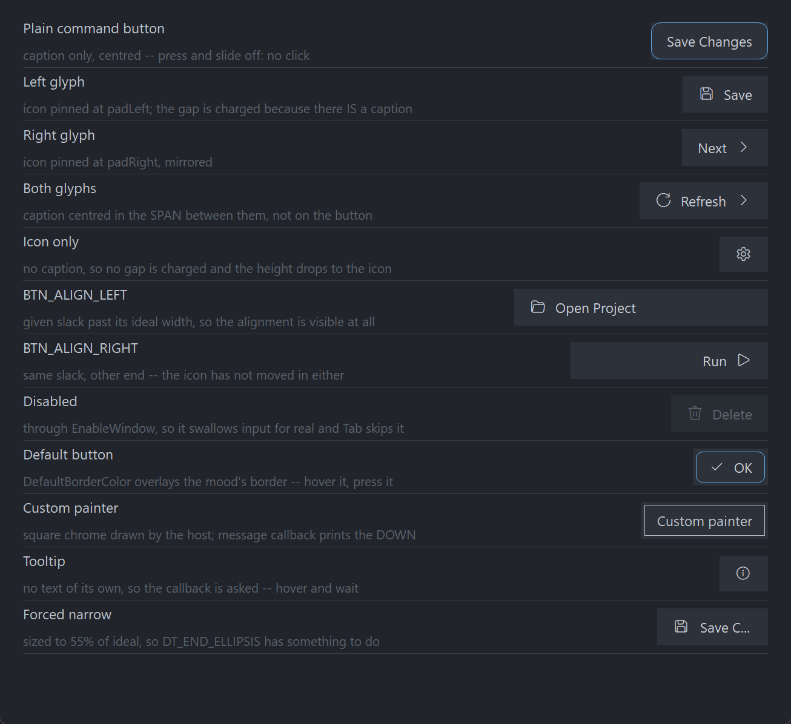

# PsButton

An owner-drawn command button for FreeBASIC Win32 applications: a rounded rectangle with an
optional glyph on the left, an optional caption, and an optional glyph on the right.

It is **momentary**. It fires on release and never latches, so it has no selected or checked
state at all — every state it carries is either transient (hot, pressed, focused) or owned by
you (enabled, default). It takes focus, so it can be reached with Tab and operated with Space or
Enter, and it draws itself entirely: there is no system `BUTTON` underneath, and nothing about
its appearance depends on the visual style the user happens to be running. Every colour it
paints is one you can set.

Either icon slot holds **a glyph from a font** — Segoe Fluent Icons codepoints, or any font's,
drawn with a separate font handle you supply — **or a real image file** (`.ico` / `.png` /
`.bmp` / `.jpg`), loaded from a path. Glyph or image, never both on the same side. There is no
`HICON` path.

---

## What it looks like



The client area of the demo (`main.bas` + `frmMain.inc`), built DPI-aware via `main.rc` /
`main_manifest.xml` and captured at the author's display scaling. Each row is one feature: the
plain button, left/right/both glyphs, icon-only (legitimately shorter — no caption means no line
of text to be as tall as), `BTN_ALIGN_LEFT` and `BTN_ALIGN_RIGHT` given slack past their ideal
width so the alignment is visible, a disabled button, the default button with its accent border,
a host-supplied painter, a tooltip-only button, and a caption forced to ellipsize.

Colours are the shipped dark defaults; every one of them is settable.

---

## Requirements

**Files to copy into your project:**

| File | Purpose |
|---|---|
| `PsButton.bi` | Declarations — types, callbacks, constants, function prototypes |
| `PsButton.inc` | Implementation |
| `PsBufferPaint.bi` | The flicker-free drawing surface the control paints through |
| `PsBufferPaint.inc` | Its implementation |
| `PsImage.bi` / `PsImage.inc` | The image loader behind `PsButton_SetImageLeft`/`SetImageRight`. Required even if you only ever use glyphs: `PsButton.bi` includes it. |
| `PsTipHost.bi` / `PsTipHost.inc` | The tooltip backend switch — see *Tooltips: two backends* |
| `PsTooltip.bi` / `PsTooltip.inc` | The owner-drawn tooltip. Required even if you never switch to it: `PsTipHost.inc` includes it. |

**AfxNova is required.** The control is built on `CWindow`, and `PsBufferPaint` draws through
`AfxNova\CGdiPlus.inc`. Sources include AfxNova relative to the workspace root
(`#include once "AfxNova\CWindow.inc"`), so builds need the workspace root on the include path:

```bash
fbc64.exe -i "C:\dev" main.bas
```

**Include order.** `PsButton.inc` pulls in its own `.bi`, which pulls in `PsBufferPaint.bi`. The
two implementation files are included in this order:

```freebasic
#include once "PsBufferPaint.inc"
#include once "PsButton.inc"
```

**GDI+ must be running before the first repaint and must outlive the last one.** The control
renders all of its geometry through GDI+, so bracket your message loop:

```freebasic
dim as ULONG_PTR gdipToken = AfxGdipInit()
' ... create windows, run the message loop ...
AfxGdipShutdown( gdipToken )
```

`AfxGdipShutdown` must come after every window is destroyed, because each repaint builds and
tears down a `PsBufferPaint`.

**Never name an identifier `ok`.** GDI+ defines `Ok = 0` as a `Status` enum value in namespace
`AfxNova`, and hosts customarily say `using AfxNova`. An existing variable, parameter or
function called `ok` becomes a duplicate definition the moment you adopt these files. Use `bOK`
instead.

**There is no pump filter to install.** If you are coming from a neighbouring control this is
worth reading twice: there is no `PsButton_FilterMessage`, and there is nothing for you to call
from your message loop. The control owns no popup and no second top-level window, so nothing
needs intercepting ahead of the dispatch.

**For Tab navigation, call `IsDialogMessage` in your message pump.** The control is a tabstop,
but only the dialog manager moves focus between tabstops:

```freebasic
do while GetMessage( @uMsg, null, 0, 0 )
    if uMsg.message = WM_QUIT then exit do
    if IsDialogMessage( hWndForm, @uMsg ) = 0 then
        TranslateMessage @uMsg
        DispatchMessage @uMsg
    end if
loop
```

Without it you still get full mouse behaviour, and Space and Enter still work once the control
has focus — only Tab navigation is lost.

**Give something the focus at startup.** `IsDialogMessage` acts only when the focused window is
already a descendant of the window you pass it. A real dialog does this in `WM_INITDIALOG`; an
ordinary window must call `SetFocus` on its first control itself. Skip it and the first Tab does
nothing, which is indistinguishable from the tabstops being broken.

**The control creates itself as a tab *item*, not a tab container.** `PsButton_Create` passes an
extended style of `0` explicitly, rather than accepting `CWindow.Create`'s default of
`WS_EX_CONTROLPARENT OR WS_EX_WINDOWEDGE`. Nothing is asked of you here except that you not add
`WS_EX_CONTROLPARENT` to the control afterwards: with it, the dialog manager descends into the
control hunting for child tabstops, finds none, and skips the control entirely.

**The control never creates a font.** Both fonts are borrowed: you create them, you keep them
alive for as long as the control lives, and you destroy them. See `PsButton_SetFont` (the caption
and *measuring* font) and `PsButton_SetGlyphFont` (the icon font).

---

## Quick start

```freebasic
' Create it. The control is created zero-sized and hidden.
dim as HWND hButton = PsButton_Create( hWndParent, IDC_FRMMAIN_SAVE )

' The two fonts. Both stay yours to destroy.
PsButton_SetFont( hButton, ghFont(GUIFONT_10) )          ' caption, and the measuring font
PsButton_SetGlyphFont( hButton, ghFont(SYMBOLFONT_10) )  ' e.g. Segoe Fluent Icons

' Be told when it is clicked.
PsButton_SetClickCallback( hButton, @MyButton_Click )

' Content. Order does not matter — every setter marks the layout dirty and one
' measuring pass covers the lot.
PsButton_SetText( hButton, "Save" )
PsButton_SetGlyphLeft( hButton, wchr(&hE74E) )

' Ask how big it wants to be, then place it. GetIdealSize is valid immediately,
' before the control has ever been sized.
dim as long iw, ih
PsButton_GetIdealSize( hButton, iw, ih )
SetWindowPos( hButton, 0, x, y, iw, ih, SWP_NOZORDER )

ShowWindow( hButton, SW_SHOW )
```

And the callback:

```freebasic
sub MyButton_Click( byval hButton as HWND, byval id as long )
    ' A matched press+release with the cursor still inside, or Space/Enter while
    ' focused, or a programmatic PsButton_Click. `id` is whatever you set with
    ' PsButton_SetID — it defaults to the CtrlID passed to PsButton_Create.
    SaveDocument()
end sub
```

Then, once the form is shown, give your first control the focus so Tab works:

```freebasic
SetFocus( hButton )
```

That is the whole minimum. Everything below is refinement.

---

## Concepts

### The handle is a real HWND

`PsButton_Create` returns an ordinary window handle, and every `PsButton_*` function takes it. It
is not an opaque type, so you can treat the control as the window it is — `SetWindowPos` to
place and size it, `ShowWindow` to show it, `GetDlgItem` to find it by the `CtrlID` you passed at
creation, `EnableWindow` to disable it.

### It is created zero-sized and hidden

`PsButton_Create` gives the control the styles `WS_CHILD`, `WS_TABSTOP`, `WS_CLIPSIBLINGS` and
`WS_CLIPCHILDREN`, and an extended style of `0`. `WS_VISIBLE` is deliberately absent, so a newly
created control shows nothing until you size it and call `ShowWindow`. That lets you build and
configure a control before it is ever seen.

`CS_DBLCLKS` is not set on the window class either — see *Behaviour and limits*.

### The layout model

This is the part worth understanding before anything else, because it is not what most button
APIs do.

**The two icon cells are pinned to the padding.** The left cell sits at
`rcButton.left + padLeft`, the right cell at `rcButton.right - padRight - iconWidth`, and
neither ever moves. `BTN_ALIGN_LEFT` / `BTN_ALIGN_CENTER` / `BTN_ALIGN_RIGHT` then place the
caption **in the span left over between them** — not in the button.

So a button with a left glyph and `BTN_ALIGN_CENTER` centres its caption on the *leftover*
space, which sits visibly right of the button's own centre. That is the intended model: the
icons frame the caption, they do not travel with it.

The geometry, if you need to predict it:

```
  ringPad     = focusGap + focusThickness          reserved ALWAYS, focused or not
  textW       = the measured caption width, 0 when there is no caption
  textH       = GetTextMetrics.tmHeight            ONE height for the control

  leftBlock   = hasLeft  ? iconWidth + (hasText ? iconGap : 0) : 0
  rightBlock  = hasRight ? iconWidth + (hasText ? iconGap : 0) : 0
  contentH    = max( hasText ? textH : 0 , (hasLeft or hasRight) ? iconHeight : 0 )

  idealW      = 2*ringPad + padLeft + leftBlock + textW + rightBlock + padRight
  idealH      = 2*ringPad + padTop  + contentH + padBottom

  rcButton    = rcClient deflated by ringPad on all four sides
  rcIconLeft  = pinned at rcButton.left + padLeft,  iconWidth x iconHeight, v-centred
  rcIconRight = pinned at rcButton.right - padRight - iconWidth, same, v-centred
  rcText      = ( rcButton.left  + padLeft  + leftBlock ,
                  rcButton.right - padRight - rightBlock ), v-centred on textH
  rcVisual    = rcButton inflated by ringPad
```

Three consequences follow, and all three catch people out:

**`rcText` is the caption span, not the caption ink.** It is the whole box between the two icon
blocks. That is exactly what `DT_END_ELLIPSIS` needs — handed a tight box around the glyphs, the
ellipsis would have nowhere to happen and the caption would simply clip. A paint callback that
fills `rcText` to draw a background "behind the text" fills the entire span.

**The icon gap is charged only when there is a caption to separate from.** An icon-only button
costs `padLeft + icon + padRight` and nothing else, so the glyph sits properly centred in its own
padding instead of being shoved off-centre by a gap with nothing on the far side of it.

**Content height ignores the font when there is no caption.** An icon-only button in a row of
captioned ones therefore has a *shorter* ideal height — nothing in it is as tall as a line of
text, and that is the honest answer. A host laying out a row of buttons takes the maximum itself
rather than having a phantom text height baked in here.

An absent part gets an **empty** rect, not a zero-width one tucked against an edge, so a paint
callback can test `IsRectEmpty` instead of re-deriving presence from the strings and images it
was handed. A cell counts as present when its side carries either a glyph or a successfully
loaded image.

Layout is lazy. A setter marks the layout stale and asks for a repaint; the next paint — or any
rect, size or tone query — recomputes it. There is no begin-update / end-update pair to
remember, and setting six properties in a row costs one measuring pass, not six.

### When the button is smaller than ideal

Rects are computed honestly rather than squeezed. The icons keep their declared size and stay
pinned to their padding, and `rcText` is what collapses — clamped to degenerate (`left = right`)
rather than going negative. So a too-narrow button loses its caption to the ellipsis and keeps
its icons, which is the useful failure. Vertically, a client shorter than the content clips top
and bottom rather than deforming anything.

### The focus-ring band is always reserved

The ring is drawn inside a band of `focusGap + focusThickness` pixels around the button chrome,
and that band is reserved whether or not the control currently has focus. This is why the button
does not jump when you Tab onto it — and it is why changing either focus-ring value changes the
ideal size.

`rcButton` is the client rect deflated by that band; `rcVisual` is `rcButton` inflated by it
again, which is the full client area.

### The icon cell is declared, never measured

`PsButton_SetIconSize` decides how much room a glyph gets, and the control never measures the
glyph font. A glyph too large for the cell **clips**; it does not resize the button. That is why
`PsButton_SetGlyphFont` is a paint-time input only — changing it repaints but never re-lays-out.

The caption font is the opposite: it is the *measuring* font, and changing it re-measures. With
no caption font set, the control measures and paints with the stock `DEFAULT_GUI_FONT`.

### An icon slot holds a glyph or an image, never both

`PsButton_SetImageLeft` and `PsButton_SetImageRight` take a file path — `.ico`, `.png`, `.bmp`,
`.jpg` — and draw that image in the icon cell **instead of** a glyph. The setters keep the
invariant themselves: setting an image clears that side's glyph string, and setting a non-empty
glyph frees that side's image. You never have to clear one before setting the other.

The image is drawn into the **same declared cell** a glyph would have used
(`PsButton_SetIconSize`), aspect ratio preserved, so switching a side from a glyph to an image
changes no geometry at all — the ideal width and the cell rect are identical either way.

The control **owns** the images it loads. They are freed when the window is destroyed, when you
pass `""`, when the load fails, and when you set a glyph on that side. You pass a path and
nothing else; there is no handle for you to keep alive or release.

```freebasic
if PsButton_SetImageLeft( hButton, ExePath() & "\save.png" ) = 0 then
    PsButton_SetGlyphLeft( hButton, wchr(&hE74E) )    ' fall back to the glyph
end if
```

### Pixels, and who scales them

Only the creation-time defaults are DPI-scaled for you:

| Setting | Default | DPI-scaled at create? |
|---|---:|---|
| Padding left / right | 12 | Yes |
| Padding top / bottom | 6 | Yes |
| Icon gap | 8 | Yes |
| Icon width | 16 | Yes |
| Icon height | 16 | Yes |
| Corner curvature | 12 | Yes |
| Border thickness | 1 | **No** |
| Focus-ring gap | 2 | Yes |
| Focus-ring thickness | 1 | **No** |

Every setter afterwards takes raw pixels and expects **you** to scale — typically
`pWindow->ScaleX(...)` / `ScaleY(...)`. The two thickness values should not be scaled at all: a
hairline should stay a hairline at any DPI.

### Corner curvature is a diameter, not a radius

`PsButton_SetCornerCurvature` takes the ellipse **diameter** that GDI's `RoundRect` vocabulary
uses. `PsBufferPaint` halves it internally, so `12` draws a 6-pixel radius. `0` gives square
corners.

### Who sizes the control

By default, nobody but you: measure with `PsButton_GetIdealSize` and call `SetWindowPos`. Turn on
`PsButton_SetAutoSize( h, true )` and the control calls `SetWindowPos` on **itself** — preserving
its top-left — whenever something that changes the ideal size changes: caption, glyphs, caption
font, padding, icon gap, icon size, focus ring. Turning it on applies immediately rather than
waiting for the next content change.

### Programmatic setters are silent — with one deliberate exception

No setter on this control fires the click callback. `PsButton_SetText`, `PsButton_SetEnabled`,
`PsButton_SetDefault` and the rest change what is drawn, never what was clicked.

**`PsButton_Click` is the exception, and it fires the click callback on purpose.** It is an
*action*, not a state setter — Win32's own `BM_CLICK` sends `BN_CLICKED` too — and it is the door
your accelerator uses, since this control parses no mnemonics. A silent version would have no
purpose.

### How a click is decided

Pressing the left button focuses the control (unconditionally, even if your message callback
goes on to suppress the press), then takes mouse capture. The click fires on **release**, and
only if the press started on the control and the cursor is still over it. So the standard escape
gesture works: press, slide off, release — nothing happens.

While a press is live and the cursor has slid outside, the control stops painting as pressed but
the gesture is not over. Slide back on and it re-arms.

Space and Enter take exactly the same path as a completed click, so the keyboard and the mouse
cannot drift apart: both are user action, both notify.

### Keyboard handling is narrow on purpose

The control answers `WM_GETDLGCODE` with `DLGC_WANTALLKEYS` only for Space and Enter, and only
when the dialog manager is asking about one specific message. Claiming keys unconditionally
would swallow Tab and break the very navigation the control opted into by being a tabstop;
claiming nothing would let `IsDialogMessage` route Enter to your dialog's default button before
the control ever saw it.

### The default button is appearance only

`PsButton_SetDefault` draws `DefaultBorderColor` over whichever mood's border would have been
used, and does nothing else. It does **not** claim Enter from elsewhere in the dialog — the
control claims Enter only while it is itself focused. Routing the dialog's default key stays your
job. Nothing stops you marking two buttons default; the control does not police it.

### The caption is also the window text

`WM_SETTEXT`, `WM_GETTEXT` and `WM_GETTEXTLENGTH` are all handled against the same store
`PsButton_SetText` writes to, so `SetWindowText` / `GetWindowText` work and generic code that
walks a form's children and reads their text sees a real caption. One store, two doors —
`DefWindowProc` is deliberately not consulted, so there is no second copy to drift.

### Enabling and disabling is real, not cosmetic

`PsButton_SetEnabled` calls `EnableWindow`. A disabled window receives no mouse input at all and
the dialog manager's Tab skips it, so there is no way for a click or a keystroke to get past a
cosmetic check. If you call `EnableWindow` on the control directly, the control notices through
`WM_ENABLE`, greys itself, and drops any hover and live press — so the two routes cannot
disagree.

### Hover tracking has a safety net

`WM_MOUSELEAVE` is not reliably delivered when the cursor exits quickly or onto another control,
which would strand the button painted hot. A 100 ms polling timer runs while the cursor is over
the control and clears the hover state if the cursor is no longer inside. The poll is suspended
while a press is live, because during capture the cursor is legitimately allowed to wander off
and come back.

### Lifetime

The control frees itself when its window is destroyed, and destroys its tooltip window with it.
The two fonts you pass in stay yours. Destroy the parent and you are done.

---

## Behaviour and limits

Firm properties of the control, not settings:

- **It never latches.** There is no `isSelected`, no checked state, no `SetSelected`. A latching
  toolbar button and an on/off switch are different controls.
- **`isDefault` is appearance only.** One border colour, applied last and with no mood test. It
  never claims Enter from elsewhere in the dialog.
- **No mnemonics.** `"&Save"` draws a literal ampersand — `PsBufferPaint.PaintText` forces
  `DT_NOPREFIX`, so this is enforced by the renderer rather than merely intended. Wire your own
  accelerator and call `PsButton_Click`.
- **No `WM_COMMAND` to the parent.** Notification is the click callback and nothing else.
- **No `HICON` path.** An icon cell takes a font glyph or an image loaded from a file path, and
  nothing else — there is no way to hand the control an `HICON` or an `HBITMAP` you already have.
- **A cell is a glyph or an image, never both.** The setters enforce it in both directions, and
  an image charges exactly the same declared cell a glyph would.
- **Single line only.** The caption is drawn with `DT_SINGLELINE`, `DT_VCENTER` and
  `DT_END_ELLIPSIS`; there is no multiline mode.
- **No pump obligation.** There is no `PsButton_FilterMessage`. `IsDialogMessage` is needed for
  Tab, but that is the dialog manager's requirement, not the control's.
- **No auto-repeat.** Holding the button down fires nothing; the click happens on release.
- **Double-clicks are not special.** `CS_DBLCLKS` is deliberately off, so a rapid second click
  arrives as an ordinary down/up pair and fires a second click. With `CS_DBLCLKS` on, every
  second rapid click would arrive as `WM_LBUTTONDBLCLK` and be silently swallowed — and on a
  momentary command button a rapid second click is a legitimate second click.
- **Mouse capture is taken.** The press/cancel gesture (press, slide off, release, nothing
  happens) consumes the guaranteed down→up pairing, so capture is required. It is released on
  the up-message before any callback runs, cancelled by `WM_CAPTURECHANGED`, and released again
  in `WM_DESTROY`. A message callback cannot suppress the up-message.
- **No hit-test function.** The whole client rectangle is the hit area, so a hit test could only
  ever return TRUE for points the caller already knows are inside.
- **Arrow keys are not handled.** Only Space and Enter activate the control.
- **The right mouse button is reported, never acted on.** A context menu is your business. No
  capture is taken for the right button, so a right-up can arrive without a matching down.
- **No caption fallback for the tooltip.** With neither tooltip text nor a tooltip callback
  answer, nothing shows.
- **Invalid alignment values are ignored**, leaving the current setting in place, rather than
  silently turning a typo into `BTN_ALIGN_LEFT`.
- **Both fonts are borrowed.** The control creates neither and destroys neither.
- **Negative layout values clamp to 0.** Padding, icon gap, icon size, curvature, border
  thickness and both focus-ring values are all floored at zero. A border or ring thickness of 0
  means "do not draw it at all".
- **An icon-only button is shorter than a captioned one.** By design; take the maximum yourself
  when laying out a row.
- **The caption span is not the caption ink.** `rcText` is the whole span between the icon cells,
  which is what a paint callback receives.

---

## API reference

### Creation

| Function | Description |
|---|---|
| `PsButton_Create( hWndParent, CtrlID ) as HWND` | Creates the control as a child of `hWndParent` and returns its window handle. `CtrlID` becomes the window's `GWLP_ID`, so `GetDlgItem` finds it, and is also the initial value reported to the click callback (override it with `PsButton_SetID`). Created zero-sized and hidden — size it with `PsButton_GetIdealSize`, place it with `SetWindowPos`, then `ShowWindow`. |

### Caption, glyphs and tooltip

All of these are silent: they change what is drawn, never what was clicked.

| Function | Description |
|---|---|
| `PsButton_GetText( hButton ) as DWSTRING` | The caption. |
| `PsButton_SetText( hButton, Text )` | Sets the caption; `""` removes it, which also stops the icon gap being charged. Re-measures, and re-applies auto-size if it is on. Reachable equivalently as `SetWindowText` — one store, two doors. |
| `PsButton_GetGlyphLeft( hButton ) as DWSTRING` | The left glyph string. |
| `PsButton_SetGlyphLeft( hButton, Glyph )` | Sets the left glyph — a font codepoint, e.g. `wchr(&hE74E)`. `""` removes it, giving back both its cell **and** its gap, so it changes the ideal width. |
| `PsButton_GetGlyphRight( hButton ) as DWSTRING` | The right glyph string. |
| `PsButton_SetGlyphRight( hButton, Glyph )` | As above, for the right cell. |
| `PsButton_SetImageLeft( hButton, Path ) as long` | Loads an image file (`.ico` / `.png` / `.bmp` / `.jpg`) into the left icon cell **instead of** a glyph, drawn into the same declared cell with its aspect preserved. Returns non-zero on a successful load. On success it clears the left glyph string; on failure it drops the half-built image so the cell is not reserved for nothing. `""` removes any image and returns **0** — a zero return is therefore "no image on this side", not necessarily an error. Re-measures and re-applies auto-size. The control owns the image and frees it. |
| `PsButton_SetImageRight( hButton, Path ) as long` | The same for the right cell, with identical semantics and return value. |
| `PsButton_GetID( hButton ) as long` | The value handed to the click callback. |
| `PsButton_SetID( hButton, id )` | Sets it. This is a **host payload**: the control never uses it as a command id, so it cannot collide with anything. Defaults to the `CtrlID` passed at creation. |
| `PsButton_GetItemData( hButton ) as integer` | Free-form host payload. |
| `PsButton_SetItemData( hButton, itemData )` | Stores anything integer-sized you want to associate with the button. Never touched by the control. |
| `PsButton_GetTooltipText( hButton ) as DWSTRING` | The control's own tooltip text. |
| `PsButton_SetTooltipText( hButton, Text )` | Sets it. The control's own text always wins; the tooltip callback is consulted only when this is empty. Does not repaint — nothing visible changed. |
| `PsButton_GetTooltipHandle( hButton ) as HWND` | The **comctl32** tooltip window, for any `TTM_*` message you want to send it yourself. The control owns it and destroys it. Returns **0** while this button is on the PsTooltip backend — the honest answer, since a `TTM_*` sent to a PsTooltip window is silently ignored. |
| `PsButton_GetPsTooltipHandle( hButton ) as HWND` | The **PsTooltip** window, or 0 while on the system backend. The door to `PsTooltip_SetColors` / `SetFonts` / `SetStyle` / `SetMaxWidth` / `SetTitle` / `SetGlyph` — none of which is mirrored here. |
| `PsButton_SetTooltipMode( hButton, nMode ) as boolean` | `PSTIP_MODE_SYSTEM` (default) or `PSTIP_MODE_PS`. See below. |
| `PsButton_GetTooltipMode( hButton ) as long` | Which backend is live. |
| `PsButton_SetHoverTime( hButton, milliseconds )` | Initial delay (`TTDT_INITIAL`) — how long the cursor must rest. Honoured by **both** backends. |
| `PsButton_SetAutoPopTime( hButton, milliseconds )` | How long the tip stays up (`TTDT_AUTOPOP`). |
| `PsButton_SetReshowTime( hButton, milliseconds )` | The shorter delay after a tip was recently dismissed (`TTDT_RESHOW`). |

#### Tooltips: two backends

The button ships on the **system** (comctl32) tooltip it has always used. `PSTIP_MODE_PS`
switches this instance to **PsTooltip**: owner-drawn, themeable, word-wrapping without a
hand-sent `TTM_SETMAXTIPWIDTH`, and — the one that matters structurally — **not a subclass of
the control it serves**, so it still works when the window under the cursor is a descendant
rather than the control itself. Either way the button adds **no pump obligation**: PsTooltip
has no `FilterMessage`.

The default is deliberate, not caution. PsTooltip's colour defaults are **dark**, so a control
that switched itself would put a dark tip on a light form. Theme every tip in the process with
`PsTooltip_SetDefaultColors` and friends, then opt in per instance.

**The mode changes how a tip is drawn, never what it says.** Both backends resolve text through
the same rule — this control's own text first, then `TooltipCallback`, then nothing.

A delay you set is **stored as well as pushed**, so it survives a switch in either direction. A
delay you never set keeps the backend's own derivation from the system double-click time, which
is what makes a tip appear on the same beat as every other tip on the machine.

```freebasic
PsTooltip_SetDefaultColors( @myTipColors )     ' once, at startup, for every tip in the process
PsTooltip_SetDefaultFonts( ghFontUI )

PsButton_SetTooltipMode( hBtn, PSTIP_MODE_PS )
PsButton_SetHoverTime( hBtn, 400 )
dim as HWND hTip = PsButton_GetPsTooltipHandle( hBtn )
if hTip then PsTooltip_SetTitle( hTip, "Add item" )   ' not reachable on the system backend
```

### State

| Function | Description |
|---|---|
| `PsButton_GetEnabled( hButton ) as boolean` | The control's enabled state. |
| `PsButton_SetEnabled( hButton, isEnabled )` | Enables or disables through `EnableWindow`, so input really stops and Tab skips it. No-op when the state already matches. Disabling clears hover and cancels a live press at once rather than waiting for the next mouse move. |
| `PsButton_GetFocused( hButton ) as boolean` | TRUE while the control has keyboard focus and is painting its focus ring. There is no child window to hold focus, so this agrees with `GetFocus()`. |
| `PsButton_GetDefault( hButton ) as boolean` | TRUE when the control is drawing the default-button border. |
| `PsButton_SetDefault( hButton, isDefault )` | **Appearance only.** Swaps one border colour and repaints; never re-measures, never claims Enter. No-op when the state already matches. |
| `PsButton_Refresh( hButton )` | Marks the layout stale and requests a repaint with background erase. Rarely needed — every setter does this for you. |
| `PsButton_Click( hButton )` | **Fires the click callback**, exactly as a real click would — the one call here that notifies. It is an action, not a setter, and it is the intended door for an accelerator. Refused on a disabled button, and does nothing when no click callback is installed. It does **not** paint a press flash: it reports an action, it does not animate one. |

### Geometry and layout

All setters take **raw pixels**; you do the DPI scaling. Unless noted, each marks the layout
stale, requests a repaint and re-applies auto-size if it is on.

| Function | Description |
|---|---|
| `PsButton_GetTextAlign( hButton ) as long` | `BTN_ALIGN_LEFT`, `BTN_ALIGN_CENTER` (the default) or `BTN_ALIGN_RIGHT`. |
| `PsButton_SetTextAlign( hButton, nTextAlign )` | Places the caption **in the span between the icon cells**, not in the button. Values outside the three constants are ignored. Cannot change the ideal size, so it repaints without re-measuring. |
| `PsButton_GetPadding( hButton, byref nLeft, byref nTop, byref nRight, byref nBottom )` | The four padding values, measured inside the chrome. |
| `PsButton_SetPadding( hButton, nLeft, nTop, nRight, nBottom )` | Sets all four; each clamped to a minimum of 0. Changes the ideal size. |
| `PsButton_GetIconGap( hButton ) as long` | The space between an icon cell and the caption. |
| `PsButton_SetIconGap( hButton, nIconGap )` | Sets it; clamped to a minimum of 0. **Charged only on a side that has an icon, and only when there is a caption** — an icon-only button spends none of it. |
| `PsButton_GetIconSize( hButton, byref nIconWidth, byref nIconHeight )` | The declared icon cell. Both icons share it. |
| `PsButton_SetIconSize( hButton, nIconWidth, nIconHeight )` | Sets it; each clamped to a minimum of 0. Nothing is measured, so this is the only thing deciding how much room a glyph gets — a glyph too large for the cell clips. |
| `PsButton_GetCornerCurvature( hButton ) as long` | The chrome's corner ellipse **diameter**. |
| `PsButton_SetCornerCurvature( hButton, nCurvature )` | Sets it; clamped to a minimum of 0, where **0 gives square corners**. A diameter, not a radius: 12 draws a 6px radius. Chrome only, so it repaints but never re-lays-out. |
| `PsButton_GetBorderThickness( hButton ) as long` | The chrome's border thickness. |
| `PsButton_SetBorderThickness( hButton, nThickness )` | Sets it; clamped to a minimum of 0, where **0 means no border at all**. Repaints but never re-lays-out — the border is drawn inside the chrome, so it moves nothing. Do not DPI-scale this value. |
| `PsButton_GetFocusRing( hButton, byref nGap, byref nThickness )` | The gap from the chrome to the focus ring, and the ring's own thickness. |
| `PsButton_SetFocusRing( hButton, nGap, nThickness )` | Sets both; each clamped to a minimum of 0. **Both change the ideal size**, because the ring's band is reserved whether or not the control has focus. Do not DPI-scale the thickness. |
| `PsButton_GetAutoSize( hButton ) as boolean` | Whether the control sizes itself. |
| `PsButton_SetAutoSize( hButton, bAutoSize )` | When TRUE the control `SetWindowPos`es **itself** to the ideal size, preserving its top-left, whenever something size-affecting changes. Default FALSE. Turning it on applies immediately. |
| `PsButton_GetIdealSize( hButton, byref nWidth, byref nHeight )` | Forces any pending layout and returns the measured ideal size. **Valid before the control has ever been sized** — the measuring pass runs ahead of the zero-client bail, which is the whole point: you call this to decide how big to make the control. |
| `PsButton_GetButtonRect( hButton, byref rc ) as boolean` | The chrome — the client rect deflated by the focus-ring band. |
| `PsButton_GetTextRect( hButton, byref rc ) as boolean` | The caption **span** between the two icon cells. Empty when there is no caption; degenerate when the client is too narrow to leave any span. |
| `PsButton_GetIconLeftRect( hButton, byref rc ) as boolean` | The left icon cell. **Empty** when the side carries neither a glyph nor a valid image — and the call still returns TRUE, because empty is the honest answer. |
| `PsButton_GetIconRightRect( hButton, byref rc ) as boolean` | The right icon cell, same rules. |
| `PsButton_GetVisualRect( hButton, byref rc ) as boolean` | The chrome inflated by the focus-ring band — the full client area. |

The five rect queries force any pending layout first, so their results are always current. Each
returns FALSE — leaving `rc` empty — when the control has no client area yet, which is the case
between `PsButton_Create` and the first `SetWindowPos`.

### Appearance

| Function | Description |
|---|---|
| `PsButton_GetColors( hButton, pColors as PSBUTTON_COLORS ptr )` | Fills your struct with the control's current colours. |
| `PsButton_SetColors( hButton, pColors as PSBUTTON_COLORS ptr )` | Copies the whole struct in and repaints. Colours only — nothing measured changes, so no layout pass and no auto-size pass. |
| `PsButton_GetFont( hButton ) as HFONT` | The caption font, or 0 if none was set. |
| `PsButton_SetFont( hButton, hTextFont )` | The **caption font, and therefore the measuring font**: changing it re-measures and can change the ideal size. Borrowed, never owned. Unset, the control measures and paints with the stock `DEFAULT_GUI_FONT`. |
| `PsButton_GetGlyphFont( hButton ) as HFONT` | The icon font, or 0 if none was set. |
| `PsButton_SetGlyphFont( hButton, hGlyphFont )` | The **icon font** (normally Segoe Fluent Icons). A paint-time input only: the icon cell is declared rather than measured, so this repaints but never re-lays-out and never resizes. Borrowed, never owned. Unset, it falls back to the caption font. |

To change one colour, read-modify-write:

```freebasic
dim as PSBUTTON_COLORS clrs
PsButton_GetColors( hButton, @clrs )
clrs.BorderColor    = theme.Divider
clrs.BorderColorHot = theme.FocusAccent
PsButton_SetColors( hButton, @clrs )
```

### Diagnostics

Three host-facing helpers. The first two are what you reach for if you write your own painter;
the third is how you check that painter is behaving.

| Function | Description |
|---|---|
| `PsButton_ResolveMood( isEnabled, isPressed, isHot ) as long` | Returns the `BTN_MOOD_*` constant this state calls for: `disabled > pressed > hot > idle`. A **pure function** — it takes no control pointer and touches no global, so a custom painter can call it with the flags from its `PAINTINFO` and get exactly what the built-in painter would have used. |
| `PsButton_ResolveColors( pColors, nMood, isDefault, byref clrBack, byref clrFore, byref clrBorder, byref clrIcon )` | Turns a mood plus the default-button flag into the four colours the painter uses. Also pure. The `isDefault` border overlay is applied **last and unconditionally**, which is what makes it one rule rather than four. Does nothing if `pColors` is null. |
| `PsButton_CountRenderedTones( hButton, nPart ) as long` | Renders the control **offscreen** with its current painter and returns how many distinct colours land inside one of its rects (`BTN_PART_*`), capped at 64. Returns 0 if the control has no geometry yet, or if the named part's rect is empty. Nothing in the control calls it. |

`PsButton_CountRenderedTones` exists for one specific purpose: **checking that a custom paint
callback is not flooding the control**. `PsBufferPaint.PaintBorderRect` fills before it strokes,
so a callback that reaches for it to draw a frame or a focus ring floods everything beneath and
the control renders as one solid block — which survives a glance, because the flood colour is a
real colour from the control. A wiped part is literally one tone, so `count > 1` is an
unambiguous check where a screenshot is a judgement call.

The probe renders with `isFocused` forced TRUE (and restored afterwards), because the focus ring
is drawn last and over the largest rect, which is exactly where that mistake shows. If you
install a `PaintCallback`, check it once after the control has been sized:

```freebasic
if PsButton_CountRenderedTones( hButton, BTN_PART_BUTTON ) <= 1 then
    print "paint callback is flooding the button"
end if
```

### Callback registration

| Function | Description |
|---|---|
| `PsButton_SetPaintCallback( hButton, usersub )` | Installs a renderer that draws the whole control **instead of** the built-in painter. Repaints with background erase. |
| `PsButton_SetMessageCallback( hButton, userfunc )` | Installs an observer for mouse, focus and key messages. |
| `PsButton_SetTooltipCallback( hButton, userfunc )` | Installs the supplier of tooltip text on demand, consulted only when the control has no tooltip text of its own. |
| `PsButton_SetClickCallback( hButton, usersub )` | Installs the handler told when the button is clicked. |

All four are optional and independent.

---

## Colors

The colour surface is one flat struct, `PSBUTTON_COLORS`, with eighteen `COLORREF` fields: four
drawn things (fill, caption, border, icon) × four moods (idle, hot, pressed, disabled), plus the
focus ring and the default-button border. Every field ships with a usable dark-theme default, so
a control you never call `PsButton_SetColors` on still looks right.

| Field | Paints |
|---|---|
| `BackColor` | Button fill, idle |
| `ForeColor` | Caption, idle |
| `BorderColor` | Button border, idle |
| `IconColor` | Both glyphs, idle |
| `BackColorHot` | Button fill, cursor over the button |
| `ForeColorHot` | Caption, hot |
| `BorderColorHot` | Button border, hot |
| `IconColorHot` | Both glyphs, hot |
| `BackColorPressed` | Button fill, live left press with the cursor still inside |
| `ForeColorPressed` | Caption, pressed |
| `BorderColorPressed` | Button border, pressed |
| `IconColorPressed` | Both glyphs, pressed |
| `BackColorDisabled` | Button fill, disabled |
| `ForeColorDisabled` | Caption, disabled |
| `BorderColorDisabled` | Button border, disabled |
| `IconColorDisabled` | Both glyphs, disabled |
| `FocusRingColor` | The focus ring, drawn only while the control has focus |
| `DefaultBorderColor` | Replaces the resolved mood's border when `isDefault` is set |

### Which colour wins

The painter picks one fill, one caption, one border and one icon colour per repaint, in this
precedence:

```
disabled   >   pressed   >   hot   >   idle
```

That is `PsButton_ResolveMood` in full, and it is a pure function you can call yourself.

**There is a real pressed set here**, not a press that renders as hot. A command button's press
is the one piece of feedback that tells the user the click registered, and the held-down state
lasts as long as the finger does.

### How the default border overlays it

`DefaultBorderColor` is the only field that is not part of a mood. `PsButton_ResolveColors`
applies it **last and with no mood test**, replacing whatever border the resolved mood chose:

```
  clrBack / clrFore / clrBorder / clrIcon   <-  the resolved mood's four
  if isDefault then clrBorder               <-  DefaultBorderColor
```

So the accent outline survives all four moods for free instead of doubling the colour matrix,
and it cannot be right in three moods and forgotten in the fourth.

### Why the button reads borderless by default

Every `BorderColorXxx` defaults to exactly the matching `BackColorXxx`, so the button reads as a
solid shape with no outline until you want one. Set those four fields to get a visible frame.

The icons follow the caption for the same reason: each `IconColorXxx` defaults to the matching
`ForeColorXxx`. Set them to break that coupling — a red record dot on an otherwise grey button.

The pressed fill is an accent push rather than a darkening, which makes pressed the one mood
whose border is visible out of the box, and only because its fill is.

### What the painter draws

| Part | Shape |
|---|---|
| Chrome | A rounded rectangle over `rcButton`, using the curvature as an ellipse diameter. Drawn with a border when the border thickness is above 0, filled without one at 0. |
| Left / right glyph | The glyph string drawn `DT_CENTER` in its cell, with the icon font (or the caption font if none was set). Skipped when the cell is empty. |
| Caption | Drawn in `rcText` with the caption font, `DT_END_ELLIPSIS`, and `DT_LEFT` / `DT_CENTER` / `DT_RIGHT` from the alignment. `PaintText` adds `DT_NOPREFIX`, `DT_VCENTER` and `DT_SINGLELINE` itself. Skipped when `rcText` is empty or degenerate. |
| Focus ring | A rounded **outline** over `rcVisual`, drawn only while the control has focus and the ring thickness is above 0. Never a fill — it is drawn over the button, and a filled shape there would erase it. Its curvature is the button's plus the band on both sides, which keeps the two curves concentric. |

All of it goes through `PsBufferPaint`, which renders geometry with GDI+, so the corners are
antialiased. A paint callback gets that same buffer and inherits the same primitives.

---

## Callbacks

### Click

```freebasic
type BTN_ClickCallbackSub as sub( byval hButton as HWND, byval id as long )
```

The button was clicked: a matched press+release with the cursor still inside, or Space/Enter
while focused, or the programmatic `PsButton_Click`. Nothing fires for a cancelled gesture —
press, slide off, release.

`id` is whatever you set with `PsButton_SetID`, defaulting to the `CtrlID` passed at creation.

The control re-reads its own enabled state immediately before calling you rather than trusting
the caller, so a message callback that disabled the control mid-gesture is honoured.

### Paint

```freebasic
type BTN_PaintCallbackSub as sub( byval p as PSBUTTON_PAINTINFO ptr )
```

Draws the whole control **instead of** the built-in painter. Paint through `p->b`, the control's
double buffer for this repaint — do not touch the screen DC.

The control has already filled the client with the **resolved mood's** background before calling
you — not a fixed colour — so a callback that only wants to add something on top does not have to
repaint the background, and cannot end up sitting on the wrong one.

`PSBUTTON_PAINTINFO` carries everything you need:

| Field | Meaning |
|---|---|
| `hButton` | The control, so the callback can query it |
| `b` | The control's `PsBufferPaint` for this repaint (borrowed, not owned) |
| `rcClient` | The whole client area |
| `rcButton` | The chrome: `rcClient` deflated by the focus-ring band |
| `rcIconLeft` | The left icon cell. **Empty** when the side carries neither a glyph nor a valid image |
| `rcText` | The caption **span** between the two icon blocks — not the ink. Empty when there is no caption, degenerate (`left = right`) when the client is too narrow to leave any span |
| `rcIconRight` | The right icon cell, same rule |
| `rcVisual` | `rcButton` inflated by the focus-ring band |
| `isHot` | The mouse is over the control |
| `isPressed` | A live left press **and** the cursor is still inside |
| `isEnabled` | The control's enabled state |
| `isFocused` | Draw a focus ring when TRUE |
| `isDefault` | This is the dialog's default button (appearance only) |
| `wszText` | The caption |
| `wszGlyphLeft` | The left glyph string |
| `wszGlyphRight` | The right glyph string |
| `pImageLeft` | The resolved left-cell image (`CGpImage ptr`), or NULL. When non-NULL, draw it with `p->b->PaintImage` **instead of** the glyph. Borrowed — the control's `PsImage` owns it |
| `pImageRight` | The same for the right cell |
| `nTextAlign` | `BTN_ALIGN_*` — map it to `DT_LEFT` / `DT_CENTER` / `DT_RIGHT` |

All five rects are precomputed. Use them as given — in particular, do not re-derive `rcText` by
re-applying the padding to `rcButton`, because the icon cells and the icon gap can change
underneath you. Test presence with `IsRectEmpty` rather than re-testing the strings.

`isPressed` goes FALSE when the cursor slides off during a press, without the gesture ending.
That is deliberate: the press should stop *looking* armed the moment the cursor leaves.

Two contracts worth honouring:

- **Draw the caption with the same font you handed to `PsButton_SetFont`.** The button's width was
  measured with it, and a different font makes that width a lie.
- **Do not reach for `PaintBorderRect` to draw a frame.** It fills unconditionally, so used as an
  outline it erases everything beneath it. `PaintRoundOutline` is the one that strokes without
  filling; `PaintRectFactory` with an explicit fill colour is the one to use when you do want a
  fill.

> **A paint callback that fills a rectangle covering the whole control will erase everything
> under it.** Draw your additions, not a background — the control has already painted one.
> `PsButton_CountRenderedTones` will tell you if you have.

### Message

```freebasic
type BTN_MessageCallbackFunc as function( byval m as PSBUTTON_MESSAGEINFO ptr ) as boolean
```

Observes messages as they arrive. Return TRUE to suppress the control's own handling of that
message, FALSE to let it proceed.

`PSBUTTON_MESSAGEINFO` carries four fields:

| Field | Meaning |
|---|---|
| `hButton` | The control |
| `uMsg` | The message |
| `wParam` | Its `wParam` |
| `lParam` | Its `lParam` |

Mouse messages (`WM_MOUSEMOVE`, `WM_MOUSELEAVE`, the left and right button messages), focus
changes (`WM_SETFOCUS`, `WM_KILLFOCUS`) and `WM_KEYDOWN` are all reported here.

**Your return value is ignored for three messages:**

| Message | Why |
|---|---|
| `WM_LBUTTONUP` | The control holds mouse capture across a press, and the up-message is what releases it. A callback that suppressed it would strand the capture and route every later click to this control. Suppressing `WM_LBUTTONDOWN` suppresses the press itself, which *is* allowed — no capture has been taken at that point. |
| `WM_SETFOCUS` | Focus is a fact the system reports, not an action to veto. The state is already updated by the time you are called. A host that does not want the control focusable must not make it a tabstop. |
| `WM_KILLFOCUS` | As above. |

For every other message, TRUE suppresses the default handling. Note that `WM_LBUTTONDOWN`
focuses the control *before* the callback runs, so suppressing the press does not suppress the
focus change.

### Tooltip

```freebasic
type BTN_TooltipCallbackFunc as function( byval hButton as HWND ) as DWSTRING
```

Supplies the tooltip text on demand, only when a tip is about to show, and **only when the
control has no tooltip text of its own**. Return `""` for no tooltip.

There is no caption fallback: a button whose caption is already on screen would otherwise pop a
tip repeating what you are looking at, so a control with neither its own text nor a callback
answer simply shows nothing.

The answer is stored in a buffer separate from `PsButton_SetTooltipText`'s store, so a transient
callback answer never silently becomes the control's stored tooltip text.

---

## Constants

```freebasic
' Where the caption sits in the span BETWEEN the two icon cells.
enum
    BTN_ALIGN_LEFT = 0
    BTN_ALIGN_CENTER        ' the default
    BTN_ALIGN_RIGHT
end enum

' Which of the four colour sets the painter uses. Returned by PsButton_ResolveMood.
enum
    BTN_MOOD_IDLE = 0
    BTN_MOOD_HOT
    BTN_MOOD_PRESSED
    BTN_MOOD_DISABLED
end enum

' Which rect PsButton_CountRenderedTones looks at.
enum
    BTN_PART_BUTTON = 0     ' rcButton, the chrome
    BTN_PART_TEXT           ' rcText, the caption span
    BTN_PART_ICONLEFT       ' rcIconLeft
    BTN_PART_ICONRIGHT      ' rcIconRight
end enum
```

| Constant | Value | Meaning |
|---|---:|---|
| `PSBUTTON_DEFAULT_PADLEFT` | 12 | Default left padding, DPI-scaled at create |
| `PSBUTTON_DEFAULT_PADRIGHT` | 12 | Default right padding, DPI-scaled at create |
| `PSBUTTON_DEFAULT_PADTOP` | 6 | Default top padding, DPI-scaled at create |
| `PSBUTTON_DEFAULT_PADBOTTOM` | 6 | Default bottom padding, DPI-scaled at create |
| `PSBUTTON_DEFAULT_ICONGAP` | 8 | Default icon-to-caption gap, DPI-scaled at create |
| `PSBUTTON_DEFAULT_ICONWIDTH` | 16 | Default icon cell width, DPI-scaled at create |
| `PSBUTTON_DEFAULT_ICONHEIGHT` | 16 | Default icon cell height, DPI-scaled at create |
| `PSBUTTON_DEFAULT_CURVATURE` | 12 | Default corner ellipse **diameter**, DPI-scaled at create |
| `PSBUTTON_DEFAULT_BORDERTHICK` | 1 | Default border thickness, never DPI-scaled |
| `PSBUTTON_DEFAULT_FOCUSGAP` | 2 | Default focus-ring gap, DPI-scaled at create |
| `PSBUTTON_DEFAULT_FOCUSTHICK` | 1 | Default focus-ring thickness, never DPI-scaled |
| `IDT_CBUTTON_HOTTRACK` | `&hCB90` | Timer id for the hover-tracking safety net. Timer ids are per-window, so every instance shares it |
| `PSBUTTON_HOTTRACK_MS` | 100 | Hover poll interval, in milliseconds |

## Running the demo

The demo loads **Segoe Fluent Icons** at startup via `AddFontResourceEx`, and
**aborts if the font is absent** — the control family draws its glyphs from it.

The font ships with Windows 11 but is Microsoft's, not ours, so it is not
redistributed here. Copy it in once before building:

```bash
copy C:\Windows\Fonts\SegoeIcons.ttf SegoeFluentIcons.ttf
```

Note the rename: Windows stores the file as `SegoeIcons.ttf`, while the family
name is "Segoe Fluent Icons". On Windows 10 the font is not present at all.

## Licence

[Mozilla Public License 2.0](LICENSE).

MPL-2.0 is file-level copyleft, chosen deliberately for a drop-in control:

- **You may use this in closed-source software**, commercial or otherwise.
  §3.2 permits static linking with no additional conditions.
- **If you modify these files, publish those files' changes.** The obligation is
  per-file — your own sources are unaffected however tightly they are combined
  with these.
- The Exhibit B "Incompatible With Secondary Licenses" notice is **not applied**,
  which keeps this GPL-compatible.
