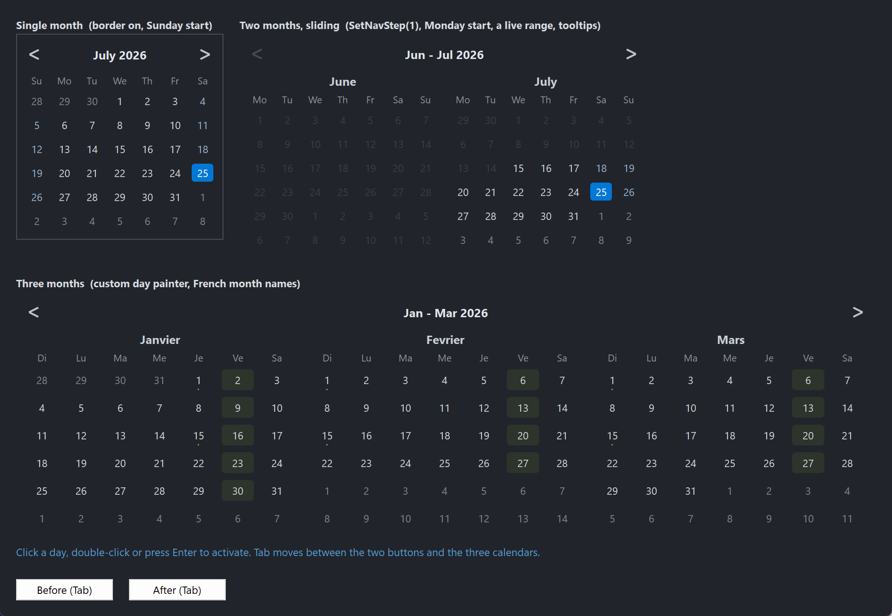

# PsCalendar

An owner-drawn month calendar that lives **inside** your window — a normal child control, not a
dropdown. It shows one month, or a grid of up to twelve, with a shared navigation band across the
top, a selectable day, an optional min/max range, and a MonthCal-style drill-down from days to
months to years.

It is a **date surface**, not a date field. There is no text box, no popup, and no parsing: it
selects a single `SYSTEMTIME` and tells you when the user moves or chooses one. If you want an
editable date field with a dropdown calendar, that is a different control.

Everything it draws is replaceable. You can restyle it field by field through a colour struct,
take over individual day cells with a callback (availability shading, appointment dots), or
replace the entire renderer.

Repository: <https://github.com/PaulSquires/PsCalendar>

---

## What it looks like



A single month with a border, a two-month sliding range picker with a min/max range and tooltips,
and a six-month grid using a host day painter and localized month names.

---

## Requirements

Copy these files into your project:

| File | What it is |
|---|---|
| `PsCalendar.bi` | Public header — types, enums, callback typedefs, declarations |
| `PsCalendar.inc` | Implementation |
| `PsBufferPaint.bi` | Flicker-free drawing surface (header) |
| `PsBufferPaint.inc` | Drawing surface (implementation) |
| `PsTipHost.bi` / `PsTipHost.inc` | The tooltip backend switch — see *Tooltips: two backends* |
| `PsTooltip.bi` / `PsTooltip.inc` | The owner-drawn tooltip. Required even if you never switch to it: `PsTipHost.inc` includes it. |

It also needs the AfxNova framework on the include path (`fbc -i "C:\dev"` if AfxNova lives at
`C:\dev\AfxNova`).

### Include order

`PsBufferPaint.inc` must be included **before** `PsCalendar.inc`:

```freebasic
#include once "windows.bi"
#include once "AfxNova\CWindow.inc"
#include once "AfxNova\AfxStr.inc"
#include once "AfxNova\AfxGdiplus.inc"
using AfxNova

#include once "PsBufferPaint.inc"
#include once "PsCalendar.inc"
```

That is the whole list of include lines. `PsCalendar.inc` includes `PsTipHost.inc` itself, which
in turn includes `PsTooltip.inc`, so the four tooltip files only have to be *present* — you never
name them. PsCalendar wraps no child control and owns no popup window of its own.

### Initialise GDI+

The control renders through GDI+. Bracket your message loop with `AfxGdipInit` and
`AfxGdipShutdown`, or it draws nothing at all:

```freebasic
dim as ULONG_PTR gdipToken = AfxGdipInit()
' ... create windows, run the message loop ...
AfxGdipShutdown( gdipToken )
```

`AfxGdipShutdown` must come **after** every window is destroyed.

### Do not name anything `ok`

GDI+ defines `Ok = 0` as a `Status` enum value in namespace `AfxNova`, and your host almost
certainly says `using AfxNova`. Any identifier of your own called `ok` becomes a duplicate
definition the moment you adopt this control. Use `bOK`.

### Message pump

**There is no `PsCalendar_FilterMessage`, and the control needs nothing added to your message
loop for its own sake.** If you are coming from a sibling control that requires a pump filter,
there is none to call here.

Because the control takes keyboard focus, you do need the two things any focusable control needs:

```freebasic
dim uMsg as MSG
do while GetMessage(@uMsg, null, 0, 0)
    if uMsg.message = WM_QUIT then exit do
    if IsDialogMessage( hMainWindow, @uMsg ) then continue do
    TranslateMessage @uMsg
    DispatchMessage @uMsg
loop
```

`IsDialogMessage` is what makes Tab move between controls. And because it ignores Tab until some
child already has focus, `SetFocus` one of your controls at startup or the first Tab press does
nothing.

---

## Quick start

```freebasic
ghCal = PsCalendar_Create( hMainWindow, IDC_CALENDAR )
PsCalendar_SetFont( ghCal, hFont )
PsCalendar_SetSelChangeCallback( ghCal, @OnSelChange )
PsCalendar_SetDateActivatedCallback( ghCal, @OnActivated )

dim as SYSTEMTIME stNow
GetLocalTime( @stNow )
PsCalendar_SetSelDate( ghCal, PsCalendar_MakeDate( stNow.wYear, stNow.wMonth, stNow.wDay ) )

' Size it to whatever it asks for, then show it.
dim as long w, h
PsCalendar_GetIdealSize( ghCal, w, h )
SetWindowPos( ghCal, NULL, 20, 20, w, h, SWP_NOZORDER or SWP_NOACTIVATE )
ShowWindow( ghCal, SW_SHOW )
```

And the two callbacks it wires:

```freebasic
sub OnSelChange( byval hCtrl as HWND, byval pDate as SYSTEMTIME ptr, byval bHasDate as boolean )
    if bHasDate = false then exit sub          ' the selection was cleared
    ' pDate is the newly selected day
end sub

sub OnActivated( byval hCtrl as HWND, byval pDate as SYSTEMTIME ptr )
    ' the user chose this date: double-click, Enter or Space
end sub
```

---

## Concepts

### The handle is a real `HWND`

`PsCalendar_Create` returns an ordinary child window handle. You position it with `SetWindowPos`,
show it with `ShowWindow`, and it takes part in Tab navigation like any other control. There is no
opaque handle type.

### Selection, anchor, and today are three different things

- **Selection** — the highlighted day. There may be none; that is a legal state
  (`PsCalendar_HasSelDate` returns FALSE).
- **Anchor** — the first displayed month. Its day component is always 1. Navigation moves the
  anchor; it does not move the selection.
- **Today** — read from the system clock at creation, and re-read by `PsCalendar_Refresh` so a
  calendar left on screen across midnight can correct itself.

### The panel grid

In `CAL_VIEW_DAYS` the control draws `nCols × nRows` month panels, **row-major** — panel `p` sits
at column `p mod nCols`, row `p \ nCols` — showing consecutive months starting at the anchor. The
product may not exceed 12.

```
client
├─ optional border (default off)
├─ padding on all four sides
├─ nav band:  [ prev ]      title      [ next ]
├─ nav gap
└─ panel grid, row-major, with horizontal and vertical gutters
      each panel: month caption / weekday row / 6 x 7 day cells
```

Two rules fall out of that and are worth knowing before the geometry surprises you:

- **The per-panel month caption is suppressed when there is only one panel.** At one panel the nav
  band's title already reads "January 2026", so the caption would just repeat it. Above one panel
  the title becomes a range ("Jan – Dec 2026") and each panel names itself. This means a
  one-panel calendar is exactly one caption shorter than a two-panel one.
- **In `CAL_VIEW_MONTHS` and `CAL_VIEW_YEARS` the panel grid does not exist.** The 3 × 4
  drill-down grid takes the whole area below the nav band, at every panel count.

### Cells stretch; ideal size is advice

The panel width is floor-divided by 7 and the body height by 6, so cells grow and shrink with the
control. Left-over pixels become a right and bottom margin.

`PsCalendar_GetIdealSize` computes the natural size from the minimum cell size and the layout
metrics. It is pure arithmetic — it takes no device context and measures no text — so it answers
correctly **before the control has ever been sized**, which is exactly when you need it. Sizing
below the ideal shrinks the cells; nothing clips and no scrollbar appears.

```
panelIdealW = 7 * cellMinW
panelIdealH = captionH + weekdayH + 6 * cellMinH
idealW = 2*(pad + border) + nCols*panelIdealW + (nCols-1)*gutterX
idealH = 2*(pad + border) + navBandH + navGap + nRows*panelIdealH + (nRows-1)*gutterY
```

### Rects are derived, never set

Every rectangle the control exposes — nav band, chevrons, title, panels, weekday cells, day cells,
drill-down cells — is computed from the client rect and the layout metrics. You change the metrics;
the control recomputes the rects. Layout is lazy: a setter marks it dirty and the next paint does
one pass, so there is no begin/end update pair to bracket a batch of changes.

### Programmatic setters are silent

`PsCalendar_SetSelDate`, `ClearSelDate`, `SetAnchorDate`, `SetView`, `SetRange`, `SetPanelGrid`
and every other setter change state without firing a callback. Only user interaction — a click, a
double-click, or a key — notifies. This lets you call a setter from inside your own handler
without re-entering it.

Two entry points are **actions**, not setters, and they do fire: `PsCalendar_SelectDate` and
`PsCalendar_Activate`. Their names say so.

### Focus and the keyboard

The control is a tab stop and paints a focus ring on the current cell. In `CAL_VIEW_DAYS` the
arrow keys move the **selection** directly, scrolling the page when the selection leaves it —
there is no separate focus cursor to keep track of.

| Key | Effect |
|---|---|
| ← → | selection ∓ 1 day |
| ↑ ↓ | selection ∓ 1 week |
| PgUp / PgDn | ∓ 1 month |
| Ctrl+PgUp / Ctrl+PgDn | ∓ 1 year |
| Home / End | first / last day of the selection's month |
| Ctrl+Home | today |
| Space / Enter | fire `DateActivated` |
| Esc | zoom out one level — **only** while drilled down |

Every move clamps to the min/max range. In the drill-down views the arrows move a cell cursor
instead, Space and Enter zoom in, and Esc zooms back out.

Esc is deliberately left alone in `CAL_VIEW_DAYS` so a host dialog's Cancel keeps working.

When nothing is selected, the focus ring falls back to today if it is on the page, and otherwise
to the first day of the first panel. `PsCalendar_GetFocusCell` reports where it is.

---

## Behaviour and limits

- **Single selection only.** One date or none. There is no multi-select and no contiguous range
  selection; `stMin`/`stMax` restrict what is *selectable*, they are not a selected range.
- **At most 12 panels.** `PsCalendar_SetPanelGrid` **refuses** — and leaves the grid untouched —
  when `nCols * nRows` exceeds 12 or either dimension is below 1. It does not silently clamp.
- **Six week rows, always.** Each month is a fixed 6 × 7 grid, so the control's natural height
  never changes as you navigate. Months needing only four or five weeks show more adjacent days.
- **Out-of-range days are inert, not just dim.** They do not highlight on hover and clicking them
  does nothing.
- **`PsCalendar_SetSelDate` refuses a date outside the range**, and narrowing the range **drops** a
  selection that no longer fits. The setter cannot reach anywhere the user could not.
- **Drilling in never selects.** Picking a month or a year navigates; it does not change the
  selection or fire a callback.
- **No week-number column**, no "Today" footer button, and no variable row count.
- **Adjacent and out-of-range days must stay far apart in colour.** An adjacent day (a leading or
  trailing day from a neighbouring month) is dimmed but still clickable; an out-of-range day is
  inert. If you restyle `DayColorAdjacent` and `DayColorDisabled` to similar values, a restricted
  range reads as a broken calendar.
- **The colour defaults are dark.** For a light theme, read the struct, assign every field, and
  write it back.

---

## API reference

### Creation

| Function | Behaviour |
|---|---|
| `PsCalendar_Create( hWndParent as HWND, CtrlID as long ) as HWND` | Creates the control as a child of `hWndParent` at zero size. Position it yourself. Returns the `HWND`, or 0 on failure. |
| `GetCalendarPointer( hCtrl as HWND ) as PSCALENDAR ptr` | The per-instance state block. Reading laid-out geometry through the accessors below is safer — they force a pending layout first; the raw struct does not. |

### Selection

All silent unless marked otherwise.

| Function | Behaviour |
|---|---|
| `PsCalendar_GetSelDate( hCtrl, byref st as SYSTEMTIME ) as boolean` | FALSE when nothing is selected; `st` untouched. |
| `PsCalendar_SetSelDate( hCtrl, byref st as SYSTEMTIME )` | Selects `st` and brings its month into view. **Refuses** a date outside the range. |
| `PsCalendar_ClearSelDate( hCtrl )` | Returns to the no-selection state. |
| `PsCalendar_HasSelDate( hCtrl ) as boolean` | Whether anything is selected. |
| `PsCalendar_SelectDate( hCtrl, byref st as SYSTEMTIME )` | **Action — fires `SelChange`.** Selects as if the user had clicked. Ignored when out of range. |
| `PsCalendar_Activate( hCtrl )` | **Action — fires `DateActivated`** for the current selection. Does nothing when there is no selection. The door for a host accelerator. |
| `PsCalendar_GetRange( hCtrl, byref stMin, byref stMax, byref bHasMin as boolean, byref bHasMax as boolean )` | Current min/max and whether each is set. |
| `PsCalendar_SetRange( hCtrl, byref stMin, byref stMax, bHasMin as boolean, bHasMax as boolean )` | Sets the selectable range. An inverted pair is **swapped**, not rejected. A selection now outside the range is **dropped**. |
| `PsCalendar_GetToday( hCtrl, byref st as SYSTEMTIME ) as boolean` | Today's date as the control sees it. |

### Displayed page

| Function | Behaviour |
|---|---|
| `PsCalendar_GetAnchorDate( hCtrl, byref st as SYSTEMTIME ) as boolean` | The first displayed month; day component is always 1. |
| `PsCalendar_SetAnchorDate( hCtrl, byref st as SYSTEMTIME )` | Scrolls to that month. The day component is discarded. |
| `PsCalendar_GetView( hCtrl ) as long` | `CAL_VIEW_DAYS`, `CAL_VIEW_MONTHS` or `CAL_VIEW_YEARS`. |
| `PsCalendar_SetView( hCtrl, eView as long )` | Switches view and seeds the drill-down cursor. Ignores an out-of-range value. |
| `PsCalendar_GetTitleText( hCtrl ) as DWSTRING` | The nav band's caption for the current view and page — `"January 2026"`, `"Jan - Dec 2026"`, `"2026"`, `"2020 - 2029"`. Honours your localized names. |

### Behaviour

| Function | Behaviour |
|---|---|
| `PsCalendar_GetWeekStart( hCtrl ) as long` | `CAL_SUNDAY` or `CAL_MONDAY`. |
| `PsCalendar_SetWeekStart( hCtrl, nWeekStart as long )` | Anything other than `CAL_MONDAY` is treated as `CAL_SUNDAY`. Rotates the whole grid. |
| `PsCalendar_GetPanelGrid( hCtrl, byref nCols as long, byref nRows as long )` | Current grid shape. |
| `PsCalendar_SetPanelGrid( hCtrl, nCols as long, nRows as long )` | **Refuses** and changes nothing when either dimension is below 1 or the product exceeds 12. |
| `PsCalendar_GetPanelCount( hCtrl ) as long` | `nCols * nRows`, the number of months displayed. |
| `PsCalendar_GetNavStep( hCtrl ) as long` | The configured step. 0 means "one page". |
| `PsCalendar_SetNavStep( hCtrl, nStep as long )` | 0 (the default) = a chevron advances by the whole page, so a one-panel calendar steps a month and a twelve-panel grid steps a year. A positive value steps that many months regardless of panel count — `SetNavStep(1)` on a two-panel calendar gives the sliding range-picker idiom. Negatives are clamped to 0. |
| `PsCalendar_GetShowTodayRing( hCtrl ) as boolean` | Whether today's cell gets an outline. |
| `PsCalendar_SetShowTodayRing( hCtrl, bShow as boolean )` | Default TRUE. |
| `PsCalendar_IsPrevDisabled( hCtrl ) as boolean` | TRUE when the previous chevron would reveal nothing selectable. |
| `PsCalendar_IsNextDisabled( hCtrl ) as boolean` | Likewise for next. Both account for the panel count: with two panels stepping one month, "next" only dies when the genuinely *new* month falls outside the range, one month later than a single-panel calendar would. |

### Localization

The control ships English names. Any entry you set overrides that one; setting an entry to `""`
reverts it. Weekday entries are indexed by **day of week** (0 = Sunday), never by column, so an
override follows the day through a week-start change.

| Function | Behaviour |
|---|---|
| `PsCalendar_GetMonthName( hCtrl, m as long ) as DWSTRING` | Full month name, `m` = 1..12. Empty string for a bad index. |
| `PsCalendar_SetMonthName( hCtrl, m as long, sName as DWSTRING )` | Used for panel captions and the single-panel title. |
| `PsCalendar_GetMonthAbbrev( hCtrl, m as long ) as DWSTRING` | Short month name, `m` = 1..12. |
| `PsCalendar_SetMonthAbbrev( hCtrl, m as long, sName as DWSTRING )` | Used for multi-panel range titles and the `CAL_VIEW_MONTHS` cells. |
| `PsCalendar_GetWeekdayAbbrev( hCtrl, i as long ) as DWSTRING` | `i` = 0 (Sunday) .. 6 (Saturday). |
| `PsCalendar_SetWeekdayAbbrev( hCtrl, i as long, sName as DWSTRING )` | The weekday header row. |
| `PsCalendar_SetMonthNames( hCtrl, sNames() as DWSTRING )` | Bulk form. Reads from `lbound` upward, mapping the first element to January; a short array leaves the tail alone. |
| `PsCalendar_SetMonthAbbrevs( hCtrl, sNames() as DWSTRING )` | Bulk form, first element = January. |
| `PsCalendar_SetWeekdayAbbrevs( hCtrl, sNames() as DWSTRING )` | Bulk form, first element = **Sunday**. |

### Layout and appearance

Sizes are DPI-scaled once at creation. Every setter afterwards takes **raw pixels** — scale them
yourself if you need to. The two thicknesses are the exception: they are never scaled here,
because the drawing primitives scale the pen they are handed.

| Function | Behaviour |
|---|---|
| `PsCalendar_GetFont( hCtrl ) as HFONT` | The main font. |
| `PsCalendar_SetFont( hCtrl, hFont as HFONT )` | Sets all three fonts at once and **clears** any title and weekday overrides. Call this first, then the overrides. The font is caller-owned; the control never deletes it. |
| `PsCalendar_GetTitleFont( hCtrl ) as HFONT` | The title/caption font, resolved — returns the main font when no override is set. |
| `PsCalendar_SetTitleFont( hCtrl, hFont as HFONT )` | Nav band title and panel captions. 0 reverts to the main font. |
| `PsCalendar_GetWeekdayFont( hCtrl ) as HFONT` | The weekday-row font, resolved. |
| `PsCalendar_SetWeekdayFont( hCtrl, hFont as HFONT )` | The S M T W T F S row. 0 reverts to the main font. |
| `PsCalendar_GetBorderThickness( hCtrl ) as long` | Frame thickness in pixels. |
| `PsCalendar_SetBorderThickness( hCtrl, nThickness as long )` | **Default 0 — no frame.** Non-zero strokes a rectangle just inside the client and shrinks the drawable area by that much on every side. Negatives are clamped to 0. |
| `PsCalendar_GetChevronThickness( hCtrl ) as long` | Nav glyph stroke weight. |
| `PsCalendar_SetChevronThickness( hCtrl, nThickness as long )` | Default 2, clamped to a minimum of 1. Appearance only — the chevron cell does not move. |
| `PsCalendar_GetPadding( hCtrl ) as long` | Inset on all four sides, inside any border. |
| `PsCalendar_SetPadding( hCtrl, nPad as long )` | Negatives clamped to 0. Changes the ideal size. |
| `PsCalendar_GetGutters( hCtrl, byref nGutterX as long, byref nGutterY as long )` | Spacing between panels. |
| `PsCalendar_SetGutters( hCtrl, nGutterX as long, nGutterY as long )` | Negatives clamped to 0. Only visible above one panel. |
| `PsCalendar_GetCellMinSize( hCtrl, byref nW as long, byref nH as long )` | The day-cell size used for the ideal-size calculation. |
| `PsCalendar_SetCellMinSize( hCtrl, nW as long, nH as long )` | Feeds `GetIdealSize` **only**. Cells stretch to the control's actual size, so raising this does not enlarge a control that is already sized — it changes what "ideal" means. Clamped to a minimum of 1. |
| `PsCalendar_GetIdealSize( hCtrl, byref nWidth as long, byref nHeight as long )` | The natural size. Pure arithmetic, no device context, valid before the control has ever been sized. |
| `PsCalendar_GetEnabled( hCtrl ) as boolean` | Enabled state. |
| `PsCalendar_SetEnabled( hCtrl, isEnabled as boolean )` | Goes through `EnableWindow`, so the disable is enforced by the system rather than being cosmetic. |
| `PsCalendar_HasFocus( hCtrl ) as boolean` | Whether the control currently has keyboard focus. |
| `PsCalendar_Refresh( hCtrl )` | Re-reads today's date and repaints. |

### Geometry

Each of these forces any pending layout before answering, and returns FALSE for a bad handle or an
out-of-range index (leaving the output untouched).

| Function | Behaviour |
|---|---|
| `PsCalendar_HitTest( hCtrl, pt as POINT ) as CAL_HITRESULT` | Resolves a client-coordinate point to a part. Identity only — it reports a day cell even when that day is out of range. |
| `PsCalendar_GetInnerRect( hCtrl, byref rc as RECT ) as boolean` | Client less border and padding. |
| `PsCalendar_GetNavBandRect( hCtrl, byref rc as RECT ) as boolean` | The whole prev/title/next band. |
| `PsCalendar_GetPrevRect( hCtrl, byref rc as RECT ) as boolean` | The previous chevron's cell. |
| `PsCalendar_GetNextRect( hCtrl, byref rc as RECT ) as boolean` | The next chevron's cell. |
| `PsCalendar_GetTitleRect( hCtrl, byref rc as RECT ) as boolean` | The clickable title, between the chevrons. |
| `PsCalendar_GetGridRect( hCtrl, byref rc as RECT ) as boolean` | Everything below the nav band. |
| `PsCalendar_GetPanelRect( hCtrl, panel as long, byref rc as RECT ) as boolean` | One month panel, `panel` = 0..`GetPanelCount()-1`. |
| `PsCalendar_GetCaptionRect( hCtrl, panel as long, byref rc as RECT ) as boolean` | That panel's month caption. **Zero height when there is only one panel.** |
| `PsCalendar_GetWeekdayRect( hCtrl, panel as long, i as long, byref rc as RECT ) as boolean` | Weekday header cell, `i` = 0..6 by **column**. |
| `PsCalendar_GetDayCellRect( hCtrl, panel as long, k as long, byref rc as RECT ) as boolean` | Day cell, `k` = 0..41, row-major within the 6 × 7 grid. |
| `PsCalendar_GetMyCellRect( hCtrl, k as long, byref rc as RECT ) as boolean` | Drill-down cell, `k` = 0..11. Zeroed while in `CAL_VIEW_DAYS`. |
| `PsCalendar_GetCellDate( hCtrl, panel as long, k as long, byref st as SYSTEMTIME ) as boolean` | The date a day cell represents, including leading and trailing days from neighbouring months. |
| `PsCalendar_GetPanelMonth( hCtrl, panel as long, byref nYear as long, byref nMonth as long ) as boolean` | Which month a panel is showing. |
| `PsCalendar_GetFocusCell( hCtrl, byref panel as long, byref index as long ) as boolean` | Where the focus ring sits. FALSE in the drill-down views. Falls back through selection → today → first day of panel 0. |

### Callback registration

| Function | Behaviour |
|---|---|
| `PsCalendar_SetSelChangeCallback( hCtrl, usersub as CAL_SelChangeCallbackSub )` | User-driven selection changes. |
| `PsCalendar_SetDateActivatedCallback( hCtrl, usersub as CAL_DateActivatedCallbackSub )` | Double-click, Enter, Space. |
| `PsCalendar_SetPaintCallback( hCtrl, usersub as CAL_PaintCallbackSub )` | Replaces the whole renderer. |
| `PsCalendar_SetDayPaintCallback( hCtrl, usersub as CAL_DayPaintCallbackSub )` | Replaces one day cell's painting. |
| `PsCalendar_SetMonthYearPaintCallback( hCtrl, usersub as CAL_MonthYearPaintCallbackSub )` | Replaces one drill-down cell's painting. |
| `PsCalendar_SetMessageCallback( hCtrl, userfunc as CAL_MessageCallbackFunc )` | Observe or suppress messages. |
| `PsCalendar_SetTooltipCallback( hCtrl, userfunc as CAL_TooltipCallbackFunc )` | Supply tooltip text for day cells. Setting it is what lets a tip exist at all. |

Pass 0 to any of these to remove the callback.

### Tooltips

| Function | Behaviour |
|---|---|
| `PsCalendar_SetTooltipMode( hCalendar, nMode as long ) as boolean` | `PSTIP_MODE_SYSTEM` (the default) or `PSTIP_MODE_PS`. Returns TRUE when the requested mode is live. Safe to call before any tip exists — it simply decides which kind gets built. |
| `PsCalendar_GetTooltipMode( hCalendar ) as long` | Which backend this calendar is on. |
| `PsCalendar_GetTooltipHandle( hCalendar ) as HWND` | The **comctl32** tooltip window, for any `TTM_*` message you want to send it yourself. **0** while on the PsTooltip backend, and **0 until a tip has actually been built** — see below. |
| `PsCalendar_GetPsTooltipHandle( hCalendar ) as HWND` | The **PsTooltip** window, or 0 on the system backend. The door to `PsTooltip_SetColors` / `SetFonts` / `SetStyle` / `SetMaxWidth` / `SetTitle` / `SetGlyph` — none of which is mirrored here. Same lazy caveat. |

#### Tooltips: two backends

The calendar ships on the **system** (comctl32) tooltip it has always used. `PSTIP_MODE_PS`
switches this instance to **PsTooltip**: owner-drawn, themeable, word-wrapping. The mode changes
how a tip is **drawn**, never what it **says** — both backends are fed by the same
`TooltipCallback`, asked once per day cell.

Either way the calendar adds **no pump obligation**: PsTooltip has no `FilterMessage`, and this
control has none of its own.

The default is deliberate. PsTooltip's colour defaults are **dark**, so a calendar that silently
switched would put a dark tip on a light form. Theme the tips first, then opt in.

**This calendar's tip is a *tracked* one.** The control resolves the text for the cell under the
cursor, positions the tip and shows it itself — there is no dwell. That is why there are no delay
setters here: `SetHoverTime`, `SetAutoPopTime` and `SetReshowTime` do not exist on this control,
and the hover delays would not apply on either backend if they did.

**The tip is also lazy.** It is built on the first day cell that actually wants one, and never at
all for a calendar whose host set no `TooltipCallback`. So both handle getters return **0** on a
fresh control — that is correct, not a failure.

Which means the handle is the wrong door for theming: it does not exist yet at the point you would
want to use it. Theme every tip in the process at once instead, at startup, before any control is
created:

```freebasic
dim as PSTOOLTIP_COLORS tipColors
tipColors.BackColor = BGR(250,250,250)
tipColors.ForeColor = BGR( 20, 20, 20)
PsTooltip_SetDefaultColors( @tipColors )       ' once, at startup, for every tip in the process
PsTooltip_SetDefaultFonts( ghFontUI )
PsTooltip_SetDefaultMaxWidth( 320 )
PsTooltip_SetDefaultStyle( TIP_STYLE_RECT )

' ... then, per calendar:
PsCalendar_SetTooltipCallback( ghCal, @OnTooltip )
PsCalendar_SetTooltipMode( ghCal, PSTIP_MODE_PS )
```

### Colours

| Function | Behaviour |
|---|---|
| `PsCalendar_GetColors( hCtrl, pColors as PSCALENDAR_COLORS ptr )` | Copies the current palette out. |
| `PsCalendar_SetColors( hCtrl, pColors as PSCALENDAR_COLORS ptr )` | Copies a palette in and repaints. Read-modify-write: get, assign the fields you care about, set. |

### Date helpers

Pure functions of their inputs — no control handle, usable anywhere. Serials are days since
1970‑01‑01, proleptic Gregorian, and may be negative.

| Function | Behaviour |
|---|---|
| `PsCalendar_IsLeapYear( y as long ) as boolean` | Gregorian leap-year rule. |
| `PsCalendar_DaysInMonth( y as long, m as long ) as long` | 28–31; returns 30 for an out-of-range month. |
| `PsCalendar_DateToSerial( y as long, m as long, d as long ) as longint` | Day serial. |
| `PsCalendar_SerialToDate( serial as longint, byref y as long, byref m as long, byref d as long )` | The inverse. |
| `PsCalendar_DowSunday( y as long, m as long, d as long ) as long` | Day of week, 0 = Sunday .. 6 = Saturday. |
| `PsCalendar_LeadingCells( y as long, m as long, nWeekStart as long ) as long` | Grid column of the 1st of that month. |
| `PsCalendar_MakeDate( y as long, m as long, d as long ) as SYSTEMTIME` | Builds a `SYSTEMTIME` with `wDayOfWeek` filled in. |
| `PsCalendar_AddMonths( byref st as SYSTEMTIME, delta as long ) as SYSTEMTIME` | **Clamps the day** to the target month's length: 31 Jan + 1 month = 28 Feb. |
| `PsCalendar_AddDays( byref st as SYSTEMTIME, delta as long ) as SYSTEMTIME` | Straight serial arithmetic, so every rollover is handled. |
| `PsCalendar_DecadeBase( y as long ) as long` | The decade's first year: 2026 → 2020. |

### Render probes

For asserting that a paint callback of your own is drawing rather than flooding. Each renders the
control offscreen through the same path `WM_PAINT` uses. `nPart` is a `CAL_PART_*` value, or
`CAL_PART_MYCELL_BASE + k` for drill-down cell `k`, or
`CAL_PART_DAYCELL_BASE + panel*100 + k` for day cell `k` of a panel.

| Function | Behaviour |
|---|---|
| `PsCalendar_TestPartTones( hCtrl, nPart as long ) as long` | Distinct colours in a part, capped at 256. A flooded part reports 1 or 2. |
| `PsCalendar_TestPartBrightness( hCtrl, nPart as long ) as long` | Brightest pixel, 0..255. Compare two parts as a **ratio**, not a difference. |
| `PsCalendar_TestHashPart( hCtrl, nPart as long ) as ulongint` | FNV-1a over a part's pixels, for checking that a state change reached the pixels. A changed hash only proves *something* moved — a destroyed render changes it too, so pair it with a tone count. |

---

## Colors

`PSCALENDAR_COLORS` is a flat struct of `COLORREF` fields with dark defaults. Read it, assign, and
write it back.

```freebasic
dim as PSCALENDAR_COLORS colors
PsCalendar_GetColors( ghCal, @colors )
colors.DayBackColorSelected = BGR(  0,120,215)
colors.DayForeColorSelected = BGR(255,255,255)
PsCalendar_SetColors( ghCal, @colors )
```

### Chrome

| Field | Paints | When |
|---|---|---|
| `BackColor` | The whole client, before anything else | Always |
| `BorderColor` | The frame | Only when `SetBorderThickness` is non-zero |
| `FocusRingColor` | A ring around the current cell | Only while the control has keyboard focus |
| `TitleColor` | The nav band title | Idle |
| `TitleColorHot` | The nav band title | Cursor over the title |
| `CaptionColor` | A panel's own month caption | Two or more panels |
| `NavGlyphColor` | Both chevrons | Idle |
| `NavGlyphColorHot` | One chevron | Cursor over it, and it is not disabled |
| `NavGlyphColorDisabled` | One chevron | That direction would reveal nothing selectable |
| `WeekdayColor` | The S M T W T F S row | Always |

### Day cells

| Field | Paints | When |
|---|---|---|
| `DayColor` | The day number | Ordinary weekday of the panel's own month |
| `DayColorWeekend` | The day number | Saturday or Sunday of the panel's own month |
| `DayColorAdjacent` | The day number | A leading or trailing day from a neighbouring month — **dimmed but still clickable** |
| `DayColorDisabled` | The day number | Outside the min/max range — inert |
| `DayBackColorHot` | A rounded chip behind the number | Cursor over an in-range cell |
| `DayForeColorHot` | The day number | Same |
| `DayBackColorSelected` | A rounded chip behind the number | The selected day |
| `DayForeColorSelected` | The day number | Same |
| `TodayRingColor` | An outline on today's cell | Today, not selected, and `SetShowTodayRing` is on |

Day-number colour precedence, highest first:

```
disabled  >  selected  >  hot  >  adjacent  >  weekend  >  ordinary
```

The background chip has its own, shorter chain: `selected > hot > none`. A disabled cell never
gets a chip, so the range reads as unavailable rather than merely unselected.

`DayColorAdjacent` and `DayColorDisabled` carry a deliberate luminance gap. Adjacent days are
clickable and out-of-range days are not; if you restyle these two to similar values, a restricted
range looks broken.

The drill-down cells reuse the day colours: `DayColor` for a normal cell, `DayColorAdjacent` for
the two decade-overhang years, and the selected and hot pairs as above.

---

## Callbacks

### Selection changed

```freebasic
type CAL_SelChangeCallbackSub as sub( byval hCtrl as HWND, byval pDate as SYSTEMTIME ptr, byval bHasDate as boolean )
```

Fires when the user moves the selection — a click on a day, or any arrow / PgUp / PgDn / Home /
End keystroke that lands somewhere new. Silent for every programmatic setter, and silent when a
key is pressed but the selection clamps to where it already was. `bHasDate` is FALSE when the
selection was cleared.

### Date activated

```freebasic
type CAL_DateActivatedCallbackSub as sub( byval hCtrl as HWND, byval pDate as SYSTEMTIME ptr )
```

The user chose a date: double-click, Enter, or Space. This is the "act on it" signal — close the
dialog, open the record. On a double-click it fires **after** `SelChange`, so the selection you
read inside it is already the new one. Pressing Enter with nothing selected commits the focus cell
first, then activates.

### Day painting

```freebasic
type CAL_DayPaintCallbackSub as sub( byval p as PSCALENDAR_DAYPAINTINFO ptr )
```

Draws one day cell instead of the built-in painter. The control has already filled the whole
client with `BackColor` and set the day font, so you start from a known state.

**Draw your additions, not a background.** A callback that fills a rectangle covering more than its
own cell erases what the control already drew.

The focus ring is drawn by the control *after* this callback returns, so ignoring `isFocused`
cannot make keyboard focus invisible. The flag is there so you can style around the ring.

**`isSelected` and `isFocused` are each true on exactly one cell per render, and always the same
cell.** This matters when more than one month is displayed: a date on a month boundary appears
twice — as a real day in its own panel, and as a dimmed leading or trailing day in the
neighbouring one — so testing `stDate` against the selected date yourself would highlight both
copies and leave the user unable to tell which cell the keyboard is on. The control resolves it
to the panel that **owns** the date, falling back to a neighbour that merely displays it, so the
selection is never shown twice and never disappears. Use the flag rather than comparing dates.

| Field | Meaning |
|---|---|
| `hCtrl` | This calendar's `HWND` |
| `b` | The buffer to draw into |
| `rcCell` | The cell's rectangle |
| `stDate` | The date this cell represents |
| `dayNumber` | 1..31, the number to draw |
| `panelIndex` | Which month panel, 0-based, row-major |
| `cellIndex` | 0..41 within that panel |
| `isAdjacent` | A leading or trailing day from a neighbouring month |
| `isWeekend` | Saturday or Sunday, from the cell's own date |
| `isToday` | |
| `isSelected` | True on **exactly one cell**, never two — see below |
| `isHot` | The cursor is over this cell |
| `isFocused` | This is the focus cell and the control has focus |
| `isDisabled` | Outside the min/max range, so unclickable |
| `isEnabled` | The control as a whole |

### Drill-down cell painting

```freebasic
type CAL_MonthYearPaintCallbackSub as sub( byval p as PSCALENDAR_MYPAINTINFO ptr )
```

Draws one month or year cell in the drill-down views.

| Field | Meaning |
|---|---|
| `hCtrl` | This calendar's `HWND` |
| `b` | The buffer to draw into |
| `rcCell` | The cell's rectangle |
| `eView` | `CAL_VIEW_MONTHS` or `CAL_VIEW_YEARS` |
| `cellIndex` | 0..11 |
| `nValue` | Month 1..12, or the four-digit year |
| `wszLabel` | What the built-in painter would draw |
| `isSelected` | |
| `isHot` | |
| `isFocused` | |
| `isDimmed` | `CAL_VIEW_YEARS` only: the leading and trailing decade overhang cells |
| `isEnabled` | |

### Whole-control painting

```freebasic
type CAL_PaintCallbackSub as sub( byval p as PSCALENDAR_PAINTINFO ptr )
```

Replaces the entire renderer. The control still fills the background before calling and still
strokes the frame afterwards, so those two cannot be lost — everything between is yours. Every
rectangle is already laid out.

| Field | Meaning |
|---|---|
| `hCtrl` | This calendar's `HWND` |
| `b` | The buffer to draw into |
| `rcClient` | The whole client area |
| `rcInner` | Client less border and padding |
| `rcNavBand` | The prev/title/next band |
| `rcPrev` | Previous chevron cell |
| `rcTitle` | Title cell |
| `rcNext` | Next chevron cell |
| `rcGrid` | Everything below the nav band |
| `eView` | Current view |
| `nCols`, `nRows` | Panel grid shape |
| `panelCount` | `nCols * nRows` |
| `isEnabled` | |
| `isFocused` | |
| `isPrevDisabled` | Previous chevron would reveal nothing selectable |
| `isNextDisabled` | Likewise for next |
| `hotPart` | `CAL_HIT_*` under the cursor |
| `hotPanel`, `hotIndex` | Which cell, when `hotPart` is a cell |

### Messages

```freebasic
type CAL_MessageCallbackFunc as function( byval m as PSCALENDAR_MESSAGEINFO ptr ) as boolean
```

Sees each message before the control handles it. Return TRUE to suppress the default handling —
which for `WM_KEYDOWN` means you can veto a navigation key.

The return value is **ignored** for `WM_KILLFOCUS`, `WM_DESTROY` and `WM_NCDESTROY`: a callback
must not be able to leave the control painted as focused when it is not, or half-destroyed.

| Field | Meaning |
|---|---|
| `hCtrl` | This calendar's `HWND` |
| `uMsg` | The message |
| `wParam`, `lParam` | Its parameters |

### Tooltips

```freebasic
type CAL_TooltipCallbackFunc as function( byval t as PSCALENDAR_TOOLTIPINFO ptr ) as boolean
```

Asked for text as the cursor moves onto a new day cell. Return TRUE having filled `outText`; an
empty string shows no tip. Day cells only — the chevrons and the title never ask.

The tooltip window is created lazily — on the first day cell that actually wants a tip, and never
at all if this callback is unset — so a calendar without one costs nothing. The tip is *tracked*:
the control positions and shows it itself as the cursor moves, with no dwell. `SetTooltipMode`
chooses which backend draws it; see *Tooltips: two backends*.

| Field | Meaning |
|---|---|
| `hCtrl` | This calendar's `HWND` |
| `stDate` | The day under the cursor |
| `isValid` | FALSE when the cursor is not over a day cell |
| `outText` | Fill this with the tip text |

---

## Constants

### Week start

| Value | Meaning |
|---|---|
| `CAL_SUNDAY` | 0 — the default |
| `CAL_MONDAY` | 1 |

### View

| Value | Meaning |
|---|---|
| `CAL_VIEW_DAYS` | The month grid — the default |
| `CAL_VIEW_MONTHS` | 3 × 4 month picker |
| `CAL_VIEW_YEARS` | 3 × 4 year picker, showing a decade plus one overhang year at each end |

### Hit-test parts

`PsCalendar_HitTest` returns a `CAL_HITRESULT` of `part`, `panel` and `index`.

| Value | `panel` / `index` |
|---|---|
| `CAL_HIT_NONE` | both −1 |
| `CAL_HIT_PREV` | — |
| `CAL_HIT_NEXT` | — |
| `CAL_HIT_TITLE` | — |
| `CAL_HIT_DAYCELL` | `panel` 0..11, `index` 0..41 |
| `CAL_HIT_MONTHCELL` | `index` 0..11 |
| `CAL_HIT_YEARCELL` | `index` 0..11 |

### Render-probe parts

| Value | Part |
|---|---|
| `CAL_PART_CLIENT` | The whole client |
| `CAL_PART_NAVBAND` | The nav band |
| `CAL_PART_PREV` | Previous chevron cell |
| `CAL_PART_NEXT` | Next chevron cell |
| `CAL_PART_TITLE` | Title cell |
| `CAL_PART_GRID` | Everything below the nav band |
| `CAL_PART_MYCELL_BASE + k` | Drill-down cell `k` (0..11) |
| `CAL_PART_DAYCELL_BASE + panel*100 + k` | Day cell `k` (0..41) of `panel` |

### Layout defaults

Logical pixels, DPI-scaled once at creation.

| Constant | Default | What it is |
|---|---|---|
| `CCAL_PAD` | 8 | Padding on all four sides, inside any border |
| `CCAL_NAVBANDH` | 34 | Height of the prev/title/next band |
| `CCAL_NAVGAP` | 4 | Gap between the nav band and the panel grid |
| `CCAL_CHEVW` | 28 | Width of each chevron cell |
| `CCAL_GUTTERX` | 12 | Horizontal spacing between panels |
| `CCAL_GUTTERY` | 10 | Vertical spacing between panel rows |
| `CCAL_CAPTIONH` | 24 | A panel's own month caption |
| `CCAL_WEEKDAYH` | 22 | The weekday header row |
| `CCAL_CELLMINW` | 34 | Day cell width, for the ideal size only |
| `CCAL_CELLMINH` | 30 | Day cell height, for the ideal size only |
| `CCAL_MY_COLS` | 3 | Drill-down grid columns |
| `CCAL_MY_ROWS` | 4 | Drill-down grid rows |
| `CCAL_MAX_PANELS` | 12 | Maximum `nCols * nRows` |

Not DPI-scaled — the drawing primitives scale the pen themselves:

| Constant | Default | What it is |
|---|---|---|
| `CCAL_DEFAULT_BORDERTHICK` | 0 | Frame thickness; 0 means no frame |
| `CCAL_DEFAULT_CHEVTHICK` | 2 | Chevron stroke weight |
| `CCAL_DEFAULT_FOCUSTHICK` | 1 | Focus ring stroke weight |

### Mouse wheel

A wheel notch **away** from the user shows the **previous** page; toward the user shows the next.
Each notch moves one navigation step (see `PsCalendar_SetNavStep`), and stops at a disabled
chevron. Sub-notch deltas from a precision touchpad accumulate rather than being dropped.

## Licence

[Mozilla Public License 2.0](LICENSE).

MPL-2.0 is file-level copyleft, chosen deliberately for a drop-in control:

- **You may use this in closed-source software**, commercial or otherwise.
  §3.2 permits static linking with no additional conditions.
- **If you modify these files, publish those files' changes.** The obligation is
  per-file — your own sources are unaffected however tightly they are combined
  with these.
- The Exhibit B "Incompatible With Secondary Licenses" notice is **not applied**,
  which keeps this GPL-compatible.
