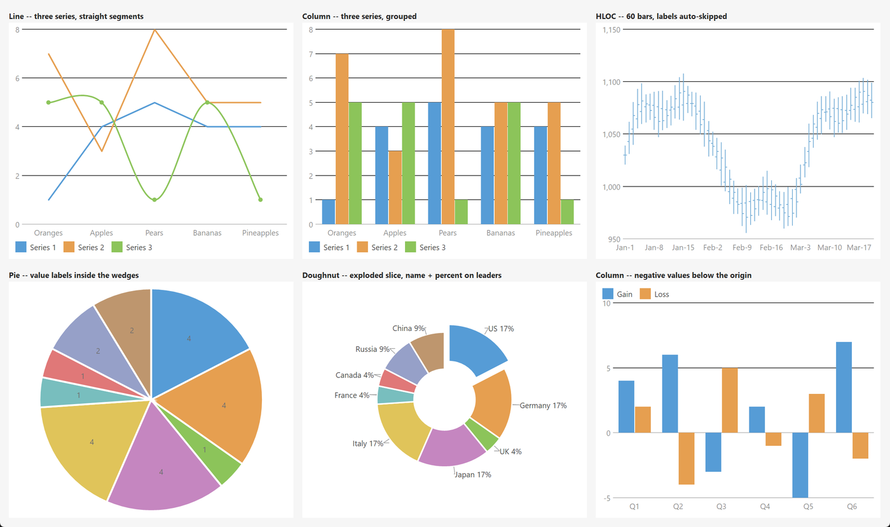

# PsChart

An owner-drawn chart control for FreeBASIC / Win32, built on the AfxNova framework.

One control draws four kinds of chart: a **line** chart of one or more series, a **column** chart
with the series grouped side by side, an **HLOC** (high-low-open-close) price chart, and a **pie**
chart that can also be drawn as a doughnut with slices pulled out of it. You choose which when you
create the control, and it stays that kind for its lifetime.

You hand it series and points; it works out everything else. It picks readable gridline values,
measures the widest axis label and reserves a gutter for it, spaces the categories evenly and
drops every Nth category label when they would otherwise collide. An optional legend and an
optional title and subtitle take their space out of the plot before the plot is measured, so
turning either on never overlaps anything.

It is a **display** control. It takes no focus, no keyboard and no mouse capture, and clicking it
does nothing. The one thing it tracks is the data point under the cursor, which drives a tooltip
naming that point and a callback you can hook. Every message it receives is offered to your
message callback first, so anything interactive — click-to-drill-down being the obvious case — is
yours to add.

Repository: <https://github.com/PaulSquires/PsControls>

## What it looks like



Six charts from the demo: line with three series (the third smoothed, with markers), grouped
columns, 60 HLOC bars with the date labels auto-skipped, a pie with its values inside the wedges,
a doughnut with one slice exploded and name/percent labels on leader lines, and columns straddling
zero.

## Requirements

| File | Why |
|---|---|
| `PsChart.bi`, `PsChart.inc` | The control. |
| `PsBufferPaint.bi`, `PsBufferPaint.inc` | The drawing surface. `PsChart.bi` includes it for you; it must be on your include path. |
| `PsTipHost.bi`, `PsTipHost.inc` | The tooltip backend switch. Also included for you. |
| `PsTooltip.bi`, `PsTooltip.inc` | Needed by `PsTipHost`. |

`PsChart_SetSeriesSymbol` draws its markers with geometry, not glyphs, so there is no font file to
ship.

### Include order

Include the `.inc` files in this order, once, from your main module:

```freebasic
#include once "PsBufferPaint.inc"
#include once "PsChart.inc"
```

`PsChart.inc` pulls in `PsChart.bi` (which includes `PsBufferPaint.bi` and `PsTipHost.bi`) and
`PsTipHost.inc` itself, so those four need no line of their own. `PsBufferPaint.inc` must come
first.

### GDI+ must be running

Every wedge, polyline, bar and gridline is drawn through GDI+. Start it before the first repaint
and shut it down after every window is destroyed:

```freebasic
dim as ULONG_PTR gdipToken = AfxGdipInit()
frmMain_Show( 0 )
AfxGdipShutdown( gdipToken )
```

Without the bracket the control draws nothing at all — it does not fail loudly.

### Do not name anything `ok`

GDI+ defines `Ok = 0` as a `Status` enum value in namespace `AfxNova`, and your host almost
certainly says `using AfxNova`. Any identifier of yours named `ok` — a variable, a parameter, in
any casing, because FreeBASIC is case-insensitive — becomes a duplicate definition the moment you
include this control. Name yours `bOK`.

For the same reason, avoid parameter names that collide with the C runtime declarations AfxNova
pulls in: `fOpen`, `fClose`, `fMin` and `fMax` are all real functions (`fopen`, `fclose`, `fmin`,
`fmax`) and a parameter of any of those names will not compile.

### There is no pump obligation

There is no `PsChart_FilterMessage`. The control needs nothing added to your message loop. It
takes no focus, so it needs no `IsDialogMessage` handling and no startup `SetFocus` either.

## Quick start

```freebasic
dim as HWND hChart = PsChart_Create( hWndParent, IDC_MYCHART, PSCHART_TYPE_COLUMN )
PsChart_SetFont( hChart, ghFont(GUIFONT_9) )

' Bracketed so the control lays out once and repaints once, not per point.
PsChart_BeginUpdate( hChart )
dim as long s1 = PsChart_AddSeries( hChart, "Series 1" )
PsChart_AddPoint( hChart, s1, "Oranges",    1.0 )
PsChart_AddPoint( hChart, s1, "Apples",     4.0 )
PsChart_AddPoint( hChart, s1, "Pears",      5.0 )
dim as long s2 = PsChart_AddSeries( hChart, "Series 2" )
PsChart_AddPoint( hChart, s2, "Oranges",    7.0 )
PsChart_AddPoint( hChart, s2, "Apples",     3.0 )
PsChart_AddPoint( hChart, s2, "Pears",      8.0 )
PsChart_EndUpdate( hChart )

PsChart_SetLegendVisible( hChart, true )
PsChart_SetHotChangeCallback( hChart, @MyChart_HotChange )
```

The control has no opinion about where it sits — position it yourself from your `WM_SIZE`:

```freebasic
SetWindowPos( hChart, 0, rc.left, rc.top, rc.right - rc.left, rc.bottom - rc.top, SWP_NOZORDER )
```

And the callback it references:

```freebasic
sub MyChart_HotChange( byval hChart as HWND, byval iSeries as long, byval iPoint as long )
    if iPoint < 0 then exit sub          ' the cursor left the data
    dim as DWSTRING wszName = PsChart_GetPointLabel( hChart, iSeries, iPoint )
    dim as double   fValue  = PsChart_GetPointValue( hChart, iSeries, iPoint )
end sub
```

## Concepts

### The handle is a real `HWND`

`PsChart_Create` returns an ordinary child window. `SetWindowPos`, `ShowWindow`, `EnableWindow`,
`GetParent` and `DestroyWindow` all work on it directly and there is no wrapper for any of them.
The control never positions itself.

### The chart type is fixed at creation

`PsChart_Create` takes the type and there is no setter for it. The four types do not share a data
shape — a pie has no value axis, and an HLOC point carries four numbers where a column point
carries one — so a control that could switch types would have to tolerate data authored for a type
it is no longer showing. Create a second control instead.

### Series and points

A **series** is what the legend names and what the palette colours: one line, or one set of bars.
A **point** is one datum in a series. Series are indexed from 0 in creation order, and points from
0 within their series.

Categories along the X axis are **positional**: point 3 of every series lines up, whatever its
label says. Only series 0's labels are drawn on the axis — a second series' labels are still
carried, and a tooltip can use them, but two series disagreeing about what category 3 is called
has no rendering that is not a lie. The number of categories is the length of the **longest**
visible series, so a series with fewer points simply stops early.

A **pie** reads only series 0, and enumerates the palette per *point* rather than per series: on a
pie the slices are what the colours have to distinguish.

### The value axis is derived, not set

Unless you turn autoscaling off, the control scans every visible series for its minimum and
maximum, then snaps the range outward to gridlines a human would have chosen — the step is always
1, 2 or 5 times a power of ten:

```
step  = the 1/2/5 x 10^n nearest (range / tick hint)
min   = floor( data minimum / step ) * step
max   = ceil ( data maximum / step ) * step
```

The bounds widen to that step deliberately: a top gridline exactly at the highest datum puts the
tallest bar flush against the edge of the plot with nothing above it.

Two type-specific rules ride on top:

- A **column** chart forces zero into the range, because bars are drawn from a baseline and a
  baseline that is not zero makes a bar four times taller than its neighbour for a value twice as
  large. If the data straddles zero the origin therefore sits inside the plot and negative bars
  hang below it.
- A **line** or **HLOC** chart does **not**. A price series trading at 1,120 plotted against a
  zero baseline is a flat line across the top of the plot.

An HLOC chart takes its range from the **low** and **high** of each point, never from the close.

### Rects are the control's, and layout owns them

`rcPlot`, the axis gutters, the legend block and the title strips are all derived from the client
rect and the measured text — you never set one. Layout is lazy: a mutator marks it stale and the
next repaint recomputes it, so populating a thousand points costs one layout. Every geometry
query (`PsChart_GetPlotRect`, `PsChart_GetPointRect`, `PsChart_HitTest`, `PsChart_ValueToY`) forces
a pending layout first, so none of them can answer from stale numbers.

The same rects drive both the renderer and the hit test, which is what makes "the tooltip named a
different bar than the one under the cursor" impossible rather than merely unlikely.

### Everything is silent except the mouse

Every setter here is silent: adding a point, hiding a series, changing a colour and re-ranging the
axis all repaint and fire nothing. Only user interaction notifies — which in this control means
only the hot point changing under the cursor. That makes it safe to call any function from inside
any callback.

### Raw pixels; you scale

Only the create-time defaults are DPI-scaled for you. Every size you pass afterwards —
`PsChart_SetPadding`, `PsChart_SetBarGap`, `PsChart_SetPointExplode`, symbol sizes, line widths —
is in device pixels, and you scale it: `pWindow->ScaleX( 14 )`. Gridline and axis thickness are
never scaled, because a hairline should stay a hairline.

### Fonts are borrowed

The control never owns an `HFONT` and never destroys one. Whatever you pass to `PsChart_SetFont`,
`PsChart_SetTitleFont` or `PsChart_SetSubtitleFont` stays yours to delete. Unset title and subtitle
fonts fall back to the label font.

## Behaviour and limits

- **The chart type cannot change** after `PsChart_Create`.
- **Column charts are grouped only.** There is no stacked mode and no horizontal (bar) orientation.
- **Line charts have no area fill** under the line.
- **A pie reads series 0 only.** Additional series on a pie chart are ignored.
- **`PsChart_SetPointExplode` is pie-only** and always addresses series 0.
- **A horizontal legend gets one row.** Entries that do not fit are dropped rather than drawn over
  the plot. Use a left or right legend when you have many series.
- **Slice labels can be dropped.** In `CHT_PIEPLACE_INSIDE`, a label wider than its wedge's chord
  is not drawn at all. `CHT_PIEPLACE_AUTO` (the default) promotes those to an outside leader
  instead, and never silently drops one.
- **A zero-valued column draws nothing** — a zero-height bar would put a stray hairline on the
  baseline where the data says there is nothing — and therefore cannot be hit-tested.
- **A zero-valued pie slice draws nothing** and has no sweep.
- **The X axis is categorical.** Points are evenly spaced whatever their labels say, so a gap in
  a date sequence is not a gap on the axis.
- **Supplying a paint callback replaces the entire renderer** — plot, axes, legend and chrome. It
  is all-or-nothing.
- **Single-threaded.** UI thread only.

## API reference

### Creation and type

| Function | Behaviour |
|---|---|
| `PsChart_Create( hWndParent, CtrlID, nChartType = PSCHART_TYPE_LINE ) as HWND` | Creates the control as a visible `WS_CHILD` at 0×0; position it yourself. An unrecognised `nChartType` falls back to `PSCHART_TYPE_LINE`. Returns 0 on failure. |
| `PsChart_GetChartType( hChart ) as long` | The `PSCHART_TYPE_*` fixed at creation. Returns −1 for a handle that is not a chart. |

Destroy it with `DestroyWindow`; the control frees its own state and tooltip.

### Series

| Function | Behaviour |
|---|---|
| `PsChart_AddSeries( hChart, wszName = "" ) as long` | Appends a series and returns its index, or −1. The slot is fully reset, so a name or colour from a previously cleared series never leaks through. |
| `PsChart_GetSeriesCount( hChart ) as long` | How many series exist. |
| `PsChart_SetSeriesName( hChart, iSeries, wszName ) as boolean` | The legend text. False for a bad index. |
| `PsChart_GetSeriesName( hChart, iSeries ) as DWSTRING` | `""` for a bad index. |
| `PsChart_SetSeriesColor( hChart, iSeries, clr ) as boolean` | Overrides the palette for this series. |
| `PsChart_ClearSeriesColor( hChart, iSeries ) as boolean` | Drops the override; the series goes back to palette entry `iSeries mod 10`. |
| `PsChart_SetSeriesLineWidth( hChart, iSeries, nWidth ) as boolean` | Line-chart pen width in raw pixels. Clamped to a minimum of 1. |
| `PsChart_SetSeriesLineStyle( hChart, series, nStyle ) as boolean` | Breaks a **line** series' stroke: one of the `CHT_LINE_*` constants. Column and HLOC charts ignore it. An unrecognised style is stored as `CHT_LINE_SOLID`, so what you read back is always something that draws. |
| `PsChart_GetSeriesLineStyle( hChart, series ) as long` | `CHT_LINE_SOLID` for a bad index as well as for an unstyled series. |
| `PsChart_SetSeriesSymbol( hChart, iSeries, nSymbol, nSize = 6 ) as boolean` | A `CHT_SYM_*` marker at every vertex of a line series. `nSize` is clamped to a minimum of 2. |
| `PsChart_SetSeriesSmooth( hChart, iSeries, bSmooth ) as boolean` | Draws the series as a cardinal spline instead of straight segments. A spline can overshoot its own data points; it is clipped to the plot. |
| `PsChart_SetSeriesVisible( hChart, iSeries, bVisible ) as boolean` | Hiding a series removes it from the **axis range** as well as from the drawing, so hiding an outlier rescales the chart. Also clears the hot point if it was in that series. |
| `PsChart_IsSeriesVisible( hChart, iSeries ) as boolean` | False for a bad index as well as for a hidden series. |

### Points

| Function | Behaviour |
|---|---|
| `PsChart_AddPoint( hChart, iSeries, wszLabel, fValue ) as long` | Appends a point; returns its index within the series, or −1. For line, column and pie charts. |
| `PsChart_AddHlocPoint( hChart, iSeries, wszLabel, fOpenVal, fHighVal, fLowVal, fCloseVal ) as long` | Appends an HLOC point. A high below its low is swapped into order. `Value` is set to the close, so a tooltip or a value query has one number without switching on the chart type. |
| `PsChart_GetPointCount( hChart, iSeries ) as long` | Points in that series; 0 for a bad index. |
| `PsChart_SetPointValue( hChart, iSeries, iPoint, fValue ) as boolean` | Line/column/pie value. Does not touch the four HLOC numbers. |
| `PsChart_GetPointValue( hChart, iSeries, iPoint ) as double` | 0 for a bad index. For an HLOC point this is the close. |
| `PsChart_SetPointLabel( hChart, iSeries, iPoint, wszLabel ) as boolean` | The category label. Only series 0's are drawn on the axis. |
| `PsChart_GetPointLabel( hChart, iSeries, iPoint ) as DWSTRING` | `""` for a bad index. |
| `PsChart_SetPointColor( hChart, iSeries, iPoint, clr ) as boolean` | Overrides both the series colour and the palette for this one point — one highlighted bar, one wedge. |
| `PsChart_ClearPointColor( hChart, iSeries, iPoint ) as boolean` | Drops that override. |
| `PsChart_SetPointItemData( hChart, iSeries, iPoint, nData ) as boolean` | Your payload. Purely storage — it does **not** repaint. |
| `PsChart_GetPointItemData( hChart, iSeries, iPoint ) as LONG_PTR` | 0 for a bad index. |
| `PsChart_SetPointExplode( hChart, iPoint, nOffset ) as boolean` | Pie only; always series 0. Raw pixels along the slice's bisector, clamped at 0. Layout reserves room for the largest offset before it cuts the pie's square, so the pie shrinks rather than the slice leaving the control. |
| `PsChart_ClearPoints( hChart, iSeries ) as boolean` | Drops every point of one series, keeping the series and its styling. Releases the labels. |
| `PsChart_Clear( hChart )` | Drops every series, point and hot state. |

### Bulk population

| Function | Behaviour |
|---|---|
| `PsChart_BeginUpdate( hChart )` | Suspends invalidation. |
| `PsChart_EndUpdate( hChart )` | Resumes it and repaints. **Nests** — a depth counter, not a flag — so a helper that brackets its own work does not end its caller's batch. Only the outermost `EndUpdate` repaints. Unbalanced extra calls are ignored. |

### Value axis

| Function | Behaviour |
|---|---|
| `PsChart_SetAutoScale( hChart, bAuto )` | On by default. |
| `PsChart_GetAutoScale( hChart ) as boolean` | |
| `PsChart_SetValueRange( hChart, fLo, fHi )` | Fixes the range and turns **autoscaling off** as a side effect. An inverted or empty range is corrected to `fLo` … `fLo + 1`. |
| `PsChart_GetValueRange( hChart, byref fLo, byref fHi )` | The **resolved** range, autoscaled or not — which is wider than your data. Forces a pending layout. |
| `PsChart_SetTickCountHint( hChart, nTicks )` | How many gridlines to aim for; a hint, not a count, because the step is snapped to 1/2/5×10ⁿ. Clamped 2…20 when used. Default 5. |
| `PsChart_SetGridLines( hChart, bHorz, bVert )` | Horizontal on, vertical off by default. Vertical gridlines are drawn at each category centre. |
| `PsChart_SetValueFormat( hChart, nDecimals, bThousands )` | `PSCHART_DECIMALS_AUTO` (−1) derives the decimal count from the axis step. Thousands grouping is a plain `,` and is not locale-dependent, so the same data reads the same on every machine. |
| `PsChart_SetAxisLabelSkip( hChart, nSkip )` | `PSCHART_SKIP_AUTO` (0) measures the widest label and works the stride out; 1 draws every label; N draws every Nth. Negative values are clamped to 0. |
| `PsChart_GetAxisLabelSkip( hChart ) as long` | The **resolved** stride actually in use, never 0. Forces a pending layout. |
| `PsChart_ValueToY( hChart, fValue ) as long` | Client-coordinate pixel row for a value. The axis minimum maps exactly to the plot's bottom edge and the maximum exactly to its top. Values outside the range map outside the plot. |
| `PsChart_YToValue( hChart, y ) as double` | The inverse, to within a pixel. |

### Title, subtitle and legend

| Function | Behaviour |
|---|---|
| `PsChart_SetTitle( hChart, wszText )` | An empty string reserves no space. |
| `PsChart_GetTitle( hChart ) as DWSTRING` | |
| `PsChart_SetSubtitle( hChart, wszText )` | Drawn under the title, same rule. |
| `PsChart_GetSubtitle( hChart ) as DWSTRING` | |
| `PsChart_SetLegendVisible( hChart, bVisible )` | Off by default. |
| `PsChart_IsLegendVisible( hChart ) as boolean` | |
| `PsChart_SetLegendPosition( hChart, nPos )` | A `CHT_LEGEND_*` edge. An unrecognised value is ignored and the position is left alone. Left/right legends are capped at half the available width. |
| `PsChart_SetPadding( hChart, nPadding )` | Inset from the client edge on all four sides, raw pixels, clamped at 0. |
| `PsChart_SetFont( hChart, hFont )` | Axis, legend and slice labels. Borrowed — you still own and destroy it. |
| `PsChart_SetTitleFont( hChart, hFont )` | Falls back to the label font when unset. |
| `PsChart_SetSubtitleFont( hChart, hFont )` | Same. |

The control also honours `WM_SETFONT` / `WM_GETFONT`, which set and read the label font.

### Column charts

| Function | Behaviour |
|---|---|
| `PsChart_SetBarGap( hChart, nGap )` | Raw pixels between bars **within** one category group. Clamped at 0. |
| `PsChart_SetGroupGapPercent( hChart, nPct )` | Percent of each category slot left empty between groups. Clamped 0…90. Default 25. |

A bar narrower than one pixel is drawn as a one-pixel hairline rather than vanishing — the chart
is too narrow for the data, and a hairline says so where nothing does not.

### HLOC charts

| Function | Behaviour |
|---|---|
| `PsChart_SetHlocTickWidth( hChart, nWidth ) ` | The open/close tick's arm length per side, raw pixels, clamped to a minimum of 1. |
| `PsChart_SetHlocUpDownColors( hChart, bEnable )` | Off by default (the whole series takes its series colour). On, a bar whose close is at or above its **own open** takes `UpColor` and one below takes `DownColor` — compared against its own open, not against the previous bar, so a bar means the same thing whether or not its neighbour is on screen. A per-point colour still wins over both. |

Each bar is a vertical high-to-low line with the open ticked to the left and the close ticked to
the right. The hit band is the whole category slot, not the two-pixel line.

### Pie charts

| Function | Behaviour |
|---|---|
| `PsChart_SetDoughnutRatio( hChart, fRatio )` | Hole radius as a fraction of the outer radius. Clamped 0.0…0.9; 0.0 is a solid pie. The hole is a hole for hit-testing too. |
| `PsChart_GetDoughnutRatio( hChart ) as single` | |
| `PsChart_SetPieLabelMode( hChart, nMode )` | A `CHT_PIELABEL_*` mode. Default `CHT_PIELABEL_VALUE`. |
| `PsChart_SetPieLabelPlacement( hChart, nPlace )` | A `CHT_PIEPLACE_*` rule. Default `CHT_PIEPLACE_AUTO`. |
| `PsChart_SetPieStartAngle( hChart, fDegrees )` | GDI+ degrees: 0 is 3 o'clock and positive runs **clockwise**. Default −90, i.e. 12 o'clock. |
| `PsChart_SetPieSliceGap( hChart, nGap )` | Width of the separator stroked between wedges, in `SliceGapColor`. Not DPI-scaled — it is a hairline. 0 removes it. |

Wedge sweeps come from the **absolute** value of each point over the sum of absolute values, so a
negative datum still gets a proportional slice instead of silently making the remaining wedges add
up to more than their total.

### Colours

| Function | Behaviour |
|---|---|
| `PsChart_GetColors( hChart, pColors )` | Copies the struct out. Read-modify-write; there are no per-field setters. |
| `PsChart_SetColors( hChart, pColors )` | Copies it back in and repaints. |
| `PsChart_SetPaletteColor( hChart, idx, clr )` | Palette entry 0…9. An out-of-range index is ignored. |
| `PsChart_GetPaletteColor( hChart, idx ) as COLORREF` | 0 for an out-of-range index. |

### Query and hit testing

| Function | Behaviour |
|---|---|
| `PsChart_HitTest( hChart, x, y, byref iSeries, byref iPoint ) as boolean` | Client coordinates. Both indices are set to −1 when nothing is there. Forces a pending layout. On the axis charts, later series are tested first so the series drawn on top answers. On a pie, the test accounts for the doughnut hole and for each slice's explode offset. |
| `PsChart_GetPlotRect( hChart, byref rc ) as boolean` | The plot area, in client coordinates. |
| `PsChart_GetPointRect( hChart, iSeries, iPoint, byref rc ) as boolean` | The bar for a column point, the full column band for an HLOC point, the hit box around the vertex for a line point, and the label box for a pie slice. Empty for a hidden series. |
| `PsChart_GetHotPoint( hChart, byref iSeries, byref iPoint ) as boolean` | The point currently under the cursor. Returns false when nothing is hot. Does **not** force a layout — it reports state, not geometry. |

### Tooltips

The tooltip text is resolved in this order: text you set with `PsChart_SetTooltipText`, then your
tooltip callback, then the control's own description of the hot point. There is no caption
fallback — a chart has no caption of its own.

The control's own description is the point's label plus its value; on a multi-series chart the
series name is included, on a pie the share as a percentage, and on an HLOC chart all four of
`O H L C`.

| Function | Behaviour |
|---|---|
| `PsChart_SetTooltipText( hChart, wszText )` | Fixed whole-control text. Wins over the callback and over the per-point default. `""` restores them. |
| `PsChart_GetTooltipText( hChart ) as DWSTRING` | |
| `PsChart_SetTooltipMode( hChart, nMode )` | `PSTIP_MODE_SYSTEM` (comctl32, the default) or `PSTIP_MODE_PS` (PsTooltip). Switching destroys one backend and builds the other. |
| `PsChart_GetTooltipMode( hChart ) as long` | |

### Callback registration

| Function | Behaviour |
|---|---|
| `PsChart_SetPaintCallback( hChart, userfunc )` | Replaces the whole renderer. |
| `PsChart_SetMessageCallback( hChart, userfunc )` | Offered every message except `WM_DESTROY` / `WM_NCDESTROY`. |
| `PsChart_SetTooltipCallback( hChart, userfunc )` | Whole-control tooltip text. |
| `PsChart_SetValueLabelCallback( hChart, userfunc )` | Formats numbers for the axis, pie labels and tooltips. |
| `PsChart_SetHotChangeCallback( hChart, userfunc )` | The hot point changed. |

Passing 0 to any of these removes the callback.

### Render probes

These render the control offscreen through the **same** function `WM_PAINT` uses, then read the
resulting pixels back. They exist so a regression check measures what is actually drawn rather
than a parallel implementation of it. None of them touches the screen.

| Function | Behaviour |
|---|---|
| `PsChart_CountRenderedTones( hChart ) as long` | How many distinct colours appear on a fixed 32×32 sample grid, capped at 64. A useful "did anything get drawn" check: an empty chart still returns at least its background and its gridlines, and adding data raises the count. |
| `PsChart_HashRenderedPart( hChart ) as ulong` | An FNV-1a hash of the same sample. Identical state hashes identically; any visible change to the sampled pixels changes it. |
| `PsChart_CountPlotInkPixels( hChart, clrBack ) as long` | How many pixels inside the plot rect are **not** `clrBack` — the series' ink, when you pass the plot background. Every pixel of the rect, not a sample grid, because a 32×32 grid is far too coarse to see a dash pattern. That makes it a *test* probe: it costs one `GetPixel` per plot pixel and has no business near a repaint. |

Both return 0 if the control has no client area yet.

## Colors

`PSCHART_COLORS`, read and written whole:

```freebasic
dim as PSCHART_COLORS clrs
PsChart_GetColors( hChart, @clrs )
clrs.BackColor = BGR(255,255,255)
clrs.GridColor = BGR(220,220,220)
PsChart_SetColors( hChart, @clrs )
```

| Field | Paints | Default |
|---|---|---|
| `BackColor` | The whole client area. | `BGR(33,37,43)` |
| `PlotBackColor` | The plot rect, and only when it differs from `BackColor` — set it apart to make the plot area stand out. | `BGR(33,37,43)` |
| `GridColor` | Value gridlines, and category gridlines when those are on. | `BGR(62,68,78)` |
| `AxisColor` | The baseline rule under the plot, and the zero rule when zero falls inside the plot. | `BGR(90,97,108)` |
| `LabelColor` | Both axes' text. | `BGR(150,156,166)` |
| `TitleColor` | The title. | `BGR(215,218,224)` |
| `SubtitleColor` | The subtitle. | `BGR(150,156,166)` |
| `LegendTextColor` | Legend entry names. Swatches take the series or slice colour. | `BGR(190,196,206)` |
| `SliceLabelColor` | Pie labels drawn **inside** a wedge. | `BGR(255,255,255)` |
| `SliceLabelOutColor` | Pie labels drawn **outside**, over the chart background. | `BGR(190,196,206)` |
| `LeaderColor` | Leader lines to outside pie labels. | `BGR(120,126,136)` |
| `SliceGapColor` | The separator stroked between pie wedges. Normally set equal to the plot background. | `BGR(33,37,43)` |
| `UpColor` | HLOC bars closing at or above their open — only when `PsChart_SetHlocUpDownColors` turned them on. | `BGR(72,151,13)` |
| `DownColor` | HLOC bars closing below their open, same condition. | `BGR(208,80,80)` |
| `ForeColorDisabled` | Reserved for a disabled chart; the default renderer does not currently consult it, but it reaches your paint callback in the info struct's `isEnabled` flag. | `BGR(110,115,125)` |

`SliceGapColor` defaults equal to `BackColor`, which is what makes the default pie read as wedges
separated by the background rather than as an outlined disc.

Series colours are **not** in this struct. They resolve in this order: an explicit per-point
colour, then an explicit per-series colour, then the palette. On a pie the palette is indexed by
**point**; everywhere else by series. The ten palette defaults are a blue, orange, green, magenta,
yellow, teal, red, periwinkle, tan and grey, wrapping after ten.

## Callbacks

### Paint

```freebasic
type CHT_PaintCallbackSub as sub( byval p as PSCHART_PAINTINFO ptr )
```

Fires once per repaint, after the control has filled the background and resolved every rect.
**Supplying one replaces the entire default renderer** — the plot, the axes, the gridlines, the
legend and the chrome. This is not the additive kind of paint callback: draw the chart yourself,
or do not set one.

Draw through `p->b`, which is the control's own `PsBufferPaint` for this repaint. Never build a
second GDI+ `Graphics` on its DC, and never touch the screen DC.

Every sentinel is already resolved: `fMin`/`fMax`/`fStep` are the real range even when
autoscaling, `nDecimals` is the derived count and never −1, and `nLabelStride` is the measured
skip and never 0.

#### `PSCHART_PAINTINFO`

| Field | Meaning |
|---|---|
| `hChart` | The control. |
| `b` | Its `PsBufferPaint ptr` for this repaint. |
| `rcClient` | The whole client rect. |
| `rcPlot` | The plot area. |
| `rcTitle` | The title strip; empty when there is no title. |
| `rcSubtitle` | The subtitle strip; empty when there is none. |
| `rcLegend` | The legend block; empty when the legend is off. |
| `rcAxisX` | The category-label strip below the plot. Empty on a pie. |
| `rcAxisY` | The value-label gutter left of the plot. Empty on a pie. |
| `rcPie` | The pie's square. Empty on every other type. |
| `nChartType` | The `PSCHART_TYPE_*`. |
| `fMin`, `fMax`, `fStep` | The resolved value axis. |
| `nDecimals` | Resolved decimal places for value labels. |
| `nOriginY` | The pixel row of value 0, clamped into the plot. |
| `nCatCount` | Categories on the X axis. |
| `nLabelStride` | Draw category label *i* when `i mod nLabelStride = 0`. |
| `nHotSeries`, `nHotPoint` | The point under the cursor; −1 when none. |
| `isEnabled` | False after `EnableWindow(hChart, FALSE)`. |
| `wszTitle`, `wszSubtitle` | The strings, so you need not query them. |

### Message

```freebasic
type CHT_MessageCallbackFunc as function( byval m as PSCHART_MESSAGEINFO ptr ) as boolean
```

Fires for every message the control receives **except** `WM_DESTROY` and `WM_NCDESTROY` — offering
those would let a callback suppress the cleanup that frees the state it is holding a pointer to.
Return TRUE to suppress the control's own handling of that message, FALSE to let it proceed.

`WM_LBUTTONUP`'s return value is **ignored**. Nothing here takes mouse capture today, but the rule
stands so that a control which later does cannot be stranded by a callback that swallowed the
up-message that would have released it.

#### `PSCHART_MESSAGEINFO`

| Field | Meaning |
|---|---|
| `hChart` | The control. |
| `uMsg`, `wParam`, `lParam` | The message, unmodified. |
| `iSeries`, `iPoint` | The currently hot point, so you need not repeat the hit test; −1 when none. |

### Tooltip

```freebasic
type CHT_TooltipCallbackFunc as function( byval hChart as HWND ) as DWSTRING
```

Consulted when no text was set with `PsChart_SetTooltipText`. Return `""` to fall through to the
control's own description of the hot point. Call `PsChart_GetHotPoint` inside it to find out what
the cursor is over.

### Value label

```freebasic
type CHT_ValueLabelCallbackFunc as function( byval hChart as HWND, byval fValue as double, _
                                             byval nContext as long ) as DWSTRING
```

Formats one number. `nContext` is `CHT_FMT_AXIS`, `CHT_FMT_PIELABEL` or `CHT_FMT_TOOLTIP`, so one
function can format an axis tick and a tooltip differently. Return `""` to fall back to the
control's own formatting, which lets you special-case a few values without formatting all of them.

Axis labels are measured to size the value gutter, so a callback that returns much wider strings
widens the gutter rather than overlapping the plot.

### Hot change

```freebasic
type CHT_HotChangeCallbackSub as sub( byval hChart as HWND, byval iSeries as long, _
                                      byval iPoint as long )
```

Fires when the data point under the cursor changes, including to `-1, -1` when the cursor leaves
the data or the control. **User interaction only** — a programmatic change that happens to move
data under the cursor does not fire it. It fires *after* the state is updated, so
`PsChart_GetHotPoint` inside the handler already reports the new point.

## Constants

### Chart type

| Constant | Meaning |
|---|---|
| `PSCHART_TYPE_LINE` | Polyline or spline per series. The default. |
| `PSCHART_TYPE_COLUMN` | Vertical bars, series grouped per category. |
| `PSCHART_TYPE_HLOC` | High-low-open-close price bars. |
| `PSCHART_TYPE_PIE` | Wedges from series 0; optionally a doughnut. |

### Line symbols

`CHT_SYM_NONE` (the default), `CHT_SYM_CIRCLE`, `CHT_SYM_SQUARE`, `CHT_SYM_DIAMOND`,
`CHT_SYM_TRIANGLE`.

### Line styles

`CHT_LINE_SOLID` (the default), `CHT_LINE_DASH`, `CHT_LINE_DOT`, `CHT_LINE_DASHDOT`. Line series
only. The dash lengths are in **pen-width units**, so one style reads the same at 1 px and at 3 px,
and the patterns favour the gap over the dash — a dashed series has to be distinguishable from a
solid one at the 1–2 px a chart series actually uses. Use this rather than a second colour when
the two runs are the same quantity: a forecast drawn in a different colour reads as different data.

`CHT_LEGEND_BOTTOM` (the default), `CHT_LEGEND_TOP`, `CHT_LEGEND_LEFT`, `CHT_LEGEND_RIGHT`.
Top and bottom lay the entries out in one row; left and right in a column.

### Pie label mode

| Constant | Label reads |
|---|---|
| `CHT_PIELABEL_NONE` | nothing |
| `CHT_PIELABEL_VALUE` | the formatted value (the default) |
| `CHT_PIELABEL_PERCENT` | `23%` |
| `CHT_PIELABEL_NAME` | the point's label |
| `CHT_PIELABEL_NAME_PERCENT` | `Oranges 23%` |

### Pie label placement

| Constant | Behaviour |
|---|---|
| `CHT_PIEPLACE_INSIDE` | Inside the wedge, and **dropped** when it does not fit. |
| `CHT_PIEPLACE_OUTSIDE` | Always outside the rim, on a two-segment leader. |
| `CHT_PIEPLACE_AUTO` | Inside when it fits, promoted to an outside leader when it does not. The default, and the only one that never drops a label. |

### Value-label context

`CHT_FMT_AXIS`, `CHT_FMT_PIELABEL`, `CHT_FMT_TOOLTIP`.

### Sentinels

| Constant | Value | Meaning |
|---|---|---|
| `PSCHART_DECIMALS_AUTO` | −1 | Derive the decimal count from the axis step. 0 is a real request for none. |
| `PSCHART_SKIP_AUTO` | 0 | Measure the labels and work the stride out. 1 is a real request for every label. |
| `PSCHART_PALETTE_COUNT` | 10 | Palette entries before it wraps. |

### Defaults

| Constant | Value |
|---|---|
| `PSCHART_DEFAULT_PADDING` | 10 |
| `PSCHART_DEFAULT_CHROMEGAP` | 6 |
| `PSCHART_DEFAULT_TICKLEN` | 4 |
| `PSCHART_DEFAULT_BARGAP` | 1 |
| `PSCHART_DEFAULT_GROUPGAPPCT` | 25 |
| `PSCHART_DEFAULT_HLOCTICK` | 3 |
| `PSCHART_DEFAULT_LINEWIDTH` | 2 |
| `PSCHART_DEFAULT_SYMBOLSIZE` | 6 |
| `PSCHART_DEFAULT_PIEGAP` | 1 |
| `PSCHART_DEFAULT_TICKHINT` | 5 |
| `PSCHART_DEFAULT_LABELGAP` | 8 |
| `PSCHART_DEFAULT_HITRADIUS` | 8 |

The size values are DPI-scaled once, when the control is created. `PSCHART_DEFAULT_PIEGAP` and the
gridline and axis thicknesses are not, ever.

## Related controls

`PsChart` draws through [PsBufferPaint](../PsBufferPaint/README.md) and shows its tooltips through
[PsTooltip](../PsTooltip/README.md) when you switch it to `PSTIP_MODE_PS`. See those documents for
the drawing surface's primitives and the tooltip's own styling functions — the tooltip's colours,
fonts and glyph are set on the tooltip, not mirrored here.

## Licence

Mozilla Public License 2.0. See `LICENSE`.
