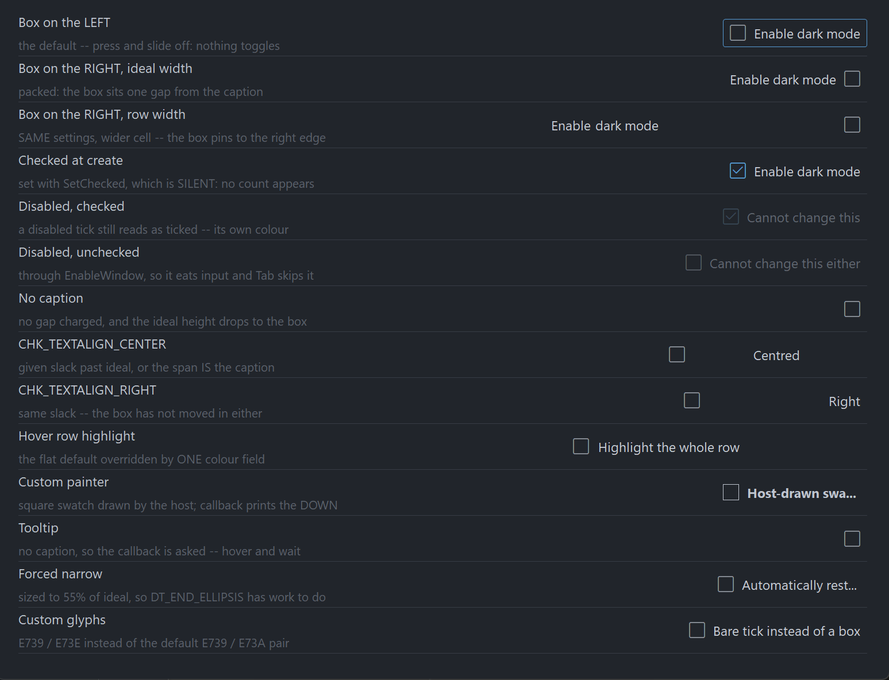

# PsCheckBox

An owner-drawn checkbox for FreeBASIC + Win32, built on AfxNova and `PsBufferPaint`. It draws a
box glyph from a font — Segoe Fluent Icons by default — and an optional caption, with a focus ring
around the pair. The box can sit on either side of the caption. You supply the colours and the
fonts; the control owns the geometry and the state.

It is a real `HWND`, so you place and size it with `SetWindowPos` like any other control. It takes
focus, tracks hover and press, greys itself when disabled through `EnableWindow`, and tells you
when the user changed its state. It has two states — checked and unchecked. There is no
indeterminate state.

The box is **one composite glyph per state**: `U+E739`, an empty outlined square, for unchecked,
and `U+E73A`, the same square with a tick in it, for checked. Both are settable. That single
decision shapes the rest of the control: the outline and the tick are one piece of ink in one
colour, so an accent-filled box with a contrasting white tick is not reachable without a paint
callback — but everything about the box's appearance is swappable by changing a font or a
codepoint.

## What it looks like



## Requirements

Copy these files into your project:

| File | Purpose |
|---|---|
| `PsCheckBox.bi` | Public surface: types, colours, constants, declarations |
| `PsCheckBox.inc` | Implementation |
| `PsBufferPaint.bi` | The double-buffered drawing surface the control paints through |
| `PsBufferPaint.inc` | |
| `PsTipHost.bi` / `PsTipHost.inc` | The tooltip backend switch — see *Tooltips: two backends* |
| `PsTooltip.bi` / `PsTooltip.inc` | The owner-drawn tooltip. Required even if you never switch to it: `PsTipHost.inc` includes it. |

You also need AfxNova on the include path (`-i "C:\dev"` if your tree matches this one), and a
font supplying the box glyph — `SegoeFluentIcons.ttf` ships with this repo.

### Include order

`PsCheckBox.inc` includes `PsCheckBox.bi`, which includes `PsBufferPaint.bi` and `PsTipHost.bi`;
`PsCheckBox.inc` also includes `PsTipHost.inc`, which in turn includes `PsTooltip.inc`. So the
tooltip files need no include line of your own. The **implementation** of `PsBufferPaint` is the
one thing not pulled in for you, so include it yourself, first:

```freebasic
#include once "windows.bi"
#include once "AfxNova\CWindow.inc"
#include once "AfxNova\AfxStr.inc"
#include once "AfxNova\AfxGdiplus.inc"
using AfxNova

#include once "PsBufferPaint.inc"
#include once "PsCheckBox.inc"
```

Beyond that there is no ordering trap: `PsCheckBox.bi` names no type it does not itself include,
so it compiles at any site that has already loaded `PsBufferPaint`.

### GDI+ must be running

`PsBufferPaint` renders all geometry through GDI+. Initialize it before the first repaint and shut
it down after every window is destroyed:

```freebasic
dim as ULONG_PTR gdipToken = AfxGdipInit()
function = frmMain_Show( 0 )
AfxGdipShutdown( gdipToken )
```

Without the bracket the control draws nothing.

### Do not name anything `ok`

GDI+ defines `Ok = 0` as a `Status` enum value in namespace `AfxNova`, and your host almost
certainly says `using AfxNova`. Any identifier of your own called `ok` becomes a duplicate
definition the moment you adopt this control. Use `bOK`.

### Message pump

**There is no `PsCheckBox_FilterMessage`.** This control owns no popup and no second top-level
window, so it adds no pump obligation — unlike `PsComboBox`, `PsNumericUpDown` and `PsTextBox`, which
all do. If you arrived from one of those, there is nothing to look for here.

Two things your pump *does* need, because the control is focusable. First, `IsDialogMessage`:

```freebasic
do while GetMessage(@uMsg, null, 0, 0)
    if uMsg.message = WM_QUIT then exit do
    ' IsDialogMessage is what makes Tab move between controls.
    if IsDialogMessage(pWindow->hWindow, @uMsg) = 0 then
        TranslateMessage @uMsg
        DispatchMessage @uMsg
    end if
loop
```

Second, once at startup, focus on one of your controls:

```freebasic
SetFocus( hCheck )
```

`IsDialogMessage` only acts when the focused window is already a descendant of the window you pass
it. Without that `SetFocus`, Tab does nothing until the user clicks something — a symptom that
reads as broken tabstops. A dialog does this for you in `WM_INITDIALOG`; an ordinary `CWindow`
host must do it itself.

Without `IsDialogMessage` the control still works fully with the mouse, and with Space and Enter
once it has focus. Only Tab *navigation* is lost.

## Quick start

```freebasic
dim as HWND hCheck = PsCheckBox_Create( hWndParent, IDC_MYCHECK )

PsCheckBox_SetFont( hCheck, ghFont(GUIFONT_10) )          ' caption font, and the MEASURING font
PsCheckBox_SetGlyphFont( hCheck, ghFont(SYMBOLFONT_12) )  ' Segoe Fluent Icons
PsCheckBox_SetText( hCheck, "Enable dark mode" )
PsCheckBox_SetChecked( hCheck, true )                     ' silent: fires no callback
PsCheckBox_SetCheckChangedCallback( hCheck, @OnDarkModeChanged )

' Size it to what it actually needs, then place it.
dim as long iw, ih
PsCheckBox_GetIdealSize( hCheck, iw, ih )
SetWindowPos( hCheck, 0, 20, 20, iw, ih, SWP_NOZORDER )
ShowWindow( hCheck, SW_SHOW )
```

```freebasic
sub OnDarkModeChanged( byval hCheckBox as HWND, byval isChecked as boolean )
    dim as string s = "dark mode = " & str(isChecked)
    print s
end sub
```

That callback fires for a completed click, for Space or Enter, and for `PsCheckBox_Toggle`. It does
**not** fire for `PsCheckBox_SetChecked`.

## Concepts

### The handle is a real window

`PsCheckBox_Create` returns an `HWND`, not an opaque type, because you legitimately need to treat
the control as a window — `SetWindowPos`, `ShowWindow`, `EnableWindow`, `GetDlgItem`. The `CtrlID`
you pass becomes the window's `GWLP_ID` and the initial `SetID` value.

The control frees itself when its window is destroyed, and destroys its tooltip with it. The two
fonts you hand it stay yours to delete.

### Geometry is derived, never set

You never assign a rectangle. You set inputs — padding, box size, gap, focus ring — and the
control derives four rectangles from them, lazily: a setter marks the layout stale, and the next
paint or rect query does a single measuring pass. A burst of setters costs one measurement, not
one each.

```
ringPad    = nFocusGap + nFocusThick          reserved ALWAYS, focused or not
textW      = measured caption width           0 when there is no caption
textH      = GetTextMetrics.tmHeight          one height for the control
textBlock  = hasText ? nBoxGap + textW : 0
contentH   = max( hasText ? textH : 0 , nBoxHeight )

nIdealW    = 2*ringPad + nPadLeft + nBoxWidth + textBlock + nPadRight
nIdealH    = 2*ringPad + nPadTop  + contentH + nPadBottom

rcContent  = rcClient deflated by ringPad on all four sides
rcVisual   = rcContent inflated by ringPad    ( = rcClient when sized ideally )

BOXALIGN_LEFT    rcBox  at rcContent.left + nPadLeft,  nBoxWidth x nBoxHeight, v-centred
                 rcText = ( rcBox.right + nBoxGap , rcContent.right - nPadRight )
BOXALIGN_RIGHT   rcBox  at rcContent.right - nPadRight - nBoxWidth, same, v-centred
                 rcText = ( rcContent.left + nPadLeft , rcBox.left - nBoxGap )
```

`PsCheckBox_GetIdealSize` is valid **before** the control has ever been sized — the measuring pass
runs ahead of the check for a client area, precisely so you can call it to decide how big to make
the control in the first place. It is also unaffected by starving the control's client area, so a
host that always sizes with it can never see an ellipsis.

### The box is pinned; the caption gets the leftover

The box cell is pinned to the padding on whichever side you put it, and the caption takes the
whole span left over. One model, two looks, decided entirely by the width you give the control:

```
sized to GetIdealSize     [x] Enable dark mode              packed
sized to a row width      Enable dark mode            [x]   settings row
```

So a column of `CHK_BOXALIGN_RIGHT` checkboxes all given the same width will line their boxes up
for free. Flipping the side does **not** change the ideal size — the box cell, the gap and both
paddings are all still charged, they have only swapped ends.

`PsCheckBox_SetTextAlign` places the caption inside that **span**, not inside the control. With the
box on the left and `CHK_TEXTALIGN_RIGHT`, the caption goes to the right-hand end of the span, not
to the right-hand edge of the window. Sized to its ideal width the span *is* the caption, so all
three alignments render identically — alignment only becomes visible once the control has slack.

### The box cell is declared, not measured

`PsCheckBox_SetBoxSize` states how much room the glyph gets. The control never measures the glyph
font, so a glyph too large for its cell clips rather than resizing the control. This is why
`PsCheckBox_SetGlyphFont` repaints but never re-lays-out, and why swapping either glyph string can
never change the ideal width.

### Setters are silent; user interaction notifies

`PsCheckBox_SetChecked` changes the state and fires nothing — Win32's `BM_SETCHECK` / `BN_CLICKED`
split. That is what makes it safe to call from inside your own change handler without recursing.

The one deliberate exception is `PsCheckBox_Toggle`, which flips the state **and** fires the
callback. It is an action, not a setter — the equivalent of `BM_CLICK`, and the door your
accelerator uses, since this control parses no mnemonics.

### Focus and keyboard

The control is a `WS_TABSTOP` with real focus tracking and a painted focus ring. Space **and**
Enter both toggle it while it is focused.

Enter is a departure from a system checkbox, which ignores it and lets it reach the dialog's
default button. If that matters to your dialog, intercept `WM_KEYDOWN` through the message
callback and return TRUE for `VK_RETURN`.

The focus ring's band is reserved whether or not the control has focus, so nothing moves when
focus arrives — which also means the ring settings contribute to the ideal size.

### Mouse capture and the cancelled gesture

The control takes mouse capture on a press, because press → slide off → release must **not**
toggle. Only a matched press and release with the cursor still inside counts as a click. While the
press is live the hover state keeps tracking, so sliding off visibly un-flashes the control before
the release decides that nothing happened.

## Behaviour and limits

- **Two states only.** `isChecked` is a `boolean` everywhere, including in the change callback.
  There is no indeterminate / tri-state.
- **One colour per box.** The composite glyph is a single piece of ink, so the box outline and the
  tick inside it always share a colour. A two-colour box needs a paint callback.
- **No mnemonics.** `"&Enable"` draws a literal ampersand. `PsBufferPaint.PaintText` forces
  `DT_NOPREFIX`, so this is enforced by the renderer rather than merely intended. Wire an
  accelerator to `PsCheckBox_Toggle` instead.
- **No multiline.** One line, ellipsized into the caption span. Wrapping would make the ideal
  height depend on the assigned width, which would cost `GetIdealSize` its "valid before sizing"
  guarantee.
- **No `HICON` path.** The box comes from a font, or from your paint callback.
- **No `WM_COMMAND` / `BN_CLICKED` to the parent.** State changes reach you through the callback
  only.
- **No `CS_DBLCLKS`.** A rapid second click is a legitimate second toggle; enabling double-clicks
  would turn it into a `WM_LBUTTONDBLCLK` the control would drop.
- **No hit test.** The whole client is the hit area — clicking the caption toggles, exactly as a
  system checkbox does — so a hit test could only ever be `PtInRect(client)`.
- **Overflow is honest, not squeezed.** Too narrow, and the box keeps its declared size and its
  padding while the caption span collapses to zero width and the caption ellipsizes. Too short,
  and the content clips rather than deforming.
- **Removing the caption drops the content height to the box alone.** A caption-less checkbox is
  therefore never taller than a captioned one, and is shorter whenever the box is smaller than a
  line of text — which it is at the defaults. If you are laying out a column of mixed rows, take
  the max of the ideal heights yourself.
- **`SetGlyphFont` is worth setting.** Unset, the glyph falls back to the caption font, which will
  draw the Fluent codepoint as a missing-glyph box.

## API reference

### Creation

| Function | Behaviour |
|---|---|
| `PsCheckBox_Create( hWndParent, CtrlID ) as HWND` | Creates the control, zero-sized and hidden. `CtrlID` becomes `GWLP_ID` and the initial `SetID` value. Size it with `GetIdealSize` and place it with `SetWindowPos`, or turn on `SetAutoSize`. |

### Content

All silent — they change what is drawn, never what was clicked.

| Function | Behaviour |
|---|---|
| `PsCheckBox_GetText( hCheckBox ) as DWSTRING` | The caption. |
| `PsCheckBox_SetText( hCheckBox, Text )` | Sets the caption and re-measures. `""` removes it, which also gives back the box gap and drops the content height to the box alone. Also reachable as the window text — see below. |
| `PsCheckBox_GetGlyphUnchecked( hCheckBox ) as DWSTRING` | The codepoint(s) drawn when unchecked. |
| `PsCheckBox_SetGlyphUnchecked( hCheckBox, Glyph )` | Replaces it. Repaints only — the cell is declared, so this can never change the ideal size. `""` draws nothing while still charging the cell and the gap. |
| `PsCheckBox_GetGlyphChecked( hCheckBox ) as DWSTRING` | The codepoint(s) drawn when checked. |
| `PsCheckBox_SetGlyphChecked( hCheckBox, Glyph )` | As above, for the checked state. |
| `PsCheckBox_GetID( hCheckBox ) as long` | The stored host id. |
| `PsCheckBox_SetID( hCheckBox, id )` | A host payload only. The control never uses it as a command id, so it cannot collide with anything. |
| `PsCheckBox_GetItemData( hCheckBox ) as integer` | Free-form host payload. |
| `PsCheckBox_SetItemData( hCheckBox, itemData )` | Stores it. The control never reads it. |

The caption has one store reached through two doors: the control handles `WM_SETTEXT`,
`WM_GETTEXT` and `WM_GETTEXTLENGTH` against the same field, so `SetWindowText` and `GetWindowText`
work and generic code that walks children and reads their text sees a real caption.
`SetWindowText` re-measures exactly as `SetText` does.

### State

| Function | Behaviour |
|---|---|
| `PsCheckBox_GetChecked( hCheckBox ) as boolean` | The current state. |
| `PsCheckBox_SetChecked( hCheckBox, isChecked )` | **Silent** — fires no callback. Repaints only; never re-measures, since both glyphs share one declared cell. Does nothing if the state already matches. |
| `PsCheckBox_GetEnabled( hCheckBox ) as boolean` | |
| `PsCheckBox_SetEnabled( hCheckBox, isEnabled )` | Goes through `EnableWindow`, so the disable is enforced by the system: the control gets no mouse input and Tab skips it. Clears hover and any live press at once. Does **not** change the checked state. |
| `PsCheckBox_GetFocused( hCheckBox ) as boolean` | Answers for this window directly — there is no inner child holding focus. |
| `PsCheckBox_Refresh( hCheckBox )` | Marks the layout stale and invalidates with a background erase. |

Reaching for `EnableWindow` yourself instead of `SetEnabled` also works: the control handles
`WM_ENABLE` and syncs its own flag, so it still renders greyed rather than looking live while
eating input.

### Action

| Function | Behaviour |
|---|---|
| `PsCheckBox_Toggle( hCheckBox )` | Flips the state **and fires** `CheckChangedCallback` — an action, not a setter. Refused outright on a disabled control. Does not paint a press flash. |

### Geometry and layout

Every setter takes **raw pixels**; you do the DPI scaling. Only the Create-time defaults are scaled
for you, and `nFocusThick` is never scaled at all — a hairline should stay a hairline.

| Function | Behaviour |
|---|---|
| `PsCheckBox_GetBoxAlign( hCheckBox ) as long` | `CHK_BOXALIGN_LEFT` or `CHK_BOXALIGN_RIGHT`. |
| `PsCheckBox_SetBoxAlign( hCheckBox, nBoxAlign )` | Puts the box on that side, pinned to that side's padding. Values outside the enum are **ignored**. Does not change the ideal size, so it never triggers auto-size. |
| `PsCheckBox_GetTextAlign( hCheckBox ) as long` | `CHK_TEXTALIGN_*`. |
| `PsCheckBox_SetTextAlign( hCheckBox, nTextAlign )` | Places the caption within its **span**, not within the control. Values outside the enum are **ignored**. Repaints only — the span does not move, just the ink inside it. |
| `PsCheckBox_GetPadding( hCheckBox, nLeft, nTop, nRight, nBottom )` | All four, by reference. |
| `PsCheckBox_SetPadding( hCheckBox, nLeft, nTop, nRight, nBottom )` | Negative values are **clamped to 0**. Changes the ideal size. |
| `PsCheckBox_GetBoxGap( hCheckBox ) as long` | |
| `PsCheckBox_SetBoxGap( hCheckBox, nBoxGap )` | Space between the box cell and the caption. Charged **only when there is a caption**. Negative clamps to 0. |
| `PsCheckBox_GetBoxSize( hCheckBox, nBoxWidth, nBoxHeight )` | |
| `PsCheckBox_SetBoxSize( hCheckBox, nBoxWidth, nBoxHeight )` | The declared cell for the glyph. Nothing is measured, so this is the only thing deciding how much room the glyph gets. Negative clamps to 0. |
| `PsCheckBox_GetFocusRing( hCheckBox, nGap, nThickness )` | |
| `PsCheckBox_SetFocusRing( hCheckBox, nGap, nThickness )` | Gap from the content to the ring, and the ring's own thickness. Both are reserved unconditionally, so **changing either changes the ideal size**. Negative clamps to 0; thickness 0 disables the ring. |
| `PsCheckBox_GetFocusCurvature( hCheckBox ) as long` | |
| `PsCheckBox_SetFocusCurvature( hCheckBox, nCurvature )` | An ellipse **diameter**, not a radius: 8 draws a 4px radius. 0 gives square corners. Repaints only — the band's width is the gap plus the thickness, not the curvature. Negative clamps to 0. |
| `PsCheckBox_GetAutoSize( hCheckBox ) as boolean` | |
| `PsCheckBox_SetAutoSize( hCheckBox, bAutoSize )` | When true the control `SetWindowPos`es **itself** to its ideal size, keeping its top-left, and applies it immediately. Default false. |
| `PsCheckBox_GetIdealSize( hCheckBox, nWidth, nHeight )` | Forces any pending layout and returns the measured size. **Valid before the control has ever been sized**, and unaffected by starving the control's client area. |
| `PsCheckBox_GetContentRect( hCheckBox, rc ) as boolean` | The client deflated by the focus-ring band. Returns FALSE if the control has no geometry yet. |
| `PsCheckBox_GetBoxRect( hCheckBox, rc ) as boolean` | The box cell. Never empty. |
| `PsCheckBox_GetTextRect( hCheckBox, rc ) as boolean` | The caption **span**. Empty when there is no caption; degenerate (left = right) when the client is too narrow. Returns TRUE either way — empty is the honest answer. |
| `PsCheckBox_GetVisualRect( hCheckBox, rc ) as boolean` | The content inflated by the ring band; equals the client when the control is sized ideally. |

All four rect queries force a pending layout first, so results are always current.

With auto-size on, the setters that re-apply it are exactly the ones that can move the ideal size:
`SetText` (and `WM_SETTEXT`), `SetFont`, `SetPadding`, `SetBoxGap`, `SetBoxSize`, `SetFocusRing`,
and `SetAutoSize` itself.

### Appearance

| Function | Behaviour |
|---|---|
| `PsCheckBox_GetColors( hCheckBox, pColors )` | Fills your struct. The read-modify-write idiom is Get, assign one field, Set. Does nothing if `pColors` is null. |
| `PsCheckBox_SetColors( hCheckBox, pColors )` | Copies the whole struct and repaints. Does nothing if `pColors` is null. |
| `PsCheckBox_GetFont( hCheckBox ) as HFONT` | |
| `PsCheckBox_SetFont( hCheckBox, hTextFont )` | The caption font, and the **measuring** font. Changing it re-measures and can change the ideal size. Borrowed, never owned. Unset, the control measures and paints with the stock GUI font. |
| `PsCheckBox_GetGlyphFont( hCheckBox ) as HFONT` | |
| `PsCheckBox_SetGlyphFont( hCheckBox, hGlyphFont )` | The box font. A paint-time input only: repaints, never re-lays-out, never resizes. Unset, it falls back to the caption font. Borrowed, never owned. |

### Colour resolution

Both are pure functions — no control handle, no globals — so you can call them from your own paint
callback to get exactly the colours the built-in painter would have used.

| Function | Behaviour |
|---|---|
| `PsCheckBox_ResolveMood( isEnabled, isPressed, isHot ) as long` | Returns a `CHK_MOOD_*` value. Precedence is `disabled > pressed > hot > idle`. |
| `PsCheckBox_ResolveColors( pColors, nMood, isChecked, clrBack, clrFore, clrBox )` | Fills the three output colours by reference. `isChecked` selects between the two box colour sets **within** the mood and affects nothing else. Does nothing if `pColors` is null. |

### Tooltips

| Function | Behaviour |
|---|---|
| `PsCheckBox_GetTooltipText( hCheckBox ) as DWSTRING` | |
| `PsCheckBox_SetTooltipText( hCheckBox, Text )` | The control's own tip text. When non-empty it wins over the callback. Stores only — the tip is pulled on demand, so there is nothing to repaint. |
| `PsCheckBox_GetTooltipHandle( hCheckBox ) as HWND` | The **comctl32** tooltip window, for any `TTM_*` message you want to send it yourself. The control owns it and destroys it. Returns **0** while this control is on the PsTooltip backend — the honest answer, since a `TTM_*` sent to a PsTooltip window is silently ignored. |
| `PsCheckBox_GetPsTooltipHandle( hCheckBox ) as HWND` | The **PsTooltip** window, or 0 while on the system backend. The door to `PsTooltip_SetColors` / `SetFonts` / `SetStyle` / `SetMaxWidth` / `SetTitle` / `SetGlyph` — none of which is mirrored here. |
| `PsCheckBox_SetTooltipMode( hCheckBox, nMode ) as boolean` | `PSTIP_MODE_SYSTEM` (default) or `PSTIP_MODE_PS`. See below. |
| `PsCheckBox_GetTooltipMode( hCheckBox ) as long` | Which backend is live. |
| `PsCheckBox_SetHoverTime( hCheckBox, milliseconds )` | Initial delay (`TTDT_INITIAL`) — how long the cursor must rest. Honoured by **both** backends. |
| `PsCheckBox_SetAutoPopTime( hCheckBox, milliseconds )` | How long the tip stays up (`TTDT_AUTOPOP`). |
| `PsCheckBox_SetReshowTime( hCheckBox, milliseconds )` | The shorter delay after a tip was recently dismissed (`TTDT_RESHOW`). |

Resolution order: the control's own text, then `TooltipCallback`, then nothing. **There is no
caption fallback** — a checkbox whose caption is already on screen would otherwise pop a tip that
just repeats it.

#### Tooltips: two backends

The control ships on the **system** (comctl32) tooltip it has always used. `PSTIP_MODE_PS`
switches this instance to **PsTooltip**: owner-drawn, themeable, word-wrapping without a
hand-sent `TTM_SETMAXTIPWIDTH`, and — the one that matters structurally — **not a subclass of
the control it serves**, so it still works when the window under the cursor is a descendant
rather than the control itself. Either way the control adds **no pump obligation**: PsTooltip
has no `FilterMessage`.

The default is deliberate, not caution. PsTooltip's colour defaults are **dark**, so a control
that switched itself would put a dark tip on a light form. Theme every tip in the process with
`PsTooltip_SetDefaultColors` and friends, then opt in per instance.

**The mode changes how a tip is drawn, never what it says.** Both backends resolve text through
the same rule — this control's own text first, then `TooltipCallback`, then nothing.

A delay you set is **stored as well as pushed**, so it survives a switch in either direction. A
delay you never set keeps the backend's own derivation from the system double-click time, which
is what makes a tip appear on the same beat as every other tip on the machine.

```freebasic
PsTooltip_SetDefaultColors( @myTipColors )     ' once, at startup, for every tip in the process
PsTooltip_SetDefaultFonts( ghFontUI )

PsCheckBox_SetTooltipMode( hCheck, PSTIP_MODE_PS )
PsCheckBox_SetHoverTime( hCheck, 400 )
dim as HWND hTip = PsCheckBox_GetPsTooltipHandle( hCheck )
if hTip then PsTooltip_SetTitle( hTip, "Dark mode" )   ' not reachable on the system backend
```

### Callback registration

| Function | Behaviour |
|---|---|
| `PsCheckBox_SetPaintCallback( hCheckBox, usersub )` | Replaces the built-in painter wholesale, and repaints. |
| `PsCheckBox_SetMessageCallback( hCheckBox, userfunc )` | Observe mouse, focus and key messages. |
| `PsCheckBox_SetTooltipCallback( hCheckBox, userfunc )` | Supply tip text on demand. |
| `PsCheckBox_SetCheckChangedCallback( hCheckBox, usersub )` | User-driven state changes. |

Pass `0` to any of them to remove the callback.

### Render probes

Neither is called by the control. They exist so a host writing its own paint callback can
**assert** two specific defects rather than eyeball them. Both render the control offscreen with
its current painter and with focus forced on, so the focus-ring step — the one the flood defect
lives on — is actually exercised.

| Function | Behaviour |
|---|---|
| `PsCheckBox_CountRenderedTones( hCheckBox, nPart ) as long` | How many distinct colours land inside one `CHK_PART_*` rect, capped at 64. Returns 0 if the control has no geometry or the part rect is empty. A part wiped by an unintended fill is literally **one** tone, so the useful assertion is `> 1`. |
| `PsCheckBox_HashRenderedPart( hCheckBox, nPart ) as ulong` | An FNV-1a hash of the pixels in one `CHK_PART_*` rect. Compare two states to prove a change actually reached the surface. Returns 0 on failure. |

`HashRenderedPart` can only ever prove **difference**, never correctness — and only for what you
isolate. Comparing checked against unchecked proves "the state reached the pixels", but not that
the *glyph* did, because the box colour changes too. To isolate one variable, flatten the other
first: set all eight box colours to the same value and the only thing left that can move a pixel
is the glyph.

## Colors

`PSCHECKBOX_COLORS` is a flat struct of `COLORREF` fields, all with defaults. Copy semantics: `Set`
takes a copy, `Get` fills one out.

| Field | Paints | When |
|---|---|---|
| `BackColor` | The whole client | Idle |
| `BackColorHot` | The whole client | Cursor over the control |
| `BackColorPressed` | The whole client | Live left press, cursor still inside |
| `BackColorDisabled` | The whole client | Disabled |
| `ForeColor` | The caption | Idle |
| `ForeColorHot` | The caption | Hot |
| `ForeColorPressed` | The caption | Pressed |
| `ForeColorDisabled` | The caption | Disabled |
| `BoxColor` | The box glyph | Unchecked, idle |
| `BoxColorHot` | The box glyph | Unchecked, hot |
| `BoxColorPressed` | The box glyph | Unchecked, pressed |
| `BoxColorDisabled` | The box glyph | Unchecked, disabled |
| `BoxColorChecked` | The box glyph | Checked, idle |
| `BoxColorCheckedHot` | The box glyph | Checked, hot |
| `BoxColorCheckedPressed` | The box glyph | Checked, pressed |
| `BoxColorCheckedDisabled` | The box glyph | Checked, disabled |
| `FocusRingColor` | The focus ring | Whenever the control has focus |

**Precedence:** `disabled > pressed > hot > idle`. The checked flag is not a mood — it selects
between the two box colour sets *inside* whichever mood resolved, and touches nothing else. That
is also why a disabled ticked box still reads as ticked: it has its own colour.

**The control reads completely flat out of the box.** `BackColorHot`, `BackColorPressed` and
`BackColorDisabled` all default **equal to** `BackColor`, so hovering changes only the box and the
caption. That is usually what you want in a settings pane. To get a menu-style highlight across the
whole row, set one field:

```freebasic
dim as PSCHECKBOX_COLORS c
PsCheckBox_GetColors( hCheck, @c )
c.BackColorHot = BGR( 44, 49, 58)
PsCheckBox_SetColors( hCheck, @c )
```

## Callbacks

### CHK_CheckChangedCallbackSub

```freebasic
type CHK_CheckChangedCallbackSub as sub( byval hCheckBox as HWND, byval isChecked as boolean )
```

The state changed through **user interaction** — a completed click, Space, or Enter — or through
`PsCheckBox_Toggle`. Fired after the state is updated, so `PsCheckBox_GetChecked()` already agrees
with the `isChecked` you are handed.

`PsCheckBox_SetChecked` does **not** fire it, which is what makes it safe to call `SetChecked` from
inside this handler.

Nothing fires for a cancelled gesture: press the control, slide off it, release, and the state does
not change.

### CHK_PaintCallbackSub

```freebasic
type CHK_PaintCallbackSub as sub( byval p as PSCHECKBOX_PAINTINFO ptr )
```

Draws the whole control **instead of** the built-in painter. Paint through `p->b` — the control's
double buffer for this repaint. Do not touch the screen DC.

The control has already filled the client with the resolved mood's `BackColor` before calling you,
so a callback that only adds a foreground does not have to repaint the background. The focus ring
is the built-in painter's job too, so a callback that wants one must draw it.

Two rules worth honouring:

- Draw the caption with the **same font** you handed to `PsCheckBox_SetFont`. The ideal width was
  measured with it; a wider font here makes that measurement a lie and the caption clips.
- **Do not use `PaintBorderRect` to draw a frame or a ring.** It fills before it strokes, so used
  as an outline it erases everything beneath it and the control renders as one solid block. Use
  `PaintRoundOutline`, which strokes without filling, or `PaintRectFactory` when you do want the
  fill. `PsCheckBox_CountRenderedTones` exists so you can assert you have not made this mistake.

More generally: a callback that fills a rectangle covering the whole control erases everything
already drawn. Draw your additions, not a background.

### CHK_MessageCallbackFunc

```freebasic
type CHK_MessageCallbackFunc as function( byval m as PSCHECKBOX_MESSAGEINFO ptr ) as boolean
```

Observe messages. Return TRUE to suppress the control's default handling, FALSE to let it proceed.

You see the mouse messages (`WM_MOUSEMOVE`, `WM_MOUSELEAVE`, `WM_LBUTTONDOWN`, `WM_LBUTTONUP`,
`WM_RBUTTONDOWN`, `WM_RBUTTONUP`), both focus messages, and `WM_KEYDOWN`. The right-button messages
are reported and never acted on — a context menu is your business — and because no capture is taken
for the right button, an up can arrive without a down.

**The result is ignored for three messages:**

| Message | Why |
|---|---|
| `WM_LBUTTONUP` | The control holds mouse capture across a press and this message releases it. A callback that suppressed it would strand the capture and route every later click to this control. Suppressing `WM_LBUTTONDOWN` suppresses the press itself, which is the supported way to veto a click. |
| `WM_SETFOCUS` | Focus is a fact the system reports, not an action to veto. The state is already updated by the time you are called. A host that does not want the control focusable must not make it a tabstop. |
| `WM_KILLFOCUS` | As above. |

### CHK_TooltipCallbackFunc

```freebasic
type CHK_TooltipCallbackFunc as function( byval hCheckBox as HWND ) as DWSTRING
```

Called only when a tip is about to show, and only when the control has no tooltip text of its own.
Return `""` for no tooltip.

### PSCHECKBOX_PAINTINFO

| Field | Meaning |
|---|---|
| `hCheckBox` | The control, so the callback can query it |
| `b` | The control's `PsBufferPaint` for this repaint — paint through this |
| `rcClient` | The whole client area |
| `rcContent` | `rcClient` deflated by the focus-ring band |
| `rcBox` | The box cell. Never empty |
| `rcText` | The caption **span**, not the ink. Empty when there is no caption; degenerate when the client is too narrow |
| `rcVisual` | `rcContent` inflated by the ring band — where the focus ring goes |
| `isChecked` | |
| `isHot` | The mouse is over the control |
| `isPressed` | A live left press **and** the cursor is still inside. Slide off and this goes false without ending the gesture |
| `isEnabled` | |
| `isFocused` | Draw a focus ring when true |
| `wszText` | The caption |
| `wszGlyph` | The glyph **already resolved** for `isChecked`, so you do not repeat the choice and cannot disagree with the control about which glyph belongs to which state |
| `nBoxAlign` | `CHK_BOXALIGN_*` |
| `nTextAlign` | `CHK_TEXTALIGN_*` — map to `DT_LEFT` / `DT_CENTER` / `DT_RIGHT` |

`rcText` is the span, not a tight box around the glyphs. That is what `DT_END_ELLIPSIS` needs;
handed a tight box the ellipsis would have nowhere to happen. It also means filling `rcText` fills
the whole span, not just behind the words.

Test presence on the **rects**, not on the strings: an absent caption leaves `rcText` empty, so
`IsRectEmpty` is the single source of truth — and a degenerate span on a too-narrow control drops
out of the same test.

### PSCHECKBOX_MESSAGEINFO

| Field | Meaning |
|---|---|
| `hCheckBox` | The control |
| `uMsg` | |
| `wParam` | |
| `lParam` | |

## Constants

### Box side

| Value | Meaning |
|---|---|
| `CHK_BOXALIGN_LEFT` | Box pinned to the left padding, caption takes the span to its right (default) |
| `CHK_BOXALIGN_RIGHT` | Box pinned to the right padding, caption takes the span to its left |

### Caption alignment within the span

| Value | Meaning |
|---|---|
| `CHK_TEXTALIGN_LEFT` | Default |
| `CHK_TEXTALIGN_CENTER` | |
| `CHK_TEXTALIGN_RIGHT` | |

### Moods

| Value | Meaning |
|---|---|
| `CHK_MOOD_IDLE` | Nothing is happening |
| `CHK_MOOD_HOT` | The cursor is over the control |
| `CHK_MOOD_PRESSED` | A live left press, cursor still inside |
| `CHK_MOOD_DISABLED` | Beats all three |

### Probe parts

| Value | Rect measured |
|---|---|
| `CHK_PART_CONTROL` | `rcContent` |
| `CHK_PART_BOX` | `rcBox` |
| `CHK_PART_TEXT` | `rcText` |

### Default glyphs

| Constant | Codepoint | Segoe Fluent Icons name |
|---|---|---|
| `PSCHECKBOX_GLYPH_UNCHECKED` | `U+E739` | Checkbox — an empty outlined square |
| `PSCHECKBOX_GLYPH_CHECKED` | `U+E73A` | CheckboxComposite — the square with a tick |

Both are written in the header as `\u` escapes rather than as literal characters, because a
BOM-less source file is read as bytes and a pasted `U+E739` would arrive as its three UTF-8 bytes.
Do the same if you replace them from source.

### Default geometry

All are DPI-scaled once at `Create` except `PSCHECKBOX_DEFAULT_FOCUSTHICK`, which is never scaled.

| Constant | Value | |
|---|---|---|
| `PSCHECKBOX_DEFAULT_PADLEFT` | 4 | |
| `PSCHECKBOX_DEFAULT_PADTOP` | 2 | |
| `PSCHECKBOX_DEFAULT_PADRIGHT` | 4 | |
| `PSCHECKBOX_DEFAULT_PADBOTTOM` | 2 | |
| `PSCHECKBOX_DEFAULT_BOXGAP` | 8 | Charged only when there is a caption |
| `PSCHECKBOX_DEFAULT_BOXWIDTH` | 16 | Declared, never measured |
| `PSCHECKBOX_DEFAULT_BOXHEIGHT` | 16 | |
| `PSCHECKBOX_DEFAULT_FOCUSGAP` | 2 | |
| `PSCHECKBOX_DEFAULT_FOCUSCURV` | 4 | Ellipse diameter |
| `PSCHECKBOX_DEFAULT_FOCUSTHICK` | 1 | Not DPI-scaled |

### Hover tracking

`WM_MOUSELEAVE` is not reliably delivered on fast exits, so the control also polls the cursor while
it is hot. The poll is suppressed while a press is live, because the press legitimately lets the
cursor wander off and come back.

| Constant | Value | |
|---|---|---|
| `IDT_CCHECKBOX_HOTTRACK` | `&hCBA0` | Timer id, per-window so every instance can share it |
| `PSCHECKBOX_HOTTRACK_MS` | 100 | Poll interval |

## Running the demo

The demo loads **Segoe Fluent Icons** at startup via `AddFontResourceEx`, and
**aborts if the font is absent** — the control family draws its glyphs from it.

The font ships with Windows 11 but is Microsoft's, not ours, so it is not
redistributed here. Copy it in once before building:

```bash
copy C:\Windows\Fonts\SegoeIcons.ttf SegoeFluentIcons.ttf
```

Note the rename: Windows stores the file as `SegoeIcons.ttf`, while the family
name is "Segoe Fluent Icons". On Windows 10 the font is not present at all.

## Licence

[Mozilla Public License 2.0](LICENSE).

MPL-2.0 is file-level copyleft, chosen deliberately for a drop-in control:

- **You may use this in closed-source software**, commercial or otherwise.
  §3.2 permits static linking with no additional conditions.
- **If you modify these files, publish those files' changes.** The obligation is
  per-file — your own sources are unaffected however tightly they are combined
  with these.
- The Exhibit B "Incompatible With Secondary Licenses" notice is **not applied**,
  which keeps this GPL-compatible.
