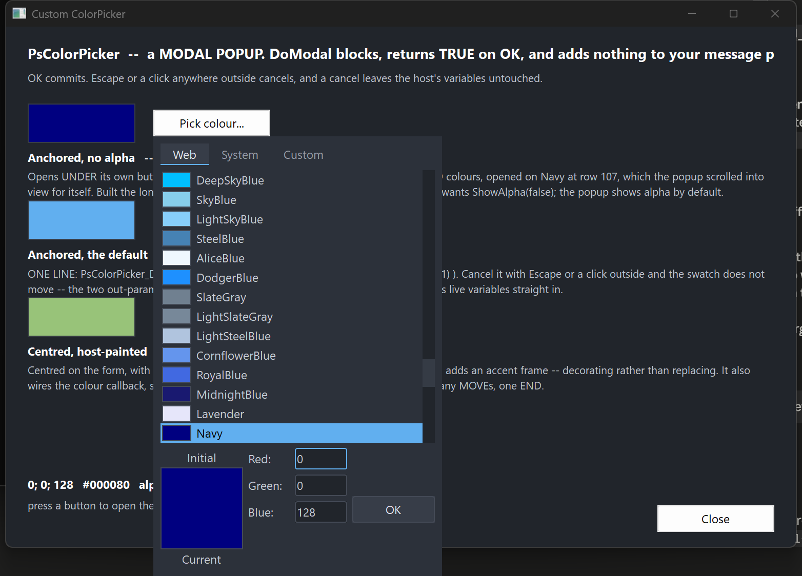

# PsColorPicker

A modal colour picker popup for FreeBASIC / Win32, owner-drawn throughout, built on
[AfxNova](https://github.com/PaulSquires) and
[PsBufferPaint](https://github.com/PaulSquires/PsBufferPaint).

Repository: [github.com/PaulSquires/PsColorPicker](https://github.com/PaulSquires/PsColorPicker)

`PsColorPicker_DoModal` puts a chromeless popup on screen, blocks until the user answers, and
returns `TRUE` with the chosen colour written back — or `FALSE` if they abandoned it, in which
case your variables are left exactly as they were. There is no caption bar, no Cancel button, and
nothing to place in a parent window: it is a call you make, not a control you lay out.

The popup holds a tab strip (**Web**, **System**, **Custom**), a body that is either a scrolling
list of named colours or a tint/shade matrix, an Initial/Current preview split across one box, a
column of R/G/B/Alpha entry fields, and an OK button. OK is the only thing that commits; Escape
and a click anywhere outside both cancel.

It is a complete interaction on its own — you do not build a dialog around it, and it adds nothing
to your message loop.

## What it looks like



The popup dropped under the button that opened it: the Web tab scrolled to the currently selected
colour, the split Initial/Current preview with its labels above and below, the field column, and
the OK button. Alpha is hidden here — it is shown by default and this host turned it off.

## Requirements

| File | Why |
| --- | --- |
| `PsColorPicker.bi` | The public surface. |
| `PsColorPicker.inc` | The implementation. |
| `PsBufferPaint.bi` / `PsBufferPaint.inc` | The flicker-free drawing surface everything is painted through. |
| `PsVScrollBar.bi` / `PsVScrollBar.inc` | The list scrollbar. You never reference it, but the files must be present. |

`PsColorPicker_SelfTest.inc` is **not** optional if you take `PsColorPicker.inc` unaltered — the
implementation includes it at the end. Either copy it along with the rest, or delete that
`#include once` line.

### Include order

`PsColorPicker.bi` includes `PsBufferPaint.bi` and `PsVScrollBar.bi` for you, and
`PsColorPicker.inc` includes `PsVScrollBar.inc` for you. So the only thing you must get right is
that `PsBufferPaint.inc` precedes `PsColorPicker.inc`:

```freebasic
#include once "windows.bi"
#include once "AfxNova\CWindow.inc"
#include once "AfxNova\AfxStr.inc"
#include once "AfxNova\AfxGdiplus.inc"

using AfxNova

#include once "PsBufferPaint.inc"
#include once "PsColorPicker.inc"
```

### GDI+ must be running

All geometry is drawn through GDI+. Initialise it before the first repaint and shut it down after
every window is gone; without the bracket the popup draws nothing at all.

```freebasic
dim as ULONG_PTR gdipToken = AfxGdipInit()
' ... run your application ...
AfxGdipShutdown( gdipToken )
```

### Never name an identifier `ok`

GDI+ defines `Ok = 0` as a `Status` enum value in namespace `AfxNova`, and your host almost
certainly says `using AfxNova`. Any variable, parameter or function of yours called `ok` becomes a
duplicate definition the moment you adopt this control. Use `bOK`.

### There is no pump obligation

**There is no `PsColorPicker_FilterMessage`, and you should not go looking for one.** If you are
coming from `PsComboBox`, `PsDatePicker`, `PsTextBox` or `PsMenuBar`, each of which requires a call
in your message loop, this control is the opposite case: `PsColorPicker_DoModal` runs its own
`GetMessage` loop, and that loop owns `IsDialogMessage`, the Escape key and the outside-click test.
While the popup is up, your loop is not running at all.

You do not need to `SetFocus` anything beforehand either — the popup focuses itself.

The one thing worth doing on your side is restoring focus **after** `DoModal` returns. The popup
took the focus and has since been destroyed, so your window is left with no focused child and the
next Tab does nothing:

```freebasic
if PsColorPicker_DoModal( hwnd, gMyColor, gMyAlpha ) then
    ' ... use the new colour ...
end if
SetFocus( hButtonThatOpenedIt )
```

## Quick start

The whole integration, for a host that wants the default popup dropped under the control that
opened it:

```freebasic
private sub OnPickColour( byval hwnd as HWND, byval hButton as HWND )

    ' Screen coordinates. The popup hangs off this rect, flipping above it if it will not fit
    ' below.
    dim as RECT rcAnchor
    GetWindowRect( hButton, @rcAnchor )

    ' gMyColor and gMyAlpha are read on the way in as the starting value, and written on the way
    ' out ONLY if the user pressed OK -- so a cancel needs no handling.
    if PsColorPicker_DoModalForRect( hwnd, rcAnchor, gMyColor, gMyAlpha ) then
        InvalidateRect( hwnd, NULL, TRUE )
    end if

    SetFocus( hButton )
end sub
```

`PsColorPicker_DoModal( hwnd, gMyColor, gMyAlpha )` is the same thing centred on `hwnd` instead of
anchored to a control.

If you need to configure the popup first — a font, a paint callback, a starting tab, the alpha row
turned off — build it the long way instead. These calls are exactly what `DoModal` does:

```freebasic
dim as HWND hPick = PsColorPicker_Create( hwnd, 0 )
PsColorPicker_SetFont( hPick, ghFontGui )
PsColorPicker_ShowAlpha( hPick, false )
PsColorPicker_SetColor( hPick, gMyColor, 255, false )
PsColorPicker_PositionForRect( hPick, rcAnchor )

if PsColorPicker_RunModal( hPick ) then
    gMyColor = PsColorPicker_GetColor( hPick )
    gMyAlpha = PsColorPicker_GetAlpha( hPick )
end if
DestroyWindow( hPick )
```

## Concepts

### The value is a COLORREF and a separate alpha

`GetColor` returns a `COLORREF`; `GetAlpha` returns a `ubyte` alongside it. Alpha never travels
inside the colour, and committing the alpha field cannot disturb the RGB. That is why the modal
entry points take two `byref` out-parameters rather than returning a single value — and it is also
what lets a cancel leave both untouched, which a sentinel return could not express.

### Initial and Current

`SetColor` establishes both the live value and the "Initial" baseline, unless you pass
`bKeepInitial = true`. The preview box is split across its middle: the top half is Initial, the
bottom half Current, with the two labels drawn above and below the box. **Clicking the Initial half
reverts** — that pair is the popup's only reset, so it behaves as the thing it looks like. Clicking
the Current half does nothing.

### Placement

Both placement routines size the window to `GetIdealSize` first, then position it, then clamp it
onto the work area of the monitor it lands on.

`PositionForRect` drops the popup under the anchor and **flips it above** when it will not fit
below. That is not cosmetic: a popup merely clamped upward ends up covering its own anchor, and
then the opening click's release lands inside it and dismisses it immediately.

### Geometry is derived, never set

Every rect is computed from the layout inputs; there are no rect setters. The layout is lazy —
mutators mark it stale and the next paint or geometry query does one measuring pass, so a burst of
setters costs one re-layout rather than one each.

The bottom block is three columns:

```
[ "Initial" label      ]
[ preview, top half    ]   [ Red:   ][field]
[ preview, bottom half ]   [ Green: ][field]
[ "Current" label      ]   [ Blue:  ][field]          [   OK   ]
                           [ Alpha: ][field]
```

The block is as tall as its **tallest** column, and the preview column is taller than the fields.
One consequence is worth knowing: `ShowAlpha` adds or removes a whole field row but **does not
change the popup's size**, because the row comes and goes inside space the preview had already
claimed. You can flip it without re-placing an anchored popup.

The OK button is bottom-aligned on the last **visible** field row, so hiding alpha moves it up.

### The matrix is a law, not a table

The Custom tab's grid is generated: lightness runs down the rows as `1 - (row + 0.5) / rows`, hue
runs across the chromatic columns, and the last column is a greyscale ramp. There is no table of
colours to look up. Changing `SetMatrixSize` therefore gives you a *finer or coarser sweep of the
same colours*, not a cropped or stretched version of a fixed picture.

`PsColorPicker_MatrixColorAt` is public and pure, so you can generate the same colours yourself
without a window.

### Tabs

Three, always present. **Web** and **System** are scrolling lists of named rows — a swatch, then
the name — sharing one renderer and one hit test; **Custom** is the matrix. Each tab is as wide as
its own caption plus padding, laid left to right from the strip's left edge, so the strip's
right-hand remainder is empty.

The body is a **fixed height across all three tabs**. A body that resized as the user browsed would
grow an already-placed popup off the bottom of the monitor.

### Selection follows the value

There is one selection index, shared by whichever tab is showing, and it is re-derived from the
colour whenever the colour or the tab changes. A colour that is not present on the current tab
selects nothing rather than snapping to a nearest match. When a list holds the same colour twice,
the first entry wins.

### Focus

The entry fields are drawn and key-handled by the control itself — there is no inner child holding
a caret — so `GetFocus() = hCtrl` is true when the popup has focus. There is no `_HasFocus` helper
and none is needed.

## Behaviour and limits

- **OK is the only commit.** Escape, and a button-down anywhere outside the popup, both cancel.
  There is no Cancel button.
- **The parent is not disabled** while the popup is up. It cannot be — a click on a disabled window
  generates nothing, and that click is how the popup is cancelled. "Modal" here means the call
  blocks, not that the rest of your application is inert.
- **Accepting commits a half-typed field; cancelling discards it.** A user who types `128` and
  presses OK gets 128. One who types `128` and presses Escape does not.
- **The entry fields are deliberately minimal.** Digits, Backspace, Delete, arrows, Home/End and
  Tab, and nothing else. No selection, no clipboard, no undo. If you need those, put a `PsTextBox`
  on your own dialog rather than expecting them here.
- **There is no hex field.** `PsColorPicker_FormatHex` / `ParseHex` are public and pure if you want
  `#RRGGBB` for storage or display.
- **There is no palette of your own named colours**, and no eyedropper, no multi-select, no
  tooltips, and no way to type a colour by name — although Web and System *are* named lists you
  pick from.
- **Values clamp, they do not wrap.** A channel field takes at most three digits and is clamped to
  0..255 on commit; the field is then re-seeded so the user sees what their `999` became. An empty
  field is discarded and the value left alone.
- **A double-click on a body cell accepts** — the mouse's equivalent of Enter. It adopts the cell
  under the cursor and then commits, so double-clicking a cell that is not the selected one
  answers with the one you hit. A double-click anywhere else — a tab, a field, the preview, the
  OK button — behaves as an ordinary click there and cannot close the popup. The cost is on the
  matrix: a rapid second click commits rather than starting a second drag.
- **Overflow is honest, not squeezed.** If you set a matrix bigger than the window, cells fall
  outside the body and are clipped rather than being scaled down.

## API reference

### Running it

| Function | Behaviour |
| --- | --- |
| `PsColorPicker_DoModal( hParent, byref clr, byref nAlpha ) as boolean` | Creates, centres on `hParent`, blocks, destroys. `TRUE` on OK, with both out-parameters written; `FALSE` on cancel, with **neither** touched. `hParent` may be `NULL`, in which case it centres on the monitor holding the cursor. |
| `PsColorPicker_DoModalForRect( hParent, byref rcAnchor, byref clr, byref nAlpha ) as boolean` | The same, dropped under `rcAnchor` (screen coordinates) and flipped above it when it will not fit below. |
| `PsColorPicker_Create( hParent, id = 0 ) as HWND` | Creates the popup **without showing it**, so you can reach the setters first. `hParent` becomes the owner, not the parent. You own the window and must `DestroyWindow` it. |
| `PsColorPicker_RunModal( hCtrl ) as boolean` | Shows the popup and runs the nested loop. `TRUE` on OK. Does **not** destroy the window. |
| `PsColorPicker_PositionForRect( hCtrl, byref rcAnchor )` | Sizes to ideal, places under the anchor with the flip-above rule, clamps to the work area. Does not show. |
| `PsColorPicker_PositionCentered( hCtrl, hParent )` | Sizes to ideal and centres on `hParent`, or on the monitor holding the cursor when `hParent` is `NULL`. Does not show. |

### Value

| Function | Behaviour |
| --- | --- |
| `PsColorPicker_SetColor( hCtrl, clr, nAlpha = 255, bKeepInitial = false )` | Sets the live value. **Silent.** Also re-establishes the Initial baseline unless `bKeepInitial` is true. |
| `PsColorPicker_GetColor( hCtrl ) as COLORREF` | The live colour. |
| `PsColorPicker_GetAlpha( hCtrl ) as ubyte` | The live alpha. |
| `PsColorPicker_SetInitial( hCtrl, clr, nAlpha = 255 )` | Sets the baseline shown as "Initial" without touching the live value. Silent. |
| `PsColorPicker_GetInitial( hCtrl ) as COLORREF` | The baseline colour. |
| `PsColorPicker_RevertToInitial( hCtrl )` | Sets the live value back to the baseline. An action, not a setter, so it **fires** the change callback with a single `END` phase. |

### Tabs and fields

| Function | Behaviour |
| --- | --- |
| `PsColorPicker_SetTab( hCtrl, nTab )` | Selects a tab. **Silent.** Refuses anything outside `CLR_TAB_WEB`..`CLR_TAB_CUSTOM`, leaving the current tab in place. Resets the scroll position and re-derives the selection. |
| `PsColorPicker_GetTab( hCtrl ) as long` | The current tab. |
| `PsColorPicker_ShowAlpha( hCtrl, bShow )` | Shows or hides the Alpha field row. **Shown by default.** Hiding it while the caret is in it commits that field first. Changes the field count and the OK button's position, but not the popup's size. |
| `PsColorPicker_IsAlphaShown( hCtrl ) as boolean` | Whether the Alpha row is placed. |
| `PsColorPicker_TabName( idx ) as DWSTRING` | The caption on tab `idx`; `""` out of range. The tab strip measures this to size each tab. |

### Appearance

| Function | Behaviour |
| --- | --- |
| `PsColorPicker_SetColors( hCtrl, pColors )` | Copies your `PSCOLORPICKER_COLORS` in. The control keeps a copy and never reads a host global. |
| `PsColorPicker_GetColors( hCtrl, pColors )` | Copies the current colours out. |
| `PsColorPicker_SetFont( hCtrl, hFont )` | Sets the text font. **You keep ownership of the `HFONT`.** Re-measures, because the tab strip is as wide as its captions. |
| `PsColorPicker_GetFont( hCtrl ) as HFONT` | The font, or 0 if none was set (the stock GUI font is used). |
| `PsColorPicker_SetOKText( hCtrl, Text )` | The OK button's caption. |
| `PsColorPicker_SetPreviewText( hCtrl, TextInitial, TextCurrent )` | The two preview labels. |
| `PsColorPicker_SetFieldText( hCtrl, nField, Text )` | The label beside one field, in `CLR_FIELD_*` order. Defaults carry their trailing colon (`"Red:"`); nothing is appended, so omit it if you do not want one. Re-measures. |
| `PsColorPicker_Refresh( hCtrl )` | Marks the layout stale and repaints. |

### State

| Function | Behaviour |
| --- | --- |
| `PsColorPicker_SetEnabled( hCtrl, bEnabled )` | Goes through `EnableWindow`, so the system enforces it rather than it being a cosmetic flag. |
| `PsColorPicker_GetEnabled( hCtrl ) as boolean` | Whether the popup is enabled. |
| `PsColorPicker_GetFocused( hCtrl ) as boolean` | Whether the popup has the keyboard focus. |

### Geometry and layout

| Function | Behaviour |
| --- | --- |
| `PsColorPicker_GetIdealSize( hCtrl, byref cx, byref cy )` | The size the popup wants. **Valid before the window has ever been sized**, which is what the placement routines rely on. Varies with the matrix and cell size and with the font; does **not** vary with `ShowAlpha`. |
| `PsColorPicker_GetMatrixSize( hCtrl, byref nCols, byref nRows )` | The Custom grid's dimensions. |
| `PsColorPicker_SetMatrixSize( hCtrl, nCols, nRows )` | Sets them. Silent, and re-measures — this changes the ideal size. |
| `PsColorPicker_GetCellSize( hCtrl, byref cx, byref cy )` | One matrix cell, in pixels. |
| `PsColorPicker_SetCellSize( hCtrl, cx, cy )` | Sets it. Silent, and re-measures. Raw pixels — you scale for DPI. |
| `PsColorPicker_GetPartRect( hCtrl, nPart, byref rc ) as boolean` | A `CLR_PART_*` rect. `FALSE` means the part is legitimately empty on this tab (`CLR_PART_MATRIX` off Custom, `CLR_PART_ALPHA` with alpha hidden) or there is no geometry yet. |
| `PsColorPicker_GetFieldRect( hCtrl, nField, byref rc ) as boolean` | One field's box. `FALSE` when the field is not placed. |
| `PsColorPicker_GetTabRect( hCtrl, idx, byref rc ) as boolean` | One tab cell. |

### Hit tests

All take **client** coordinates.

| Function | Behaviour |
| --- | --- |
| `PsColorPicker_HitTestTab( hCtrl, x, y ) as long` | Tab index, or -1. |
| `PsColorPicker_HitTestField( hCtrl, x, y ) as long` | `CLR_FIELD_*`, or -1. Only visible fields are reachable. |
| `PsColorPicker_HitTestBody( hCtrl, x, y ) as long` | The body cell index, or -1. On Custom that is `row * cols + col`; on a list tab it is the entry index, and a partial row drawn past the bottom of the viewport is deliberately **not** hit-testable. |

### Colour tables

The two fixed lists, exposed so you can offer the same colours elsewhere. An out-of-range index
gives 0 or `""` rather than failing.

| Function | Behaviour |
| --- | --- |
| `PsColorPicker_WebColorCount() as long` | How many named web colours there are. |
| `PsColorPicker_WebColorAt( idx ) as COLORREF` | One of them. |
| `PsColorPicker_WebColorName( idx ) as DWSTRING` | Its name. |
| `PsColorPicker_SystemColorCount() as long` | How many system colours there are. |
| `PsColorPicker_SystemColorAt( idx ) as COLORREF` | One of them, read live through `GetSysColor`. |
| `PsColorPicker_SystemColorName( idx ) as DWSTRING` | Its name. |

### Pure helpers

No window needed; safe to call before anything is created.

| Function | Behaviour |
| --- | --- |
| `PsColorPicker_HSLtoRGB( h, s, l ) as COLORREF` | HSL to RGB. Every axis **clamps** out-of-range input rather than wrapping, so a hue of 1.4 does not silently become 0.4. |
| `PsColorPicker_MatrixColorAt( nCol, nRow, nCols, nRows ) as COLORREF` | The colour the matrix law puts at that cell. Indices clamp. |
| `PsColorPicker_MatrixIndexOf( clr, nCols, nRows ) as long` | The cell index holding `clr`, or -1. |
| `PsColorPicker_CellFromPoint( rc, cellW, cellH, nCols, nRows, x0, y0, byref c, byref r ) as boolean` | Point to grid cell. `FALSE` when the point is outside the grid. |
| `PsColorPicker_FormatHex( clr ) as DWSTRING` | `#RRGGBB`, upper case. |
| `PsColorPicker_ParseHex( wszText, byref clr ) as boolean` | Reads `#RRGGBB` with or without the `#`, either case. `FALSE` — leaving `clr` alone — on empty, short, long or non-hex input. |
| `PsColorPicker_ContrastColor( clr ) as COLORREF` | Black or white, whichever is legible on `clr`. |
| `PsColorPicker_FieldAccepts( nField, ch, nPos ) as boolean` | Whether a field would take that character. Digits only; `nPos` is accepted for symmetry and never affects the answer. An out-of-range field accepts nothing. |
| `PsColorPicker_FieldMaxLen( nField ) as long` | How long a field may get — three digits. |
| `PsColorPicker_PtIn( rc, x, y ) as boolean` | Half-open containment: left/top inclusive, right/bottom exclusive, matching the grid arithmetic. |

### Callback registration and painting

| Function | Behaviour |
| --- | --- |
| `PsColorPicker_SetColorChangedCallback( hCtrl, usersub )` | See Callbacks below. |
| `PsColorPicker_SetTabChangedCallback( hCtrl, usersub )` | See Callbacks below. |
| `PsColorPicker_SetMessageCallback( hCtrl, userfunc )` | See Callbacks below. |
| `PsColorPicker_SetPaintCallback( hCtrl, usersub )` | Replaces the built-in painter wholesale. |
| `PsColorPicker_RenderInfo( p )` | Runs the **built-in** painter into the buffer your paint callback was handed. Pass it the same pointer. This is what lets you decorate rather than replace. |
| `PsColorPicker_CountRenderedTones( hCtrl, nPart ) as long` | Renders the popup offscreen through the real paint path and counts the distinct colours in one part rect, capped at 64. Public so you can assert your own paint callback has not flooded the control. |
| `PsColorPicker_HashRenderedPart( hCtrl, nPart ) as ulong` | The same render, hashed, so you can assert a state change actually reached the pixels. |

## Colors

Fill a `PSCOLORPICKER_COLORS` and hand it to `PsColorPicker_SetColors`. These paint the popup's own
chrome — the colours it is *editing* are content and are never themed.

| Field | Paints | When |
| --- | --- | --- |
| `BackColor` | The popup's background. | Always. |
| `ForeColor` | Field labels and the two preview labels. | Always. |
| `BorderColor` | The frame around the preview box, and each list swatch. | Always. |
| `TabBackColor` | A tab cell's background. | An unselected, unhovered tab. |
| `TabBackColorSel` | A tab cell's background. | The selected tab, and also the hovered one. |
| `TabForeColor` | A tab caption. | An unselected tab, and every tab while the popup is disabled. |
| `TabForeColorSel` | A tab caption. | The selected tab. |
| `FieldBackColor` | An entry field's box. | Always. |
| `FieldForeColor` | The text and caret in an entry field. | Always. |
| `FieldBorderColor` | An entry field's frame. | A field without the caret. |
| `FieldBorderColorSel` | An entry field's frame. | The field holding the caret. |
| `HotRingColor` | The ring around a swatch. | The swatch under the cursor. |
| `SelRingColor` | The ring around a swatch, and the rule under the selected tab. | The selected swatch. |
| `FocusRingColor` | A ring around the whole content area. | The popup has focus and **no** field holds the caret. |
| `OKBackColor` | The OK button's fill. | Idle. |
| `OKBackColorHot` | The OK button's fill. | Cursor over it. |
| `OKBackColorPressed` | The OK button's fill. | Held down with the cursor still on it. |
| `OKForeColor` | The OK button's caption. | Always. |
| `OKBorderColor` | The OK button's frame. | Always. |

The OK button's fill resolves **pressed > hot > idle**. There is no disabled pair, because OK is
never disabled — every reachable state of the popup has a committable colour in it.

A swatch ring is kept distinct from the swatch fill so a selection stays visible on a swatch of any
colour, including one identical to the panel behind it.

## Callbacks

### Value changed

```freebasic
type CLR_ColorChangedCallbackSub as sub( byval hCtrl as HWND, _
                                         byval clr as COLORREF, _
                                         byval nAlpha as ubyte, _
                                         byval nPhase as long )
```

Fires for **user action only**. Every programmatic setter is silent, which is what lets you call
`PsColorPicker_SetColor` from inside this callback without re-entering.

`nPhase` is the distinction that makes live preview possible. Dragging across the matrix emits one
`CLR_PHASE_BEGIN`, many `CLR_PHASE_MOVE`s and one `CLR_PHASE_END`; a click on a swatch, a commit in
a field, or a click on the Initial preview each emit a single `CLR_PHASE_END`. Coalesce the moves,
commit on the end.

**If a stolen capture abandons a drag, no `END` is sent.** Abandoned is not the same as finished,
and inventing an `END` would tell you the user settled on a colour they were merely passing over.
Treat a missing `END` the way you treat a cancel.

You do not need this callback at all if you only want the final answer — `DoModal` reports that
itself. Note that it is reachable only through `Create` + `RunModal`; `DoModal` has nowhere in its
signature to take one.

### Tab changed

```freebasic
type CLR_TabChangedCallbackSub as sub( byval hCtrl as HWND, byval nTab as long )
```

Fires when the **user** switches tabs. `PsColorPicker_SetTab` is silent.

### Message observer

```freebasic
type CLR_MessageCallbackFunc as function( byval m as PSCOLORPICKER_MESSAGEINFO ptr ) as boolean
```

Return `TRUE` to suppress the control's own handling of that message, `FALSE` to let it proceed.

**The result is ignored for three messages**, and the reasons are worth knowing:

- `WM_LBUTTONUP` — the control holds mouse capture across a matrix drag and across the OK button's
  press, and this message is what releases it. A callback that suppressed it would strand the
  capture and route every later click into the popup.
- `WM_SETFOCUS` and `WM_KILLFOCUS` — focus is a fact the system reports, not an action to veto.
  `WM_KILLFOCUS` is also what commits a half-typed field, so suppressing it would silently discard
  the user's typing.

| `PSCOLORPICKER_MESSAGEINFO` field | Meaning |
| --- | --- |
| `hColorPicker` | The popup. |
| `uMsg` | The message. |
| `wParam` | Its `wParam`. |
| `lParam` | Its `lParam`. |

### Painting

```freebasic
type CLR_PaintCallbackSub as sub( byval p as any ptr )
```

Cast `p` to a `PSCOLORPICKER_PAINTINFO ptr`. The control has already filled the client with
`BackColor` before calling you.

**Do not use `PaintBorderRect` to draw an outline.** It fills unconditionally before it strokes, so
used as a frame it erases everything beneath it and the whole popup renders as one flat rectangle.
`PaintRoundOutline` strokes without filling. More generally: draw your additions, not a background —
a callback that fills a rectangle covering the control erases everything already drawn.
`PsColorPicker_CountRenderedTones` exists so you can assert you have not done this.

To decorate rather than replace, call `PsColorPicker_RenderInfo( p )` first and then add your own
drawing on top:

```freebasic
private sub MyPickerPaint( byval p as any ptr )
    dim as PSCOLORPICKER_PAINTINFO ptr pi = cast( PSCOLORPICKER_PAINTINFO ptr, p )
    if pi->b = 0 then exit sub

    PsColorPicker_RenderInfo( p )

    dim as RECT rc = pi->rcBody
    InflateRect( @rc, 2, 2 )
    pi->b->SetPenColor( BGR(86,156,214) )
    pi->b->PaintRoundOutline( @rc, 6, 1 )
end sub
```

Every rect below is precomputed. Never re-derive one from another.

| `PSCOLORPICKER_PAINTINFO` field | Meaning |
| --- | --- |
| `hColorPicker` | The popup, so you can query it. |
| `b` | The buffer for this repaint. Not a copy — draw into it. |
| `rcClient` | The whole client area. |
| `rcContent` | `rcClient` deflated by the padding. |
| `rcTabs` | The whole tab strip. The tabs themselves do not fill it. |
| `rcBody` | The tab's content area. Fixed height across all tabs; never empty. |
| `rcMatrix` | The tint/shade grid, or **empty** when not on Custom. |
| `rcSwatches` | The list area, scrollbar excluded, or **empty** when on Custom. |
| `rcOK` | The OK button. Never empty. |
| `rcPreview` | The whole split preview box. |
| `rcInitial` | Its top half, the baseline. |
| `rcCurrent` | Its bottom half, the live value. |
| `rcInitialLabel` | The "Initial" label, **above** the box. |
| `rcCurrentLabel` | The "Current" label, **below** the box. |
| `rcFields` | The entry block, previews excluded. |
| `rcAlpha` | The alpha field's box, or **empty** when alpha is hidden. |
| `clrCurrent` | The live colour. |
| `nAlphaCurrent` | The live alpha. |
| `clrInitial` | The baseline colour. |
| `nAlphaInitial` | The baseline alpha. |
| `nTab` | `CLR_TAB_*`. |
| `isEnabled` | Whether the popup is enabled. |
| `isFocused` | Whether it has focus. |
| `isDragging` | A live matrix drag is in progress. |
| `isOKHot` | The cursor is over OK. |
| `isOKPressed` | OK is held down and the cursor has not slid off. |
| `nFocusField` | `CLR_FIELD_*`, or -1 when no field holds the caret. |

`rcMatrix` and `rcSwatches` are **mutually exclusive** — whichever the current tab does not use is
empty — so you can branch on `IsRectEmpty` instead of re-implementing the tab-to-body mapping.

## Keyboard

| Key | Effect |
| --- | --- |
| `Escape` | Cancels. `DoModal` returns `FALSE` and your variables are untouched. Works from inside a field, and deliberately does **not** commit that field on the way out. |
| `Enter` | With the caret in a field: commits it, clamps it, re-seeds it, and stays there. Otherwise: accepts, exactly as OK does. |
| `Tab` / `Shift+Tab` | Walks the visible fields, **wrapping** at both ends. Hidden fields are skipped. From the body, Tab enters the first field. |
| `Left` / `Right` | In a field: moves the caret. Otherwise: moves the body selection by one cell and adopts that colour. |
| `Up` / `Down` | Outside a field: moves the body selection by one row — one list row, or one whole row of matrix cells. |
| `Home` / `End` | Moves the caret within a field. |
| `Backspace` / `Delete` | Edits the field. |
| Digits | Typed into the focused field. The first character after entering a field replaces the seeded value; any editing key switches it to amending. |
| Mouse wheel | Scrolls the list on the Web and System tabs. |
| Double-click | On a body cell: adopts it and accepts, exactly as Enter does. Anywhere else: an ordinary click. |

## Constants

### Tabs

| Constant | Value |
| --- | --- |
| `CLR_TAB_WEB` | 0 |
| `CLR_TAB_SYSTEM` | 1 |
| `CLR_TAB_CUSTOM` | 2 |
| `CLR_TAB_COUNT` | 3 |

### Change phases

| Constant | Meaning |
| --- | --- |
| `CLR_PHASE_BEGIN` | A drag started. |
| `CLR_PHASE_MOVE` | One step of a drag. |
| `CLR_PHASE_END` | A settled value. |

### Parts

`CLR_PART_TABS`, `CLR_PART_MATRIX`, `CLR_PART_SWATCHES`, `CLR_PART_INITIAL`, `CLR_PART_CURRENT`,
`CLR_PART_FIELDS`, `CLR_PART_ALPHA`, `CLR_PART_OK`.

### Fields

`CLR_FIELD_R` (0), `CLR_FIELD_G`, `CLR_FIELD_B`, `CLR_FIELD_A`, `CLR_FIELD_COUNT` (4). The enum
order is the visual order, top to bottom, and the Tab order. `CLR_FIELD_A` keeps its id whether or
not the row is shown, so a stored "which field had focus" never changes meaning.

### Defaults, in unscaled pixels

DPI scaling is applied once at creation. Every setter afterwards takes raw pixels and you scale.

| Constant | Default | Meaning |
| --- | --- | --- |
| `PSCOLORPICKER_DEFAULT_PAD` | 8 | Padding around the content. |
| `PSCOLORPICKER_DEFAULT_GAP` | 6 | Gap between blocks and between field rows. |
| `PSCOLORPICKER_DEFAULT_TABHEIGHT` | 24 | Tab strip height. |
| `PSCOLORPICKER_DEFAULT_TABPAD` | 14 | Padding either side of a tab's caption. |
| `PSCOLORPICKER_DEFAULT_MATRIXCOLS` | 16 | Matrix columns. |
| `PSCOLORPICKER_DEFAULT_MATRIXROWS` | 14 | Matrix rows. |
| `PSCOLORPICKER_DEFAULT_CELLW` | 18 | Matrix cell width. |
| `PSCOLORPICKER_DEFAULT_CELLH` | 22 | Matrix cell height. |
| `PSCOLORPICKER_DEFAULT_SWATCHW` | 34 | Swatch width in a list row. |
| `PSCOLORPICKER_DEFAULT_LISTROWS` | 14 | Visible list rows. |
| `PSCOLORPICKER_DEFAULT_SCROLLW` | 14 | Scrollbar strip width. |
| `PSCOLORPICKER_DEFAULT_PREVIEWW` | 92 | Preview box width. |
| `PSCOLORPICKER_DEFAULT_PREVIEWH` | 46 | Height of **one half** of the preview box. |
| `PSCOLORPICKER_DEFAULT_FIELDW` | 58 | Entry field width. |
| `PSCOLORPICKER_DEFAULT_FIELDH` | 24 | Entry field height. |
| `PSCOLORPICKER_DEFAULT_OKW` | 92 | OK button width. |
| `PSCOLORPICKER_DEFAULT_OKH` | 30 | OK button height. |
| `PSCOLORPICKER_DEFAULT_LABELW` | 52 | Field label gutter. |
| `PSCOLORPICKER_DEFAULT_ROWH` | 22 | List row height, and each preview label row. |
| `PSCOLORPICKER_DEFAULT_CURVATURE` | 4 | Corner rounding, as an ellipse diameter. |
| `PSCOLORPICKER_DEFAULT_BORDERTHICK` | 1 | Border pen width. Not scaled here — the painter scales the pen. |
| `PSCOLORPICKER_DEFAULT_FOCUSTHICK` | 1 | Focus ring pen width. Not scaled here, for the same reason. |
| `PSCOLORPICKER_RINGINSET` | 1 | How far a hot/selected ring is inset into its swatch. |

## Related controls

The popup embeds a [PsVScrollBar](https://github.com/PaulSquires/PsVScrollBar) for the Web and
System lists, and paints everything through
[PsBufferPaint](https://github.com/PaulSquires/PsBufferPaint). You never call into either directly,
but their files must be present — see Requirements.

## Licence

[Mozilla Public License 2.0](LICENSE).

MPL-2.0 is file-level copyleft, chosen deliberately for a drop-in control:

- **You may use this in closed-source software**, commercial or otherwise.
  §3.2 permits static linking with no additional conditions.
- **If you modify these files, publish those files' changes.** The obligation is
  per-file — your own sources are unaffected however tightly they are combined
  with these.
- The Exhibit B "Incompatible With Secondary Licenses" notice is **not applied**,
  which keeps this GPL-compatible.
