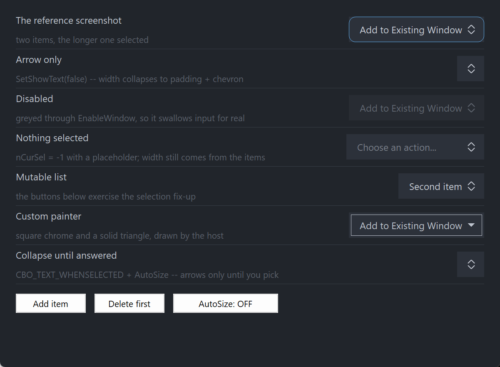

# PsComboBox

An owner-drawn dropdown selector for FreeBASIC Win32 applications: a button showing the
current choice with a stacked up/down chevron on its right, which drops a list of the
alternatives where exactly one — the current one — is checkmarked.

Single selection only. There is no text entry, no multi-select, no per-item icons and no
tooltips. It takes focus, so it can be reached with Tab and driven with the arrow keys, and it
draws itself entirely — there is no system `COMBOBOX` underneath, and nothing about its
appearance depends on the visual style the user happens to be running. Every colour it paints
is one you can set.

The button has no label of its own. It shows the selected item's caption (or a placeholder, or
nothing at all), so a field label goes beside it, positioned by you.

The dropdown is a **PsPopupMenu** — a second, top-level window that the control creates and owns.
That is where the two obligations in *Requirements* come from, and it is the source of several
entries in *Behaviour and limits*: in particular, **the list does not scroll**.

---

## What it looks like



Seven rows: the reference two-item case carrying the focus ring, arrow-only, disabled, a placeholder with nothing selected, a mutable list, a host-painted square variant with a solid triangle, and collapse-until-answered. The button's width comes from the **widest item**, never the selected one, so picking never resizes it. The three plain buttons at the bottom are ordinary Win32 host buttons driving the list.

---

## Requirements

**Files to copy into your project:**

| File | Purpose |
|---|---|
| `PsComboBox.bi` | Declarations — types, callbacks, constants, function prototypes |
| `PsComboBox.inc` | Implementation |
| `PsPopupMenu.bi` | The floating list the control drops |
| `PsPopupMenu.inc` | Its implementation |
| `PsBufferPaint.bi` | The flicker-free drawing surface both controls paint through |
| `PsBufferPaint.inc` | Its implementation |

**AfxNova is required.** The control is built on `CWindow`, and `PsBufferPaint` draws through
`AfxNova\CGdiPlus.inc`. Sources include AfxNova relative to the workspace root
(`#include once "AfxNova\CWindow.inc"`), so builds need the workspace root on the include path:

```bash
fbc64.exe -i "C:\dev" main.bas
```

**Include order.** `PsComboBox.bi` includes **both** of its dependencies itself, so there is no
declaration-order trap to fall into. The three implementation files are included in dependency
order:

```freebasic
#include once "PsBufferPaint.inc"
#include once "PsPopupMenu.inc"
#include once "PsComboBox.inc"
```

If your project already vendors `PsPopupMenu`, you keep one copy: `#include once` dedupes by
resolved path.

**GDI+ must be running before the first repaint and must outlive the last one.** Both controls
render their geometry through GDI+, so bracket your message loop:

```freebasic
dim as ULONG_PTR gdipToken = AfxGdipInit()
' ... create windows, run the message loop ...
AfxGdipShutdown( gdipToken )
```

`AfxGdipShutdown` must come after every window is destroyed, because each repaint builds and
tears down a `PsBufferPaint`.

**Never name an identifier `ok`.** GDI+ defines `Ok = 0` as a `Status` enum value in namespace
`AfxNova`, and hosts customarily say `using AfxNova`. An existing variable, parameter or
function called `ok` becomes a duplicate definition the moment you adopt these files. Use `bOK`
instead.

### The message-pump contract — this one is mandatory

**Call `PsComboBox_FilterMessage` once per combobox, first, in your message pump.**

```freebasic
do while GetMessage( @uMsg, null, 0, 0 )
    if uMsg.message = WM_QUIT then exit do

    dim as boolean bEaten = false
    for i as long = 0 to COMBO_COUNT - 1
        if PsComboBox_FilterMessage( ghCombo(i), @uMsg ) then
            bEaten = true
            exit for
        end if
    next
    if bEaten then continue do

    if IsDialogMessage( hWndForm, @uMsg ) = 0 then
        TranslateMessage @uMsg
        DispatchMessage @uMsg
    end if
loop
```

Each call returns FALSE immediately when that control's list is closed, so calling it for every
combobox on the form costs nothing measurable.

**What breaks without it.** The dropdown lives in `PsPopupMenu`, and `PsPopupMenu` puts its
keyboard navigation and its outside-click dismissal in the filter. A host that never calls it
gets a list that opens and paints correctly, and that can still be clicked, but that **cannot be
driven from the keyboard and never dismisses when you click somewhere else**. Escape stops
working too. The control notices when it is being run without the filter and degrades as
sensibly as it can — a `WM_KEYDOWN` arriving while the list is open is swallowed rather than
moving the selection behind a list still showing the old checkmark, and the button still opens
and closes on alternate clicks — but there is no way to recover the navigation.

**The one-shot reopen guard is the other half of that call.** `PsPopupMenu`'s own filter dismisses
the chain on an outside click and then returns FALSE *on purpose*, so the click still reaches
whatever it landed on ("clicking a toolbar button while a menu is open both closes the menu and
presses the button"). For a click on the combobox's **own button** that is exactly wrong: the
list would close in the filter, and the `WM_LBUTTONDOWN` that follows would immediately reopen
it — making the button impossible to close by clicking. So when the click is ours and the list is
open, `PsComboBox_FilterMessage` arms a one-shot flag which the very next `WM_LBUTTONDOWN` consumes
and clears. It is deterministic: no timer, no close-time heuristic, and it cannot mis-fire,
because the first down-click that sees it clears it unconditionally.

### Focus and Tab

**Call `IsDialogMessage` in your pump**, after the filter. The control is a tabstop, but only the
dialog manager moves focus between tabstops. Without it you still get full mouse behaviour, and
the arrow keys, F4, Space and Enter still work once the control has focus — only Tab navigation
is lost.

**Give something the focus at startup.** `IsDialogMessage` acts only when the focused window is
already a descendant of the window you pass it. A real dialog does this in `WM_INITDIALOG`; an
ordinary window must call `SetFocus` on its first control itself. Skip it and the first Tab does
nothing, which is indistinguishable from the tabstops being broken.

---

## Quick start

```freebasic
' Create it. The control is created zero-sized and hidden.
dim as HWND hCombo = PsComboBox_Create( hWndParent, IDC_MYFORM_COMBO )

' The font is BORROWED — you keep it and destroy it. It is also the measuring font, and it
' is handed straight to the dropdown, so button and list can never disagree about widths.
PsComboBox_SetFont( hCombo, ghFont(GUIFONT_10) )

' Be told when the user picks something.
PsComboBox_SetSelChangeCallback( hCombo, @MyCombo_SelChange )

' Fill it. AddItem returns the new index; the third argument is a free-form host id.
PsComboBox_AddItem( hCombo, "Add to Existing Window", 1 )
PsComboBox_AddItem( hCombo, "Open a New Window", 2 )

' Set the initial choice. This is silent — the callback above does not fire.
PsComboBox_SetCurSel( hCombo, 0 )

' Ask how big it wants to be, then place it. GetIdealSize is valid immediately, before the
' control has ever been sized.
dim as long iw, ih
PsComboBox_GetIdealSize( hCombo, iw, ih )
SetWindowPos( hCombo, 0, x, y, iw, ih, SWP_NOZORDER )

ShowWindow( hCombo, SW_SHOW )
```

And the callback:

```freebasic
sub MyCombo_SelChange( byval hCombo as HWND, byval idxOld as long, byval idxNew as long )
    ' Fired only for user action: a pick from the list, or an arrow / Home / End key.
    ' The control's state is already updated, so PsComboBox_GetCurSel( hCombo ) = idxNew.
    gConfig.OpenMode = PsComboBox_GetItemID( hCombo, idxNew )
end sub
```

That, plus the pump call from *Requirements*, is the whole minimum. Everything below is
refinement.

---

## Concepts

### The handle is a real HWND

`PsComboBox_Create` returns an ordinary window handle, and every `PsComboBox_*` function takes it.
It is not an opaque type, so you can treat the control as the window it is — `SetWindowPos` to
place and size it, `ShowWindow` to show it, `GetDlgItem` to find it by the `CtrlID` you passed at
creation.

### It is created zero-sized and hidden

`PsComboBox_Create` gives the control the styles `WS_CHILD`, `WS_TABSTOP`, `WS_CLIPSIBLINGS` and
`WS_CLIPCHILDREN`, and **no extended style at all**. `WS_VISIBLE` is deliberately absent, so a
newly created control shows nothing until you size it and call `ShowWindow`. That lets you build
and configure a control before it is ever seen.

The absent extended style is load-bearing rather than an omission: `WS_EX_CONTROLPARENT` would
declare the control a *container*, and the dialog manager would descend into it looking for
tabstops, find no children, and skip it — Tab would never land on the combobox.

### Two windows, one of them not a child

The button is the control. The **dropdown is a separate top-level `WS_POPUP` window**, a
`PsPopupMenu` owned by your top-level frame rather than parented to the combobox. It is created
lazily on the first open (or on the first call to `PsComboBox_EnsureList`,
`PsComboBox_SetListColors` or `PsComboBox_SetListItemHeight`) and destroyed with the control — so a
form with a dozen comboboxes on tabs the user never visits does not create a dozen popup windows
at startup.

Because it is a popup and not a child, it is not a tab target, and it never takes activation.

### The rows are rebuilt from your items on every open

Nothing incremental happens between the model and the list: every `PsComboBox_DropDown` clears the
popup and refills it from the item array, so the two cannot drift. The row ids handed to
`PsPopupMenu` are `(model index + 1)` — never your item's `id` field, which stays a free-form
payload and never enters the command stream.

That rebuild is also why `PsComboBox_GetListHandle` is for appearance only, and why the opening
edge of `DropDownCallback` is the right place to rebuild a dynamic list.

### Geometry is derived, never assigned

The control computes four rectangles and owns all four. You influence them through the layout
setters; you never write them.

| Rect | What it is |
|---|---|
| `rcButton` | The chrome: the client area deflated by the focus-ring band |
| `rcText` | The caption box. **Empty** in arrow-only mode |
| `rcChevron` | The cell the stacked up/down chevron is drawn in |
| `rcVisual` | `rcButton` inflated by the focus-ring band |

The formulas, if you need to predict them:

```
  ringPad   = focusGap + focusThickness
  textW     = MAX over all items of the measured caption width  (0 when no caption is drawn)
  textH     = GetTextMetrics.tmHeight       ONE height for the whole control
  contentH  = max( textH, chevronHeight )

  idealW    = 2*ringPad + padLeft + [textW + textGap] + chevronWidth + padRight
  idealH    = 2*ringPad + padTop  + contentH + padBottom

  rcButton  = rcClient deflated by ringPad on all four sides
  rcChevron = right-aligned inside rcButton at padRight, v-centred, chevronWidth wide
  rcText    = from rcButton.left + padLeft to rcChevron.left - textGap, v-centred on textH
  rcVisual  = rcButton inflated by ringPad  ( = rcClient when you sized the control ideally )
```

The `[textW + textGap]` term is spent **only when a caption is drawn**. In arrow-only mode there
is nothing on the left for the chevron to be separated from, so charging for the gap would leave
the arrow visibly off-centre in its own padding.

Layout is lazy. A setter marks the layout stale and asks for a repaint; the next paint — or any
rect query, size query or auto-size pass — recomputes it. There is no begin-update / end-update
pair to remember, and adding forty items in a row costs one measuring pass, not forty.

### The width comes from the widest item, never the selected one

This is the rule the whole layout is built around. The button must not change width when the
selection changes: a combobox that grows and shrinks as the user picks reflows whatever surrounds
it and drags its own dropdown anchor sideways.

So every caption is measured and the widest wins. The **placeholder is deliberately not
measured** — a long one cannot inflate the button and a short one cannot let it shrink, either of
which would make the button resize on the user's very first pick.

The one place the width *does* move is the `-1` ↔ selected boundary under
`CBO_TEXT_WHENSELECTED`, which is that mode's whole purpose rather than an exception: every
*selected* state still has the same width as every other. See the mode's entry in *Constants*.

### The ideal size is valid before the control has ever been sized

`PsComboBox_GetIdealSize` is what you call to decide how big to make the control in the first
place, so it must not need the control to already have a size. The measuring pass runs *ahead of*
the layout's zero-client bail, which is what makes that work. The rect queries are the other way
round — they describe placement, so they return FALSE until the control has a client area.

### Pixels, and who scales them

Only the creation-time defaults are DPI-scaled for you:

| Setting | Default | DPI-scaled at create? |
|---|---:|---|
| Padding left / right | 12 / 10 | Yes |
| Padding top / bottom | 6 / 6 | Yes |
| Text gap | 8 | Yes |
| Chevron width / height | 9 / 12 | Yes |
| Chevron gap | 3 | Yes |
| Corner curvature | 12 | Yes |
| Focus-ring gap | 2 | Yes |
| Border thickness | 1 | **No** |
| Focus-ring thickness | 1 | **No** |
| Chevron thickness | 1 | **No** — but see below |

Every setter afterwards takes raw pixels and expects **you** to scale — typically
`pWindow->ScaleX(...)` / `ScaleY(...)`.

The border and focus-ring thicknesses should not be scaled at all: a hairline should stay a
hairline at any DPI. **The chevron thickness is the deliberate exception**: it is not scaled at
creation, but `PsBufferPaint.PaintLine` scales the pen width it is handed, so the chevron's stroke
*does* grow on a high-DPI display. A rule is a hairline; a glyph's stroke should grow with the
glyph.

### Programmatic changes are silent — with one deliberate exception

`PsComboBox_SetCurSel` never fires the selection callback. `SelChangeCallback` reports **user**
action — a pick from the list, or an arrow / Home / End key — and nothing else. This follows
Win32's own `CB_SETCURSEL` / `CBN_SELCHANGE` split, and it means you can safely call
`PsComboBox_SetCurSel` from inside your own handler without recursing. Every item mutator
(`AddItem`, `InsertItem`, `DeleteItem`, `Clear`, and all the `SetItem*` setters) is silent too.

**`DropDownCallback` is the exception, and it is not an oversight.** It fires for
`PsComboBox_DropDown` and `PsComboBox_CloseUp` as well as for user opens, because it reports a
*window-state transition* rather than a value change — and a host that rebuilds its item set on
open needs that hook to run however the list was opened.

### How a click is decided

**The list opens on the button-DOWN**, not on the release. Pressing the left button focuses the
control (unconditionally, even if you go on to suppress the click from a message callback), then
opens or closes the list.

**No mouse capture is taken, anywhere.** Take capture only if something consumes the guaranteed
`WM_LBUTTONDOWN` → `WM_LBUTTONUP` pairing, and here nothing does: from the instant of the down,
the popup owns the interaction. So there is no press/cancel gesture to protect, no
`WM_CAPTURECHANGED` handling, and — unlike the controls that do take capture — a message
callback's return value **is** honoured for `WM_LBUTTONUP`.

### Keyboard handling follows Win32's combobox

With the list **closed**:

| Key | Effect |
|---|---|
| Down / Up | Move the selection in place, without opening. Fires `SelChangeCallback` |
| Home / End | Jump to the first / last selectable item. Fires `SelChangeCallback` |
| Alt+Down, Alt+Up | Open the list |
| F4, Space, Enter | Open the list |

Arrow movement **clamps at the ends, it does not wrap**: a wrapping Down at the last item would
jump the user back to the first with no list visible to explain it. Disabled items are skipped.
From "nothing selected", Up lands on the last selectable item — the only sensible answer when
there is no current position to step back from.

With the list **open**, the keyboard belongs to `PsPopupMenu`'s filter, which is one more reason
the pump call matters. Note that `PsPopupMenu`'s own arrow navigation *wraps* — a menu convention,
and deliberately different from the closed-list behaviour above.

The control answers `WM_GETDLGCODE` with `DLGC_WANTALLKEYS` only for Up, Down, Home, End, F4,
Space and Enter, and only when the dialog manager is asking about one specific message. Claiming
keys unconditionally would swallow Tab and break the very navigation the control opted into by
being a tabstop; claiming nothing would let `IsDialogMessage` route Enter to your dialog's default
button before the control ever saw it.

### Enabling and disabling is real, not cosmetic

`PsComboBox_SetEnabled` calls `EnableWindow`. A disabled window receives no mouse input at all and
the dialog manager's Tab skips it, so there is no way for a click or a keystroke to get past a
cosmetic check. If you call `EnableWindow` on the control directly, the control notices and greys
itself, so the two routes cannot disagree. Disabling also closes an open list and clears hover
immediately rather than waiting for the next mouse move.

Disabling does **not** change the selection. A disabled combobox still reads as showing its
value, which is why the colour struct carries a full disabled set.

### Hover is polled as well as tracked

`WM_MOUSELEAVE` is not reliably delivered when the cursor exits quickly, or onto another control,
which would strand the button painted hot. While the cursor is over the control a 100 ms timer
runs as a safety net and clears the hover state itself. The same tick is where a list that was
closed behind the control's back gets noticed — see the one-chain rule in *Behaviour and limits*.

### Lifetime

The control frees itself when its window is destroyed, and destroys its dropdown with it. The
font you pass in stays yours: it is borrowed, never owned, so keep it alive for as long as the
control lives and destroy it yourself afterwards.

---

## Behaviour and limits

Firm properties of the control, not settings:

- **The dropdown does not scroll. This is a dozen-item control, not a fifty-item one.**
  `PsPopupMenu` clamps to the monitor work area, so a list taller than the work area is **clipped
  and its tail is unreachable** — there is no scrollbar, no wheel scrolling and no keyboard route
  to the hidden rows. If your list can grow past a screenful, this is the wrong control.
- **The checkmark sits in a fixed left gutter.** `PsPopupMenu` reserves a 30px check column on the
  left of every row and a 20px column on the right, with no setters for either, so rows read like
  a Windows menu — check on the left, and a reserved-but-unused column on the right — rather than
  as a right-aligned tick.
- **Only one popup chain can be open at a time.** Opening combobox B while combobox A's list is up
  closes A's list *silently*: A is never told, and its `DropDown(false)` callback is deferred to
  the next non-paint touch of A (a mouse move, a focus change, its hover tick, or any state
  query). A's painted state is corrected immediately; only the callback is late. Host callbacks
  are never run from inside `WM_PAINT`, which is what forces that deferral.
- **`PsComboBox_DropDown` fails on an empty list.** With no items there is nothing to show, so it
  returns FALSE. It fires the opening callback first and then a matching closing one, so the
  callback's open/close pairing always holds even when the open fails.
- **Double-clicks are not special.** `CS_DBLCLKS` is deliberately off, so a rapid second click
  arrives as an ordinary down/up pair. That is what you want here: on this control a rapid second
  click is a legitimate close-then-reopen, and with `CS_DBLCLKS` on it would arrive as
  `WM_LBUTTONDBLCLK` and be silently dropped.
- **No mouse capture is taken.** See *How a click is decided*.
- **No tooltip support.** There is no tooltip callback and no tooltip window is created. If you
  want a tip, add your own tool over the control's `HWND`.
- **No text entry.** There is no editable variant and no `CBS_DROPDOWN` equivalent.
- **No multi-select**, and no per-item icons or images.
- **No hit-test function.** The entire client rectangle opens the list, so a hit test could only
  ever return TRUE for points the caller already knows are inside.
- **Arrow keys clamp, they do not wrap** — while the list is closed. The open list, being a
  `PsPopupMenu`, wraps.
- **The right mouse button is reported, never acted on.** A context menu is your business.
- **`PsComboBox_GetListHandle` is for appearance only.** Adding, deleting or re-ordering rows
  through it is not supported: the rows are rebuilt from your items on every open, so your changes
  vanish at the next open at best. The checkmark is placed by the control from its own selection.
- **Invalid text-mode values are ignored**, leaving the current mode in place, rather than laying
  the button out somewhere unexpected.
- **When the control is too narrow, `rcText` collapses and the chevron survives.** Rects are
  computed honestly rather than squeezed: the chevron keeps its size and stays pinned to the
  right, and the caption box degenerates to an empty rect rather than a negative one. So a
  too-narrow combobox loses its caption and keeps its arrow, which is the useful failure.
- **`PsComboBox_FindItemByText` compares through a 1024-character buffer**, so captions longer than
  1023 characters are compared on their first 1023 characters only.

---

## API reference

### Creation

| Function | Description |
|---|---|
| `PsComboBox_Create( hWndParent, CtrlID ) as HWND` | Creates the control as a child of `hWndParent` and returns its window handle. `CtrlID` becomes the window's `GWLP_ID`, so `GetDlgItem` finds it. Created zero-sized and hidden — size it with `PsComboBox_GetIdealSize`, place it with `SetWindowPos`, then `ShowWindow`. No extended style is applied, deliberately. |

### Items

The set is dynamic, and every structural mutation fixes up the current selection. **All of these
are silent** — no callbacks, no notifications.

| Function | Description |
|---|---|
| `PsComboBox_AddItem( hCombo, Text, id = 0, itemData = 0 ) as long` | Appends an item and returns its index, or -1 on failure. Cannot move an existing index, so the selection is untouched. It does **not** auto-select the first item — -1 is a legal state here. `id` and `itemData` are free-form host payloads; `id` never enters the command stream. |
| `PsComboBox_InsertItem( hCombo, idx, Text, id = 0, itemData = 0 ) as long` | Inserts **before** `idx`, shifting the tail up. `idx` equal to the count appends. Returns `idx`, or -1 for an out-of-range index. A selection at or after `idx` moves up by one. |
| `PsComboBox_DeleteItem( hCombo, idx ) as boolean` | Removes one item. Deleting the **current** item clears the selection to -1 rather than sliding it onto a neighbour; a selection after `idx` moves down by one. FALSE for an invalid index. |
| `PsComboBox_Clear( hCombo )` | Removes everything and clears the selection to -1. |
| `PsComboBox_GetCount( hCombo ) as long` | Number of items. |
| `PsComboBox_IsValidItem( hCombo, idx ) as boolean` | TRUE when `idx` is in range. |
| `PsComboBox_GetItemText( hCombo, idx ) as DWSTRING` | The item's caption, or `""` for an invalid index. |
| `PsComboBox_SetItemText( hCombo, idx, Text ) as boolean` | Sets the caption and **re-measures**, so this can change the button's ideal width — and, with auto-size on, the button itself. FALSE for an invalid index. |
| `PsComboBox_GetItemID( hCombo, idx ) as long` | The host id, or 0 for an invalid index. |
| `PsComboBox_SetItemID( hCombo, idx, id ) as boolean` | Sets the host id. No repaint — nothing draws it. |
| `PsComboBox_GetItemData( hCombo, idx ) as integer` | The host payload, or 0 for an invalid index. |
| `PsComboBox_SetItemData( hCombo, idx, itemData ) as boolean` | Sets the host payload. No repaint. |
| `PsComboBox_GetItemEnabled( hCombo, idx ) as boolean` | The item's enabled state. |
| `PsComboBox_SetItemEnabled( hCombo, idx, bEnabled ) as boolean` | A disabled item is greyed in the list, is not selectable by mouse or keyboard, and is skipped by the arrow keys — but it still counts for indexing and **still contributes its width**. **Disabling the current item clears the selection to -1**, because the user could not restore it once they moved off (and `SetCurSel` refuses to put it back). |
| `PsComboBox_FindItemByID( hCombo, id ) as long` | Index of the **first** item carrying this id, or -1. |
| `PsComboBox_FindItemByText( hCombo, Text ) as long` | Index of the **first** item with this exact caption, case-insensitively, or -1. Compared through a 1024-character buffer. |

### Selection and state

| Function | Description |
|---|---|
| `PsComboBox_GetCurSel( hCombo ) as long` | The selected model index, or -1 for nothing selected. |
| `PsComboBox_SetCurSel( hCombo, idx ) as boolean` | Sets the selection and repaints. **Silent** — does not fire `SelChangeCallback`. **Refuses a disabled item** (returns FALSE, changes nothing): the user could not have reached that state. `-1` always succeeds; an out-of-range index does not. Returns TRUE when the selection already matched. No re-measure — the width comes from the widest item, not the selected one. |
| `PsComboBox_GetText( hCombo ) as DWSTRING` | What the **button** is currently showing: the selected caption, or the placeholder, or `""`. |
| `PsComboBox_GetEnabled( hCombo ) as boolean` | The control's enabled state. |
| `PsComboBox_SetEnabled( hCombo, isEnabled )` | Enables or disables through `EnableWindow`, so input really stops. Disabling closes an open list and clears hover at once. Does not change the selection. |
| `PsComboBox_GetFocused( hCombo ) as boolean` | TRUE while the control has keyboard focus and is painting its focus ring. |
| `PsComboBox_Refresh( hCombo )` | Marks the layout stale and requests a repaint with background erase. Rarely needed — every setter does this for you. |

### The dropdown

| Function | Description |
|---|---|
| `PsComboBox_IsDroppedDown( hCombo ) as boolean` | TRUE while the list is showing. It first re-syncs against the popup's real state, so it can fire a pending `DropDown(false)` callback as a side effect — see the one-chain rule in *Behaviour and limits*. |
| `PsComboBox_DropDown( hCombo ) as boolean` | Opens the list. Returns TRUE if it is open (including when it already was), FALSE if the control is disabled, the item set is **empty**, or the popup could not be shown. The order is guaranteed: the `DropDown(true)` callback fires **first, before a single row is built** — then the rows are rebuilt from your items, the font is re-handed over, the list is widened to at least the button's width, the current row is preselected so keyboard navigation starts where the user is, and the popup is shown below the button chrome with left edges aligned and the borders merged. If it bails after the first step, a matching `DropDown(false)` is fired so the pairing always holds. |
| `PsComboBox_CloseUp( hCombo )` | Closes the list and fires `DropDown(false)` if it was open. Silent when it was already closed. |
| `PsComboBox_FilterMessage( hCombo, pMsg ) as boolean` | **The mandatory pump hook.** Returns TRUE when the message was consumed and your pump must skip Translate/Dispatch. Returns FALSE immediately when this control's list is closed, so calling it per combobox is cheap. It also arms the one-shot reopen guard described in *Requirements*. Safe to call with a stale handle. |
| `PsComboBox_EnsureList( hCombo ) as HWND` | Creates the dropdown window now instead of on the first open, and returns its handle (0 on failure). Only needed when you want to reach the popup through `PsComboBox_GetListHandle` **before** the user has ever opened it — `PsComboBox_SetListColors` and `PsComboBox_SetListItemHeight` call it for you. |

### Geometry and layout

All setters take **raw pixels**; you do the DPI scaling. Each requests a repaint, and — when the
change can move the ideal width — re-applies auto-size if you turned it on.

| Function | Description |
|---|---|
| `PsComboBox_GetTextMode( hCombo ) as long` | `CBO_TEXT_ALWAYS` (the default), `CBO_TEXT_NEVER` or `CBO_TEXT_WHENSELECTED`. |
| `PsComboBox_SetTextMode( hCombo, nTextMode )` | Sets the mode. Values outside the three constants are **ignored**. See *Constants* for what each means and for the width consequence of the third. |
| `PsComboBox_GetShowText( hCombo ) as boolean` | Answers "**is a caption drawn right now**", not "what mode is set" — under `CBO_TEXT_WHENSELECTED` those are different questions, and this is the one a caller can use. |
| `PsComboBox_SetShowText( hCombo, bShowText )` | The two-state convenience over `SetTextMode`: TRUE = `CBO_TEXT_ALWAYS`, FALSE = `CBO_TEXT_NEVER`. It cannot reach `CBO_TEXT_WHENSELECTED` — that mode has no boolean spelling, which is why the enum exists. |
| `PsComboBox_GetAutoSize( hCombo ) as boolean` | Whether the control sizes itself. |
| `PsComboBox_SetAutoSize( hCombo, bAutoSize )` | When TRUE the control `SetWindowPos`es **itself** to its ideal size, preserving its top-left, whenever something that changes that size changes: items, item text, font, text mode, padding, text gap, chevron size, focus ring. Default FALSE — normally the host measures with `GetIdealSize` and sizes. Turning it on applies immediately. **The control owns its size; you still own its position**, so a control that grows in place must be re-placed by you if it is right-aligned. |
| `PsComboBox_GetPadding( hCombo, byref nLeft, nTop, nRight, nBottom )` | The four inner paddings, inside the chrome. |
| `PsComboBox_SetPadding( hCombo, nLeft, nTop, nRight, nBottom )` | Sets them; each clamped to a minimum of 0. Changes the ideal size. |
| `PsComboBox_GetTextGap( hCombo ) as long` | The gap between the caption and the chevron. |
| `PsComboBox_SetTextGap( hCombo, nTextGap )` | Sets it; clamped to a minimum of 0. **Spent only when a caption is drawn** — in arrow-only mode it is not charged at all. |
| `PsComboBox_GetChevronSize( hCombo, byref nWidth, nHeight )` | The chevron cell's size. |
| `PsComboBox_SetChevronSize( hCombo, nWidth, nHeight )` | Sets it; **clamped to a minimum of 2×2**, below which the arms degenerate and the painter would draw a stray bar instead of a chevron. Changes the ideal size. |
| `PsComboBox_GetChevronGap( hCombo ) as long` | The vertical air between the up chevron and the down chevron. |
| `PsComboBox_SetChevronGap( hCombo, nGap )` | Sets it; clamped to a minimum of 0. It lives **inside** the chevron cell, so it changes the two arms' height and never the control's ideal size — repaint only, no re-layout. |
| `PsComboBox_GetChevronThickness( hCombo ) as long` | The chevron's stroke weight. |
| `PsComboBox_SetChevronThickness( hCombo, nThickness )` | Sets it; clamped to a minimum of 1. Repaint only — the arms are drawn inside the cell, so nothing moves. **This is the one thickness that is DPI-scaled**, at paint time, by `PsBufferPaint.PaintLine`. |
| `PsComboBox_GetCornerCurvature( hCombo ) as long` | The chrome's corner curvature. |
| `PsComboBox_SetCornerCurvature( hCombo, nCurvature )` | Sets it; clamped to a minimum of 0, where **0 means square corners**. This is an ellipse **diameter**, not a radius — `PsBufferPaint` keeps GDI's vocabulary and halves it internally, so 12 draws a 6px radius. Repaint only. |
| `PsComboBox_GetBorderThickness( hCombo ) as long` | The chrome's border thickness. |
| `PsComboBox_SetBorderThickness( hCombo, nThickness )` | Sets it; clamped to a minimum of 0, where **0 means no border at all** (the chrome is then a plain filled rounded rect). Repaint only — the border is drawn inside the chrome. Do not DPI-scale this value. |
| `PsComboBox_GetFocusRing( hCombo, byref nGap, nThickness )` | The gap from the chrome to the focus ring, and the ring's own thickness. |
| `PsComboBox_SetFocusRing( hCombo, nGap, nThickness )` | Sets both; each clamped to a minimum of 0. **Both change the ideal size**, because the ring's band is reserved whether or not the control has focus — which is what stops the button jumping sideways when you Tab onto it. Do not DPI-scale the thickness. |
| `PsComboBox_GetIdealSize( hCombo, byref nWidth, nHeight )` | The measured button size: chrome plus the focus-ring band on every side. Forces a pending layout, and is **valid before the control has ever been sized**. |
| `PsComboBox_GetButtonRect( hCombo, byref rc ) as boolean` | The chrome, in client coordinates. |
| `PsComboBox_GetTextRect( hCombo, byref rc ) as boolean` | The caption box. Returns TRUE with an **empty** rect in arrow-only mode — empty is the honest answer, and reporting failure would conflate "no caption" with "not sized yet". |
| `PsComboBox_GetChevronRect( hCombo, byref rc ) as boolean` | The chevron cell. |
| `PsComboBox_GetVisualRect( hCombo, byref rc ) as boolean` | The chrome inflated by the focus-ring band. |

The four rect queries force any pending layout first, so their results are always current. Each
returns FALSE — leaving `rc` empty — when the control has no client area yet, which is the case
between `PsComboBox_Create` and the first `SetWindowPos`.

### Appearance

| Function | Description |
|---|---|
| `PsComboBox_GetColors( hCombo, pColors as PSCOMBOBOX_COLORS ptr )` | Fills your struct with the control's current colours. |
| `PsComboBox_SetColors( hCombo, pColors as PSCOMBOBOX_COLORS ptr )` | Copies the whole struct in and repaints with background erase. **Also re-derives the dropdown's colours** from it — unless you have claimed them with `PsComboBox_SetListColors`. |
| `PsComboBox_GetFont( hCombo ) as HFONT` | The font you handed in, or 0. |
| `PsComboBox_SetFont( hCombo, hTextFont )` | Sets the font and re-measures. **Borrowed, never owned** — keep it alive and destroy it yourself. It is also the measuring font *and* it is passed straight to the dropdown, so button and list always agree about widths. A paint callback must draw with this same font, or the measured width lies. |
| `PsComboBox_GetPlaceholderText( hCombo ) as DWSTRING` | The placeholder string, or `""`. |
| `PsComboBox_SetPlaceholderText( hCombo, Text )` | The string drawn when nothing is selected; `""` draws nothing. Repaint only — the placeholder is **never measured** and can never change the width. |
| `PsComboBox_GetListHandle( hCombo ) as HWND` | The dropdown's `PsPopupMenu` handle, or **0 until the list has been created** (which happens on the first open, or on `PsComboBox_EnsureList`). **Appearance only** — every `PsPopupMenu_Set*` appearance call is available through it, but adding, deleting or re-ordering rows is not supported: the rows are rebuilt from your items on every open and your changes vanish. The checkmark is placed by the control. |
| `PsComboBox_SetListColors( hCombo, pColors as PSPOPUPMENU_COLORS ptr )` | Sets the dropdown's colours directly, creating the list if needed. **This claims them permanently**: from here on `PsComboBox_SetColors` will not re-derive them, so an explicit choice is never overwritten by a later theme change. |
| `PsComboBox_SetListItemHeight( hCombo, nItemHeight )` | Sets the dropdown's row height, creating the list if needed. |

To change one colour, read-modify-write:

```freebasic
dim as PSCOMBOBOX_COLORS clrs
PsComboBox_GetColors( hCombo, @clrs )
clrs.BorderColor    = BGR( 80, 86, 96)
clrs.BorderColorHot = BGR(110,118,130)
PsComboBox_SetColors( hCombo, @clrs )
```

### Callback registration

| Function | Description |
|---|---|
| `PsComboBox_SetPaintCallback( hCombo, usersub )` | Installs a renderer that draws the whole **button** instead of the built-in painter. Repaints. The dropdown is painted by `PsPopupMenu` — reach that through `PsComboBox_GetListHandle`. |
| `PsComboBox_SetMessageCallback( hCombo, userfunc )` | Installs an observer for mouse, focus and key messages. |
| `PsComboBox_SetSelChangeCallback( hCombo, usersub )` | Installs the handler told when the **user** changes the selection. |
| `PsComboBox_SetDropDownCallback( hCombo, usersub )` | Installs the handler told when the list opens or closes — **including programmatically**. |

All four are optional and independent.

---

## Colors

The colour surface is one flat struct, `PSCOMBOBOX_COLORS`, with eighteen `COLORREF` fields: four
drawn parts (background, caption, border, chevron) × four moods (idle, hot, open, disabled), plus
the placeholder colour and the focus ring. Every field ships with a usable dark-theme default, so
a control you never call `PsComboBox_SetColors` on still looks right.

| Field | Paints |
|---|---|
| `BackColor` | Chrome fill, idle |
| `ForeColor` | Caption, idle |
| `BorderColor` | Chrome border, idle |
| `ChevronColor` | Chevron strokes, idle |
| `BackColorHot` | Chrome fill, cursor over the button with the list closed |
| `ForeColorHot` | Caption, hot |
| `BorderColorHot` | Chrome border, hot |
| `ChevronColorHot` | Chevron strokes, hot |
| `BackColorOpen` | Chrome fill while the list is dropped |
| `ForeColorOpen` | Caption, open |
| `BorderColorOpen` | Chrome border, open |
| `ChevronColorOpen` | Chevron strokes, open |
| `BackColorDisabled` | Chrome fill, disabled |
| `ForeColorDisabled` | Caption, disabled |
| `BorderColorDisabled` | Chrome border, disabled |
| `ChevronColorDisabled` | Chevron strokes, disabled |
| `ForeColorPlaceholder` | The placeholder string, drawn instead of the caption colour when nothing is selected. **One field, not four** — a placeholder is already a muted state, so it does not vary by mood |
| `FocusRingColor` | The focus ring, drawn only while the control has focus |

### Which colour wins

The built-in painter picks one fill, one caption, one border and one chevron colour per repaint,
in this precedence:

```
disabled   >   open   >   hot   >   idle
```

**Open beats hot on purpose.** While the list is up, the cursor is normally over the *list*, not
over the button — and the button must stay lit while its own list is showing.

**There are no pressed colours, and there is no pressed mood.** This control opens its list on
mouse-down, so "pressed" and "open" are the same instant and collapse into one state.

### Why the button reads borderless by default

Every `BorderColorXxx` defaults **equal to** the matching `BackColorXxx`, so the chrome reads as a
solid shape with no outline. If you want a visible border, set those four fields to something
different from the fill — the border thickness is already 1, so it costs nothing until you do.

The chevron follows the caption for the same reason: each `ChevronColorXxx` defaults equal to the
matching `ForeColorXxx`, so caption and chevron change colour together. Set them to break that
coupling.

`BackColorOpen` defaults equal to `BackColor`, **not** to `BackColorHot`: in the open state only
the caption and the chevron change, and the fill stays put.

### The dropdown's colours

`PSPOPUPMENU_COLORS` ships with no defaults except its separator colour, so a list that is never
given colours renders black on black. To stop that being the out-of-box experience, the control
**derives the list's colours from its own** every time `PsComboBox_SetColors` runs, and once more
when the list is first created. Theming the button themes the list for free:

| Dropdown field | Taken from |
|---|---|
| `BackColor` | `BackColor` |
| `ForeColor` | `ForeColor` |
| `BackColorHot` | `BackColorHot` |
| `ForeColorHot` | `ForeColorHot` |
| `ForeColorDisabled` | `ForeColorDisabled` |
| `BorderColor` | **`BorderColorHot`** |
| `SeparatorColor` | `ForeColorDisabled` |

The border comes from `BorderColorHot` rather than `BorderColor` because the latter defaults equal
to `BackColor` — deriving from it would give the popup an invisible border and no edge at all
against the window behind it.

Call `PsComboBox_SetListColors` to override the whole set. That **claims** the dropdown's colours:
the derivation stands down permanently for that control, so a later `PsComboBox_SetColors` will not
overwrite your choice.

### What the painter draws

| Part | Shape |
|---|---|
| Chrome | A rounded rectangle over `rcButton`, stroked with a border when the border thickness is above 0 and filled without one at 0. |
| Caption | Drawn into `rcText` with `DT_LEFT` and `DT_END_ELLIPSIS`; `DT_NOPREFIX`, `DT_VCENTER` and `DT_SINGLELINE` are added by the buffer. Drawn in `ForeColorPlaceholder` when it is the placeholder. |
| Chevron | Four strokes: an up chevron in the top half of the cell and a down chevron in the bottom half, separated by the chevron gap, both apexes pointing **away** from the centre. It is geometry, not a glyph, so it needs no icon font installed and it scales cleanly. A degenerate cell is skipped rather than drawn wrong. |
| Focus ring | A rounded **outline** over `rcVisual`, drawn only while the control has focus and the ring thickness is above 0. Never a fill — it is drawn over the button, and a filled shape there would erase it. Its curvature is the chrome's plus the band on both sides, which is what keeps the two curves concentric. |

All of it goes through `PsBufferPaint`, which renders geometry with GDI+, so the chrome's corners
and the chevron's diagonals are antialiased. A paint callback gets that same buffer and inherits
the same antialiased primitives.

---

## Callbacks

### Selection changed

```freebasic
type CBO_SelChangeCallbackSub as sub( byval hCombo as HWND, byval idxOld as long, byval idxNew as long )
```

The **user** changed the selection — a pick from the list, or an arrow / Home / End key while the
list is closed. Fires **after** the control's state is updated, so `PsComboBox_GetCurSel( hCombo )`
already equals `idxNew`.

It does not fire for `PsComboBox_SetCurSel`, which is what makes it safe to call that setter from
inside this handler. Picking the item that is already current is not a change and fires nothing;
neither is a refused pick — a disabled item or an out-of-range index is dropped without notifying.

Under `CBO_TEXT_WHENSELECTED` the new ideal width is already in place by the time you are called,
so a host that re-places the control from here reads the correct size.

### Dropdown opened or closed

```freebasic
type CBO_DropDownCallbackSub as sub( byval hCombo as HWND, byval isOpen as boolean )
```

The list is about to open (`isOpen = TRUE`) or has just closed (`isOpen = FALSE`).

**It fires for programmatic opens too** — `PsComboBox_DropDown` and `PsComboBox_CloseUp` — unlike the
selection callback. It reports a *window-state transition*, not a value change, and a host that
rebuilds its items on open needs that to run however the list was opened.

**The opening edge runs before a single row is built**, which makes it the just-in-time hook:
`Clear` + `AddItem` here and the new set is picked up by the same open. On a pick, the closing
notification goes out *before* the selection change, so a host handling both sees a consistent
"closed, and here is the new value" order.

```freebasic
sub MyCombo_DropDown( byval hCombo as HWND, byval isOpen as boolean )
    if isOpen = false then exit sub
    PsComboBox_Clear( hCombo )
    for i as long = 0 to gDocs.Count - 1
        PsComboBox_AddItem( hCombo, gDocs.Name(i), gDocs.ID(i) )
    next
end sub
```

### Paint

```freebasic
type CBO_PaintCallbackSub as sub( byval p as PSCOMBOBOX_PAINTINFO ptr )
```

Draws the whole **button** instead of the built-in painter. Paint through `p->b`, the control's
double buffer for this repaint — do not touch the screen DC. This callback owns the button only;
the dropdown is painted by `PsPopupMenu` and is reached through `PsComboBox_GetListHandle`.

The control has already filled the client with the current mood's `BackColor` before calling you,
so a callback that only wants to add something on top does not have to repaint the background.

Draw with the **same font** you handed to `PsComboBox_SetFont`: the button's width was measured
with it, and a different font means the width lies.

`PSCOMBOBOX_PAINTINFO` carries everything you need:

| Field | Meaning |
|---|---|
| `hCombo` | The control, so the callback can query it |
| `b` | The control's `PsBufferPaint` for this repaint (borrowed, not owned) |
| `rcClient` | The whole client area |
| `rcButton` | The chrome: `rcClient` deflated by the focus-ring band |
| `rcText` | The caption box. Empty when `isTextVisible` is FALSE |
| `rcChevron` | The stacked up/down chevron cell |
| `rcVisual` | `rcButton` inflated by the focus-ring band |
| `isHot` | The mouse is over the control and the list is closed |
| `isOpen` | The dropdown is showing |
| `isEnabled` | The control's enabled state |
| `isFocused` | Draw a focus ring when TRUE |
| `nCurSel` | The selected index, or -1 |
| `wszText` | The caption to draw: the selected item's, or the placeholder, or `""` |
| `isPlaceholder` | `wszText` is the placeholder, not a real selection |
| `isTextVisible` | Is a caption drawn at all right now — already resolved from the text mode *and* the selection |

All four rects are precomputed. Use them as given — in particular, do not re-derive `rcText` by
re-applying the padding to `rcButton`, because the chevron size and the text gap can change
underneath you.

When `isTextVisible` is FALSE, `rcText` is empty and only the chevron should be drawn. Do not fall
back to painting `wszText` somewhere of your own choosing: the field is still computed and handed
to you as information.

> **A paint callback that fills a rectangle covering the whole control will erase everything
> under it.** Draw your additions, not a background — the control has already painted one. In
> particular, stroke a focus ring with `PaintRoundOutline` and not `PaintBorderRect`:
> `PaintBorderRect` always fills before it strokes.

### Message

```freebasic
type CBO_MessageCallbackFunc as function( byval m as PSCOMBOBOX_MESSAGEINFO ptr ) as boolean
```

Observes messages as they arrive. Return TRUE to suppress the control's own handling of that
message, FALSE to let it proceed.

`PSCOMBOBOX_MESSAGEINFO` carries four fields:

| Field | Meaning |
|---|---|
| `hCombo` | The control |
| `uMsg` | The message |
| `wParam` | Its `wParam` |
| `lParam` | Its `lParam` |

Mouse messages (including both right-button messages), focus changes (`WM_SETFOCUS`,
`WM_KILLFOCUS`) and `WM_KEYDOWN` are all reported here.

**Your return value is ignored for two messages:**

| Message | Why |
|---|---|
| `WM_SETFOCUS` | Focus is a fact the system reports, not an action to veto. The state is already updated by the time you are called. A host that does not want the control focusable must not make it a tabstop. |
| `WM_KILLFOCUS` | As above. |

`WM_LBUTTONUP` is **not** on that list, unlike in the controls that take mouse capture: this one
takes none, so there is no capture bookkeeping an unhandled up-message could strand, and your
return value is honoured like any other.

Returning TRUE from `WM_LBUTTONDOWN` suppresses the open/close, but **not** the focus change — the
control focuses itself before calling you, because clicking a control focuses it whatever the host
then decides about the click.

---

## Constants

### Text mode

```freebasic
enum
    CBO_TEXT_ALWAYS = 0       ' the default
    CBO_TEXT_NEVER
    CBO_TEXT_WHENSELECTED
end enum
```

| Constant | Meaning |
|---|---|
| `CBO_TEXT_ALWAYS` | The caption is always drawn. With nothing selected that means the placeholder, or an empty button. The width never changes. |
| `CBO_TEXT_NEVER` | Arrow-only, permanently: the ideal width collapses to padding + chevron. The control still **has** a selection and the list still checkmarks it; only the button's caption is suppressed. |
| `CBO_TEXT_WHENSELECTED` | Arrow-only while nothing is selected, and an ordinary captioned combobox once something is. The button collapses until the user answers it. |

**`CBO_TEXT_WHENSELECTED` is the one mode whose width moves**, and that is its purpose rather than
a violation of the widest-item rule: every *selected* state still has the same width as every
other, and what changes is the one-time `-1` → selected transition from "unanswered" to
"answered", which the mode exists to make visible.

The practical consequence: in this mode, either turn on `PsComboBox_SetAutoSize`, or re-place the
control from your `SelChange` handler. Left at a fixed size, the control keeps its collapsed width
and the caption arrives ellipsized into a chevron-sized box. A placeholder can never be seen in
this mode either, since the only state that would show it is the collapsed, caption-less one.

### Geometry defaults

| Constant | Value | Meaning |
|---|---:|---|
| `PSCOMBOBOX_DEFAULT_PADLEFT` | 12 | Left padding inside the chrome, DPI-scaled at create |
| `PSCOMBOBOX_DEFAULT_PADRIGHT` | 10 | Right padding, DPI-scaled at create |
| `PSCOMBOBOX_DEFAULT_PADTOP` | 6 | Top padding, DPI-scaled at create |
| `PSCOMBOBOX_DEFAULT_PADBOTTOM` | 6 | Bottom padding, DPI-scaled at create |
| `PSCOMBOBOX_DEFAULT_TEXTGAP` | 8 | Caption-to-chevron gap, DPI-scaled at create |
| `PSCOMBOBOX_DEFAULT_CHEVRONW` | 9 | Chevron cell width, DPI-scaled at create. Odd on purpose, so the glyph comes to a point |
| `PSCOMBOBOX_DEFAULT_CHEVRONH` | 12 | Chevron cell height, DPI-scaled at create |
| `PSCOMBOBOX_DEFAULT_CHEVRONGAP` | 3 | Air between the up and down chevrons, DPI-scaled at create |
| `PSCOMBOBOX_DEFAULT_CURVATURE` | 12 | Corner ellipse **diameter** (so a 6px radius), DPI-scaled at create |
| `PSCOMBOBOX_DEFAULT_BORDERTHICK` | 1 | Border thickness, never DPI-scaled |
| `PSCOMBOBOX_DEFAULT_FOCUSGAP` | 2 | Focus-ring gap, DPI-scaled at create |
| `PSCOMBOBOX_DEFAULT_FOCUSTHICK` | 1 | Focus-ring thickness, never DPI-scaled |

The chevron's stroke weight has no constant of its own: it defaults to 1 and is set with
`PsComboBox_SetChevronThickness`.

### Internal timer

| Constant | Value | Meaning |
|---|---:|---|
| `IDT_CCOMBOBOX_HOTTRACK` | `&hCB80` | Timer id for the hover safety-net poll. Timer ids are per-window, so every instance shares it |
| `PSCOMBOBOX_HOTTRACK_MS` | 100 | Its interval, in milliseconds |

Neither needs anything from you; they are documented so you do not collide with the id if you
subclass the control's window.

---

## Related controls

**PsComboBox embeds `PsPopupMenu` as its dropdown, and uses it unmodified.** That is where the
list's window behaviour comes from — a `WS_POPUP` that never takes activation, hover-is-selection,
keyboard navigation, Escape, outside-click dismissal, and a checkmark per row — and it is also
where three of this control's limits come from: the fixed left check gutter, the absence of
scrolling, and the one-open-chain-at-a-time rule. All three are covered in *Behaviour and limits*.
`PsPopupMenu` is also what makes `PsComboBox_FilterMessage` mandatory.

Two neighbours worth knowing about, for when this control is the wrong shape:

- If you need a **long, scrollable list**, this is not it — the dropdown clips at the work area.
  `PsListBox` is the scrolling list control.
- If you want a **row of flat labels with exactly one current**, rather than a dropdown, that is
  `PsSelectBar`.

Both the button and the list paint through `PsBufferPaint`, which is why it appears in the file
list even though you never call it directly — except from a paint callback, where it arrives as
`p->b`.

## Licence

[Mozilla Public License 2.0](LICENSE).

MPL-2.0 is file-level copyleft, chosen deliberately for a drop-in control:

- **You may use this in closed-source software**, commercial or otherwise.
  §3.2 permits static linking with no additional conditions.
- **If you modify these files, publish those files' changes.** The obligation is
  per-file — your own sources are unaffected however tightly they are combined
  with these.
- The Exhibit B "Incompatible With Secondary Licenses" notice is **not applied**,
  which keeps this GPL-compatible.
