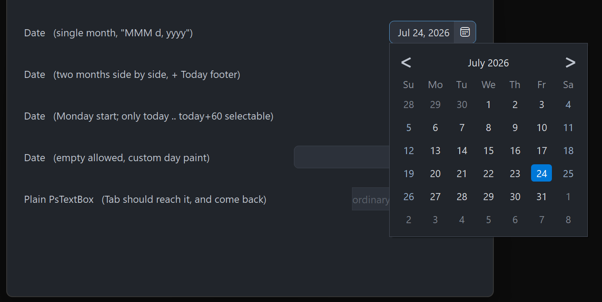

# PsDatePicker

An owner-drawn date picker: an editable date field with a calendar icon on the right, and a
popup calendar the control owns. Typing a date and picking one from the calendar are two routes
to the same `SYSTEMTIME` value.

The field is a real editing control — a borderless `PsTextBox` — so typing, the caret, selection,
undo, paste and the right-click menu all behave the way a text box does. The calendar is a
separate top-level window: a month grid with prev/next navigation, a clickable title that drills
down from days to months to a decade of years, an optional second month side by side, week-start
choice, a min/max range, a today ring, and an optional clickable "Today" band at the foot.

**The host owns date format and parsing.** The control stores a `SYSTEMTIME` and imposes no
locale: you supply a Format callback that renders a date into field text and a Parse callback
that resolves typed text back into a date. Without a Format callback it falls back to ISO
`yyyy-MM-dd` so it is usable before you wire anything; without a Parse callback typed text is
never accepted and only the calendar can set the date.

If you want a calendar embedded in your window rather than dropping out of a field, that is
`PsCalendar` — no text box, no popup, and no pump obligation.

Repository: <https://github.com/PaulSquires/PsDatePicker>

---

## What it looks like



Four pickers: a single month, two months side by side with the Today footer, a Monday-start
calendar limited to a 60-day range, and an empty-allowed field with a host day painter.

---

## Requirements

This control both **wraps a real child** and **owns a second top-level window**, so its file list
is longer than most. Copy all of these:

| File | What it is |
|---|---|
| `PsDatePicker.bi` | Public header — types, enums, callback typedefs, declarations |
| `PsDatePicker.inc` | Implementation |
| `PsTextBox.bi` / `PsTextBox.inc` | The editable field |
| `PsPopupMenu.bi` / `PsPopupMenu.inc` | The field's right-click menu (required by `PsTextBox`) |
| `PsBufferPaint.bi` / `PsBufferPaint.inc` | Flicker-free GDI+ drawing surface |
| `PsTipHost.bi` / `PsTipHost.inc` | The tooltip backend switch |
| `PsTooltip.bi` / `PsTooltip.inc` | The optional owner-drawn tooltip backend (required by `PsTipHost`) |

It also needs the AfxNova framework on the include path (`fbc -i "C:\dev"` if AfxNova lives at
`C:\dev\AfxNova`).

### Include order

`PsDatePicker.bi` names types from `PsBufferPaint`, `PsTipHost` and `PsTextBox` and includes
those headers itself, but the **implementations** must be pulled in ahead of it, in this order:

```freebasic
#include once "windows.bi"
#include once "AfxNova\CWindow.inc"
#include once "AfxNova\AfxStr.inc"
#include once "AfxNova\AfxGdiplus.inc"
using AfxNova

#include once "PsBufferPaint.inc"
#include once "PsPopupMenu.inc"
#include once "PsTextBox.inc"
#include once "PsDatePicker.inc"
```

`PsDatePicker.inc` includes `PsTipHost.inc` (and through it `PsTooltip.inc`) for you, so those
two need no line of their own — but the files must be present.

### Initialise GDI+

The control renders through GDI+. Bracket your message loop with `AfxGdipInit` and
`AfxGdipShutdown`, or it draws nothing at all:

```freebasic
dim as ULONG_PTR gdipToken = AfxGdipInit()
' ... create windows, run the message loop ...
AfxGdipShutdown( gdipToken )
```

`AfxGdipShutdown` must come **after** every window is destroyed.

### Do not name anything `ok`

GDI+ defines `Ok = 0` as a `Status` enum value in namespace `AfxNova`, and your host almost
certainly says `using AfxNova`. Any identifier of your own called `ok` becomes a duplicate
definition the moment you adopt this control. Use `bOK`.

### Message pump — `PsDatePicker_FilterMessage` is NOT optional

```freebasic
dim uMsg as MSG
do while GetMessage(@uMsg, null, 0, 0)
    if PsDatePicker_FilterMessage( @uMsg ) then continue do
    TranslateMessage @uMsg
    DispatchMessage @uMsg
loop
```

One call discharges three obligations at once:

1. it forwards to `PsTextBox_FilterMessage`, without which the field's right-click menu has no
   keyboard navigation and never closes on an outside click;
2. it dismisses the open calendar on **Esc** and on a click outside it — the popup never takes
   activation, so it cannot see either event itself;
3. it arms a one-shot guard so that an icon click which just dismissed the calendar does not
   instantly reopen it.

Skip the call and the calendar becomes a popup you can only close by picking a date.

Tab navigation into and out of the field needs no `IsDialogMessage`: `PsTextBox` handles `VK_TAB`
itself, and the container carries `WS_EX_CONTROLPARENT` so that walk can see through it.

---

## Quick start

```freebasic
dim as HWND hDate = PsDatePicker_Create( hMainWindow, IDC_MYDATE )
PsDatePicker_SetFont( hDate, hFont )                       ' caller-owned HFONT
PsDatePicker_SetFormatCallback( hDate, @MyFormat )         ' date -> field text
PsDatePicker_SetParseCallback( hDate, @MyParse )           ' typed text -> date
PsDatePicker_SetDateChangedCallback( hDate, @MyChanged )

dim as SYSTEMTIME stNow
GetLocalTime( @stNow )
PsDatePicker_SetDate( hDate, PsDatePicker_MakeDate( stNow.wYear, stNow.wMonth, stNow.wDay ) )

' Size it to whatever it asks for, then show it.
dim as long w, h
PsDatePicker_GetIdealSize( hDate, w, h )
SetWindowPos( hDate, NULL, 20, 20, w, h, SWP_NOZORDER )
ShowWindow( hDate, SW_SHOW )
```

And the callbacks it wires:

```freebasic
' date -> display text
sub MyFormat( byval hCtrl as HWND, byval pDate as SYSTEMTIME ptr, byref sOut as DWSTRING )
    if pDate = 0 then sOut = "" : exit sub
    sOut = str(pDate->wYear) & "-" & format(pDate->wMonth,"00") & "-" & format(pDate->wDay,"00")
end sub

' typed text -> date. Return FALSE for anything you cannot accept.
function MyParse( byval hCtrl as HWND, byval sText as DWSTRING, byval pDate as SYSTEMTIME ptr ) as boolean
    if pDate = 0 then return false
    dim as string s = trim( sText )
    dim as long y = valint( mid(s, 1, 4) )
    dim as long m = valint( mid(s, 6, 2) )
    dim as long d = valint( mid(s, 9, 2) )
    if (m < 1) orelse (m > 12) then return false
    if (d < 1) orelse (d > PsDatePicker_DaysInMonth( y, m )) then return false
    *pDate = PsDatePicker_MakeDate( y, m, d )
    return true
end function

sub MyChanged( byval hCtrl as HWND, byval pDate as SYSTEMTIME ptr, byval bHasDate as boolean )
    if bHasDate = false then exit sub          ' the field was cleared
    ' pDate is the new value
end sub
```

---

## Concepts

### The handle is a real `HWND`

`PsDatePicker_Create` returns an ordinary child window. Position and size it with `SetWindowPos`,
show it with `ShowWindow`, destroy it with its parent. It is created 0×0 and invisible; nothing
appears until you size and show it.

### Format and Parse must round-trip

This is the one wiring mistake that produces no error message. On commit the control calls your
Parse callback with whatever is in the field; if Parse returns FALSE the field **silently
reverts** to the last text the control wrote — which is exactly what it looks like when the user
typed nothing at all. So if your Format produces `"Jul 24, 2026"` and your Parse only understands
digits, every commit made after the calendar or a setter wrote the field will fail and revert.

Assert `Parse( Format( d ) ) = d` for a few dates when you wire the pair.

### Focus lives two levels down

The field is a `PsTextBox`, whose own input window is a RichEdit. `GetFocus() = hCtrl` is
**never** true. Ask `PsDatePicker_HasFocus` instead.

### Programmatic setters are silent

`SetDate`, `ClearDate`, `SetRange` and `ReformatText` never fire `DateChangedCallback`. It fires
only for user action: a typed commit (Enter, or focus leaving the field) or a calendar pick. That
is what lets you call a setter from inside your own handler without re-entering it.

`DropDownCallback` is the deliberate exception: it reports a window-state transition rather than
a value change, so it fires for `PsDatePicker_DropDown` and `PsDatePicker_CloseUp` too.

### Rects are derived, never set

`rcFrame`, `rcField`, `rcDiv` and `rcIcon` are computed from the client rect on the next paint
after anything invalidates the layout. You cannot assign them; you read them back with
`GetFrameRect` / `GetFieldRect` / `GetIconRect`, each of which returns FALSE while the control
has never been given a non-empty size.

The layout is:

```
icon    = the right nIconWidth pixels, full height
divider = nDividerThick pixels immediately left of the icon
field   = from left + nCornerRadius to the divider,
          inset top and bottom by nBorderThick
```

The field is inset by the corner radius so the frame's rounded left corners survive underneath
the child's square rectangle. The `PsTextBox` child is moved to `rcField` on every layout.

### The calendar is a popup the control owns

It is created **lazily** — `PsDatePicker_GetCalendarHandle` returns 0 until the first open — and
destroyed with the control. It is a `WS_POPUP` that never takes activation, so your window stays
foreground and keystrokes keep flowing to it; that is why dismissal runs through the pump filter,
and why the popup polls the foreground window (every 100 ms) to close itself on alt-tab.

Only one picker's calendar is open at a time process-wide.

Every open **re-seeds** the calendar from the control: week start, month count, footer, range,
the selected date, and today. The view always reopens on the days grid, and the displayed month
is the selected date's month, or today's when there is no date.

### Sizes are DPI-scaled once, at Create

The icon width, field padding, vertical padding and corner radius are scaled for the monitor's
DPI when the control is created; the calendar's own metrics are scaled when the popup is created.
Every setter afterwards takes **raw pixels** — scale them yourself. The border and divider
thicknesses are rules, not sizes, and are never scaled: a hairline stays a hairline.

---

## Behaviour and limits

- **The pump filter is mandatory.** See Requirements.
- **The calendar is mouse-driven for selection.** F4, Alt+Down and Down open it (and close it
  again); Esc, an outside click and alt-tab dismiss it. There are no arrow keys inside the
  popup — you cannot move the selection from the keyboard.
- **`nMonthCount` is 1 or 2.** Anything else is clamped. Only the left panel carries the
  chevrons and the interactive title; the right one is a static caption.
- **The drill-down uses the left panel only.** In two-month mode the right half is blank chrome
  while the months or years grid is showing.
- **The day grid is a fixed 6×7.** The popup never changes height between months.
- **Month names and weekday abbreviations in the calendar chrome are English** and cannot be
  replaced. Only the field's text goes through your Format callback. (`PsCalendar` takes
  host-supplied names if you need localized chrome.)
- **The range clamps, it does not refuse.** `SetDate` and a typed commit both clamp into
  `[min, max]`; an inverted min/max pair is swapped rather than left unsatisfiable.
- **Empty is a legal value** unless you turn it off with `SetAllowEmpty(false)`, in which case
  clearing the field reverts to the last valid text on commit.
- **There is no keyboard route to the Today footer** — it is a click target.
- **`CS_DBLCLKS` is off.** A rapid second click on the icon is a legitimate close-then-reopen and
  arrives as two `WM_LBUTTONDOWN`.
- **The tooltip is calendar-only.** There is no tip on the field or the icon, and none at all
  until you set a `TooltipCallback`.

---

## API reference

### Creation, children, focus

| Function | Behaviour |
|---|---|
| `PsDatePicker_Create( hWndParent, CtrlID ) as HWND` | Creates the control and its embedded field. Returns a real child `HWND`, sized 0×0 and hidden — size and show it yourself. |
| `PsDatePicker_GetTextBoxHandle( hCtrl ) as HWND` | The embedded `PsTextBox`, for `PsTextBox_*` styling. Do not give it a border or change its margins: the container owns both. |
| `PsDatePicker_GetCalendarHandle( hCtrl ) as HWND` | The popup calendar window, or **0 until it has been opened once**. The window survives a close and is reused. |
| `PsDatePicker_HasFocus( hCtrl ) as boolean` | True when the field owns the caret. Use this — `GetFocus() = hCtrl` is never true. |

### Value

All silent; none of these fire `DateChangedCallback`.

| Function | Behaviour |
|---|---|
| `PsDatePicker_GetDate( hCtrl, byref st ) as boolean` | Fills `st` and returns TRUE, or returns FALSE and leaves `st` alone when there is no date. |
| `PsDatePicker_SetDate( hCtrl, byref st )` | Clamps into the range, normalises to a date-only `SYSTEMTIME`, and rewrites the field through Format. |
| `PsDatePicker_ClearDate( hCtrl )` | Drops to the no-date state and empties the field. Legal regardless of `SetAllowEmpty` — that governs the *user*, not you. |
| `PsDatePicker_HasDate( hCtrl ) as boolean` | Whether a date is currently set. |
| `PsDatePicker_GetRange( hCtrl, byref stMin, byref stMax, byref bHasMin, byref bHasMax )` | Reads the bounds and whether each is in force. |
| `PsDatePicker_SetRange( hCtrl, byref stMin, byref stMax, bHasMin, bHasMax )` | Sets either or both bounds. An inverted pair is **swapped**. The current date is re-clamped and the field rewritten, silently. Out-of-range days paint disabled and are unclickable, and the chevrons disable when there is nothing reachable beyond them. |
| `PsDatePicker_GetAllowEmpty( hCtrl ) as boolean` | Default TRUE. |
| `PsDatePicker_SetAllowEmpty( hCtrl, bAllow )` | FALSE makes a commit on an empty field revert to the last valid text instead of clearing the date. |
| `PsDatePicker_ReformatText( hCtrl )` | Re-runs Format on the current date and rewrites the field — call it after your own date-format preference changes. |

### Calendar behaviour

| Function | Behaviour |
|---|---|
| `PsDatePicker_GetWeekStart( hCtrl ) as long` | `DTP_SUNDAY` (default) or `DTP_MONDAY`. |
| `PsDatePicker_SetWeekStart( hCtrl, nWeekStart )` | Anything that is not `DTP_MONDAY` is taken as `DTP_SUNDAY`. Takes effect at the next open. |
| `PsDatePicker_GetMonthCount( hCtrl ) as long` | 1 (default) or 2. |
| `PsDatePicker_SetMonthCount( hCtrl, nCount )` | **Clamped to 1..2.** Takes effect at the next open. |
| `PsDatePicker_GetShowToday( hCtrl ) as boolean` | Default TRUE. |
| `PsDatePicker_SetShowToday( hCtrl, bShow )` | Draw the ring on today's cell. The ring is suppressed on a cell that is also selected. |
| `PsDatePicker_GetShowTodayFooter( hCtrl ) as boolean` | Default **FALSE**. |
| `PsDatePicker_SetShowTodayFooter( hCtrl, bShow )` | Adds a clickable "Today: …" band at the foot, present in every view. Silent. If the calendar is open it is re-laid-out and **resized immediately**, because the band changes the popup's height. |
| `PsDatePicker_DropDown( hCtrl )` | Opens the calendar. A no-op when disabled or already open. Fires `DropDownCallback(true)` **before** the calendar is built or seeded. |
| `PsDatePicker_CloseUp( hCtrl )` | Closes it, hides any tip and stops the foreground poll. Fires `DropDownCallback(false)` only if it was actually open. |
| `PsDatePicker_IsDroppedDown( hCtrl ) as boolean` | Whether the calendar is showing. |

### Layout and appearance

Every size below is in **raw pixels** — scale for DPI yourself.

| Function | Behaviour |
|---|---|
| `PsDatePicker_GetFont( hCtrl ) as HFONT` | The text font, or 0. |
| `PsDatePicker_SetFont( hCtrl, hFont )` | **Caller-owned**; never deleted by the control. Used by the field *and* the calendar. Re-lays out and repaints. |
| `PsDatePicker_GetIconFont( hCtrl ) as HFONT` | The host-supplied glyph font, or 0 when the control's own default is in use. |
| `PsDatePicker_SetIconFont( hCtrl, hFont )` | Caller-owned. Pass **0 to restore** the control's default (Segoe Fluent Icons, created at Create and deleted with the control). |
| `PsDatePicker_GetIconGlyph( hCtrl ) as DWSTRING` | The current glyph string. |
| `PsDatePicker_SetIconGlyph( hCtrl, sGlyph )` | Any string — it is drawn with the icon font. Default is `&hE787` ("Calendar"). |
| `PsDatePicker_GetIconWidth( hCtrl ) as long` | Width of the icon cell. |
| `PsDatePicker_SetIconWidth( hCtrl, nWidth )` | Negative values clamp to 0. Changes the field width, so it also changes `GetIdealSize`. |
| `PsDatePicker_GetCornerRadius( hCtrl ) as long` | Frame corner radius. |
| `PsDatePicker_SetCornerRadius( hCtrl, nRadius )` | Clamped at 0. Also the field's left inset, so it moves the text. |
| `PsDatePicker_GetBorderThickness( hCtrl ) as long` | Frame border, default 1. |
| `PsDatePicker_SetBorderThickness( hCtrl, nThickness )` | Clamped at 0. Not DPI-scaled by the control — a hairline stays a hairline. |
| `PsDatePicker_GetIdealSize( hCtrl, byref nWidth, byref nHeight )` | Width for the current field text, or for a representative long date (`"Wednesday, September 30, 2222"`) when the field is empty, plus icon, divider, corner inset and border. Height is one text line plus vertical padding and border. Valid before the control has ever been sized. |
| `PsDatePicker_GetEnabled( hCtrl ) as boolean` | |
| `PsDatePicker_SetEnabled( hCtrl, isEnabled )` | Goes through `EnableWindow` on the container **and** the field, so the disable is enforced by the system rather than being cosmetic. Disabling closes an open calendar and clears the icon hover. |
| `PsDatePicker_Refresh( hCtrl )` | Marks the layout dirty and invalidates — the next paint re-derives every rect. |

### Geometry

| Function | Behaviour |
|---|---|
| `PsDatePicker_GetFrameRect( hCtrl, byref rc ) as boolean` | The whole client rect. FALSE if the control has never had a non-empty size. |
| `PsDatePicker_GetFieldRect( hCtrl, byref rc ) as boolean` | Where the `PsTextBox` child sits. Same FALSE rule. |
| `PsDatePicker_GetIconRect( hCtrl, byref rc ) as boolean` | The icon cell. Same FALSE rule. |
| `PsDatePicker_HitTest( hCtrl, pt ) as long` | **1** for a point inside the icon cell, **0** for anything else — including the field, which is a child window and hits nothing here. |

### Colours

| Function | Behaviour |
|---|---|
| `PsDatePicker_GetColors( hCtrl, pColors )` | Copies the struct out. |
| `PsDatePicker_SetColors( hCtrl, pColors )` | Copies it in, pushes the field colours into the embedded `PsTextBox`, and repaints the control and any open calendar. Read-modify-write: `GetColors` → assign → `SetColors`. |

### Callback registration

| Function | Behaviour |
|---|---|
| `PsDatePicker_SetParseCallback( hCtrl, userfunc )` | Resolve typed text to a date. With none set, typed text is never accepted. |
| `PsDatePicker_SetFormatCallback( hCtrl, usersub )` | Render a date into field text. **Immediately re-renders** the current date in the new format. |
| `PsDatePicker_SetDateChangedCallback( hCtrl, usersub )` | User-driven value changes only. |
| `PsDatePicker_SetDropDownCallback( hCtrl, usersub )` | Calendar opened/closed, programmatic opens included. |
| `PsDatePicker_SetPaintCallback( hCtrl, usersub )` | Replace the editing-box painter entirely. |
| `PsDatePicker_SetDayPaintCallback( hCtrl, usersub )` | Replace the painter for one calendar day cell. |
| `PsDatePicker_SetMessageCallback( hCtrl, userfunc )` | Observe messages. |
| `PsDatePicker_SetTooltipCallback( hCtrl, userfunc )` | Supply the text for the day cell under the cursor. **No callback means no tooltip machinery is ever created.** |

### Tooltips

The calendar's day-cell tip is **tracked**: the control resolves the text, positions the tip on
the cell and shows it immediately, rather than letting a dwell decide. It is also **lazy** —
nothing is built until a day cell actually asks for a tip, and nothing is built at all unless a
`TooltipCallback` is set.

| Function | Behaviour |
|---|---|
| `PsDatePicker_SetTooltipMode( hDatePicker, nMode ) as boolean` | `PSTIP_MODE_SYSTEM` (default, the comctl32 tip) or `PSTIP_MODE_PS` (`PsTooltip`). **Refuses** any other value and returns FALSE. The text is unaffected — both backends are fed by the same `TooltipCallback`. |
| `PsDatePicker_GetTooltipMode( hDatePicker ) as long` | The stored mode. |
| `PsDatePicker_GetTooltipHandle( hDatePicker ) as HWND` | The comctl32 tooltip window; 0 unless the system backend is current **and** a day cell has already asked for a tip. |
| `PsDatePicker_GetPsTooltipHandle( hDatePicker ) as HWND` | The `PsTooltip` window under the same rule. This is the door to `PsTooltip`'s own colour, font, style, title and max-width setters — they are not mirrored here. |

The mode is remembered on the **picker**, not the popup. The popup's tip is destroyed with the
popup, so a mode stored there would revert to the default the second time a user opened the
calendar; setting the mode applies to the current popup if there is one and to every later one.

### Host message pump

| Function | Behaviour |
|---|---|
| `PsDatePicker_FilterMessage( pMsg ) as boolean` | Call once per message, before `TranslateMessage`. Returns TRUE when the message was consumed. It forwards to `PsTextBox_FilterMessage`, consumes **Esc** to close an open calendar, and closes the calendar on a button-down outside it — that one returns FALSE so the click still reaches its target, and arms the reopen guard when the click landed on this control. Not optional. |

### Date helpers

Pure functions, safe to call before any control exists. The serial is a day count that makes
every month and year rollover fall out of ordinary arithmetic.

| Function | Behaviour |
|---|---|
| `PsDatePicker_IsLeapYear( y ) as boolean` | Proleptic Gregorian. |
| `PsDatePicker_DaysInMonth( y, m ) as long` | 28–31. |
| `PsDatePicker_DateToSerial( y, m, d ) as longint` | Day serial for a calendar date. |
| `PsDatePicker_SerialToDate( serial, byref y, byref m, byref d )` | The inverse. |
| `PsDatePicker_DowSunday( y, m, d ) as long` | Day of week, **0 = Sunday … 6 = Saturday**. |
| `PsDatePicker_LeadingCells( y, m, nWeekStart ) as long` | 0–6: how many cells of the previous month lead the grid for that month under that week start. |
| `PsDatePicker_MakeDate( y, m, d ) as SYSTEMTIME` | A date-only `SYSTEMTIME` with the time fields zeroed. |
| `PsDatePicker_AddMonths( byref st, delta ) as SYSTEMTIME` | Steps whole months, clamping the day to the target month's length (31 Jan + 1 month = 28/29 Feb). |
| `PsDatePicker_DecadeBase( y ) as long` | The decade start: 2021 → 2020, 2030 → 2030. The years grid runs from one before this. |

### Test seam and render probes

These drive the real calendar painter into an offscreen buffer, so a host that replaces the day
painter can assert its render is sane. They take the **calendar** handle, not the control's.

| Function | Behaviour |
|---|---|
| `PsDatePicker_TestPrepareCalendar( hCtrl, eView, anchorYear, anchorMonth ) as HWND` | Builds, seeds and sizes the calendar **without showing it**, sets the view and displayed month, and lays out every rect at the real client size. Returns the calendar handle, or 0. |
| `GetDatePickerCalPointer( hCal ) as PSDATEPICKER_CAL ptr` | The popup's private state, for reading calendar geometry (`rcDayCell`, `rcTodayFooter`, `panelMonth`, …). Note the unprefixed name. Read it; do not write it. |
| `PsDatePicker_TestCalendarTones( hCal ) as long` | Distinct colours over the whole client, sampled on a stride and capped at 256. A healthy calendar produces many; a flooded one produces 1–2. |
| `PsDatePicker_TestFooterTones( hCal ) as long` | The same inside the Today band. **0 when the footer is off** — geometry proves where the band is, not that anything was drawn in it. |
| `PsDatePicker_TestPartBrightness( hCal, nPart ) as long` | Brightest pixel in a part: `0` = prev chevron, `1` = next chevron, `100 + k` = day cell *k* of panel 0. Returns -1 if the calendar is unusable. Use it to prove a disabled chevron or day really renders dimmer — a check on the colour *field* only proves the field. |

A tone floor copied from another control is meaningless: the number depends on what else is
inside the rect.

---

## Colors

`PSDATEPICKER_COLORS` is a flat struct of `COLORREF` fields, all carrying defaults for a dark
theme. Read-modify-write it with `GetColors` / `SetColors`.

### Frame and field

| Field | Paints | When |
|---|---|---|
| `BackColor` | The client behind the rounded frame | Always — it is what shows through the corners |
| `BorderColor` | The frame outline | Enabled and unfocused |
| `FocusBorderColor` | The frame outline | While the field has the caret |
| `BorderColorDisabled` | The frame outline | Disabled |
| `DividerColor` | The hairline between field and icon | Enabled |
| `DividerColorDisabled` | The same hairline | Disabled |
| `FieldBackColor` | The field fill | Enabled — pushed into the `PsTextBox` |
| `FieldForeColor` | The date text | Enabled — drawn by the RichEdit, not by this control |
| `FieldBackColorDisabled` | The field fill | Disabled |
| `FieldForeColorDisabled` | The date text | Disabled |

### Icon cell

| Field | Paints | When |
|---|---|---|
| `IconColor` | The icon cell fill | At rest. **Defaults equal to `FieldBackColor`**, which is why the cell reads flat until hovered |
| `IconBackColorHot` | The icon cell fill | Cursor over the icon |
| `IconGlyphColor` | The glyph | At rest |
| `IconGlyphColorHot` | The glyph | Cursor over the icon |
| `IconGlyphColorDisabled` | The glyph | Disabled |

### Calendar chrome

| Field | Paints | When |
|---|---|---|
| `CalBackColor` | The popup background | Always |
| `CalBorderColor` | The popup's outline | Always |
| `TitleColor` | The "March 2021" title | At rest |
| `TitleColorHot` | The title | Cursor over it (panel 0 only — the right panel's caption is inert) |
| `NavGlyphColor` | The ‹ › chevrons | Enabled |
| `NavGlyphColorHot` | A chevron | Cursor over it |
| `NavGlyphColorDisabled` | A chevron | Nothing reachable in that direction within the range |
| `WeekdayColor` | The Su Mo Tu … header row | Always |

### Day cells

| Field | Paints | When |
|---|---|---|
| `DayColor` | The day number | Ordinary weekday of the displayed month |
| `DayColorWeekend` | The day number | Saturday or Sunday of the displayed month |
| `DayColorAdjacent` | The day number | A leading/trailing day from the neighbouring month — **dimmed but still clickable** |
| `DayColorDisabled` | The day number | Outside the min/max range, inert |
| `DayBackColorHot` | A rounded chip behind the cell | Cursor over an in-range cell |
| `DayForeColorHot` | The day number | Same |
| `DayBackColorSelected` | A rounded chip behind the cell | The selected day |
| `DayForeColorSelected` | The day number | Same |
| `TodayRingColor` | A thin outline on the cell | Today, when `SetShowToday` is on and the cell is not selected |

### Today footer

Only used when `SetShowTodayFooter` is on. The band has no fill of its own — it sits on
`CalBackColor` — so these three are the caption colour alone.

| Field | Paints | When |
|---|---|---|
| `TodayFooterColor` | The "Today: …" caption | At rest, today in range |
| `TodayFooterColorHot` | The caption | Cursor over the band |
| `TodayFooterColorDisabled` | The caption | Today falls outside the min/max range — the band is inert and does not hot-track |

**Keep `DayColorAdjacent` and `DayColorDisabled` clearly apart.** An adjacent day is clickable
and navigates to its month; a disabled day does nothing. If the two are close in luminance, a
range like "the next 60 days" shows most of the month greyed with no way to tell which greys can
be clicked. The defaults sit far apart deliberately.

### Day-cell precedence

Background first: `selected` → `hot` (and only when not disabled) → nothing. Then the today ring,
drawn only when the cell is not selected. Then the number:

```
disabled > selected > hot > adjacent > weekend > ordinary
```

Note that `disabled` beats `selected` here, and that `hot` beats `adjacent` — an out-of-month day
under the cursor takes the hot colour.

---

## Callbacks

Every typedef carries the `DTP_` prefix.

### `DTP_ParseCallbackFunc`

```freebasic
function MyParse( byval hCtrl as HWND, byval sText as DWSTRING, byval pDate as SYSTEMTIME ptr ) as boolean
```

Called on **commit** — Enter, or focus leaving the field — with the field's current text. Fill
`*pDate` and return TRUE, or return FALSE for text you cannot accept, in which case the field
reverts to the last text the control wrote. Empty text never reaches you: the control handles it
according to `SetAllowEmpty`. A date you return is clamped into the range afterwards.

> **`sText` is `byval` — copy that signature exactly.** Declaring it `byref … as const DWSTRING`
> and then copying it (`dim as DWSTRING c = sText`, the obvious first line of any parser)
> **corrupts the process heap**: AfxNova's `DWSTRING` copy constructor is not const-correct. The
> crash lands far from the cause, often much later and in unrelated code.

### `DTP_FormatCallbackSub`

```freebasic
sub MyFormat( byval hCtrl as HWND, byval pDate as SYSTEMTIME ptr, byref sOut as DWSTRING )
```

Render a date into field text. Called whenever the control writes the field — a setter, a
calendar pick, a successful parse, `ReformatText`, or `SetFormatCallback` itself — and also for
the Today footer's caption, so the band matches the field above it. With no callback the control
falls back to ISO `yyyy-MM-dd`.

### `DTP_DateChangedCallbackSub`

```freebasic
sub MyChanged( byval hCtrl as HWND, byval pDate as SYSTEMTIME ptr, byval bHasDate as boolean )
```

**User action only** — a typed commit or a calendar pick (including the Today footer, which
routes through the same commit path, so it fires exactly once). Every programmatic setter is
silent. It fires only when the value actually changed. `bHasDate` is FALSE when the user cleared
the field, and `pDate` then holds the stale previous value — test the flag, not the pointer.

### `DTP_DropDownCallbackSub`

```freebasic
sub MyDropDown( byval hCtrl as HWND, byval isOpen as boolean )
```

The calendar opened or closed, **programmatic opens included**. The opening edge runs before the
calendar is created or seeded, which makes it the just-in-time hook for setting a range or a
month count that depends on current state. If the popup fails to be created, the closing edge
fires immediately so the pairing holds.

### `DTP_PaintCallbackSub`

```freebasic
sub MyPaint( byval p as PSDATEPICKER_PAINTINFO ptr )
```

Replaces the built-in painter for the **editing box** — frame, divider and icon. It never draws
the date text; the RichEdit child does that, on top of whatever you paint. The buffer's
background has already been filled with `BackColor` before you are called.

> A callback that fills a rectangle covering the whole control erases everything already drawn.
> Draw your additions, not a background.

#### `PSDATEPICKER_PAINTINFO`

| Field | What it is |
|---|---|
| `hCtrl` | The control window |
| `b` | The `PsBufferPaint` surface to draw into |
| `rcClient` | The full client rect |
| `rcFrame` | The frame — currently the whole client |
| `rcField` | Where the `PsTextBox` child sits; anything you draw here is covered by it |
| `rcDiv` | The divider hairline |
| `rcIcon` | The icon cell |
| `isEnabled` | The control as a whole |
| `isFocused` | The field has the caret |
| `isOpen` | The calendar is dropped down |
| `iconHot` | The cursor is over the icon cell |
| `iconPressed` | The icon is being pressed |

### `DTP_DayPaintCallbackSub`

```freebasic
sub MyDayPaint( byval p as PSDATEPICKER_DAYPAINTINFO ptr )
```

Draws **one** day cell, replacing the built-in day painter for that cell. The cell's background
has already been filled with `CalBackColor`. This is the granular hook — availability shading,
appointment dots, per-day colouring.

#### `PSDATEPICKER_DAYPAINTINFO`

| Field | What it is |
|---|---|
| `hCtrl` | The **picker** control, not the popup |
| `b` | The `PsBufferPaint` surface |
| `rcCell` | The cell rect, in calendar client coordinates |
| `stDate` | The date this cell represents |
| `dayNumber` | 1–31, the number to draw |
| `monthIndex` | 0 = left/only panel, 1 = right panel |
| `isAdjacent` | A leading/trailing day of the neighbouring month — dim it, but it is clickable |
| `isWeekend` | Saturday or Sunday, from the cell's own date |
| `isToday` | |
| `isSelected` | |
| `isHot` | The cursor is over this cell (never set for an out-of-range cell) |
| `isDisabled` | Outside the min/max range, unclickable |
| `isEnabled` | The control as a whole |

### `DTP_MessageCallbackFunc`

```freebasic
function MyMessage( byval m as PSDATEPICKER_MESSAGEINFO ptr ) as boolean
```

Observes messages arriving at the container and at the embedded field. Return TRUE to suppress
the control's own handling.

**The return value is ignored for four messages**, because each has already changed state by the
time you are offered it, so suppressing it could only leave the control disagreeing with what the
system has done: `WM_KILLFOCUS` (a claimed kill-focus would skip the typed-text commit),
`WM_LBUTTONUP` (a claimed button-up would strand state the control has to unwind),
`WM_MOUSELEAVE` (the hot flag and its repaint happen regardless) and `WM_ENABLE` (the enabled
flag, the field colours and the repaint happen regardless).

#### `PSDATEPICKER_MESSAGEINFO`

| Field | What it is |
|---|---|
| `hCtrl` | The control window (even for a message that arrived at the field) |
| `uMsg` | The message |
| `wParam` | |
| `lParam` | |

### `DTP_TooltipCallbackFunc`

```freebasic
function MyTooltip( byval t as PSDATEPICKER_TOOLTIPINFO ptr ) as boolean
```

Supply the tip for the day under the cursor. Fill `outText` and return TRUE; return FALSE — or
leave `outText` empty — for no tip on that day. Called once per day cell as the cursor moves
between cells, not once per mouse move.

**Setting this callback is what turns tooltips on.** With none set, no tip window is ever
created.

#### `PSDATEPICKER_TOOLTIPINFO`

| Field | What it is |
|---|---|
| `hCtrl` | The picker control |
| `stDate` | The day under the cursor |
| `isValid` | FALSE when the cursor is not over a day cell |
| `outText` | Fill this with the tip text; empty means no tip |

---

## Constants

### Week start

| Value | Meaning |
|---|---|
| `DTP_SUNDAY` (0) | Default |
| `DTP_MONDAY` (1) | |

### Calendar view

| Value | Meaning |
|---|---|
| `DTP_VIEW_DAYS` (0) | The month grid. Every open reseeds to this |
| `DTP_VIEW_MONTHS` | A 3×4 grid of the twelve months |
| `DTP_VIEW_YEARS` | A 3×4 grid of a decade, starting one year before the decade base |

### Hit-test parts

Returned inside `DTP_HITRESULT` by the calendar's internal hit test, and the vocabulary the
`nPart` arguments of the render probes echo.

| Value | Meaning |
|---|---|
| `DTP_HIT_NONE` | |
| `DTP_HIT_PREV` / `DTP_HIT_NEXT` | The chevrons (panel 0 only) |
| `DTP_HIT_TITLE` | The interactive title — zooms out one level |
| `DTP_HIT_DAYCELL` | `index` 0–41, `panel` 0 or 1 |
| `DTP_HIT_MONTHCELL` / `DTP_HIT_YEARCELL` | `index` 0–11 |
| `DTP_HIT_TODAY` | The optional footer band |

`PsDatePicker_HitTest` on the **control** is a different, much smaller vocabulary: 1 for the icon
cell, 0 for everything else.

### Tooltip modes

| Value | Meaning |
|---|---|
| `PSTIP_MODE_SYSTEM` (0) | The comctl32 tracking tip. Default |
| `PSTIP_MODE_PS` (1) | `PsTooltip` — owner-drawn, with wrap, a title band and an icon cell |

### Cross-window messages

Sent by the popup to the control. Listed because they pass through a host message callback, not
because a host should send them.

| Message | Meaning |
|---|---|
| `DTP_CM_DATEPICKED` | The user picked a day. `lParam` is a `SYSTEMTIME ptr`, valid for the synchronous send only |
| `DTP_CM_CALCLOSED` | The popup dismissed itself |

### Layout defaults

Sizes are DPI-scaled at Create unless noted.

| Constant | Default | What it is |
|---|---|---|
| `CDTP_DEFAULT_ICONWIDTH` | 28 | The icon cell |
| `CDTP_DEFAULT_FIELDPAD` | 6 | Field padding, left and right |
| `CDTP_DEFAULT_VERTPAD` | 5 | Above and below the text, for `GetIdealSize` |
| `CDTP_DEFAULT_CORNERRADIUS` | 6 | |
| `CDTP_DEFAULT_BORDERTHICK` | 1 | **Not scaled** |
| `CDTP_DEFAULT_DIVIDERTHICK` | 1 | **Not scaled** |
| `CDTP_DEFAULT_ICONGLYPH` | `&hE787` | Segoe Fluent Icons "Calendar" |
| `CDTP_DEFAULT_ICONFONTPT` | 11 | Point size of the control-created icon font |
| `CDTP_CAL_PAD` | 8 | Popup padding, all four sides |
| `CDTP_CAL_GUTTER` | 12 | Between the two month panels |
| `CDTP_CAL_HEADERH` | 34 | The title/chevron band |
| `CDTP_CAL_CHEVW` | 28 | Each chevron cell |
| `CDTP_CAL_WEEKDAYH` | 22 | The weekday header row |
| `CDTP_CAL_FOOTERH` | 30 | The Today band |
| `CDTP_CAL_CELLMINW` | 34 | Minimum day-cell width — seven of these set the panel's ideal width |
| `CDTP_CAL_CELLMINH` | 30 | Minimum day-cell height — six set the ideal height |
| `CDTP_MY_COLS` / `CDTP_MY_ROWS` | 3 / 4 | The months and years grids |

### Mouse wheel

Over the open calendar, a wheel notch **away** from the user shows the **previous** month;
toward the user shows the next. Sub-notch deltas from a precision touchpad accumulate rather than
being dropped, and a notch stops at a disabled chevron.

---

## Related controls

- **`PsTextBox`** is the editing field. Its docs cover the text behaviour you inherit — caret,
  selection, undo, paste, the right-click menu — and the reason `PsPopupMenu` is on the file
  list. Its `FilterMessage` obligation is discharged for you by `PsDatePicker_FilterMessage`.
- **`PsTooltip`** is the optional tip backend selected by `PsDatePicker_SetTooltipMode`. Style it
  through the handle `PsDatePicker_GetPsTooltipHandle` hands back.
- **`PsCalendar`** is the embedded, non-popup calendar: the same grid and drill-down as a normal
  child control, with host-supplied month names, keyboard selection, and no pump obligation.

GPL-3.0.

## Licence

[Mozilla Public License 2.0](LICENSE).

MPL-2.0 is file-level copyleft, chosen deliberately for a drop-in control:

- **You may use this in closed-source software**, commercial or otherwise.
  §3.2 permits static linking with no additional conditions.
- **If you modify these files, publish those files' changes.** The obligation is
  per-file — your own sources are unaffected however tightly they are combined
  with these.
- The Exhibit B "Incompatible With Secondary Licenses" notice is **not applied**,
  which keeps this GPL-compatible.
