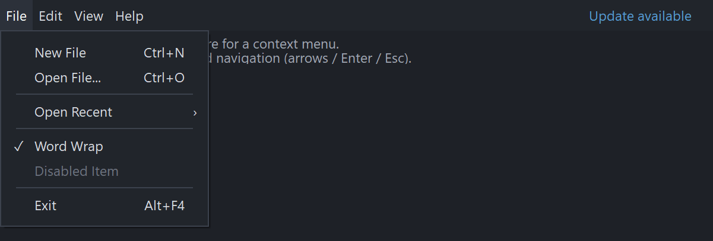

# PsMenuBar

An owner-drawn menu bar for FreeBASIC Win32 applications: a horizontal strip of text items —
File, Edit, View, Help — each owning a dropdown menu. Click an item and its dropdown opens
underneath it; while one is open, moving the cursor onto another item switches to that item's
dropdown without a second click; clicking the bar again closes it.

It draws itself entirely. There is no system menu underneath, nothing about its appearance
depends on the visual style the user happens to be running, and every colour it paints is one
you set. Items are measured from your font, so the bar hugs its content and the strip to the
right of the items stays yours to draw in.

The dropdowns are **[PsPopupMenu](PsPopupMenu.md)** windows, which is where the actual menu rows,
submenus, checkmarks and accelerator labels live. This document covers the bar; that one covers
the menus, and stands alone if all you want is a context menu.

---

## What it looks like



The repo holds two controls, and both are here: the horizontal **PsMenuBar** across the top, and the **PsPopupMenu** dropped from `File`. The dropdown shows what the popup handles — accelerator text, separators of their own height, a submenu arrow (`Open Recent`), a checkmark, and a disabled item. `Update available` on the right is painted by the host into the bar's spare space, not a menu item. Cropped below the menu.

---

## Requirements

**Files to copy into your project:**

| File | Purpose |
|---|---|
| `PsMenuBar.bi` | Declarations for the bar — types, callbacks, constants, prototypes |
| `PsMenuBar.inc` | Its implementation |
| `PsPopupMenu.bi` | Declarations for the dropdowns |
| `PsPopupMenu.inc` | Their implementation |
| `PsBufferPaint.bi` | The flicker-free drawing surface both controls paint through |
| `PsBufferPaint.inc` | Its implementation |

All six. The bar's dropdowns *are* `PsPopupMenu` windows, so the pair is not optional here — but
the dependency runs one way, and a host that wants only context menus needs just `PsPopupMenu`
plus `PsBufferPaint`. See [PsPopupMenu.md](PsPopupMenu.md).

**AfxNova is required.** Both controls are built on `CWindow`, and `PsBufferPaint` draws through
`AfxNova\CGdiPlus.inc`. Sources include AfxNova relative to the workspace root
(`#include once "AfxNova\CWindow.inc"`), so builds need the workspace root on the include path:

```bash
fbc64.exe -i "C:\dev" main.bas
```

**Include order.** `PsMenuBar.inc` pulls in its own `.bi` **and** `PsPopupMenu.inc`, so including
it alone gives you the complete menu system. You still include `PsBufferPaint.inc` first, and
after any colour or font globals your callbacks need to see:

```freebasic
#include once "windows.bi"
#include once "AfxNova\CWindow.inc"
#include once "AfxNova\AfxStr.inc"
#include once "AfxNova\AfxGdiplus.inc"

using AfxNova

#include once "PsBufferPaint.inc"
#include once "PsMenuBar.inc"        ' pulls in PsPopupMenu.inc itself
```

**GDI+ must be running before the first repaint and must outlive the last one.** Both controls
render through GDI+, so bracket your message loop:

```freebasic
dim as ULONG_PTR gdipToken = AfxGdipInit()
' ... create windows, run the message loop ...
AfxGdipShutdown( gdipToken )
```

`AfxGdipShutdown` must come after every window is destroyed, because each repaint builds and
tears down a `PsBufferPaint`. If you also use COM, initialise it before GDI+ and uninitialise it
after — GDI+ leans on COM.

**Never name an identifier `ok`.** GDI+ defines `Ok = 0` as a `Status` enum value in namespace
`AfxNova`, and hosts customarily say `using AfxNova`. An existing variable, parameter or
function called `ok` becomes a duplicate definition the moment you adopt these files. Use `bOK`
instead.

### The message-pump filter is mandatory

The bar never takes focus and neither do its dropdowns, so keystrokes keep going to your own
window. `PsMenuBar_FilterMessage` is the only thing that sees them:

```freebasic
dim uMsg as MSG
do while GetMessage( @uMsg, null, 0, 0 )
    if PsMenuBar_FilterMessage( HWND_MENUBAR, @uMsg ) then continue do
    TranslateMessage( @uMsg )
    DispatchMessage( @uMsg )
loop
```

Leave that line out and the bar still opens dropdowns, still paints, and still executes rows you
click. What you lose is everything else: **arrows, Home/End, Enter and Escape do nothing, an
open dropdown never closes when you click outside it, and the keyboard-highlight mode
(`PsMenuBar_SetActiveIndex`) is inert.** Stray typing also leaks through to whatever control has
focus behind the menu.

**It covers the bar and everything hanging off it** — the bar itself, its dropdowns, and their
submenus to any depth — because it wraps `PsPopupMenu_FilterMessage` for whichever dropdown is
open.

**It does not cover popups you show yourself.** A standalone context menu is a chain the bar
knows nothing about, so it needs its own filter call. A host with both:

```freebasic
do while GetMessage( @uMsg, null, 0, 0 )
    if PsMenuBar_FilterMessage( HWND_MENUBAR, @uMsg ) then continue do
    if PsPopupMenu_FilterMessage( HWND_CTXMENU, @uMsg ) then continue do
    TranslateMessage( @uMsg )
    DispatchMessage( @uMsg )
loop
```

Order does not matter much — a filter whose chain is not open returns FALSE cheaply — but
putting the bar first keeps the reading order obvious.

---

## Quick start

Build the bar and its dropdowns once, after your window exists:

```freebasic
HWND_MENUBAR = PsMenuBar_Create( hwnd, IDC_FRMMAIN_MENUBAR )
PsMenuBar_SetColors( HWND_MENUBAR, @gBarColors )
PsMenuBar_SetFont( HWND_MENUBAR, ghFont(GUIFONT_10) )
PsMenuBar_SetCommandCallback( HWND_MENUBAR, @MyApp_MenuCommand )
PsMenuBar_SetInitPopupCallback( HWND_MENUBAR, @MyApp_MenuInitPopup )

PsMenuBar_AddItem( HWND_MENUBAR, "File", IDMB_FILE )
PsMenuBar_AddItem( HWND_MENUBAR, "Edit", IDMB_EDIT )
PsMenuBar_AddItem( HWND_MENUBAR, "View", IDMB_VIEW )
PsMenuBar_AddItem( HWND_MENUBAR, "Help", IDMB_HELP )

' Each dropdown is a PsPopupMenu. Attaching it transfers ownership to the bar.
dim as HWND hFileMenu = PsPopupMenu_Create( hwnd )
PsPopupMenu_SetColors( hFileMenu, @gPopupColors )
PsPopupMenu_SetFonts( hFileMenu, ghFont(GUIFONT_10) )
PsPopupMenu_AddItem( hFileMenu, IDM_FILE_NEW, "New File", "Ctrl+N" )
PsPopupMenu_AddItem( hFileMenu, IDM_FILE_OPEN, "Open File...", "Ctrl+O" )
PsPopupMenu_AddSeparator( hFileMenu )
PsPopupMenu_AddItem( hFileMenu, IDM_FILE_WORDWRAP, "Word Wrap", "", false, gWordWrap )
PsPopupMenu_AddItem( hFileMenu, IDM_FILE_DISABLED, "Disabled Item", "", true )
PsPopupMenu_AddSeparator( hFileMenu )
PsPopupMenu_AddItem( hFileMenu, IDM_FILE_EXIT, "Exit", "Alt+F4" )
PsMenuBar_SetDropDown( HWND_MENUBAR, 0, hFileMenu )
```

Place it from your `WM_SIZE` handler. **Give the bar a real height first, then ask for its ideal
width** — item rects need a client height before they can be measured at all:

```freebasic
sub frmMain_PositionControls( byval hwnd as HWND )
    dim as RECT rc
    GetClientRect( hwnd, @rc )
    dim as long nBarHeight = 30
    dim pWindow as CWindow ptr = AfxCWindowPtr(hwnd)
    if pWindow then nBarHeight = pWindow->ScaleY(30)

    if IsWindow(HWND_MENUBAR) then
        SetWindowPos( HWND_MENUBAR, 0, rc.left, rc.top, rc.right - rc.left, nBarHeight, SWP_NOZORDER )
        dim as long nBarW = PsMenuBar_GetIdealWidth( HWND_MENUBAR )
        if nBarW > 0 then
            SetWindowPos( HWND_MENUBAR, 0, rc.left, rc.top, nBarW, nBarHeight, SWP_NOZORDER )
        end if
    end if
end sub
```

The bar is created hidden, so show it once:

```freebasic
frmMain_BuildMenus( HWND_FRMMAIN )
frmMain_PositionControls( HWND_FRMMAIN )
ShowWindow( HWND_MENUBAR, SW_SHOW )
```

Handle the chosen command:

```freebasic
sub MyApp_MenuCommand( byval hMenuBar as HWND, byval id as long )
    ' The chain is already closed and the bar highlight already cleared.
    ' id is the POPUP row's command id, so this can post straight on:
    '   PostMessage( HWND_FRMMAIN, WM_COMMAND, MAKEWPARAM(id, 0), 0 )
    select case id
        case IDM_FILE_WORDWRAP
            gWordWrap = (gWordWrap = false)
            dim as HWND hFileMenu = PsMenuBar_GetDropDown( hMenuBar, 0 )
            PsPopupMenu_SetItemChecked( hFileMenu, IDM_FILE_WORDWRAP, gWordWrap )
        case IDM_FILE_EXIT
            PostMessage( HWND_FRMMAIN, WM_CLOSE, 0, 0 )
    end select
end sub
```

Refresh menu state just before a dropdown opens:

```freebasic
sub MyApp_MenuInitPopup( byval hMenuBar as HWND, byval idx as long, byval hPopup as HWND )
    select case idx
        case 2      ' View
            PsPopupMenu_SetItemChecked( hPopup, IDM_VIEW_EXPLORER, gExplorerVisible )
            PsPopupMenu_SetItemChecked( hPopup, IDM_VIEW_OUTPUT, gOutputVisible )
            PsPopupMenu_SetItemEnabled( hPopup, IDM_VIEW_FULLSCREEN, (gOutputVisible = false) )
    end select
end sub
```

Close instantly when the app loses the foreground, rather than waiting for the control's own
poll:

```freebasic
case WM_ACTIVATEAPP
    if wParam = FALSE then PsMenuBar_CloseMenu( HWND_MENUBAR )
```

Plus the mandatory filter line in your pump, above. That is the whole minimum.

---

## Concepts

### The handle is a real HWND

`PsMenuBar_Create` returns an ordinary window handle, and every `PsMenuBar_*` function takes it. It
is not an opaque type, so you treat the bar as the child window it is — `SetWindowPos` to place
and size it, `ShowWindow` to show it, `GetDlgItem` to find it by the `CtrlID` you passed at
creation.

### It is created zero-sized and hidden

`PsMenuBar_Create` gives the bar `WS_CHILD`, `WS_CLIPSIBLINGS` and `WS_CLIPCHILDREN`.
`WS_VISIBLE` is deliberately absent, so a newly created bar shows nothing until you size it and
call `ShowWindow`. That lets you build the whole menu system before any of it is seen. The class
style carries `CS_DBLCLKS`.

### The bar's height, and the strip beside it, are yours

The bar does not decide how tall it is. Item rects always span the full client height, so
whatever height you give the window is the height of every item, vertically centred text
included.

Nor does it decide how wide it is. `PsMenuBar_GetIdealWidth` reports the right edge of the last
item — the width the items actually need — and you either size the bar to that and put your own
window beside it, or leave the bar full-width and draw your own content in the leftover strip.
Either way the bar paints only as far as its own window goes.

**`GetIdealWidth` returns 0 until the bar has a client height**, because measuring is what
produces the rects and layout refuses to run against a zero-height client. That is why the
quick start sizes the bar once before asking.

### Geometry is derived, never assigned

You never write a rect. Items run contiguously from `x = 0`:

```
  itemWidth  = measured text width + 2*padding
  item rect  = [ runningX, clientTop ] .. [ runningX + itemWidth, clientBottom ]
  idealWidth = the last item's right edge
```

Layout is lazy: adding an item, retitling one, changing the padding or changing the font marks
the layout stale and asks for a repaint, and the next paint — or any rect query — recomputes it.
There is no begin-update / end-update pair to remember. A resize invalidates the layout too,
since item rects span the client height.

When the items do not fit, the rightmost simply clips at the client edge. Nothing is squeezed.

### Pixels, and who scales them

Only the creation-time default is DPI-scaled for you:

| Setting | Default | DPI-scaled at create? |
|---|---:|---|
| Item padding (each side) | 6 | Yes |

`PsMenuBar_SetPadding` afterwards takes **raw pixels** and expects you to scale — typically
`pWindow->ScaleX(...)`.

### Two single-valued facts: hot and active

They are deliberately separate:

- **Hot** is transient mouse hover. It is set by `WM_MOUSEMOVE` and cleared when the cursor
  leaves. Hovering highlights any item, whether or not it has a dropdown.
- **Active** is the item whose dropdown is open, *or* the item holding the keyboard highlight
  when no dropdown is open. `PsMenuBar_IsMenuOpen` tells the two modes apart.

The built-in painter renders them identically — hot fill, hot text — because a click opens the
dropdown at once, so hover and active are two frames of one gesture. Styling them differently
makes the fill flicker in under the cursor on press. Install a paint callback if your design
wants them distinct.

Hover clearing has a 100 ms poll behind it, because `WM_MOUSELEAVE` is not reliably delivered
when the cursor exits fast.

### Opening, switching and closing

| Gesture | Effect |
|---|---|
| Click an item with a dropdown | Opens it, nothing selected |
| Move onto another item while a dropdown is open | Switches the open dropdown to that item, if it has one |
| Click the bar again while a dropdown is open | Closes it |
| Click an item with no dropdown | Nothing |
| Click anywhere outside | Closes the chain, and the click still reaches its target |

Opening a dropdown fires the bar's init-popup callback first, then the popup's own, then anchors
the popup under the item with its border merged into the bar's bottom edge.

The bar takes **no mouse capture**: it acts on the button-down alone, tracks no press state and
has no drag, so nothing consumes the down→up pairing. `WM_LBUTTONDBLCLK` runs the same handler
as `WM_LBUTTONDOWN`, so a fast double-click still toggles once per press instead of dropping
every second one.

### Keyboard, through the filter

There are two keyboard modes.

**A dropdown is open.** Keys go to the open menu — see [PsPopupMenu](PsPopupMenu.md) for the full
table — with two moves added at the bar boundary:

| Key | Effect |
|---|---|
| Left, at the root level of the chain | Step to the **previous** bar item that has a dropdown, wrapping, and open it with its first row selected |
| Right, on a row without an enabled submenu | Step to the **next** such bar item, same |

Inside a submenu, Left closes it instead, and Right opens the selected row's submenu — the bar
only claims the two keys the menu itself treats as no-ops.

**Highlight-only mode**, entered with `PsMenuBar_SetActiveIndex`: an item is highlighted but
nothing is open.

| Key | Effect |
|---|---|
| Left / Right | Move the highlight, wrapping. Unlike the open-menu case this steps to **any** item, including ones with no dropdown |
| Down / Enter | Open the highlighted item's dropdown with its first row selected |
| Escape | Clear the highlight |
| A click anywhere but the bar | Abandons the highlight; the click proceeds |

When neither mode is active the filter consumes nothing at all, so it is invisible to the rest of
your application.

### Alt is yours

The filter **never consumes the `WM_SYSKEY*` family**. What Alt does — activate the bar, do
nothing, or something specific to your application — is your decision, and you drive the bar for
it with `PsMenuBar_OpenMenu` (open a named menu, as an `Alt+F` accelerator would) or
`PsMenuBar_SetActiveIndex` (just highlight, as a bare Alt press would). Applications whose editing
surface already claims Alt are the reason this is not built in.

### Programmatic changes are silent

`PsMenuBar_OpenMenu`, `PsMenuBar_CloseMenu`, `PsMenuBar_SetActiveIndex`, `PsMenuBar_AddItem` and
`PsMenuBar_SetItemText` fire no command callback and send no notification. Only user interaction
notifies. This follows Win32's own setter/notification split, and it means you can call these
from inside your own handlers without re-entrancy.

Opening a menu — whether by click, hover-switch, keyboard or `PsMenuBar_OpenMenu` — does fire the
init-popup callbacks, because those report a window becoming visible rather than a user choice.

### Lifetime

The bar frees itself when its window is destroyed, and **destroys its attached dropdowns**,
which destroy their submenus in turn. One `DestroyWindow` on the bar unwinds the whole menu
system.

Ownership transfers at `PsMenuBar_SetDropDown`. Fonts you pass in stay yours — the bar borrows
them and never deletes one.

---

## Behaviour and limits

Firm properties of the control, not settings:

- **The pump filter is not optional.** Without `PsMenuBar_FilterMessage` in your message loop
  there is no keyboard navigation and no outside-click dismissal. See Requirements.
- **`PsMenuBar_FilterMessage` does not cover popups you show yourself.** It wraps the popup
  filter only for whichever of the bar's own dropdowns is open. A standalone context menu needs
  its own `PsPopupMenu_FilterMessage` call.
- **Alt does nothing on its own.** The filter never consumes `WM_SYSKEY*`; wire Alt up yourself.
- **No mnemonics.** There is no `&File` parsing and no underlined letter — the caption is drawn
  as written.
- **`GetIdealWidth` and `GetItemRect` return nothing useful before the bar has a client
  height.** Size the window first.
- **Items are never re-ordered, removed or hidden.** The API is append-only: there is no
  `InsertItem`, no `DeleteItem`, no `Clear`. Build the bar once. (The *dropdowns* are fully
  dynamic — that lives on `PsPopupMenu`.)
- **The id you pass to `PsMenuBar_AddItem` is stored but never used**, and there is no getter for
  it. Bar items are addressed by index everywhere in this API; commands come from the popup rows
  underneath. Treat the parameter as reserved.
- **Items that do not fit are clipped**, right to left, rather than compressed or scrolled.
- **No overflow chevron.** A bar too narrow for its items simply loses the last of them.
- **The bar never takes focus** and is not a tabstop. It is driven by the mouse and by the pump
  filter.
- **No mouse capture is taken**, because the bar acts on the button-down and has no drag.
- **Hover and active paint identically** under the built-in painter. Use a paint callback to
  distinguish them.
- **One dropdown open at a time**, and only one popup chain is open process-wide — showing a
  standalone context menu closes an open dropdown, and vice versa.
- **There is no `GetColors`.** Keep your `PSMENUBAR_COLORS` struct and call `SetColors` again.

---

## API reference

### Creation

| Function | Description |
|---|---|
| `PsMenuBar_Create( hWndParent, CtrlID ) as HWND` | Creates the bar as a child of `hWndParent` and returns its window handle. `CtrlID` becomes the window's `GWLP_ID`, so `GetDlgItem` finds it. Created zero-sized and hidden — size it with `SetWindowPos`, then `ShowWindow`. |

### Items

Append-only, and silent.

| Function | Description |
|---|---|
| `PsMenuBar_AddItem( hMenuBar, Text, id ) as long` | Appends an item and returns its **index**, or -1. `Text` is drawn as written — no mnemonic parsing. `id` is stored for your own bookkeeping and is **never read by the control**; there is no getter, and everything in this API addresses items by index. Marks the layout stale. |
| `PsMenuBar_GetItemCount( hMenuBar ) as long` | How many items the bar has. |
| `PsMenuBar_GetItemText( hMenuBar, idx ) as DWSTRING` | The item's caption, or `""` for an invalid index. |
| `PsMenuBar_SetItemText( hMenuBar, idx, Text ) as boolean` | Retitles the item. Re-lays out, because the caption drives the item's width. FALSE for an invalid index. |

### Dropdowns

| Function | Description |
|---|---|
| `PsMenuBar_SetDropDown( hMenuBar, idx, hPopup ) as boolean` | Attaches a [PsPopupMenu](PsPopupMenu.md) window as item `idx`'s dropdown. **Ownership transfers** — the bar destroys it when the bar is destroyed. Attaching over an existing dropdown **destroys the old one**. `hPopup = 0` detaches without destroying, returning ownership to you. FALSE for an invalid index. Does not change the bar's layout. |
| `PsMenuBar_GetDropDown( hMenuBar, idx ) as HWND` | The item's dropdown, or 0 when it has none or the index is invalid. This is how you reach the menu rows to flip a checkmark or an enabled state. |

An item with no dropdown still paints and still highlights on hover; clicking it does nothing.

### Menu control and state

All of these are **silent** — no command callback, no notification. Opening still fires the
init-popup callbacks.

| Function | Description |
|---|---|
| `PsMenuBar_OpenMenu( hMenuBar, idx, bSelectFirst = false ) as boolean` | Opens item `idx`'s dropdown and makes the item active, optionally putting the selection on the dropdown's first selectable row. This is the entry point for a host accelerator such as `Alt+F`. FALSE when the index is invalid, the item has no dropdown, or the bar has no geometry to anchor against yet. |
| `PsMenuBar_CloseMenu( hMenuBar )` | Closes any open dropdown chain **and** clears the highlight. Call it from your `WM_ACTIVATEAPP(FALSE)` handler for instant dismissal on an app switch — the control's own foreground watch is a 100 ms poll. |
| `PsMenuBar_IsMenuOpen( hMenuBar ) as boolean` | Is a dropdown currently open? This is also what distinguishes an open menu from the keyboard-highlight mode. |
| `PsMenuBar_GetActiveIndex( hMenuBar ) as long` | The active item — the one whose dropdown is open, or the one holding the keyboard highlight — or -1 for none. |
| `PsMenuBar_SetActiveIndex( hMenuBar, idx ) as boolean` | Sets the keyboard highlight **without opening a menu**; `-1` clears it. This is what a bare Alt press would call, and it is what puts the filter into highlight-only mode. FALSE for any index that is neither -1 nor valid. |

### Geometry and layout

Queries force a pending layout first, so results are current — but both need the bar to have a
client height, which it does not until you have sized the window.

| Function | Description |
|---|---|
| `PsMenuBar_GetItemRect( hMenuBar, idx, byref rc ) as boolean` | The item's rect in client coordinates: full client height, `text + 2*padding` wide. FALSE with an empty rect for an invalid index. |
| `PsMenuBar_GetIdealWidth( hMenuBar ) as long` | The right edge of the last item — the width the items need. **0** when the bar has no items or no geometry yet. Size the bar with it, or use it to find where your own content can start in a full-width bar. |
| `PsMenuBar_GetPadding( hMenuBar ) as long` | The horizontal inset applied to **each** side of an item's caption. |
| `PsMenuBar_SetPadding( hMenuBar, nPadding )` | Sets that inset; clamped to a minimum of 0. Takes **raw pixels** — you do the DPI scaling. Re-lays out, because padding is part of every item's width. |

### Appearance

| Function | Description |
|---|---|
| `PsMenuBar_SetColors( hMenuBar, pColors as PSMENUBAR_COLORS ptr )` | Copies the whole struct in and repaints. Your struct stays yours. |
| `PsMenuBar_SetFont( hMenuBar, hBarFont )` | Sets the caption font. It is also the **measuring** font, so this re-lays out. The font is **borrowed** — keep it alive and delete it yourself. With none set, the bar falls back to the stock GUI font for both measuring and drawing. |

Colours for the dropdowns are set separately, per popup, with `PsPopupMenu_SetColors`. Nothing
propagates from the bar to its menus.

### Plumbing and callback registration

| Function | Description |
|---|---|
| `PsMenuBar_FilterMessage( hMenuBar, pMsg as MSG ptr ) as boolean` | **The message-pump hook for the bar and everything hanging off it, and it is mandatory.** Call it once per pumped message; skip `TranslateMessage`/`DispatchMessage` when it returns TRUE. Handles the bar-boundary keys, delegates the rest to the open dropdown's own filter, and drives the highlight-only keyboard mode. Returns FALSE — deliberately — for the outside click that dismissed a menu, so that click still reaches its target, and for a click on the bar itself, so the bar's own toggle handler sees it. Consumes nothing when no menu is open and no item is highlighted. **Does not cover popups you show yourself.** |
| `PsMenuBar_SetCommandCallback( hMenuBar, usersub )` | Installs the handler told when a command on one of the bar's dropdowns is executed. |
| `PsMenuBar_SetInitPopupCallback( hMenuBar, usersub )` | Installs the just-in-time hook fired before a dropdown opens. |
| `PsMenuBar_SetPaintItemCallback( hMenuBar, usersub )` | Installs a renderer that draws every bar item **instead of** the built-in painter. |

All three callbacks are optional and independent.

---

## Colors

The colour surface is one flat struct, `PSMENUBAR_COLORS`, copied on `SetColors`. Every field is
zero — black — until you set it, so a bar you never call `PsMenuBar_SetColors` on is unreadable.

| Field | Paints |
|---|---|
| `BackColor` | The bar's background, and the fill of an idle item |
| `ForeColor` | An idle item's caption |
| `BackColorHot` | The fill of a hovered **or** active item |
| `ForeColorHot` | The caption of a hovered **or** active item |

### Which colour wins

The built-in painter picks one fill and one text colour per item:

```
hot or active   >   idle
```

There are only the two pairs, on purpose. **Hovered and active render identically** — see
*Two single-valued facts* above for why. A paint callback receives `isHot` and `isActive`
separately and can draw them differently.

### What the painter draws

| Part | Shape |
|---|---|
| Bar background | The whole client filled with `BackColor`, before the items |
| Item | A filled rect over the item's full rect, then the caption `DT_CENTER` in the same rect, in the bar font |

Everything goes through `PsBufferPaint`, so there is no flicker, and a paint callback inherits the
same buffer.

---

## Callbacks

### Command

```freebasic
type MB_CommandCallbackSub as sub( byval hMenuBar as HWND, byval id as long )
```

A command row on one of this bar's dropdowns was executed — a click or Enter. `id` is the
**popup row's** command id, not the bar item's, which is what makes forwarding it a one-liner:

```freebasic
PostMessage( HWND_FRMMAIN, WM_COMMAND, MAKEWPARAM(id, 0), 0 )
```

By the time it fires the **popup chain is already closed and the bar's highlight already
cleared**, so the handler can open a dialog, or re-open a menu, without fighting a live popup.
`PsMenuBar_IsMenuOpen` is already FALSE inside it.

User interaction only. Nothing you do programmatically fires it.

This callback reaches you because the bar registers itself as the notify window of each dropdown
as it opens. If you also set a select callback directly on a dropdown, both run.

### Init popup

```freebasic
type MB_InitPopupCallbackSub as sub( byval hMenuBar as HWND, byval idx as long, byval hPopup as HWND )
```

The dropdown for bar item `idx` is about to open — by click, hover-switch, keyboard or
`PsMenuBar_OpenMenu`. `hPopup` is the dropdown being opened.

This is the just-in-time hook: flip enabled and checked states on the popup tree (the by-id
setters recurse into submenus, so one call reaches any depth), retitle rows, or rebuild a dynamic
section. Fired **before** the popup's own init-popup callback, and before its layout runs, so
mutations here are coalesced into the single measuring pass that follows.

It reports a dropdown becoming visible, so it fires for programmatic opens as well as user ones.

### Paint item

```freebasic
type MB_PaintItemCallbackSub as sub( byval p as PSMENUBAR_PAINTINFO ptr )
```

Draws one bar item **instead of** the built-in painter. Setting the callback takes over every
item — all or none.

Paint through `p->b`, the control's double buffer for this repaint; do not touch the screen DC.
Fill `p->rc` and centre the caption in it. The control has already painted the bar background
before the item loop, so a callback that only wants to add something on top does not have to
repaint it.

`PSMENUBAR_PAINTINFO` carries everything you need:

| Field | Meaning |
|---|---|
| `hMenuBar` | The bar, so the callback can query it |
| `itemID` | The bar item **index** |
| `b` | The control's `PsBufferPaint` for this repaint (borrowed, not owned) |
| `rc` | The item's full rect — **fill this** |
| `isHot` | The mouse is over this item |
| `isActive` | This item's dropdown is open, or it holds the keyboard highlight |
| `wszCaption` | The item's caption |

> **A paint callback that fills a rectangle covering more than its own item will erase its
> neighbours.** Fill `p->rc`, not the client area.

`isHot` and `isActive` are independent booleans and both can be true at once — the cursor sitting
on the item whose dropdown is open.

---

## Constants

| Constant | Value | Meaning |
|---|---:|---|
| `PSMENUBAR_DEFAULT_PADDING` | 6 | Default horizontal inset per side of an item's caption, DPI-scaled at create |
| `PSMENUBAR_HOTTRACK_MS` | 100 | Interval of the poll that guarantees the hover highlight is cleared when the cursor leaves |
| `IDT_CMENUBAR_HOTTRACK` | `&hCB40` | That timer's id. Timer ids are per-window, so every instance shares it |

The dropdowns bring their own constants — alignment flags, notification messages and geometry
defaults. See [PsPopupMenu.md](PsPopupMenu.md).

---

## Related controls

- **[PsPopupMenu](PsPopupMenu.md)** — the floating menu the bar uses for every dropdown, and the
  place all the menu detail lives: rows, separators, checkmarks, accelerator labels, recursive
  submenus, the row paint callback and the colour struct that goes with it. It is independently
  usable, so the same control serves as your context menus, and its document stands alone.

The dependency runs one way. `PsPopupMenu` knows nothing about the bar; the bar drives it through
the same public API you would.

## Licence

[Mozilla Public License 2.0](LICENSE).

MPL-2.0 is file-level copyleft, chosen deliberately for a drop-in control:

- **You may use this in closed-source software**, commercial or otherwise.
  §3.2 permits static linking with no additional conditions.
- **If you modify these files, publish those files' changes.** The obligation is
  per-file — your own sources are unaffected however tightly they are combined
  with these.
- The Exhibit B "Incompatible With Secondary Licenses" notice is **not applied**,
  which keeps this GPL-compatible.
