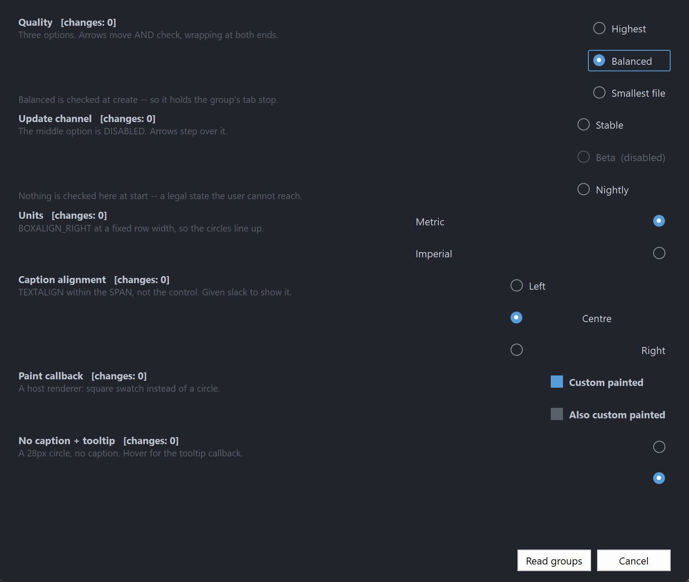

# PsOptionButton

An owner-drawn option button (radio button) for FreeBASIC + Win32, built on
[AfxNova](https://github.com/PaulSquires/AfxNova) and
[PsBufferPaint](https://github.com/PaulSquires/PsBufferPaint).

A circle and an optional caption, side by side, with a focus ring around the pair. Unchecked
draws a thin outlined ring; checked draws an accent-filled disc with a contrasting dot on it.
No chrome, no animation, no group box.

**The control owns mutual exclusion.** Option buttons that share a parent window and a group id
form a group, and checking one unchecks the rest. You do not write that logic, and you do not
call anything after a click to keep the group consistent.

It also implements the keyboard behaviour a Windows radio group actually has, which is the part
most hand-rolled radio buttons get wrong: **the whole group is a single tab stop**, and the arrow
keys move the selection within it. Tab moves past the group, not through it.

Repository: <https://github.com/PaulSquires/PsOptionButton>

---

## What it looks like



---

## Requirements

Copy these files into your project:

| File | Purpose |
|---|---|
| `PsOptionButton.bi` | public surface — types, enums, callbacks, declarations |
| `PsOptionButton.inc` | implementation |
| `PsBufferPaint.bi` | flicker-free drawing surface |
| `PsBufferPaint.inc` | |
| `PsTipHost.bi` / `PsTipHost.inc` | the tooltip backend switch — see *Tooltips: two backends* |
| `PsTooltip.bi` / `PsTooltip.inc` | the owner-drawn tooltip. Required even if you never switch to it: `PsTipHost.inc` includes it. |

There is no icon font to ship. The circle is drawn as geometry through GDI+, so nothing here
depends on Segoe Fluent Icons being installed.

You also need AfxNova on the include path (`-i "C:\dev"` if your tree matches this one).

### Include order

`PsBufferPaint.inc` must be included **before** `PsOptionButton.inc`, and both after AfxNova:

```freebasic
#include once "windows.bi"
#include once "AfxNova\CWindow.inc"
#include once "AfxNova\AfxStr.inc"
#include once "AfxNova\AfxGdiplus.inc"
using AfxNova

#include once "PsBufferPaint.inc"
#include once "PsOptionButton.inc"
```

Those two lines are the whole of it. `PsOptionButton.inc` includes `PsTipHost.inc` itself, and
`PsTipHost.inc` includes `PsTooltip.inc`, so the tooltip backend adds no include line to the host
— only the four files to the table above.

`PsOptionButton.bi` includes `PsBufferPaint.bi` itself, so the header is self-sufficient. It does
**not** include `windows.bi` or AfxNova — the host must already have done so, and must already
have said `using AfxNova`.

### GDI+ must be running

Every repaint draws through GDI+. Initialise it before the first paint and shut it down after
every window is destroyed:

```freebasic
CoInitialize( null )
dim as ULONG_PTR gdipToken = AfxGdipInit()

' ... create windows, run the message loop ...

AfxGdipShutdown( gdipToken )
CoUninitialize
```

Without the bracket the control draws nothing at all — no error, just an empty rectangle.

### Do not name anything `ok`

GDI+ defines `Ok = 0` as a `Status` enum value in namespace `AfxNova`. Every host says
`using AfxNova`, so any host identifier called `ok` becomes a duplicate definition the moment you
adopt this file. Use `bOK`.

### Message pump

**This control adds no pump obligation.** There is no `PsOptionButton_FilterMessage` and none is
needed. If you are coming from a control that has one, there is nothing to look for here.

It is focusable, though, so the two ordinary rules for a focusable control in a plain `CWindow`
host both apply:

```freebasic
do while GetMessage( @uMsg, null, 0, 0 )
    if uMsg.message = WM_QUIT then exit do
    ' IsDialogMessage is what makes Tab work at all.
    if IsDialogMessage( pWindow->hWindow, @uMsg ) = 0 then
        TranslateMessage @uMsg
        DispatchMessage @uMsg
    end if
loop
```

and, before the loop starts:

```freebasic
SetFocus( hFirstControl )
```

Without `IsDialogMessage`, Tab does nothing and the arrow keys still work. Without the startup
`SetFocus`, the **first** Tab does nothing: `IsDialogMessage` only acts when the focused window is
a descendant of the window passed to it, and at startup focus is on the form itself — a window is
not its own child.

---

## Quick start

```freebasic
' Three options in one group. The group id is the third Create argument.
dim as HWND hHigh = PsOptionButton_Create( hParent, 1001, 1 )
dim as HWND hMed  = PsOptionButton_Create( hParent, 1002, 1 )
dim as HWND hLow  = PsOptionButton_Create( hParent, 1003, 1 )

dim as HWND opts(0 to 2) = { hHigh, hMed, hLow }
dim as DWSTRING caps(0 to 2) = { "Highest", "Balanced", "Smallest file" }

for i as long = 0 to 2
    PsOptionButton_SetFont( opts(i), hFont )
    PsOptionButton_SetText( opts(i), caps(i) )
    PsOptionButton_SetCheckChangedCallback( opts(i), @OnQualityChanged )

    ' The control is created 0x0 and hidden. Ask it how big it wants to be.
    dim as long iw, ih
    PsOptionButton_GetIdealSize( opts(i), iw, ih )
    SetWindowPos( opts(i), 0, 20, 20 + (i * 30), iw, ih, SWP_NOZORDER or SWP_NOACTIVATE )
    ShowWindow( opts(i), SW_SHOW )
next

' Silent: no callback fires. This also moves the group's tab stop here.
PsOptionButton_SetChecked( hMed, true )
```

The callback it references:

```freebasic
sub OnQualityChanged( byval hOpt as HWND, byval isChecked as boolean )
    ' BOTH edges arrive here. The option being vacated fires first with isChecked = false,
    ' then the one being taken fires with true.
    if isChecked then
        print "quality is now id " & str( PsOptionButton_GetID( hOpt ) )
    end if
end sub
```

Reading the answer back later, without holding any of the handles:

```freebasic
dim as long nQuality = PsOptionButton_FindCheckedID( hParent, 1 )   ' -1 = unanswered
```

---

## Concepts

### The handle is a real window

`PsOptionButton_Create` returns an ordinary `HWND`. Move it with `SetWindowPos`, show it with
`ShowWindow`, disable it with `EnableWindow` — all of that works, and the control keeps its own
state in step when you do. There is no opaque handle type.

### A group is a parent plus a group id

A group is the pair *(parent window, group id)*. Every option button with the same parent and the
same group id is in the same group, and exactly one of them can be checked.

The group id is a `Create` parameter rather than only a setter, because a forgotten grouping call
does not fail — it silently merges two groups into one, and the form looks right until somebody
clicks. It defaults to `0`, so a window with a single logical group needs no grouping calls at
all.

```freebasic
hOpt1 = PsOptionButton_Create( hParent, 1001, 1 )   ' group 1
hOpt2 = PsOptionButton_Create( hParent, 1002, 1 )   ' group 1
hOpt3 = PsOptionButton_Create( hParent, 1003, 2 )   ' a different group, same parent
```

Two groups on one parent never interfere. `PsOptionButton_SetGroupID` moves a button between
groups later.

### Exactly one member of a group carries `WS_TABSTOP`

The checked member, or the first enabled member when nothing is checked. It moves automatically
when the check moves, when a member is disabled, and when a member is destroyed.

That is what makes the **group** a single tab stop, which is how a Windows radio group behaves:
Tab enters the group at the checked option and the next Tab leaves the group entirely. Within the
group you navigate with the arrows.

You do not manage this bit, and you should not set `WS_TABSTOP` on these controls yourself.

### Arrow order is creation order

The arrow keys walk the group in the order the buttons were **created**, not in z-order and not
by screen position. If you create a group out of visual order, the arrows will follow the order
you created them in.

### Geometry is derived, never set

The control owns its rects. You set inputs — padding, the box cell size, the gap, the ring band —
and the layout produces the rects from them. You can read them, but you cannot assign them.

```
ringPad    = nFocusGap + nFocusThick        reserved ALWAYS, focused or not
textBlock  = hasText ? nBoxGap + textW : 0
contentH   = max( hasText ? textH : 0 , nBoxHeight )

idealW     = 2*ringPad + padLeft + boxWidth + textBlock + padRight
idealH     = 2*ringPad + padTop  + contentH + padBottom

rcContent  = client deflated by ringPad
rcVisual   = rcContent inflated by ringPad
```

`PsOptionButton_GetIdealSize` is valid **before** the control has ever been sized, which is what
lets you use it to decide how big to make the control in the first place.

The focus-ring band is reserved whether or not the control has focus, so nothing moves when focus
arrives.

### The box cell is pinned; the caption gets the leftover

The box cell sits against the padding on whichever side `OPT_BOXALIGN_*` puts it, and the caption
takes the whole span that is left over. One model gives both looks, decided only by how wide you
make the control:

```
sized to GetIdealSize     (o) Highest quality          packed
sized to a full row width  Highest quality        (o)  settings row
```

A column of `OPT_BOXALIGN_RIGHT` buttons all sized to the same width line their circles up for
free.

`rcText` is the **span**, not the ink. It runs from the box cell to the far padding so
`DT_END_ELLIPSIS` has somewhere to ellipsize into. Drawing a background behind "the text" using
that rect fills the whole span.

### The circle is inscribed in the cell, not equal to it

`rcBox` is the declared cell the layout charges for. `rcCircle` is the largest centred **square**
inside it — which is what actually gets drawn. They are identical for the default 16×16 cell and
differ the moment you set a non-square one, at which point stroking `rcBox` would produce a
stadium rather than a circle.

If you write a paint callback and want a round button, use `rcCircle`.

### The dot scales with the circle by default

`nDotSize` is `0` by default, which means *derive the dot as a percentage of the circle diameter*.
Set the box cell to 32px and the dot grows with it. A declared non-zero `nDotSize` overrides that
and stays fixed — useful, but it decouples: scale the cell up afterwards and the dot will look
wrong with nothing to warn you.

### Setters are silent; user interaction notifies

`PsOptionButton_SetChecked`, `SetGroupID` and `ClearGroup` change state without firing any
callback. Only a completed click, Space, an arrow-key move, or the explicit
`PsOptionButton_Click` notifies.

That split is what makes it safe to call a setter from inside your own change callback — the
recursive call cannot notify.

### Both edges notify, and the loser fires first

When the user checks B while A was checked, two callbacks fire, in this order:

```
OnChanged( hA, false )      ' first
OnChanged( hB, true  )      ' second
```

Both state writes land **before** either callback runs, so reading
`PsOptionButton_FindChecked()` from inside either one gives a coherent answer — the group is
never observably double-checked or momentarily empty.

If you only care about the winner, test `isChecked` and ignore the other call.

### Mouse capture and the cancelled gesture

Pressing an option button takes mouse capture. Press it, slide the cursor off, release — and
nothing gets checked. The control paints the press state only while the cursor is inside, so the
gesture visibly cancels before the release confirms it.

---

## Behaviour and limits

- **A group with nothing checked is legal**, and it is the state a group starts in.
  `PsOptionButton_FindCheckedID` returns `-1` for it. **The user can never reach it** — clicking
  the checked member is a silent no-op and no gesture unchecks. Only the host can empty a group,
  via `SetChecked(h, false)` or `ClearGroup`.
- **Enter is not claimed.** A focused option button lets Enter through to the dialog's default
  button, which is what a Win32 radio button does. Space is the activation key.
- **Groups cannot span parents.** A group is *(parent, id)*; two buttons with different parents
  are never in the same group even with the same id.
- **Arrow keys clamp to the group** and wrap at both ends. They never move focus out of it.
- **Disabled members are stepped over** by the arrows and refuse clicks, but
  `PsOptionButton_SetChecked` still works on them — a host restoring saved settings onto a
  conditionally-greyed form has to be able to say which option is selected.
- **Destroying the checked member leaves the group with nothing checked.** The check is not
  reassigned to a survivor. The tab stop *is* handed on, so the group stays reachable by Tab.
- **`SetGroupID` makes an arriving checked button lose** if the destination group already has a
  checked member. Re-grouping is a layout operation, not a user answering a question.
- **The box cell is declared, never measured.** Set it larger and the control gets wider; the
  control never sizes the cell to fit anything.
- **A caption-less option button is shorter** than a captioned one, because the content height
  ignores the font when there is no text. A host laying out a mixed column takes the max itself.
- **No mnemonics.** The renderer forces `DT_NOPREFIX`, so `&Highest` draws a literal ampersand.
  `PsOptionButton_Click` is the door for a host accelerator.
- **No tri-state**, no multiline captions, no `HICON`, no `WM_COMMAND` sent to the parent, no
  hit-testing API. The whole client is the hit area, caption included.
- **`CS_DBLCLKS` is not set.** A rapid second click arrives as an ordinary `WM_LBUTTONDOWN`.
- Not thread-safe. Create and drive these from the UI thread only.

---

## API reference

### Creation

| Function | Behaviour |
|---|---|
| `PsOptionButton_Create( hWndParent, CtrlID, nGroupID = 0 ) as HWND` | Creates the control as a hidden 0×0 child. `nGroupID` places it in a group; buttons sharing `hWndParent` and `nGroupID` are mutually exclusive. Returns the control's `HWND`. |

### Group

| Function | Behaviour |
|---|---|
| `PsOptionButton_GetGroupID( hOpt ) as long` | The button's group id. |
| `PsOptionButton_SetGroupID( hOpt, nGroupID )` | Moves the button to another group. **Silent.** Re-establishes the tab-stop rule in both the old and the new group. If the button was checked and the destination already has a checked member, the arriving button is **unchecked**. If it was the checked member of the group it left, that group is left with nothing checked. |
| `PsOptionButton_GetGroupCount( hOpt ) as long` | How many live members the button's group has, including itself. |
| `PsOptionButton_GetGroupMember( hOpt, idx ) as HWND` | The `idx`'th member of the group in **creation** order. `0` if `idx` is out of range. |
| `PsOptionButton_GetGroupChecked( hOpt ) as HWND` | The checked member of the button's group, or `0` when nothing is checked. |
| `PsOptionButton_FindChecked( hWndParent, nGroupID ) as HWND` | Same question asked without holding a member handle. `0` when nothing is checked. |
| `PsOptionButton_FindCheckedID( hWndParent, nGroupID ) as long` | The control id of the checked member, or **`-1`** when nothing is checked. `-1` means unanswered, not failed. |
| `PsOptionButton_ClearGroup( hOpt )` | Unchecks every member of the button's group. **Silent.** The group keeps its tab stop. |

### Content

| Function | Behaviour |
|---|---|
| `PsOptionButton_GetText( hOpt ) as DWSTRING` | The caption. |
| `PsOptionButton_SetText( hOpt, Text )` | Sets the caption and re-measures. `""` removes it, and the box gap is then not charged. Re-applies auto-size. |
| `PsOptionButton_GetID( hOpt ) as long` | The host command id. Defaults to the `CtrlID` passed to `Create`. |
| `PsOptionButton_SetID( hOpt, id )` | Sets the id reported by `FindCheckedID`. Does not change the window's `GWLP_ID`. |
| `PsOptionButton_GetItemData( hOpt ) as integer` | Free-form host payload. |
| `PsOptionButton_SetItemData( hOpt, itemData )` | Stores a host payload. The control never reads it. |

`WM_SETTEXT`, `WM_GETTEXT` and `WM_GETTEXTLENGTH` all alias the caption, so `SetWindowTextW` and
`GetWindowTextW` work on these controls and agree with `Get/SetText`.

### State

| Function | Behaviour |
|---|---|
| `PsOptionButton_GetChecked( hOpt ) as boolean` | Whether this button is the checked member. |
| `PsOptionButton_SetChecked( hOpt, isChecked )` | **Silent.** Checking unchecks every peer and moves the group's tab stop here. Unchecking is allowed and leaves the group with nothing checked. Works on a disabled button. A no-op if the state is already what you asked for. |
| `PsOptionButton_GetEnabled( hOpt ) as boolean` | Whether the control is enabled. |
| `PsOptionButton_SetEnabled( hOpt, isEnabled )` | Goes through `EnableWindow`, so the system enforces it. Clears any hover state. Disabling the member holding the group's tab stop hands it to another enabled member. |
| `PsOptionButton_GetFocused( hOpt ) as boolean` | Whether the control currently has keyboard focus. |
| `PsOptionButton_Refresh( hOpt )` | Marks the layout stale and requests a repaint. Rarely needed — every setter does it. |

### Action

| Function | Behaviour |
|---|---|
| `PsOptionButton_Click( hOpt )` | Checks the button **as if the user had clicked it** — it FIRES the change callbacks, both edges, loser first. A silent no-op when the button is already checked or is disabled. With no mnemonics, this is the only door a host accelerator has. |

### Geometry and layout

| Function | Behaviour |
|---|---|
| `PsOptionButton_GetBoxAlign( hOpt ) as long` | `OPT_BOXALIGN_LEFT` or `OPT_BOXALIGN_RIGHT`. |
| `PsOptionButton_SetBoxAlign( hOpt, nBoxAlign )` | Which side the circle sits on. Does **not** change the ideal size — the mirror is exact. |
| `PsOptionButton_GetTextAlign( hOpt ) as long` | `OPT_TEXTALIGN_LEFT` / `CENTER` / `RIGHT`. |
| `PsOptionButton_SetTextAlign( hOpt, nTextAlign )` | Where the caption sits **within its span**, which is the leftover after the box cell and padding — not within the control. |
| `PsOptionButton_GetPadding( hOpt, nLeft, nTop, nRight, nBottom )` | Reads the four paddings. |
| `PsOptionButton_SetPadding( hOpt, nLeft, nTop, nRight, nBottom )` | Raw pixels — you scale for DPI. Re-measures and re-applies auto-size. |
| `PsOptionButton_GetBoxGap( hOpt ) as long` | Gap between the box cell and the caption. |
| `PsOptionButton_SetBoxGap( hOpt, nBoxGap )` | Charged **only** when there is a caption. Re-measures. |
| `PsOptionButton_GetBoxSize( hOpt, nBoxWidth, nBoxHeight )` | Reads the declared box cell. |
| `PsOptionButton_SetBoxSize( hOpt, nBoxWidth, nBoxHeight )` | Sets the declared cell. Clamped to `>= 0`. The drawn circle is the largest centred square inside it. Re-measures. |
| `PsOptionButton_GetRingThickness( hOpt ) as long` | The unchecked ring's pen width, in raw pixels. |
| `PsOptionButton_SetRingThickness( hOpt, nThickness )` | **Raw pixels — do not pre-scale for DPI.** The painter scales the pen itself; pre-scaling doubles it. Clamped to `>= 0` (`0` draws no ring). Repaints without re-measuring. |
| `PsOptionButton_GetDotSize( hOpt ) as long` | The declared dot diameter, or `0` for derived. |
| `PsOptionButton_SetDotSize( hOpt, nDotSize )` | `0` derives the dot from the circle diameter (the default, and what keeps them in proportion). Non-zero is a fixed diameter. Clamped to `>= 0`, and at paint time to at least 2px and at most the circle. Re-derives the layout. |
| `PsOptionButton_GetFocusRing( hOpt, nGap, nThickness )` | Reads the focus band. |
| `PsOptionButton_SetFocusRing( hOpt, nGap, nThickness )` | The band is reserved unconditionally, so both values **contribute to the ideal size** and this re-measures. `nThickness` is raw pixels — the painter scales it. |
| `PsOptionButton_GetFocusCurvature( hOpt ) as long` | Corner ellipse **diameter** of the focus ring. |
| `PsOptionButton_SetFocusCurvature( hOpt, nCurvature ) ` | Clamped to `>= 0`. `0` gives square corners. Repaints only. |
| `PsOptionButton_GetAutoSize( hOpt ) as boolean` | Whether the control resizes itself. |
| `PsOptionButton_SetAutoSize( hOpt, bAutoSize )` | Opt-in. When on, the control `SetWindowPos`es **itself** to its ideal size after any change that could alter it, preserving the top-left. Off by default: normally the host measures and places. |
| `PsOptionButton_GetIdealSize( hOpt, nWidth, nHeight )` | The size the control wants. **Valid before the control has ever been sized.** |
| `PsOptionButton_GetContentRect( hOpt, rc ) as boolean` | Client deflated by the focus band. |
| `PsOptionButton_GetBoxRect( hOpt, rc ) as boolean` | The declared box **cell**. Never empty. |
| `PsOptionButton_GetCircleRect( hOpt, rc ) as boolean` | The inscribed circle actually drawn. Never empty. |
| `PsOptionButton_GetDotRect( hOpt, rc ) as boolean` | The dot, centred in the circle. Computed whether or not the button is checked. |
| `PsOptionButton_GetTextRect( hOpt, rc ) as boolean` | The caption **span**. Returns FALSE and an empty rect when there is no caption. |
| `PsOptionButton_GetVisualRect( hOpt, rc ) as boolean` | Content inflated by the focus band — the outer visual bounds. |

All six rect getters force any pending layout first, so they never hand back a stale value. They
return FALSE when the control has no geometry yet or the rect is legitimately empty.

### Appearance

| Function | Behaviour |
|---|---|
| `PsOptionButton_GetColors( hOpt, pColors )` | Copies the colour struct out. |
| `PsOptionButton_SetColors( hOpt, pColors )` | Copies the struct in and repaints. Read-modify-write it; do not build one from scratch unless you intend to set all 21 fields. |
| `PsOptionButton_GetFont( hOpt ) as HFONT` | The caption font. The caller owns it. |
| `PsOptionButton_SetFont( hOpt, hTextFont )` | The **measuring** font: it drives the ideal width, so this re-measures and re-applies auto-size. The control never deletes it. |

### Colour resolution

Both are pure functions — they take no control handle and touch no global, so you can call them
from a paint callback to get exactly the colours the built-in painter would use.

| Function | Behaviour |
|---|---|
| `PsOptionButton_ResolveMood( isEnabled, isPressed, isHot ) as long` | Returns one of `OPT_MOOD_*`. Precedence: disabled > pressed > hot > idle. |
| `PsOptionButton_ResolveColors( pColors, nMood, isChecked, clrBack, clrFore, clrRing, clrDot )` | Fills the four output colours for a mood. `isChecked` selects between the ring and ring-checked sets **inside** each mood. `clrDot` is resolved even when unchecked. |

### Tooltips

| Function | Behaviour |
|---|---|
| `PsOptionButton_GetTooltipText( hOpt ) as DWSTRING` | The control's own tooltip text. |
| `PsOptionButton_SetTooltipText( hOpt, Text )` | Sets it. When non-empty it wins over the tooltip callback. |
| `PsOptionButton_GetTooltipHandle( hOpt ) as HWND` | The **comctl32** tooltip window, for any `TTM_*` message you want to send it yourself. The control owns it and destroys it. Returns **0** while this button is on the PsTooltip backend — the honest answer, since a `TTM_*` sent to a PsTooltip window is silently ignored. |
| `PsOptionButton_GetPsTooltipHandle( hOpt ) as HWND` | The **PsTooltip** window, or 0 while on the system backend. The door to `PsTooltip_SetColors` / `SetFonts` / `SetStyle` / `SetMaxWidth` / `SetTitle` / `SetGlyph` — none of which is mirrored here. |
| `PsOptionButton_SetTooltipMode( hOpt, nMode ) as boolean` | `PSTIP_MODE_SYSTEM` (default) or `PSTIP_MODE_PS`. Returns TRUE when the requested mode is live on return. See below. |
| `PsOptionButton_GetTooltipMode( hOpt ) as long` | Which backend is live. |
| `PsOptionButton_SetHoverTime( hOpt, milliseconds )` | Initial delay (`TTDT_INITIAL`) — how long the cursor must rest before a tip appears. Honoured by **both** backends. |
| `PsOptionButton_SetAutoPopTime( hOpt, milliseconds )` | How long the tip stays up (`TTDT_AUTOPOP`). |
| `PsOptionButton_SetReshowTime( hOpt, milliseconds )` | The shorter delay after a tip was recently dismissed (`TTDT_RESHOW`). |

There is **no caption fallback**: a control with neither its own tooltip text nor a callback
answer shows nothing, rather than popping a tip that repeats the caption already on screen.

#### Tooltips: two backends

The control ships on the **system** (comctl32) tooltip it has always used. `PSTIP_MODE_PS`
switches this instance to **PsTooltip**: owner-drawn, themeable, word-wrapping without a
hand-sent `TTM_SETMAXTIPWIDTH`, and — the one that matters structurally — **not a subclass of the
control it serves**, so it still works when the window under the cursor is a descendant rather
than the control itself. Either way the control adds **no pump obligation**: PsTooltip has no
`FilterMessage`, so switching changes nothing about your message loop.

The default is deliberate, not caution. PsTooltip's colour defaults are **dark**, so a control
that switched itself would put a dark tip on a light form. Theme every tip in the process with
`PsTooltip_SetDefaultColors` and friends, then opt in per instance.

**The mode changes how a tip is drawn, never what it says.** Both backends resolve text through
the same rule — this control's own text first, then `OPT_TooltipCallbackFunc`, then nothing.

All three delays are **stored as well as pushed**, so one set before a mode switch is still in
force after it, in either direction. A delay you never set keeps the backend's own derivation
from the system double-click time, which is what makes a tip appear on the same beat as every
other tip on the machine.

```freebasic
PsTooltip_SetDefaultColors( @myTipColors )     ' once, at startup, for every tip in the process
PsTooltip_SetDefaultFonts( ghFontUI )

PsOptionButton_SetTooltipMode( hOpt, PSTIP_MODE_PS )
PsOptionButton_SetHoverTime( hOpt, 400 )
dim as HWND hTip = PsOptionButton_GetPsTooltipHandle( hOpt )
if hTip then PsTooltip_SetTitle( hTip, "Render quality" )   ' not reachable on the system backend
```

### Callback registration

| Function | Behaviour |
|---|---|
| `PsOptionButton_SetPaintCallback( hOpt, usersub )` | Replaces the built-in painter entirely. |
| `PsOptionButton_SetMessageCallback( hOpt, userfunc )` | Observes messages; can suppress most default handling. |
| `PsOptionButton_SetTooltipCallback( hOpt, userfunc )` | Supplies tooltip text on demand. |
| `PsOptionButton_SetCheckChangedCallback( hOpt, usersub )` | Reports user-driven check changes. |

### Render probes

Public so that a host supplying its own paint callback can assert it has not destroyed the
control. Both render the control offscreen with its current painter.

| Function | Behaviour |
|---|---|
| `PsOptionButton_CountRenderedTones( hOpt, nPart ) as long` | Number of distinct colours in one part, capped at 64. `0` if the control has no geometry. A part filled by a single rectangle reports 1 or 2 — calibrate any threshold against a deliberately broken render rather than assuming a low number means "not flooded". |
| `PsOptionButton_HashRenderedPart( hOpt, nPart ) as ulong` | FNV-1a over the same render. Two different states must hash differently; the same state twice must hash identically. It can prove a difference, never correctness. `0` is also the failure return. |

`nPart` is one of the `OPT_PART_*` constants. Both force `isFocused` true internally so the focus
ring is included, and restore it afterwards.

---

## Colors

`PSOPTIONBUTTON_COLORS`, copied on `SetColors`. Twenty-one fields.

| Field | Paints | When |
|---|---|---|
| `BackColor` | the control's background | idle |
| `BackColorHot` | " | cursor over the control |
| `BackColorPressed` | " | left button down, cursor inside |
| `BackColorDisabled` | " | disabled |
| `ForeColor` | the caption | idle |
| `ForeColorHot` | " | hot |
| `ForeColorPressed` | " | pressed |
| `ForeColorDisabled` | " | disabled |
| `RingColor` | the **unchecked** circle — a stroked outline, no fill | idle |
| `RingColorHot` | " | hot |
| `RingColorPressed` | " | pressed |
| `RingColorDisabled` | " | disabled |
| `RingColorChecked` | the **checked** circle — a solid accent **fill** | idle |
| `RingColorCheckedHot` | " | hot |
| `RingColorCheckedPressed` | " | pressed |
| `RingColorCheckedDisabled` | " | disabled |
| `DotColor` | the dot drawn on top of the checked fill | idle |
| `DotColorHot` | " | hot |
| `DotColorPressed` | " | pressed |
| `DotColorDisabled` | " | disabled |
| `FocusRingColor` | the focus ring around the whole control | whenever focused |

**Precedence:** `disabled > pressed > hot > idle`. `isChecked` is not a mood — it selects between
the `RingColor*` and `RingColorChecked*` sets *inside* whichever mood resolved, so it works in all
four without doubling the table.

**The control reads completely flat by default**, because `BackColorHot`, `BackColorPressed` and
`BackColorDisabled` all default **equal** to `BackColor`. Hovering therefore changes only the
circle and the caption. If you want a menu-style highlight across the whole row, set one field:

```freebasic
dim as PSOPTIONBUTTON_COLORS c
PsOptionButton_GetColors( hOpt, @c )
c.BackColorHot     = BGR( 44, 49, 58 )
c.BackColorPressed = BGR( 44, 49, 58 )
PsOptionButton_SetColors( hOpt, @c )
```

`DotColor` defaults to white rather than to `ForeColor`, because it sits on the accent fill rather
than on the control background. `DotColorDisabled` defaults to the background colour, so a
disabled checked button reads as a hollow ring.

---

## Callbacks

### OPT_CheckChangedCallbackSub

```freebasic
type OPT_CheckChangedCallbackSub as sub( byval hOptionButton as HWND, byval isChecked as boolean )
```

Fires when the checked state changes through **user interaction** — a completed click, Space, an
arrow-key move within the group, or the explicit `PsOptionButton_Click`.

**Both edges fire, and the loser fires first.** Checking B while A was checked produces
`OnChanged(hA, false)` then `OnChanged(hB, true)`. Both state writes land before either call, so
`PsOptionButton_FindChecked()` is coherent from inside either one.

Fired **after** the state is updated, so `PsOptionButton_GetChecked()` agrees with `isChecked`.

`SetChecked`, `SetGroupID` and `ClearGroup` do **not** fire it — which is what makes it safe to
call them from inside this handler.

### OPT_PaintCallbackSub

```freebasic
type OPT_PaintCallbackSub as sub( byval p as PSOPTIONBUTTON_PAINTINFO ptr )
```

Draws the whole control **instead of** the built-in painter. Paint through `p->b`, the control's
double buffer for this repaint — do not touch the screen DC.

The control has already filled the client with the resolved mood's `BackColor` before calling you,
so a callback that only adds a foreground does not have to repaint the background.

Two contracts worth honouring:

- Draw the caption with the **same font** you handed to `PsOptionButton_SetFont`. The ideal width
  was measured with it; a different font means the width lies.
- **Do not use `PaintBorderRect` to draw an outline.** It fills unconditionally before it strokes,
  so used as a frame or a focus ring it erases everything beneath it. `PaintRoundOutline` strokes
  without filling. `PaintEllipse` **always** fills regardless of its pen argument.
  `PsOptionButton_CountRenderedTones` exists so you can assert you have not done this.

More generally: a callback that fills a rectangle covering the whole control erases everything the
control already drew. Draw your additions, not a background.

### OPT_MessageCallbackFunc

```freebasic
type OPT_MessageCallbackFunc as function( byval m as PSOPTIONBUTTON_MESSAGEINFO ptr ) as boolean
```

Observes messages. Return TRUE to suppress the control's default handling, FALSE to let it
proceed. Focus and keyboard messages are handed over as well as mouse ones. Arrow keys reach you
**before** they move the group selection, so you can veto navigation.

**The result is ignored for three messages:**

| Message | Why |
|---|---|
| `WM_LBUTTONUP` | The control holds mouse capture across a press and this message releases it. A callback that suppressed it would strand capture and route every later click to this control. Suppressing `WM_LBUTTONDOWN` suppresses the press without touching the capture bookkeeping. |
| `WM_SETFOCUS` | Focus is a fact the system reports, not an action to veto. The state is already updated by the time you are called. |
| `WM_KILLFOCUS` | " |

A host that does not want the control focusable must not make it a tab stop.

### OPT_TooltipCallbackFunc

```freebasic
type OPT_TooltipCallbackFunc as function( byval hOptionButton as HWND ) as DWSTRING
```

Supplies tooltip text on demand, only when a tip is about to show, and only when the control has
no tooltip text of its own. Return `""` for no tooltip.

### PSOPTIONBUTTON_PAINTINFO

| Field | Meaning |
|---|---|
| `hOptionButton` | the control, so the callback can query it |
| `b` | the control's `PsBufferPaint` for this repaint (not a copy) |
| `rcClient` | the whole client area |
| `rcContent` | `rcClient` deflated by the focus-ring band |
| `rcBox` | the declared box **cell**. Never empty |
| `rcCircle` | the inscribed circle — the largest centred square in `rcBox`. Use this for a round button |
| `rcDot` | the dot, centred in `rcCircle`. Computed whether or not the button is checked |
| `rcText` | the caption **span**, not the ink. Empty when there is no caption; degenerate when the client is too narrow |
| `rcVisual` | `rcContent` inflated by the focus-ring band |
| `isChecked` | this button is the group's checked member |
| `isHot` | the mouse is over the control |
| `isPressed` | a live left press **and** the cursor is still inside |
| `isEnabled` | |
| `isFocused` | draw a focus ring when true |
| `wszText` | the caption |
| `nRingThick` | ring pen width in **raw** pixels — `PaintRoundOutline` scales it for you |
| `nBoxAlign` | `OPT_BOXALIGN_*` |
| `nTextAlign` | `OPT_TEXTALIGN_*`; map to `DT_LEFT` / `DT_CENTER` / `DT_RIGHT` |

### PSOPTIONBUTTON_MESSAGEINFO

| Field | Meaning |
|---|---|
| `hOptionButton` | the control |
| `uMsg` | the message |
| `wParam` | |
| `lParam` | |

---

## Constants

### Box side

| Constant | Meaning |
|---|---|
| `OPT_BOXALIGN_LEFT` | circle pinned to the left padding (default) |
| `OPT_BOXALIGN_RIGHT` | circle pinned to the right padding |

### Caption alignment within the span

| Constant | Meaning |
|---|---|
| `OPT_TEXTALIGN_LEFT` | default |
| `OPT_TEXTALIGN_CENTER` | |
| `OPT_TEXTALIGN_RIGHT` | |

### Moods

| Constant | |
|---|---|
| `OPT_MOOD_IDLE` | |
| `OPT_MOOD_HOT` | |
| `OPT_MOOD_PRESSED` | |
| `OPT_MOOD_DISABLED` | |

### Probe parts

| Constant | Rect measured |
|---|---|
| `OPT_PART_CONTROL` | `rcContent` |
| `OPT_PART_BOX` | `rcBox`, the declared cell |
| `OPT_PART_TEXT` | `rcText`, the caption span |

### Default geometry

DPI-scaled once at `Create`, except where noted. Every setter afterwards takes raw pixels.

| Constant | Value | |
|---|---|---|
| `PSOPTIONBUTTON_DEFAULT_PADLEFT` | 4 | |
| `PSOPTIONBUTTON_DEFAULT_PADTOP` | 2 | |
| `PSOPTIONBUTTON_DEFAULT_PADRIGHT` | 4 | |
| `PSOPTIONBUTTON_DEFAULT_PADBOTTOM` | 2 | |
| `PSOPTIONBUTTON_DEFAULT_BOXGAP` | 8 | charged only when there is a caption |
| `PSOPTIONBUTTON_DEFAULT_BOXWIDTH` | 16 | the declared cell |
| `PSOPTIONBUTTON_DEFAULT_BOXHEIGHT` | 16 | |
| `PSOPTIONBUTTON_DEFAULT_RINGTHICK` | 1 | **not** scaled at Create — the painter scales the pen |
| `PSOPTIONBUTTON_DEFAULT_FOCUSTHICK` | 1 | **not** scaled at Create — same reason |
| `PSOPTIONBUTTON_DEFAULT_DOTSIZE` | 0 | 0 = derive from the circle diameter |
| `PSOPTIONBUTTON_DOTRATIO_PCT` | 40 | the derived dot, as a percentage of the circle |
| `PSOPTIONBUTTON_DEFAULT_FOCUSGAP` | 2 | |
| `PSOPTIONBUTTON_DEFAULT_FOCUSCURV` | 4 | ellipse **diameter**, not a radius |
| `PSOPTIONBUTTON_DEFAULT_GROUPID` | 0 | |

The two pen widths are the exception worth remembering: `PaintRoundOutline` DPI-scales the pen it
is handed, so scaling them at creation as well would double them at any scale above 100%. They
are DPI-aware — the painter is simply the thing that does it.

### Hover tracking

| Constant | Value | |
|---|---|---|
| `PSOPTIONBUTTON_HOTTRACK_MS` | 100 | poll interval for the hover safety net, since `WM_MOUSELEAVE` is not guaranteed on a fast exit |

## Licence

[Mozilla Public License 2.0](LICENSE).

MPL-2.0 is file-level copyleft, chosen deliberately for a drop-in control:

- **You may use this in closed-source software**, commercial or otherwise.
  §3.2 permits static linking with no additional conditions.
- **If you modify these files, publish those files' changes.** The obligation is
  per-file — your own sources are unaffected however tightly they are combined
  with these.
- The Exhibit B "Incompatible With Secondary Licenses" notice is **not applied**,
  which keeps this GPL-compatible.
