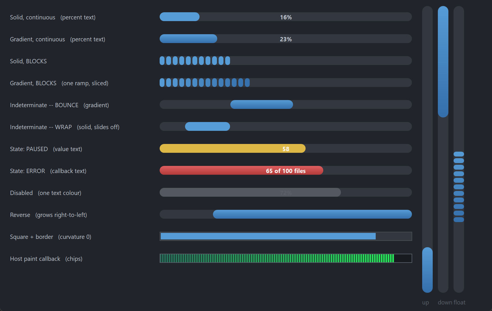

# PsProgressBar

An owner-drawn progress bar for FreeBASIC / Win32, built on the AfxNova framework.

A rounded track with a fill that grows along it. The fill can be a flat colour or a two-stop
linear gradient, and it can be continuous or broken into blocks — those two settings are
independent, so all four combinations are available. When there is nothing to measure, switch it
to indeterminate mode and a chunk floats back and forth inside the track (or slides off one end
and in at the other, if you prefer the classic Windows marquee).

It covers what a standard Win32 progress bar does — range, position, step, marquee, and the
normal / paused / error states of `PBM_SETSTATE` — and adds gradients, blocks, an optional
percentage or caption drawn across the bar in two colours split at the fill boundary, and a
vertical orientation.

It is **display-only**. It takes no focus, no mouse capture and no keyboard, and it never reacts
to a click. Every message it receives is offered to your message callback, so anything
interactive — click-to-cancel being the obvious case — is yours to add.

Repository: <https://github.com/PaulSquires/PsProgressBar>

---

## What it looks like



---

## Requirements

Copy these files into your project:

| File | Purpose |
|---|---|
| `PsProgressBar.bi` | Public surface, state type, layout |
| `PsProgressBar.inc` | Implementation |
| `PsBufferPaint.bi` | Flicker-free drawing surface (header) |
| `PsBufferPaint.inc` | Flicker-free drawing surface (implementation) |
| `PsTipHost.bi` / `PsTipHost.inc` | The tooltip backend switch — see *Tooltips: two backends* |
| `PsTooltip.bi` / `PsTooltip.inc` | The owner-drawn tooltip. Required even if you never switch to it: `PsTipHost.inc` includes it. |

`PsProgressBar.bi` includes `PsBufferPaint.bi` and `PsTipHost.bi` itself, and
`PsProgressBar.inc` includes `PsTipHost.inc` (which in turn includes `PsTooltip.inc`), so the
extra files cost you no include lines — they only have to be present.

### Include order

Headers first, implementations after your globals — the same order `main.bas` uses:

```freebasic
#include once "windows.bi"
#include once "AfxNova\CWindow.inc"
#include once "AfxNova\AfxStr.inc"
#include once "AfxNova\AfxGdiplus.inc"

using AfxNova

' ... your fonts, theme and other globals here ...

#include once "PsBufferPaint.inc"
#include once "PsProgressBar.inc"
```

Your sources reference AfxNova as `AfxNova\...`, i.e. relative to the workspace root, so the
compiler needs that root on its include path:

```bash
fbc64.exe -i "C:\dev" -w all main.bas main.rc
```

### GDI+ must be running

All geometry is drawn through GDI+, and the gradient fills are GDI+ linear-gradient brushes.
Initialise it before the first repaint and shut it down only after every window is destroyed:

```freebasic
CoInitialize(null)
dim as ULONG_PTR gdipToken = AfxGdipInit()

function = frmMain_Show( 0 )

AfxGdipShutdown( gdipToken )   ' before CoUninitialize -- GDI+ leans on COM
CoUninitialize
```

Without this the control draws nothing at all.

### Do not name anything `ok`

GDI+ defines `Ok = 0` as a `Status` enum value that lands at global scope, and FreeBASIC
identifiers are case-insensitive. Any variable or parameter of yours named `ok`, `Ok` or `OK`
becomes a duplicate definition the moment you include `PsBufferPaint.bi`. Dropping
`using AfxNova` does not help. Use `bOK`.

### There is no pump obligation

**PsProgressBar has no `PsProgressBar_FilterMessage`, and needs no call in your message loop.**
If you are coming from a neighbouring control you will look for one — there isn't one. The
marquee animation runs on a `WM_TIMER`, and neither tooltip backend needs your loop: the system
tip subclasses the control itself (`TTF_SUBCLASS`) and PsTooltip has no `FilterMessage` at all.
Switching backends therefore adds no pump obligation either.

Nor does it need `IsDialogMessage`: it takes no focus and is not a tab stop.

```freebasic
do while GetMessage(@uMsg, null, 0, 0)
    if uMsg.message = WM_QUIT then exit do
    TranslateMessage @uMsg
    DispatchMessage @uMsg
loop
```

---

## Quick start

```freebasic
' Create it, place it, show it. Orientation is chosen here and cannot change later.
dim as HWND hBar = PsProgressBar_Create( hWndParent, IDC_MYBAR, PRG_HORIZONTAL )

PsProgressBar_SetRange( hBar, 0, 100 )
PsProgressBar_SetPos( hBar, 45 )

' A vertical gradient across a horizontal bar gives a glossy top-to-bottom sheen.
PsProgressBar_SetFillStyle( hBar, PRG_FILL_GRADIENT )

' Optional: write the percentage across the bar. The font is yours -- the control
' borrows the handle and never destroys it.
PsProgressBar_SetFont( hBar, ghFont(GUIFONTBOLD_9) )
PsProgressBar_SetTextMode( hBar, PRG_TEXT_PERCENT )

PsProgressBar_SetMessageCallback( hBar, @MyBar_MessageCallback )

SetWindowPos( hBar, 0, 20, 20, 320, 18, SWP_NOZORDER )
ShowWindow( hBar, SW_SHOW )
```

The message callback — the only place this control can be made interactive:

```freebasic
function MyBar_MessageCallback( byval m as PSPROGRESSBAR_MESSAGEINFO ptr ) as boolean
    select case m->uMsg
    case WM_LBUTTONUP
        ' The control will never act on this itself.
        MyCancelTheJob()
    end select
    return false        ' let the control's default handling proceed
end function
```

To drive it while work happens, call `PsProgressBar_SetPos` (or `PsProgressBar_StepIt`) as the
work progresses. The bar moves immediately — it does not ease toward the new value.

---

## Concepts

### The handle is a real `HWND`

`PsProgressBar_Create` returns an ordinary window handle, not an opaque type, so you place and
size the control with `SetWindowPos` / `MoveWindow` like any other child window. Every
`PsProgressBar_*` function takes that handle.

The control frees itself when its window is destroyed, and destroys its own tooltip window with
it. It does not own the font you give it.

### Orientation is fixed at creation

Pass `PRG_HORIZONTAL` or `PRG_VERTICAL` to `PsProgressBar_Create`. It cannot change afterwards;
`PsProgressBar_GetOrientation` reads it back. A vertical bar fills **bottom-up** by default.

`PsProgressBar_SetReverse` mirrors the growth direction on whichever axis is in use: a horizontal
bar grows right-to-left, a vertical bar grows top-down.

### Three rects, all derived

You never set the control's geometry directly. It derives three rects from the client area and
your settings, and recomputes them lazily — a setter marks the layout stale, and the next repaint
(or the next rect query) rebuilds it.

```
rcTrack   spans the client along the growth axis;
          nThickness deep across it, centred on that axis.
          nThickness = 0 (the default) means "fill the client".

rcFill    rcTrack deflated by nBarInset on all four sides.
          This is where a 100% bar reaches.

rcBar     the drawn portion.
            determinate    anchored to rcFill's start edge,
                           length = (pos - min) / (max - min) * fill length
            indeterminate  a chunk of nChunkPercent of the fill, floating
                           at whatever offset the marquee gives for the
                           current tick. NOT anchored to either end.
```

Read them with `PsProgressBar_GetTrackRect`, `GetFillRect` and `GetBarRect`. All three are in
client coordinates.

If the client is smaller than the settings ask for, the rects are computed honestly and the
overflow is clipped — the track keeps its proper shape rather than being squeezed into a
different one.

### Everything is silent

There is no change callback of any kind. A progress bar's position is only ever set
programmatically, so there is nothing a user did that you would need telling about. Set the
position and the bar repaints; that is the whole contract.

### The position jumps, it does not animate

`PsProgressBar_SetPos` moves the bar immediately. Windows' own common control eases toward the
new value; this one does not, which means the control runs a timer **only** in indeterminate
mode. A determinate bar costs nothing between repaints.

If you want smooth motion, drive the position from your own timer.

### Text is drawn twice

When a text mode is set, the string is drawn centred on `rcTrack` in **two clipped passes over
the same rectangle**: the part lying over the filled bar takes `TextColorOnBar`, the part over
the empty track takes `TextColor`. Because both passes use the identical rect, the glyphs land
in the same place and only the colour changes at the fill boundary — including part-way through
a single glyph.

A disabled bar draws the text once, in `TextColorDisabled`.

---

## Behaviour and limits

- **Orientation cannot change after creation.** Create a second control if you need both.
- **Vertical bars draw their text horizontally.** The string is not rotated, so a text mode on a
  narrow vertical bar will clip. Leave it at `PRG_TEXT_NONE`.
- **`PsProgressBar_StepIt` clamps at the maximum; it does not wrap.** Windows' `PBM_STEPIT` wraps
  around to the minimum, which makes a finished job look restarted.
- **An empty or inverted range draws an empty bar** rather than dividing by zero.
  `PsProgressBar_SetRange` normalises an inverted pair and pulls the position into the new range.
- **In indeterminate mode the position means nothing.** It is still stored and still readable, but
  nothing draws from it until you switch back.
- **The marquee animates only while the control is enabled and not hidden.** Disabling it or
  hiding it stops the timer; re-enabling or re-showing restarts it.
- **Blocks inherit the track's curvature.** At the default stadium setting each block is drawn as
  a small capsule rather than a rectangle, because the curvature is clamped to half the block's
  own shorter side. Call `PsProgressBar_SetCurvature( hBar, 0 )` for square blocks, or a small
  value such as 3 for softened ones.
- **`PRG_MARQUEE_WRAP` clips its chunk at the track edges.** That is what makes it slide in and
  out rather than snap, so the visible chunk is narrower during the transition. `PRG_MARQUEE_BOUNCE`
  never clips — the chunk keeps one width throughout.
- **At curvature 0 with no track border, the fill leaves a one-pixel seam** down its right edge and
  along its bottom. This is the rounded-rectangle fill convention the drawing layer uses
  throughout, matched to what GDI's `RoundRect` covers. Any curvature above 0 hides it behind the
  end caps, and a track border of 1 or more covers it.
- **`PsProgressBar_SetFont` borrows the handle.** The control never creates or destroys a font;
  yours must outlive the control.
- **There is no `PsProgressBar_HitTest`.** The whole client is the same inert surface.
- **No accessibility support.** The control does not expose itself to screen readers.

---

## API reference

### Creation and lifetime

| Function | Behaviour |
|---|---|
| `PsProgressBar_Create( hWndParent, CtrlID, nOrientation = PRG_HORIZONTAL ) as HWND` | Creates the control as a child of `hWndParent` at 0,0,0,0 — place it yourself. Orientation is fixed here; an unrecognised value falls back to `PRG_HORIZONTAL`. Returns the control's `HWND`. |
| `PsProgressBar_GetOrientation( hProgressBar ) as long` | `PRG_HORIZONTAL` or `PRG_VERTICAL`. |
| `PsProgressBar_Refresh( hProgressBar )` | Marks the layout stale and repaints with a background erase. You rarely need this — every setter does it. |

### Range and position

Every function in this group is silent: none of them fires a callback.

| Function | Behaviour |
|---|---|
| `PsProgressBar_GetRange( hProgressBar, byref nMin, byref nMax )` | Reads the current range. |
| `PsProgressBar_SetRange( hProgressBar, nMin, nMax )` | Sets the range. An inverted pair is normalised (swapped), and the current position is clamped into the result. |
| `PsProgressBar_GetPos( hProgressBar ) as long` | The current position. |
| `PsProgressBar_SetPos( hProgressBar, nPos )` | Clamps to the range. Repaints only if the value actually changed. |
| `PsProgressBar_GetStep( hProgressBar ) as long` | The `StepIt` increment. Default 10. |
| `PsProgressBar_SetStep( hProgressBar, nStep )` | Sets the increment. Does not repaint — nothing visible changed. |
| `PsProgressBar_StepIt( hProgressBar ) as long` | Advances by the step and returns the new position. **Clamps at the maximum; does not wrap.** |
| `PsProgressBar_DeltaPos( hProgressBar, nDelta ) as long` | Advances by `nDelta` (negative is fine) and returns the new position. Clamps. |
| `PsProgressBar_GetPercent( hProgressBar ) as long` | The position as a whole-number percentage, 0..100. Answers 0 for an empty range. |

### Mode and state

| Function | Behaviour |
|---|---|
| `PsProgressBar_GetMode( hProgressBar ) as long` | `PRG_MODE_DETERMINATE` or `PRG_MODE_INDETERMINATE`. |
| `PsProgressBar_SetMode( hProgressBar, nMode )` | Switches mode. Entering or leaving indeterminate resets the animation to its start, and starts or stops the timer. An unrecognised value is treated as determinate. |
| `PsProgressBar_GetState( hProgressBar ) as long` | `PRG_STATE_NORMAL`, `PRG_STATE_PAUSED` or `PRG_STATE_ERROR`. |
| `PsProgressBar_SetState( hProgressBar, nState )` | Swaps the bar's colour pair. An unrecognised value falls back to `PRG_STATE_NORMAL`. Repaints without re-laying out — no geometry changed. |
| `PsProgressBar_GetEnabled( hProgressBar ) as boolean` | Whether the control is enabled. |
| `PsProgressBar_SetEnabled( hProgressBar, isEnabled )` | Goes through `EnableWindow`, so the disable is enforced by the system. Switches to the disabled colours and stops the marquee. |

### Marquee (indeterminate mode)

Setting any of these while in determinate mode is legal and simply has no visible effect until
you switch.

| Function | Behaviour |
|---|---|
| `PsProgressBar_GetMarqueeStyle( hProgressBar ) as long` | `PRG_MARQUEE_BOUNCE` or `PRG_MARQUEE_WRAP`. |
| `PsProgressBar_SetMarqueeStyle( hProgressBar, nStyle )` | Sets the motion. Resets the animation to its start. An unrecognised value is treated as `PRG_MARQUEE_BOUNCE`. |
| `PsProgressBar_GetMarqueeSpeed( hProgressBar, byref nIntervalMs, byref nStepPx )` | The timer interval and the pixels moved per tick. |
| `PsProgressBar_SetMarqueeSpeed( hProgressBar, nIntervalMs, nStepPx )` | Values of 0 or less are ignored, leaving that setting unchanged. Restarts a running timer so a new interval takes effect immediately. |
| `PsProgressBar_GetMarqueeChunkPercent( hProgressBar ) as long` | The chunk's length as a percentage of the track. |
| `PsProgressBar_SetMarqueeChunkPercent( hProgressBar, nPercent )` | Clamped to 1..100. |

### Fill style and segmentation

These two settings are independent — every combination of them is legal.

| Function | Behaviour |
|---|---|
| `PsProgressBar_GetFillStyle( hProgressBar ) as long` | `PRG_FILL_SOLID` or `PRG_FILL_GRADIENT`. |
| `PsProgressBar_SetFillStyle( hProgressBar, nFillStyle )` | Anything other than `PRG_FILL_GRADIENT` is treated as solid. A solid fill uses only the *start* colour of the state's pair. |
| `PsProgressBar_GetGradientMode( hProgressBar ) as long` | The `LinearGradientMode` the ramp runs along. |
| `PsProgressBar_SetGradientMode( hProgressBar, nMode )` | `LinearGradientModeHorizontal` / `Vertical` / `ForwardDiagonal` / `BackwardDiagonal`. Out-of-range values fall back to `Vertical`. |
| `PsProgressBar_GetSegmented( hProgressBar ) as boolean` | Whether the bar is drawn as blocks. |
| `PsProgressBar_SetSegmented( hProgressBar, isSegmented )` | Turns block mode on or off. With a gradient fill, each block takes its slice of one ramp spanning the whole bar, so the blocks read as a single perforated run. |
| `PsProgressBar_GetBlockMetrics( hProgressBar, byref nBlockLen, byref nBlockGap )` | Block length and the gap between blocks, in pixels. |
| `PsProgressBar_SetBlockMetrics( hProgressBar, nBlockLen, nBlockGap )` | A length of 0 or less is ignored; a negative gap is ignored. Values are raw pixels — scale them yourself. |
| `PsProgressBar_GetBlockCount( hProgressBar ) as long` | How many blocks are **currently drawn**. Answers 0 when not segmented. Note this counts the blocks in the bar, not the slots in the track — in indeterminate mode the blocks tile the floating chunk. |
| `PsProgressBar_GetBlockRect( hProgressBar, idx, byref rc ) as boolean` | The `idx`-th drawn block, in client coordinates. Returns FALSE for a negative index, an index past the last drawn block, or a control that is not segmented. |

### Geometry and chrome

Setters here take **raw pixels**. Only the creation-time defaults are DPI-scaled for you; scale
your own values with `CWindow::ScaleX` / `ScaleY`.

| Function | Behaviour |
|---|---|
| `PsProgressBar_GetThickness( hProgressBar ) as long` | The track's depth across the growth axis. |
| `PsProgressBar_SetThickness( hProgressBar, nThickness )` | 0 (the default) means fill the client. A value larger than the client is treated as 0. Negatives clamp to 0. |
| `PsProgressBar_GetBarInset( hProgressBar ) as long` | The gap between the track edge and the bar. |
| `PsProgressBar_SetBarInset( hProgressBar, nBarInset )` | Deflates the fill area on all four sides. Negatives clamp to 0. An inset larger than half the track collapses the fill to empty rather than inverting it. |
| `PsProgressBar_GetBorderThickness( hProgressBar ) as long` | The track outline's thickness. 0 (the default) means no outline. |
| `PsProgressBar_SetBorderThickness( hProgressBar, nThickness )` | Negatives clamp to 0. **Not** DPI-scaled — a hairline stays a hairline. |
| `PsProgressBar_GetCurvature( hProgressBar ) as long` | The corner ellipse diameter, or `PSPROGRESSBAR_CURVATURE_STADIUM` (-1). |
| `PsProgressBar_SetCurvature( hProgressBar, nCurvature )` | 0 gives square corners. **Any** negative value normalises to the stadium sentinel, which makes both ends exact semicircles whatever the track's thickness. Not DPI-scaled. |
| `PsProgressBar_GetReverse( hProgressBar ) as boolean` | Whether the growth direction is mirrored. |
| `PsProgressBar_SetReverse( hProgressBar, isReverse )` | Horizontal bars grow right-to-left; vertical bars grow top-down. |
| `PsProgressBar_GetTrackRect( hProgressBar, byref rc ) as boolean` | The groove, in client coordinates. Runs a pending layout first. |
| `PsProgressBar_GetFillRect( hProgressBar, byref rc ) as boolean` | Where a 100% bar reaches. |
| `PsProgressBar_GetBarRect( hProgressBar, byref rc ) as boolean` | The drawn portion. In indeterminate mode this is the floating chunk. |

### Text

| Function | Behaviour |
|---|---|
| `PsProgressBar_GetTextMode( hProgressBar ) as long` | One of the `PRG_TEXT_*` values. |
| `PsProgressBar_SetTextMode( hProgressBar, nTextMode )` | Out-of-range values fall back to `PRG_TEXT_NONE`. |
| `PsProgressBar_GetFont( hProgressBar ) as HFONT` | The borrowed font handle, or 0. |
| `PsProgressBar_SetFont( hProgressBar, hFont )` | Borrows the handle — you keep ownership and must outlive the control. Passing 0 falls back to the device context's own font. |
| `PsProgressBar_GetDisplayText( hProgressBar ) as DWSTRING` | Exactly what would be drawn right now, with the mode and any callback already applied. `""` when nothing would be drawn. |

### Colors

| Function | Behaviour |
|---|---|
| `PsProgressBar_GetColors( hProgressBar, pColors )` | Copies the current colours into your `PSPROGRESSBAR_COLORS`. |
| `PsProgressBar_SetColors( hProgressBar, pColors )` | Copies yours in and repaints. Read-modify-write: get, change the fields you care about, set. |
| `PsProgressBar_ResolveBarColors( hProgressBar, byref clr1, byref clr2 )` | The two bar stops the control would use right now, with the state-and-enabled precedence already applied. Useful from a paint callback that wants to match. |

### Tooltips

| Function | Behaviour |
|---|---|
| `PsProgressBar_GetTooltipText( hProgressBar ) as DWSTRING` | The authored tip text, or `""`. |
| `PsProgressBar_SetTooltipText( hProgressBar, Text )` | Sets static tip text. When this is non-empty the tooltip callback is not consulted. |
| `PsProgressBar_GetTooltipHandle( hProgressBar ) as HWND` | The **comctl32** tooltip window, for any `TTM_*` message you want to send it yourself. The control owns it and destroys it. Returns **0** while this control is on the PsTooltip backend — the honest answer, since a `TTM_*` sent to a PsTooltip window is silently ignored. |
| `PsProgressBar_GetPsTooltipHandle( hProgressBar ) as HWND` | The **PsTooltip** window, or 0 while on the system backend. The door to `PsTooltip_SetColors` / `SetFonts` / `SetStyle` / `SetMaxWidth` / `SetTitle` / `SetGlyph` — none of which is mirrored here. |
| `PsProgressBar_SetTooltipMode( hProgressBar, nMode ) as boolean` | `PSTIP_MODE_SYSTEM` (default) or `PSTIP_MODE_PS`. Returns TRUE if the requested backend is live on return. See below. |
| `PsProgressBar_GetTooltipMode( hProgressBar ) as long` | Which backend is live. |
| `PsProgressBar_SetHoverTime( hProgressBar, milliseconds )` | Initial delay (`TTDT_INITIAL`) — how long the cursor must rest. Honoured by **both** backends. |
| `PsProgressBar_SetAutoPopTime( hProgressBar, milliseconds )` | How long the tip stays up (`TTDT_AUTOPOP`). |
| `PsProgressBar_SetReshowTime( hProgressBar, milliseconds )` | The shorter delay after a tip was recently dismissed (`TTDT_RESHOW`). |

#### Tooltips: two backends

The control ships on the **system** (comctl32) tooltip. `PSTIP_MODE_PS` switches this instance
to **PsTooltip**: owner-drawn, themeable, word-wrapping without a hand-sent
`TTM_SETMAXTIPWIDTH`, and — the one that matters structurally — **not a subclass of the control
it serves**. Either way the control adds **no pump obligation**: PsTooltip has no
`FilterMessage`.

The default is deliberate, not caution. PsTooltip's colour defaults are **dark**, so a control
that switched itself would put a dark tip on a light form. Theme every tip in the process with
`PsTooltip_SetDefaultColors` and friends, then opt in per instance.

**The mode changes how a tip is drawn, never what it says.** Both backends resolve text through
the same rule — this control's own text first, then `PRG_TooltipCallbackFunc`, then nothing.

The three delay setters are the control's only ones; before them a tip ran at whatever the
backend derived and there was no way to say otherwise. A delay you set is **stored as well as
pushed**, so it survives a switch in either direction. A delay you never set keeps the backend's
own derivation from the system double-click time, which is what makes a tip appear on the same
beat as every other tip on the machine.

```freebasic
PsTooltip_SetDefaultColors( @myTipColors )     ' once, at startup, for every tip in the process
PsTooltip_SetDefaultFonts( ghFontUI )

PsProgressBar_SetTooltipMode( hBar, PSTIP_MODE_PS )
PsProgressBar_SetHoverTime( hBar, 400 )
dim as HWND hTip = PsProgressBar_GetPsTooltipHandle( hBar )
if hTip then PsTooltip_SetTitle( hTip, "Copying files" )   ' not reachable on the system backend
```

### Callback registration

| Function | Behaviour |
|---|---|
| `PsProgressBar_SetPaintCallback( hProgressBar, usersub )` | Replaces the built-in painter entirely. Pass 0 to restore it. |
| `PsProgressBar_SetMessageCallback( hProgressBar, userfunc )` | Observe or suppress messages. |
| `PsProgressBar_SetTooltipCallback( hProgressBar, userfunc )` | Supply tip text on demand. |
| `PsProgressBar_SetTextCallback( hProgressBar, userfunc )` | Supply the bar's caption. Only consulted in `PRG_TEXT_CALLBACK` mode. |

### Render probes

These render the control offscreen and measure the result. They exist so that a host supplying
its own paint callback can assert it has not accidentally erased the control — the standing
hazard described under [Callbacks](#callbacks).

| Function | Behaviour |
|---|---|
| `PsProgressBar_CountRenderedTones( hProgressBar, nPart ) as long` | Distinct colours inside `nPart`'s rect. A part wiped by a filling call scores **1**, so the signal to look for is the count leaving 1 — not the count being large. Returns 0 if the control has no geometry yet. |
| `PsProgressBar_HashRenderedPart( hProgressBar, nPart ) as ulong` | An FNV-1a hash of the same pixels. Compare two hashes of the same part in two different states: equal means the state change never reached the surface. It can only prove difference, never correctness — and it proves difference for *any* reason, so isolate the change you are testing. |

### Pure functions

These take no window and touch no state. They are the arithmetic the control itself uses, exposed
so you can predict or reproduce it.

| Function | Behaviour |
|---|---|
| `PsProgressBar_ComputeBarLength( nPos, nMin, nMax, nTrackLen ) as long` | Bar length for a determinate position. Clamps `nPos` into the range; answers 0 for an empty or inverted range, or a track of zero length. Safe against overflow on very large ranges. |
| `PsProgressBar_ComputeMarqueeOffset( nTrackLen, nChunkLen, nStep, nTick, nStyle ) as long` | The chunk's leading edge at tick `nTick`, as an offset from the start of the track. **The two styles have different ranges** — see below. Negative ticks are handled. A step of 0 or less is treated as 1. |
| `PsProgressBar_ComputeBlockCount( nLength, nBlockLen, nBlockGap ) as long` | How many whole blocks fit in `nLength`. The last block needs no trailing gap. Answers 0 for a zero block length or a length shorter than one block. |

`PsProgressBar_ComputeMarqueeOffset`'s two ranges:

| Style | Range | Shape |
|---|---|---|
| `PRG_MARQUEE_BOUNCE` | `0 .. nTrackLen - nChunkLen` | Triangle wave. The chunk never leaves the track, so nothing is clipped. The period is **twice** the span — out and back. |
| `PRG_MARQUEE_WRAP` | `-nChunkLen .. nTrackLen` | Sawtooth. It goes **negative on purpose**, which is what makes the chunk slide in from one edge and out of the other. The caller must clip the resulting rect to the track; the control does. |

---

## Colors

`PSPROGRESSBAR_COLORS` is a flat struct of `COLORREF` fields, all with defaults. Read-modify-write:

```freebasic
dim as PSPROGRESSBAR_COLORS clrs
PsProgressBar_GetColors( hBar, @clrs )
clrs.BarColor    = BGR( 62,140, 90)
clrs.BarColorEnd = BGR( 40,100, 62)
PsProgressBar_SetColors( hBar, @clrs )
```

| Field | Paints | When |
|---|---|---|
| `BackColor` | The control's own background, behind the track | Always |
| `TrackColor` | The groove | Always |
| `TrackBorderColor` | The groove's outline | Only when `SetBorderThickness` is 1 or more |
| `BarColor` | The bar's first gradient stop | Enabled, `PRG_STATE_NORMAL` |
| `BarColorEnd` | The bar's second stop | As above, and only with `PRG_FILL_GRADIENT` |
| `BarColorPaused` | First stop | Enabled, `PRG_STATE_PAUSED` |
| `BarColorPausedEnd` | Second stop | As above, gradient only |
| `BarColorError` | First stop | Enabled, `PRG_STATE_ERROR` |
| `BarColorErrorEnd` | Second stop | As above, gradient only |
| `BarColorDisabled` | First stop | Disabled, whatever the state |
| `BarColorDisabledEnd` | Second stop | As above, gradient only |
| `TextColor` | The caption where it lies over the **empty** track | Enabled, and a text mode is set |
| `TextColorOnBar` | The caption where it lies over the **filled** bar | Enabled, and a text mode is set |
| `TextColorDisabled` | The whole caption, in one colour | Disabled |

**Bar colour precedence:** `disabled > PRG_STATE_ERROR > PRG_STATE_PAUSED > PRG_STATE_NORMAL`.
Disabled wins outright — a paused-and-disabled bar draws grey, not yellow.

With `PRG_FILL_SOLID` only the first stop of the chosen pair is used; the `*End` field is ignored.
That means one set of colours serves both fill styles and switching between them needs no changes.

---

## Callbacks

### Paint

```freebasic
type PRG_PaintCallbackSub as sub( byval p as PSPROGRESSBAR_PAINTINFO ptr )
```

Replaces the built-in painter entirely. Draw through `p->b` — the control's double buffer for
this repaint — and never touch the screen DC. The client has already been filled with `BackColor`
before you are called, so a callback that only adds something on top does not have to repaint the
background.

> **A callback that fills a rectangle covering the whole control erases everything already drawn.**
> `PsBufferPaint`'s `PaintBorderRect` and `PaintRoundBorderRect` **fill before they stroke**, so
> using either as a frame over your own drawing wipes it out. Use `PaintRoundOutline`, which
> strokes only. `PsProgressBar_CountRenderedTones` exists so you can assert you have not done this.

### `PSPROGRESSBAR_PAINTINFO`

| Field | Meaning |
|---|---|
| `hProgressBar` | The control, so the callback can query it |
| `b` | The `PsBufferPaint` for this repaint — a pointer, not a copy |
| `rcClient` | The whole client area |
| `rcTrack` | The groove |
| `rcFill` | Where a 100% bar reaches |
| `rcBar` | The drawn portion. In indeterminate mode, the floating chunk — not anchored to either end |
| `nPos` | Current position |
| `nMin` | Range minimum |
| `nMax` | Range maximum |
| `nPercent` | 0..100, already clamped; 0 when the range is empty |
| `isIndeterminate` | TRUE in indeterminate mode, where `nPos` means nothing |
| `isEnabled` | Draw the disabled look when FALSE |
| `isReverse` | The bar grows from the right, or from the top |
| `isSegmented` | Block mode is on |
| `nOrientation` | `PRG_HORIZONTAL` or `PRG_VERTICAL` |
| `nState` | `PRG_STATE_*` |
| `nFillStyle` | `PRG_FILL_*` |
| `nCurvature` | Already resolved — the stadium sentinel never reaches a callback |
| `nBlockLength` | Block length as drawn |
| `nBlockGap` | Block gap as drawn |
| `wszText` | The caption, mode and callback already applied. `""` means draw nothing |

### Message

```freebasic
type PRG_MessageCallbackFunc as function( byval m as PSPROGRESSBAR_MESSAGEINFO ptr ) as boolean
```

Return TRUE if you handled the message and want the control's default handling suppressed, FALSE
to let it proceed.

**Every message is offered and every answer is honoured, with one exception:** `WM_DESTROY` and
`WM_NCDESTROY` are never offered at all. They free the control's state and its tooltip window, and
a callback suppressing either would leak both.

There are no other exemptions. Controls that take mouse capture have to ignore your answer for the
button-up messages, or a callback could strand the capture; this control takes no capture, has no
press gesture and no focus, so everything it offers you is genuinely suppressible. This is also
the only place the control can be made interactive, since it never acts on a click itself.

### `PSPROGRESSBAR_MESSAGEINFO`

| Field | Meaning |
|---|---|
| `hProgressBar` | The control |
| `uMsg` | The message |
| `wParam` | Its `wParam` |
| `lParam` | Its `lParam` |

### Tooltip

```freebasic
type PRG_TooltipCallbackFunc as function( byval hProgressBar as HWND ) as DWSTRING
```

Called only when a tip is about to show, and only when the control has no tooltip text of its own.
Return `""` for no tooltip. There is no fallback to the displayed percentage — a bar with neither
authored text nor a callback answer shows nothing.

### Text

```freebasic
type PRG_TextCallbackFunc as function( byval hProgressBar as HWND, _
                                       byval nPos as long, _
                                       byval nMin as long, _
                                       byval nMax as long ) as DWSTRING
```

Consulted only in `PRG_TEXT_CALLBACK` mode, and called on **every repaint** — keep it cheap, and
do not create windows in it. Returning `""` draws nothing. If the mode is set but no callback is
installed, nothing is drawn.

---

## Constants

### Orientation — fixed at creation

| Value | Meaning |
|---|---|
| `PRG_HORIZONTAL` | Grows left-to-right (right-to-left when reversed) |
| `PRG_VERTICAL` | Grows bottom-up (top-down when reversed) |

### Mode

| Value | Meaning |
|---|---|
| `PRG_MODE_DETERMINATE` | The position drives the bar |
| `PRG_MODE_INDETERMINATE` | A chunk floats; the position is ignored |

### Marquee style

| Value | Meaning |
|---|---|
| `PRG_MARQUEE_BOUNCE` | Ping-pongs off both ends. The default |
| `PRG_MARQUEE_WRAP` | Slides off one end and in at the other |

### Fill style

| Value | Meaning |
|---|---|
| `PRG_FILL_SOLID` | Flat colour, using the state's first stop only |
| `PRG_FILL_GRADIENT` | Two-stop linear gradient |

### State

| Value | Meaning |
|---|---|
| `PRG_STATE_NORMAL` | The normal colour pair |
| `PRG_STATE_PAUSED` | The paused pair |
| `PRG_STATE_ERROR` | The error pair |

### Text mode

| Value | Draws |
|---|---|
| `PRG_TEXT_NONE` | Nothing. The default |
| `PRG_TEXT_PERCENT` | `"45%"` — the position as a percentage of the range |
| `PRG_TEXT_VALUE` | `"45"` — the raw position |
| `PRG_TEXT_CALLBACK` | Whatever `PRG_TextCallbackFunc` returns |

### Probe parts

| Value | Rect measured |
|---|---|
| `PRG_PART_CONTROL` | The whole client |
| `PRG_PART_TRACK` | The groove |
| `PRG_PART_BAR` | The drawn bar |
| `PRG_PART_TEXT` | The middle third of the track, where a centred caption lands |

### Defaults

| Constant | Value | DPI-scaled at creation |
|---|---|---|
| `PSPROGRESSBAR_DEFAULT_THICKNESS` | 0 (fill the client) | yes |
| `PSPROGRESSBAR_DEFAULT_BARINSET` | 0 | yes |
| `PSPROGRESSBAR_DEFAULT_BORDERTHICK` | 0 (no outline) | **no** |
| `PSPROGRESSBAR_DEFAULT_CURVATURE` | -1 (stadium) | **no** |
| `PSPROGRESSBAR_DEFAULT_BLOCKLEN` | 10 | yes |
| `PSPROGRESSBAR_DEFAULT_BLOCKGAP` | 3 | yes |
| `PSPROGRESSBAR_DEFAULT_MARQUEE_MS` | 30 | n/a |
| `PSPROGRESSBAR_DEFAULT_MARQUEE_STEP` | 2 | yes |
| `PSPROGRESSBAR_DEFAULT_CHUNK_PCT` | 25 | n/a |
| `PSPROGRESSBAR_CURVATURE_STADIUM` | -1 | n/a |

The range defaults to 0..100, the position to 0, and the step to 10.

## Licence

[Mozilla Public License 2.0](LICENSE).

MPL-2.0 is file-level copyleft, chosen deliberately for a drop-in control:

- **You may use this in closed-source software**, commercial or otherwise.
  §3.2 permits static linking with no additional conditions.
- **If you modify these files, publish those files' changes.** The obligation is
  per-file — your own sources are unaffected however tightly they are combined
  with these.
- The Exhibit B "Incompatible With Secondary Licenses" notice is **not applied**,
  which keeps this GPL-compatible.
