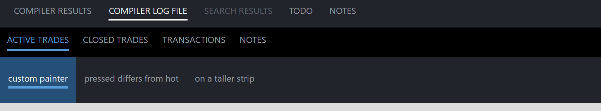

# PsSelectBar

An owner-drawn select bar for FreeBASIC Win32 applications: a flat row of text labels where
exactly one is current, marked by a coloured line drawn under the word.

It is the control you reach for above a results pane or a detail view — the widget that reads
as a set of view choices rather than as tabs. There is no tab chrome, no close button, no
reordering and no scrolling. It draws itself entirely; nothing about its appearance depends on
the visual style the user happens to be running, and every colour it paints is one you can set.
Any number of instances can coexist, each owning all of its own state.

**The panel set is static by contract.** Panels are added once, when you build the bar, and are
never inserted, deleted or moved afterwards — there is no `InsertPanel` and no `DeletePanel`.
`PsSelectBar_Clear` exists as a full-rebuild escape hatch (re-localising the labels, say), not as
a runtime editing tool. If you need a bar whose panels come and go while the user watches, this
is the wrong control.

Clicking a panel never moves the keyboard focus. The bar is mouse-only: it is not a tabstop, it
takes no focus and handles no keys, so a host's editor keeps the caret while the user switches
views.

---

## What it looks like



Three bars: the Output-panel style with one current entry underlined, a blue-accent variant, and a taller strip drawn by a host paint callback. Exactly one entry is always current — the control refuses to have none. The indicator spans the **text**, not the padded cell, and text plus gap plus rule are centred as a block. Cropped below the bars.

---

## Requirements

**Files to copy into your project:**

| File | Purpose |
|---|---|
| `PsSelectBar.bi` | Declarations — types, callbacks, constants, function prototypes |
| `PsSelectBar.inc` | Implementation |
| `PsBufferPaint.bi` | The flicker-free drawing surface the control paints through |
| `PsBufferPaint.inc` | Its implementation |
| `PsTipHost.bi` | The tooltip backend switch — declarations |
| `PsTipHost.inc` | Its implementation |
| `PsTooltip.bi` | The owner-drawn tooltip, reachable with `PSTIP_MODE_PS` — declarations |
| `PsTooltip.inc` | Its implementation |

**AfxNova is required.** The control is built on `CWindow` and uses `DWSTRING`, and
`CBufferPaint` draws through `AfxNova\CGdiPlus.inc`. Sources include AfxNova relative to the
workspace root (`#include once "AfxNova\CWindow.inc"`), so builds need the workspace root on the
include path:

```bash
fbc64.exe -i "C:\dev" main.bas
```

**Include order.** `PsSelectBar.inc` pulls in its own `.bi`, which pulls in `PsBufferPaint.bi` and
`PsTipHost.bi`; it also pulls in `PsTipHost.inc` itself, which pulls in `PsTooltip.inc`. So the
four tooltip files must be present on disk, but they need **no include line of their own** — the
host's include list is unchanged:

```freebasic
#include once "windows.bi"
#include once "AfxNova\CWindow.inc"
#include once "AfxNova\AfxStr.inc"
#include once "AfxNova\AfxGdiplus.inc"

using AfxNova

#include once "PsBufferPaint.inc"
#include once "PsSelectBar.inc"
```

**GDI+ must be running before the first repaint and must outlive the last one.** Every repaint
builds and tears down a `PsBufferPaint`, so bracket your message loop:

```freebasic
dim as ULONG_PTR gdipToken = AfxGdipInit()
' ... create windows, run the message loop ...
AfxGdipShutdown( gdipToken )
```

`AfxGdipShutdown` must come after every window is destroyed. If you also use COM, shut GDI+ down
before `CoUninitialize` — GDI+ leans on COM.

**Never name an identifier `ok`.** GDI+ defines `Ok = 0` as a `Status` enum value in namespace
`AfxNova`, and hosts customarily say `using AfxNova`. An existing variable, parameter or
function called `ok` becomes a duplicate definition the moment you adopt these files. Use `bOK`
instead.

**There is no pump obligation.** The control installs no message filter and needs nothing from
your message loop. It is not a tabstop and never takes focus, so `IsDialogMessage` has nothing
to do with it either way.

**You supply the font and you own it.** The control never creates a font; it stores the `HFONT`
you hand `PsSelectBar_SetFont` and uses it both to measure and to draw. Keep it alive for as long
as the control lives, and destroy it yourself afterwards. See *Always set a font* under Concepts
— the measuring pass and the painter disagree if you do not.

---

## Quick start

```freebasic
' Create it. The control is created zero-sized and hidden.
dim as HWND hBar = PsSelectBar_Create( hWndParent, IDC_MYFORM_SELECTBAR )

' The font is both the measuring font and the drawing font. Set it first, so the first
' layout pass measures with the right one.
PsSelectBar_SetFont( hBar, ghFont(GUIFONT_10) )

' Be told when the user switches panels.
PsSelectBar_SetSelChangeCallback( hBar, @MyBar_SelChange )

' Build the bar. The FIRST panel added silently becomes the current one.
dim as long idx
idx = PsSelectBar_AddPanel( hBar, "COMPILER RESULTS", IDP_COMPILER_RESULTS )
PsSelectBar_SetTooltipText( hBar, idx, "Errors and warnings from the last build" )
' Panel 0's own left padding is the bar's lead-in indent; there is no separate property.
PsSelectBar_SetPanelPadding( hBar, idx, pWindow->ScaleX(20), -1 )

PsSelectBar_AddPanel( hBar, "COMPILER LOG FILE", IDP_COMPILER_LOG )

idx = PsSelectBar_AddPanel( hBar, "SEARCH RESULTS", IDP_SEARCH_RESULTS )
PsSelectBar_SetEnabled( hBar, idx, false )      ' nothing searched yet

PsSelectBar_AddPanel( hBar, "TODO", IDP_TODO )
PsSelectBar_AddPanel( hBar, "NOTES", IDP_NOTES )

' Restore the panel the user was last on. This is silent -- the callback does not fire.
PsSelectBar_SetCurSel( hBar, gConfig.OutputPanelIndex )

' Place it. The bar has no opinion about its own size: give it the strip you want.
' PsSelectBar_GetIdealWidth tells you how wide the run of panels is, and is valid here,
' before the control has ever been sized.
SetWindowPos( hBar, 0, x, y, cx, pWindow->ScaleY(44), SWP_NOZORDER )
ShowWindow( hBar, SW_SHOW )
```

And the callback:

```freebasic
sub MyBar_SelChange( byval hBar as HWND, byval idxOld as long, byval idxNew as long )
    ' Fired only for user action. The control's state is already updated, so
    ' PsSelectBar_GetCurSel( hBar ) = idxNew.
    ShowOutputPage( PsSelectBar_GetPanelID( hBar, idxNew ) )
end sub
```

That is the whole minimum. Everything below is refinement.

---

## Concepts

### The handle is a real HWND

`PsSelectBar_Create` returns an ordinary window handle, and every `PsSelectBar_*` function takes
it. It is not an opaque type, so you can treat the control as the window it is — `SetWindowPos`
to place and size it, `ShowWindow` to show it, `GetDlgItem` to find it by the `CtrlID` you passed
at creation.

### It is created zero-sized and hidden

`PsSelectBar_Create` gives the control the styles `WS_CHILD`, `WS_CLIPSIBLINGS` and
`WS_CLIPCHILDREN`, and adds `CS_DBLCLKS` to its window class. `WS_VISIBLE` is deliberately
absent, so a newly created control shows nothing until you size it and call `ShowWindow`. That
lets you build and configure a bar before it is ever seen.

There is no `WS_TABSTOP`, no focus handling and no keyboard handling. The control has no child
windows — the control window *is* the bar, and every panel is drawn in its `WM_PAINT`.

### Model indices

Panels are addressed by **index**, 0-based, in the order you added them. Because the set is
static, an index is stable for the life of the bar. Each panel also carries a host `id` and a
free-form `itemData`; `PsSelectBar_FindPanelByID` maps an id back to an index, which is the lookup
to prefer in a `select case` so that adding a panel at design time does not renumber anything.

### Exactly one panel is always current

The bar has no "nothing selected" state. Three rules hold that invariant:

1. **The first panel added becomes current**, silently, at the only moment the invariant could
   otherwise be violated.
2. **`PsSelectBar_SetCurSel` rejects -1** and rejects a **disabled** panel, returning FALSE and
   changing nothing.
3. **`PsSelectBar_SetEnabled( idx, false )` refuses the current panel**, returning FALSE and
   changing nothing. Switch away first, then disable.

Between them, the current panel always exists and is always enabled, so the indicator is always
somewhere on screen.

The one gap is deliberate: `PsSelectBar_Clear` resets the selection to -1, and the next
`PsSelectBar_AddPanel` re-establishes it. `PsSelectBar_GetCurSel` returns -1 only while the bar is
empty.

### A panel is as wide as its own label

There is no equal-width mode and no auto-sizing to fill the bar. A panel's cell width is:

```
  cellWidth(i) = padLeft(i) + measured text width + padRight(i)
```

`padLeft` and `padRight` come from the bar-wide default (`PsSelectBar_SetPadding`) unless that
panel overrides them (`PsSelectBar_SetPanelPadding`), where **-1 on either side means inherit the
bar's value**.

`PsSelectBar_GetIdealWidth` is the sum of every cell width — what the bar would have to be for
the run to fill it exactly. It does not depend on the client area at all, so it is valid before
the control has ever been sized.

The run always starts at x = 0. There is no separate indent property: the visual indent before
the first label is simply panel 0's left padding.

### The block-centred layout

This is the part that surprises people. The indicator spans the **text**, not the padded cell,
and the thing centred vertically in the client area is **text + gap + line as one unit** — not
the text alone with the line hanging underneath it.

```
  textH     = GetTextMetrics.tmHeight          ONE height for the whole bar
  blockH    = textH + indicatorGap + indicatorThickness
  blockTop  = clientTop + (clientH - blockH) \ 2

  rc(i)          = ( x, clientTop, x + cellWidth(i), clientBottom )    full client height
  rcText(i)      = ( x + padLeft(i), blockTop,
                     x + padLeft(i) + textW(i), blockTop + textH )
  rcIndicator(i) = ( rcText.left,  rcText.bottom + indicatorGap,
                     rcText.right, rcText.bottom + indicatorGap + indicatorThickness )
```

So **the indicator thickness and the indicator gap are layout inputs, not cosmetics**: changing
either moves the text as well as the line. That is what keeps the space above the text and the
space below the line balanced whatever the font, the gap or the thickness do.

`textH` comes from `GetTextMetrics`, once, for the whole bar — not from each label's own extent.
One height means every label sits on the same baseline and every indicator on the same pixel
row; per-panel extents would let an all-uppercase or an empty caption ride up or down relative to
its neighbours and the indicators would visibly stagger.

Note that `rc` spans the **full client height**, so a panel's fill and hit area cover the whole
strip even though its text sits in the centred block.

### Geometry is derived, never assigned

The control computes three rectangles per panel and owns all three. You influence them through
the padding, indicator and font setters; you never write them.

| Rect | What it is |
|---|---|
| `rc` | The full cell, padding included: the **fill** rect and the **hit** rect |
| `rcText` | Exactly the measured text box |
| `rcIndicator` | Spans `rcText` horizontally, sits `indicatorGap` below it |

Layout is lazy. A mutator marks the layout stale and asks for a repaint; the next paint — or any
rect query — recomputes it. There is no begin-update / end-update pair to remember, and a burst
of `PsSelectBar_AddPanel` calls costs one measuring pass, not one per panel.

Every rect query forces a pending layout first, so results are always current. They return TRUE
for any valid index, but the rects stay **empty until the control has a client area**: with a
zero-sized control there is nowhere to place anything, so the layout computes the widths (and
therefore `GetIdealWidth`) and leaves the rects alone.

### Always set a font

`PsSelectBar_SetFont` is not optional in practice. With no font set, the measuring pass falls back
to the stock `DEFAULT_GUI_FONT` while the built-in painter draws with whatever font the drawing
buffer's DC happens to hold — so the measured cell widths and the text actually drawn can
disagree. Set the font once, before or after adding panels; setting it re-lays-out the whole bar,
because it is what the widths and the block height are derived from.

The `HFONT` is borrowed, never owned. Keep it alive, and destroy it yourself.

### Pixels, and who scales them

Only the creation-time defaults are DPI-scaled for you:

| Setting | Default | DPI-scaled at create? |
|---|---:|---|
| Left padding | 12 | Yes |
| Right padding | 12 | Yes |
| Indicator thickness | 2 | Yes |
| Indicator gap | 4 | Yes |

Every setter afterwards takes **raw pixels** and expects you to scale — typically
`pWindow->ScaleX(...)` / `ScaleY(...)`.

### Programmatic changes are silent

`PsSelectBar_SetCurSel` never fires the selection-change callback. That callback reports **user**
action and nothing else, following Win32's own `TCM_SETCURSEL` / `TCN_SELCHANGE` split. It means
you can safely call `PsSelectBar_SetCurSel` from inside your own change handler without recursing.

Clicking the panel that is already current is not a change either, and fires nothing.

### How a click is decided

Pressing the left button over an **enabled** panel takes mouse capture and arms that panel. The
selection moves on **release**, and only if the release lands on the same panel the press started
on. So the standard escape gesture works: press, slide off, release — the selection does not
move.

While a press is live and the cursor has slid outside, the panel stops painting as pressed but
the gesture is not over. Slide back on and it re-arms. Anything that steals capture (a modal
dialog, the shell) cancels the gesture.

Pressing does **not** call `SetFocus`. A select bar must not pull the caret out of the host's
editor.

### Hot tracking

The bar tracks which panel the cursor is over and repaints only the panels whose state changed.
Disabled panels are never hot. Because `WM_MOUSELEAVE` is not reliably delivered when the cursor
exits fast, a 100 ms timer polls the cursor position while the mouse is over the control and
clears the hot panel if it has really gone; the timer runs only while it is needed and is killed
with the window.

### Tooltips

One tooltip tool covers the whole control — the panels are painted rects, not windows — and its
text is resolved on demand for whichever panel is currently hot:

1. the panel's own text, set with `PsSelectBar_SetTooltipText`, if it has any;
2. otherwise `SEL_TooltipCallbackFunc`, if you installed one;
3. otherwise no tip.

There is deliberately no fallback to the panel's caption: the caption is already on screen, so a
tip repeating it is noise. The tooltip window is created with the control and destroyed with it.

There are **two tooltip backends** — the system (comctl32) tip the control has always used, and
the owner-drawn `PsTooltip`. The backend changes how a tip is *drawn*, never what it *says*: the
resolution order above is the same either way. See *Tooltips: two backends* under the API
reference.

### Lifetime

The control frees itself, and its tooltip window, when its window is destroyed. It owns no host
resources: the font stays yours. Destroy the parent and you are done.

---

## Behaviour and limits

Firm properties of the control, not settings:

- **Static by contract.** Panels are added and never inserted, deleted or moved. There is no
  `InsertPanel` and no `DeletePanel`. `PsSelectBar_Clear` tears the whole bar down for a rebuild;
  it is not a runtime editing tool. `PsSelectBar_SetText` and the padding setters *do* re-measure
  and therefore shift every panel to their right — design-time operations, and keeping them out
  of the runtime path is your job.
- **Exactly one panel is always current.** The first panel added auto-selects; `SetCurSel`
  rejects -1 and rejects disabled panels; `SetEnabled(false)` refuses the current panel. The only
  moment `GetCurSel` returns -1 is between `Clear` and the next `AddPanel`.
- **`CS_DBLCLKS` is on, and a double-click delivers a trailing up.** The full sequence a host
  sees is `WM_LBUTTONDOWN, WM_LBUTTONUP, WM_LBUTTONDBLCLK, WM_LBUTTONUP`. The double-click
  message *substitutes for* the second rapid down rather than arriving on top of it, which is why
  the control handles the two identically — a control that ignored the dblclk would drop that
  press, so a quick A → B → A would silently lose a selection change, and the trailing up would
  release a capture that was never taken.

  > **The trap:** if you act on the double-click through the message callback, and your
  > single-click action has a side effect the double-click reverses, you must **consume that
  > trailing up yourself** — a one-shot boolean, not a click timer. Otherwise the up that follows
  > the dblclk re-runs the single-click action and undoes what you just did.

- **Double-clicks are reported, never acted on.** The control's own response to
  `WM_LBUTTONDBLCLK` is exactly its response to a press. Whatever a double-click means in your
  UI, you implement it in the message callback.
- **The right mouse button is reported, never acted on.** A context menu is your business. No
  capture is taken for the right button, so a right-up can arrive without a matching down.
- **No keyboard, no focus, no tabstop.** Arrow-key navigation between panels does not exist, and
  clicking never moves focus.
- **No scrolling and no overflow handling.** When the run of panels is wider than the control,
  the tail simply clips at the client edge. Rects are computed honestly rather than squeezed, so
  hit-testing stays correct: a cell that runs past the edge is unreachable because the
  interaction path also requires the cursor to be inside the client area.
- **No equal-width or fill mode.** Cells are as wide as their own text plus padding.
- **No icons, no close buttons, no reordering, no multi-select.**
- **`PsSelectBar_HitTest` includes disabled panels** and does not require the point to be inside
  the client area. It answers "what geometry is here". The hover and click paths add both extra
  tests themselves, which is why the message callback's `idx` can be -1 where `HitTest` returns a
  panel.
- **A message callback cannot suppress `WM_LBUTTONUP`.** The result is honoured for every
  reported message except that one, where it is ignored — the up-message is what releases mouse
  capture, and a callback that suppressed it would strand the capture and route every later click
  to this control.

  > **A paint callback that fills a rectangle covering the whole control will erase everything
  > under it**, including the panels already drawn in the same pass. Fill `p->rc`, the cell you
  > were handed — never the client area.

---

## API reference

### Creation

| Function | Description |
|---|---|
| `PsSelectBar_Create( hWndParent, CtrlID ) as HWND` | Creates the control as a child of `hWndParent` and returns its window handle. `CtrlID` becomes the window's `GWLP_ID`, so `GetDlgItem` finds it. Created zero-sized and hidden — place it with `SetWindowPos`, then `ShowWindow`. Also creates the bar's tooltip window. |

### Panels

| Function | Description |
|---|---|
| `PsSelectBar_AddPanel( hSelectBar, Text, id = 0, itemData = 0 ) as long` | Appends a panel and returns its index, or -1 if the handle is not a select bar. **The first panel added silently becomes the current one.** |
| `PsSelectBar_Clear( hSelectBar )` | Removes every panel and resets the selection to -1. For a **full rebuild** only — the panel set is otherwise static. The next `AddPanel` re-establishes the always-one-current invariant. |
| `PsSelectBar_GetCount( hSelectBar ) as long` | Number of panels. |
| `PsSelectBar_IsValidPanel( hSelectBar, idx ) as boolean` | TRUE when `idx` is in `0 .. count-1`. |
| `PsSelectBar_FindPanelByID( hSelectBar, id ) as long` | Index of the **first** panel carrying that host id, or -1. |
| `PsSelectBar_GetText( hSelectBar, idx ) as DWSTRING` | The panel's label; `""` for an invalid index. |
| `PsSelectBar_SetText( hSelectBar, idx, Text ) as boolean` | Sets the label. **Re-measures and re-lays out — every panel to its right moves.** Design-time only. FALSE for an invalid index. |
| `PsSelectBar_GetPanelID( hSelectBar, idx ) as long` | The panel's host id; 0 for an invalid index. |
| `PsSelectBar_SetPanelID( hSelectBar, idx, id ) as boolean` | Sets it. No repaint — the id is not drawn. FALSE for an invalid index. |
| `PsSelectBar_GetItemData( hSelectBar, idx ) as integer` | The panel's free-form host payload; 0 for an invalid index. |
| `PsSelectBar_SetItemData( hSelectBar, idx, itemData ) as boolean` | Sets it. No repaint. FALSE for an invalid index. |
| `PsSelectBar_Refresh( hSelectBar )` | Marks the layout stale and requests a repaint with background erase. Rarely needed — every mutator does this for you. |

### Selection and state

| Function | Description |
|---|---|
| `PsSelectBar_GetCurSel( hSelectBar ) as long` | The current panel's index. -1 **only** while the bar is empty. |
| `PsSelectBar_SetCurSel( hSelectBar, idx ) as boolean` | Makes a panel current and repaints just the two panels involved. **Silent** — does not fire the selection-change callback. Returns TRUE if the panel is already current. Returns FALSE, changing nothing, for an invalid index (**including -1**) or a **disabled** panel. |
| `PsSelectBar_GetEnabled( hSelectBar, idx ) as boolean` | The panel's enabled state; FALSE for an invalid index. |
| `PsSelectBar_SetEnabled( hSelectBar, idx, isEnabled ) as boolean` | Enables or disables one panel. A disabled panel greys out, never goes hot and swallows clicks. **Disabling is REFUSED for the panel that is currently current** — returns FALSE and changes nothing; switch away first. Disabling the hovered or pressed panel clears that state immediately rather than at the next mouse move. Returns TRUE for a no-op (state already matches), FALSE for an invalid index. |
| `PsSelectBar_HitTest( hSelectBar, x, y ) as long` | The panel at a **client-coordinate** point, or -1. Forces a pending layout, so the answer is current. **Disabled panels are included**, and the point is not required to be inside the client area — this reports geometry, not interaction. |

### Geometry and layout

All setters take **raw pixels**; you do the DPI scaling. Each marks the layout stale and requests
a repaint.

| Function | Description |
|---|---|
| `PsSelectBar_GetPadding( hSelectBar, byref nPadLeft, byref nPadRight )` | The bar-wide padding every panel inherits. Both outputs are set to 0 if the handle is not a select bar. |
| `PsSelectBar_SetPadding( hSelectBar, nPadLeft, nPadRight )` | Sets that default. Negative values are clamped to 0. Re-lays out the whole bar. |
| `PsSelectBar_SetPanelPadding( hSelectBar, idx, nPadLeft, nPadRight ) as boolean` | Overrides one panel's padding. **-1 on either side goes back to inheriting** the bar's value; values below -1 are clamped to -1. Use it on panel 0 to set the bar's lead-in indent. FALSE for an invalid index. |
| `PsSelectBar_GetIndicator( hSelectBar, byref nThickness, byref nGap )` | The indicator line's thickness and the gap between the text and the line. Both outputs are set to 0 if the handle is not a select bar. |
| `PsSelectBar_SetIndicator( hSelectBar, nThickness, nGap )` | Sets both; negatives clamped to 0. **Both are layout inputs** — the centred block is `text + gap + thickness`, so either one moves the text as well as the line. |
| `PsSelectBar_GetIdealWidth( hSelectBar ) as long` | The summed width of every cell. Forces a pending layout, and is **valid before the bar has ever been sized**. |
| `PsSelectBar_GetPanelRect( hSelectBar, idx, byref rc ) as boolean` | The full cell, padding included: the fill and hit-test rect, spanning the full client height. |
| `PsSelectBar_GetPanelTextRect( hSelectBar, idx, byref rc ) as boolean` | Exactly the measured text box. |
| `PsSelectBar_GetPanelIndicatorRect( hSelectBar, idx, byref rc ) as boolean` | Where the line goes — computed for **every** panel, whether or not it is the current one. |

The three rect queries force any pending layout first, and set `rc` empty before doing anything
else, so a FALSE return always leaves an empty rect. They return FALSE for a bad handle or a bad
index. A TRUE return with an empty rect means the control has no client area yet, which is the
case between `PsSelectBar_Create` and the first `SetWindowPos`.

### Appearance

| Function | Description |
|---|---|
| `PsSelectBar_GetColors( hSelectBar, pColors as PSSELECTBAR_COLORS ptr )` | Fills your struct with the control's current colours. Ignores a null pointer. |
| `PsSelectBar_SetColors( hSelectBar, pColors as PSSELECTBAR_COLORS ptr )` | Copies the whole struct in and repaints with background erase. Ignores a null pointer. |
| `PsSelectBar_GetFont( hSelectBar ) as HFONT` | The font used to measure and draw panel text, or 0 if none was set. |
| `PsSelectBar_SetFont( hSelectBar, hPanelFont ) as boolean` | Sets it. **Re-lays out the whole bar** — the font is what cell widths and the block height are derived from. The `HFONT` is borrowed: keep it alive and destroy it yourself. FALSE only for a bad handle. |
| `PsSelectBar_GetTooltipHandle( hSelectBar ) as HWND` | The **comctl32** tooltip window — one tool covering the whole control — for any `TTM_*` message you want to send it yourself. The control owns it and destroys it. Returns **0** while this control is on the PsTooltip backend, which is the honest answer: a `TTM_*` sent to a PsTooltip window is silently ignored. |
| `PsSelectBar_GetPsTooltipHandle( hSelectBar ) as HWND` | The **PsTooltip** window, or 0 while on the system backend. The door to `PsTooltip_SetColors` / `SetFonts` / `SetStyle` / `SetMaxWidth` / `SetTitle` / `SetGlyph` — none of which is mirrored here. |
| `PsSelectBar_SetTooltipMode( hSelectBar, nMode ) as boolean` | `PSTIP_MODE_SYSTEM` (default) or `PSTIP_MODE_PS`. Destroys the outgoing tip and builds the incoming one, re-applying the stored delays. A no-op when that mode is already live. TRUE if the requested mode is live on return; FALSE for a bad handle. See below. |
| `PsSelectBar_GetTooltipMode( hSelectBar ) as long` | Which backend is live. `PSTIP_MODE_SYSTEM` for a bad handle. |
| `PsSelectBar_SetHoverTime( hSelectBar, milliseconds )` | Initial delay (`TTDT_INITIAL`) — how long the cursor must rest before a tip appears. Default 250 ms, honoured by **both** backends. **Double duty:** this same value is `TrackMouseEvent`'s `dwHoverTime`, so it also sets the hot-tracking dwell. Changing it changes when the control considers itself hot, not just when a tip shows. |
| `PsSelectBar_SetAutoPopTime( hSelectBar, milliseconds )` | How long the tip stays up (`TTDT_AUTOPOP`). Honoured by both backends. |
| `PsSelectBar_SetReshowTime( hSelectBar, milliseconds )` | The shorter delay after a tip was recently dismissed (`TTDT_RESHOW`). Honoured by both backends. |
| `PsSelectBar_GetTooltipText( hSelectBar, idx ) as DWSTRING` | The panel's own tooltip text; `""` for an invalid index. |
| `PsSelectBar_SetTooltipText( hSelectBar, idx, Text ) as boolean` | Sets it. `""` means "ask the tooltip callback instead". No repaint. FALSE for an invalid index. |

#### Tooltips: two backends

The control ships on the **system** (comctl32) tooltip it has always used. `PSTIP_MODE_PS`
switches this instance to **PsTooltip**: owner-drawn, themeable, word-wrapping without a
hand-sent `TTM_SETMAXTIPWIDTH`, and — the one that matters structurally — **not a subclass of
the control it serves**, so it still works when the window under the cursor is a descendant
rather than the control itself. Either way the control adds **no pump obligation**: PsTooltip
has no `FilterMessage`.

The default is deliberate, not caution. PsTooltip's colour defaults are **dark**, so a control
that switched itself would put a dark tip on a light form. Theme every tip in the process with
`PsTooltip_SetDefaultColors` and friends, then opt in per instance.

**The mode changes how a tip is drawn, never what it says.** Both backends resolve text through
the same rule — the panel's own text first, then `SEL_TooltipCallbackFunc`, then nothing.

A delay you set is **stored as well as pushed**, so it survives a switch in either direction. A
delay you never set keeps the backend's own derivation from the system double-click time, which
is what makes a tip appear on the same beat as every other tip on the machine.

```freebasic
PsTooltip_SetDefaultColors( @myTipColors )     ' once, at startup, for every tip in the process
PsTooltip_SetDefaultFonts( ghFontUI )

PsSelectBar_SetTooltipMode( hBar, PSTIP_MODE_PS )
PsSelectBar_SetHoverTime( hBar, 400 )
dim as HWND hTip = PsSelectBar_GetPsTooltipHandle( hBar )
if hTip then PsTooltip_SetTitle( hTip, "Compiler results" )  ' not reachable on the system backend
```

To change one colour, read-modify-write:

```freebasic
dim as PSSELECTBAR_COLORS clrs
PsSelectBar_GetColors( hBar, @clrs )
clrs.ForeColorSelect = BGR( 86,156,214)
clrs.IndicatorColor  = BGR( 86,156,214)
PsSelectBar_SetColors( hBar, @clrs )
```

### Callback registration

| Function | Description |
|---|---|
| `PsSelectBar_SetPaintPanelCallback( hSelectBar, usersub )` | Installs a renderer that draws a panel **instead of** the built-in painter. Setting it replaces the built-in rendering for **every** panel. |
| `PsSelectBar_SetMessageCallback( hSelectBar, userfunc )` | Installs an observer for the control's mouse messages. |
| `PsSelectBar_SetTooltipCallback( hSelectBar, userfunc )` | Installs the on-demand supplier of tooltip text for panels that have none of their own. |
| `PsSelectBar_SetSelChangeCallback( hSelectBar, usersub )` | Installs the handler told when the **user** switches panels. |

All four are optional and independent. None of them repaints on its own; install them while
building the bar.

---

## Colors

The colour surface is one flat struct, `PSSELECTBAR_COLORS`, with eight `COLORREF` fields. Every
field ships with a usable dark-theme default, so a bar you never call `PsSelectBar_SetColors` on
still looks right.

| Field | Default | Paints |
|---|---|---|
| `BackColor` | `BGR(33,37,43)` | The bar's background, and an idle panel's cell fill |
| `ForeColor` | `BGR(150,156,166)` | An idle panel's label |
| `BackColorHot` | `BGR(33,37,43)` | The cell fill when the mouse is over the panel, or the panel is pressed |
| `ForeColorHot` | `BGR(215,218,224)` | The label when hot or pressed |
| `BackColorSelect` | `BGR(33,37,43)` | The current panel's cell fill |
| `ForeColorSelect` | `BGR(255,255,255)` | The current panel's label |
| `ForeColorDisabled` | `BGR(90,96,106)` | A disabled panel's label |
| `IndicatorColor` | `BGR(255,255,255)` | The line under the current panel |

### Why two of them default to BackColor

`BackColorHot` and `BackColorSelect` are deliberately equal to `BackColor` out of the box. That
gives the flat look the control was drawn for: a uniform background across the whole bar, where
the only things that move are the label colour and the indicator. If you want a filled hover cell
or a filled selected cell, set those two fields to something different — nothing else has to
change.

There is no disabled *background*: a disabled panel keeps `BackColor` and changes only its label
colour.

### Which colour wins

The built-in painter picks one fill and one label colour per panel per repaint, in this
precedence:

```
disabled   >   pressed   >   hot   >   selected   >   idle
```

The first rung is unreachable from the others rather than merely winning over them: a disabled
panel is never hot and never pressable.

**Pressed renders exactly as hot.** A press here is a half-completed selection, not a button
being pushed, and flashing a distinct pressed style for the fraction of a second before the
indicator moves reads as noise. `isPressed` is still handed to a paint callback, which is free to
disagree.

### What the painter draws

| Part | Order | Notes |
|---|---|---|
| Bar background | First, once | The whole client, in `BackColor`, so the area to the right of the last panel is covered too |
| Cell fill | Per panel | Over `rc` — the whole cell, padding included |
| Label | Per panel | `DT_CENTER` inside `rcText`; since `rcText` *is* the measured text, that is equivalent to `DT_LEFT` and simply survives a 1px measurement drift. `PaintText` also forces `DT_VCENTER`, `DT_SINGLELINE` and `DT_NOPREFIX`, so ampersands draw literally and a label never wraps |
| Indicator | Last | Only for the current panel, in `IndicatorColor`, over `rcIndicator`. Drawn last so a host-set `BackColorSelect` cannot paint over it |

Panels outside the repaint's update rectangle are skipped, so hovering repaints two cells rather
than the whole bar.

---

## Callbacks

### Selection changed

```freebasic
type SEL_SelChangeCallbackSub as sub( byval hSelectBar as HWND, _
                                      byval idxOld as long, byval idxNew as long )
```

The **user** changed the current panel — a press and release on the same enabled panel. Fires
**after** the control's state is updated, so `PsSelectBar_GetCurSel( hSelectBar )` already equals
`idxNew`.

It does not fire for `PsSelectBar_SetCurSel`, which is what makes it safe to call that setter from
inside this handler. Clicking the panel that is already current is not a change and fires
nothing.

### Paint panel

```freebasic
type SEL_PaintPanelCallbackSub as sub( byval p as PSSELECTBAR_PAINTINFO ptr )
```

Draws one panel **instead of** the built-in painter. Installing it replaces the built-in
rendering for every panel — there is no per-panel opt-in. Paint through `p->b`, the control's
double buffer for this repaint; do not touch the screen DC.

`PSSELECTBAR_PAINTINFO` carries everything you need:

| Field | Meaning |
|---|---|
| `hSelectBar` | The control, so the callback can query it |
| `itemID` | The panel's model index |
| `b` | The control's `PsBufferPaint` for this repaint (borrowed, not owned) |
| `rc` | The full cell, padding included — **fill this** |
| `rcText` | Exactly the measured text box — the label goes here |
| `rcIndicator` | Where the line goes; fill it when `isSelected` |
| `isHot` | The mouse is over this panel |
| `isSelected` | This is the current panel |
| `isPressed` | A live left press is on this panel **and** the cursor is still over it |
| `isEnabled` | The panel's enabled state |
| `wszCaption` | The panel's label |

Three contracts worth honouring:

- **Draw with the same font you handed `PsSelectBar_SetFont`.** The control measured the cell
  widths with it; a different font means the widths lie.
- **Fill `p->rc`, not `p->rcText`.** `rc` is the whole cell including padding. The control filled
  the client with `BackColor` before calling you, so anything you leave unpainted shows the bar
  background through.
- **Use the rects as handed to you** rather than re-deriving insets from `p->rc`. `rcText` is
  exactly the measured text and `rcIndicator` is already positioned under it; both move when the
  padding, the indicator or the font changes.

`isPressed` goes FALSE when the cursor slides off during a press, without the gesture ending.
That is deliberate: the press should stop *looking* armed the moment the cursor leaves.

> **A callback that fills a rectangle covering the whole control will erase everything under
> it** — including the panels already drawn in the same pass. Fill the cell you were handed.

### Message

```freebasic
type SEL_MessageCallbackFunc as function( byval m as PSSELECTBAR_MESSAGEINFO ptr ) as boolean
```

Observes messages as they arrive. Return TRUE to suppress the control's own handling of that
message, FALSE to let it proceed.

`PSSELECTBAR_MESSAGEINFO`:

| Field | Meaning |
|---|---|
| `hSelectBar` | The control |
| `uMsg` | The message |
| `wParam` | Its `wParam` |
| `lParam` | Its `lParam` |
| `idx` | The panel under the mouse, or -1 for none. **Disabled panels report -1**, and so does a point outside the client area — this is the interaction index, not `HitTest`'s geometry index. It is always -1 for `WM_MOUSELEAVE` |

The messages reported are `WM_MOUSEMOVE`, `WM_MOUSEHOVER`, `WM_MOUSELEAVE`, `WM_LBUTTONDOWN`,
`WM_LBUTTONDBLCLK`, `WM_LBUTTONUP`, `WM_RBUTTONDOWN` and `WM_RBUTTONUP`. This is where a host
implements right-click menus and double-click behaviour.

**Your return value is ignored for `WM_LBUTTONUP`.** The control holds mouse capture across a
press, and the up-message is what releases it: a callback that suppressed it would strand the
capture and route every later click to this control. Suppressing `WM_LBUTTONDOWN` suppresses the
press itself, which *is* allowed — no capture has been taken at that point.

For every other reported message, TRUE suppresses the default handling.

### Tooltip

```freebasic
type SEL_TooltipCallbackFunc as function( byval hSelectBar as HWND, byval idx as long ) as DWSTRING
```

Supplies a panel's tooltip text on demand, and only when a tip is about to show. Consulted
**only** for panels with no tooltip text of their own. Return `""` for no tooltip.

There is deliberately no fallback to the panel's caption: the caption is already on screen, so a
tip repeating it is noise.

---

## Constants

One enum, the tooltip backend selector, taken by `PsSelectBar_SetTooltipMode` and returned by
`PsSelectBar_GetTooltipMode`:

| Constant | Value | Meaning |
|---|---:|---|
| `PSTIP_MODE_SYSTEM` | 0 | The comctl32 tooltip. **The default.** |
| `PSTIP_MODE_PS` | 1 | `PsTooltip` — owner-drawn, themeable, word-wrapping |

The tunable defaults are `#define`s:

| Constant | Value | Meaning |
|---|---:|---|
| `PSSELECTBAR_DEFAULT_PADLEFT` | 12 | Default left padding, DPI-scaled at create |
| `PSSELECTBAR_DEFAULT_PADRIGHT` | 12 | Default right padding, DPI-scaled at create |
| `PSSELECTBAR_DEFAULT_INDICATORH` | 2 | Default indicator thickness, DPI-scaled at create |
| `PSSELECTBAR_DEFAULT_INDICATORGAP` | 4 | Default gap between the text and the indicator, DPI-scaled at create |

Two more belong to the hot-tracking safety net and are not host settings:

| Constant | Value | Meaning |
|---|---:|---|
| `IDT_CSELECTBAR_HOTTRACK` | `&hCB60` | Timer id for the cursor poll. Timer ids are per-window, so every instance can share it |
| `PSSELECTBAR_HOTTRACK_MS` | 100 | Poll interval, in milliseconds |

The tooltip hover delay is not a constant — it is a per-instance value, default 250 ms, changed
with `PsSelectBar_SetHoverTime`, which also drives the hot-tracking dwell. The auto-pop and reshow
delays have no default of their own: unset, each backend derives its own from the system
double-click time.

## Licence

[Mozilla Public License 2.0](LICENSE).

MPL-2.0 is file-level copyleft, chosen deliberately for a drop-in control:

- **You may use this in closed-source software**, commercial or otherwise.
  §3.2 permits static linking with no additional conditions.
- **If you modify these files, publish those files' changes.** The obligation is
  per-file — your own sources are unaffected however tightly they are combined
  with these.
- The Exhibit B "Incompatible With Secondary Licenses" notice is **not applied**,
  which keeps this GPL-compatible.
