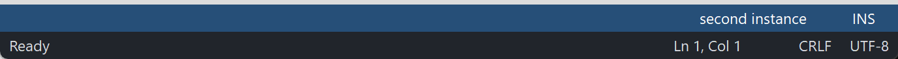

# PsStatusBar

An owner-drawn status bar for FreeBASIC Win32 applications: a horizontal strip of panels
along the bottom of a window, each holding a short piece of text, one of them able to stretch
so the rest sit flush against the right edge.

It draws itself entirely — there is no system `msctls_statusbar32` underneath, and nothing
about its appearance depends on the visual style the user happens to be running. It has no
child windows either: the control window *is* the bar, and a panel is a rectangle the control
computed, not a window you can get a handle to.

The control owns the bar's background, the panel geometry, hover tracking and the tooltip.
It does **not** own a single pixel inside a panel. Everything you see in a panel comes from
your paint callback, so a control with no paint callback installed renders as a bare
coloured strip.

---

## What it looks like



Two independent status bars: a blue-themed one with right-aligned panels, and a dark one with `Ready` on the left and Ln/Col, CRLF and UTF-8 on the right. Panels auto-size to their text and one panel may spring to absorb the slack. Cropped to the bars — the demo's client area above them is empty filler, not part of the control.

---

## Requirements

**Files to copy into your project:**

| File | Purpose |
|---|---|
| `PsStatusBar.bi` | Declarations — types, callbacks, constants, function prototypes |
| `PsStatusBar.inc` | Implementation |
| `PsBufferPaint.bi` | The flicker-free drawing surface the control paints through |
| `PsBufferPaint.inc` | Its implementation |
| `PsTipHost.bi` / `PsTipHost.inc` | The tooltip backend switch — see *Tooltips: two backends* |
| `PsTooltip.bi` / `PsTooltip.inc` | The owner-drawn tooltip. Required even if you never switch to it: `PsTipHost.inc` includes it. |

**AfxNova is required.** The control is built on `CWindow`, uses `DWSTRING` for panel text,
and `CBufferPaint` draws through `AfxNova\CGdiPlus.inc`. Sources include AfxNova relative to
the workspace root (`#include once "AfxNova\CWindow.inc"`), so builds need the workspace root
on the include path:

```bash
fbc64.exe -i "C:\dev" main.bas
```

**Include order.** `PsStatusBar.bi` pulls in `PsBufferPaint.bi` and `PsTipHost.bi`;
`PsStatusBar.inc` pulls in `PsTipHost.inc`, which in turn pulls in `PsTooltip.inc`. So the four
tooltip files need no include line of your own. The **implementation** of `PsBufferPaint` is the
one thing not pulled in for you, so include it yourself, first, after the AfxNova headers and
after `using AfxNova`:

```freebasic
#include once "windows.bi"
#include once "AfxNova\CWindow.inc"
#include once "AfxNova\AfxStr.inc"
#include once "AfxNova\AfxGdiplus.inc"

using AfxNova

#include once "PsBufferPaint.inc"
#include once "PsStatusBar.inc"
```

**GDI+ must be running before the first repaint and must outlive the last one.** The control
renders through `PsBufferPaint`, which draws geometry with GDI+, so bracket your message loop:

```freebasic
dim as ULONG_PTR gdipToken = AfxGdipInit()
' ... create windows, run the message loop ...
AfxGdipShutdown( gdipToken )
```

`AfxGdipShutdown` must come after every window is destroyed, because each repaint builds and
tears down a `PsBufferPaint`. If you also call `CoInitialize` / `CoUninitialize`, put the
shutdown before `CoUninitialize` — GDI+ leans on COM.

**Never name an identifier `ok`.** GDI+ defines `Ok = 0` as a `Status` enum value in namespace
`AfxNova`, and hosts customarily say `using AfxNova`. An existing variable, parameter or
function called `ok` becomes a duplicate definition the moment you adopt these files. Use
`bOK` instead.

**There is no pump obligation.** The control installs no message filter and needs none — the
header declares no filter function for you to call. It never takes focus and is not a tabstop,
so `IsDialogMessage` is irrelevant to it. An ordinary `GetMessage` / `TranslateMessage` /
`DispatchMessage` loop is all it asks for.

**You supply and own the font.** The control never creates one and never destroys one — it
stores the `HFONT` you hand `PsStatusBar_SetFont` and selects it into a DC to measure with.
Keep it alive for as long as the control lives, and delete it yourself afterwards. With no
font set, the control measures with the stock `DEFAULT_GUI_FONT`, which it correctly never
deletes.

---

## Quick start

```freebasic
' Create it. The control is created zero-sized and hidden.
dim as HWND hBar = PsStatusBar_Create( hWndParent, IDC_MYFORM_STATUSBAR )

' Install the renderer FIRST -- nothing is drawn inside a panel without it.
PsStatusBar_SetPaintCallback( hBar, @MyStatusBar_Paint )
PsStatusBar_SetMessageCallback( hBar, @MyStatusBar_Message )
PsStatusBar_SetTooltipCallback( hBar, @MyStatusBar_Tooltip )

' The font is a LAYOUT input: it is what panel widths are measured with.
PsStatusBar_SetBackColor( hBar, BGR(33,37,43) )
PsStatusBar_SetFont( hBar, ghFont )

' A representative bar: a message on the left, readouts on the right,
' and an empty spring panel between them doing the pushing.
PsStatusBar_AddPanel( hBar, "Ready",       1001 )
PsStatusBar_AddPanel( hBar, "",            1002 )   ' the spring
PsStatusBar_AddPanel( hBar, "Ln 1, Col 1", 1003 )
PsStatusBar_AddPanel( hBar, "CRLF",        1004 )
PsStatusBar_AddPanel( hBar, "UTF-8",       1005 )

PsStatusBar_SetExpandPanel( hBar, 1 )                          ' panel 1 eats the slack
PsStatusBar_SetPanelMinWidth( hBar, 2, pWindow->ScaleX(110) )  ' stop the readout jittering

ShowWindow( hBar, SW_SHOW )
```

Place it yourself, from the host's `WM_SIZE`. The control has no opinion about where it goes:

```freebasic
sub MyForm_PositionStatusBar( byval hwnd as HWND )
    dim as RECT rc: GetClientRect( hwnd, @rc )
    dim as long nHeight = 24
    dim pWindow as CWindow ptr = AfxCWindowPtr(hwnd)
    if pWindow then nHeight = pWindow->ScaleY(24)
    SetWindowPos( hBar, 0, _
        rc.left, rc.bottom - nHeight, rc.right - rc.left, nHeight, SWP_NOZORDER )
end sub
```

And the renderer, which draws one panel per call:

```freebasic
sub MyStatusBar_Paint( byval p as PSSTATUSBAR_PAINTINFO ptr )
    dim as COLORREF backclr, foreclr
    if p->isHot then                  ' the only panel state there is: hot > normal
        backclr = theme.BackColorHot : foreclr = theme.ForeColorHot
    else
        backclr = theme.BackColor    : foreclr = theme.ForeColor
    end if
    p->b->SetForeColor( foreclr )
    p->b->SetBackColor( backclr )
    p->b->PaintRect( @p->rc )

    ' Inset by the control's own padding, not a hardcoded guess: that padding is what
    ' the panel's width was measured with. Same for the font.
    dim as RECT rcText = p->rc
    rcText.left += PsStatusBar_GetPadding( p->hStatusBar )
    p->b->SetFont( ghFont )
    p->b->PaintText( p->wszCaption, @rcText, DT_LEFT )
end sub
```

Later, from anywhere:

```freebasic
PsStatusBar_SetText( hBar, 2, "Ln 42, Col 7" )   ' re-measures and repaints
```

That is the whole minimum. Everything below is refinement.

---

## Concepts

### The handle is a real HWND

`PsStatusBar_Create` returns an ordinary window handle, and every `PsStatusBar_*` function takes
it. It is not an opaque type, so you can treat the control as the window it is — `SetWindowPos`
to place and size it, `ShowWindow` to show it, `GetDlgItem` to find it by the `CtrlID` you
passed at creation.

### It is created zero-sized and hidden

`PsStatusBar_Create` gives the control the styles `WS_CHILD`, `WS_CLIPSIBLINGS` and
`WS_CLIPCHILDREN`. `WS_VISIBLE` is deliberately absent, so a newly created control shows
nothing until you size it and call `ShowWindow`. That lets you build and configure the whole
bar before it is ever seen. `CS_DBLCLKS` is added to the window class after creation, so
`WM_LBUTTONDBLCLK` is delivered.

### A panel is a rectangle, not a window

Panels live in an internal array. They are identified by their **model index**, `0` to
`PsStatusBar_GetCount() - 1`, and every function that names a panel takes that index. Panels can
be added, inserted and deleted at any time, and the whole set can be cleared — this control is
not static.

Each panel carries three pieces of host-visible state: its `Text`, an `itemData` integer of
your choosing (a command id, typically, since a click hands you back the index and you look the
id up), and `nMinWidth`. Its rect is derived by the control and is read-only to you.

**Indices move.** Insert or delete a panel and every later panel's index shifts, so an index you
stashed earlier can now name a different panel. The control keeps its *own* stored indices
straight for you — see the spring rules below — but yours are your problem.

### How wide a panel is

This is the core of the control. Every panel is measured, and the formula is:

```
  panelWidth(i) = max( textWidth(i) + 2*padding, nMinWidth(i) )
```

`textWidth` is `GetTextExtentPoint32W` of the panel's text, measured with the font you set (or
the stock GUI font if you set none). `padding` is one value for the whole bar, charged on
**both** sides. `nMinWidth` is per panel and defaults to 0, so panels auto-size to their text.

`nMinWidth` is a **floor, not a fixed width**. A panel whose text is wider than its minimum
grows past it; a panel is never drawn narrower than its own text.

Then the spring absorbs the slack:

```
  totalW   = sum of every panelWidth(i)
  leftover = clientWidth - totalW

  if leftover > 0 and a valid spring panel is set:
      panelWidth(spring) += leftover
```

And the panels are laid left to right, each spanning the **full client height**:

```
  x = 0
  for each panel i:
      rc(i) = ( x, clientTop, x + panelWidth(i), clientBottom )
      x += panelWidth(i)
```

#### Worked example

An 800-pixel-wide bar, padding 8, with the five panels from the quick start. Text widths are
whatever the font measures — the numbers below are illustrative:

| i | Text | text | +2×8 | nMinWidth | width |
|---:|---|---:|---:|---:|---:|
| 0 | `Ready` | 40 | 56 | 0 | **56** |
| 1 | *(empty — the spring)* | 0 | 16 | 0 | **16** |
| 2 | `Ln 1, Col 1` | 70 | 86 | 110 | **110** |
| 3 | `CRLF` | 32 | 48 | 0 | **48** |
| 4 | `UTF-8` | 38 | 54 | 0 | **54** |
| | | | | | *total 284* |

`leftover = 800 − 284 = 516`, so panel 1 becomes `16 + 516 = 532`, and the rects come out:

```
  0:  0 .. 56       "Ready"
  1:  56 .. 588     the spring, empty
  2:  588 .. 698    "Ln 1, Col 1"
  3:  698 .. 746    "CRLF"
  4:  746 .. 800    "UTF-8"
```

Panels 2, 3 and 4 are flush against the right edge, and stay there through every resize,
because the spring is what changes size. **That is the entire alignment story** — there is no
right-align flag, no per-panel alignment API. You get a trailing right-aligned group by putting
the spring in front of it.

#### On overflow, nothing shrinks

When `leftover <= 0` the spring does not grow — it is already at its natural width — and no
panel is squeezed. The panels simply run past the right edge and the ones on the right are
clipped. Rects are computed honestly rather than compressed, which keeps hit-testing correct
for free: the cursor cannot reach past the edge anyway.

### Panels are measured, so the font re-lays-out

Layout takes a device context. `PsStatusBar_SetFont` therefore does more than repaint — it
invalidates the layout and every panel is re-measured on the next paint. So does
`PsStatusBar_SetPadding`, and so does every change to a panel's text.

Two obligations follow for your paint callback, and breaking either makes the widths lie:

- **Draw with the same font you handed `PsStatusBar_SetFont`.** The widths were measured with it.
- **Inset your text by `PsStatusBar_GetPadding()`.** That padding was added to the measured text
  width, so it is exactly the space the width already accounts for. This is why
  `PSSTATUSBAR_PAINTINFO` carries `hStatusBar` — so the callback can ask.

### Layout is lazy

Mutators mark the layout stale and request a repaint; the next paint — or a
`PsStatusBar_GetPanelRect` query — performs one measuring pass. There is no
begin-update / end-update pair to remember, and a burst of `PsStatusBar_SetText` calls costs one
layout, not N.

A layout attempted while the control has no client area yet (created zero-sized, or not sized
by the host), or one that cannot obtain a DC, leaves the layout marked stale and retries on the
next paint.

### The spring is one panel, and the control keeps its index honest

`PsStatusBar_SetExpandPanel` nominates the single spring. Setting one clears any previous one;
`-1` clears it entirely; an index that is neither valid nor `-1` is refused and the current
spring is left alone.

Because the spring is stored as an index, the control fixes it up when panels move:

| You do | The stored spring index |
|---|---|
| Insert at or before the spring | Shifts up by one, so it still names the same panel |
| Insert after the spring | Unchanged |
| Delete the spring itself | Cleared to `-1` — there is no spring any more |
| Delete a panel before the spring | Shifts down by one |
| `PsStatusBar_Clear` | Cleared to `-1` |

### Hover, and the safety net behind it

One panel at a time is hot — the one under the cursor. It is passed to your paint callback as
`isHot`, and it is the only per-panel visual state the control tracks. There is no selection and
no pressed state.

`WM_MOUSEMOVE` recomputes the hot panel and invalidates only the two panels whose state changed,
not the whole bar. `WM_MOUSELEAVE` clears it. Because `WM_MOUSELEAVE` is not reliably delivered
when the cursor exits quickly or onto another control — which would strand a panel painted hot —
a 100 ms timer runs while the cursor is over the control and polls the cursor position as a
fallback. The timer is killed on `WM_DESTROY`, so it cannot outlive the window.

### Tooltips

The control creates one tooltip window covering the **whole bar** — not one tool per panel,
because panels are painted rects rather than windows. The tip text is pulled on demand
(`LPSTR_TEXTCALLBACK` / `TTN_GETDISPINFOW`) for whichever panel is currently hot, so nothing is
duplicated and nothing goes stale. Moving between panels pops the current tip so the next hover
re-queries.

With no tooltip callback installed, the tip shows the hot panel's own `Text`. Install one to
supply something different, and return `""` to suppress the tip for that panel entirely.

The control owns that tooltip window and destroys it in `WM_NCDESTROY`.
`PsStatusBar_GetTooltipHandle` hands you the `HWND` if you want to send it `TTM_*` messages.

There are two tooltip **backends** — the comctl32 one described above, which is the default, and
the owner-drawn `PsTooltip`. `PsStatusBar_SetTooltipMode` chooses per instance. The choice
changes how a tip is drawn and driven, never what it says: both backends resolve the text through
the rule in the paragraphs above. See *Tooltips: two backends* under the API reference.

### Pixels, and who scales them

Only the creation-time padding default is DPI-scaled for you: `PSSTATUSBAR_DEFAULT_PADDING` (8)
is passed through `CWindow::ScaleX` at create. `PsStatusBar_SetPadding` and
`PsStatusBar_SetPanelMinWidth` take **raw pixels** afterwards and expect you to scale —
typically `pWindow->ScaleX(...)`. The control's height is entirely yours: it spans whatever you
give it, and every panel spans the full client height.

### Instances share nothing

Every scrap of state — panels, spring, padding, font, colours, callbacks, hot index, tooltip —
lives in a per-instance structure hung off the control window. Two bars on the same form can
have different callbacks, different padding and independent hover state, and hovering one never
lights up the other.

### Lifetime

The control frees itself when its window is destroyed, and destroys its own tooltip window with
it. Fonts you pass in stay yours. Destroy the parent and the only thing left to clean up is your
`HFONT`.

---

## Behaviour and limits

Firm properties of the control, not settings:

- **Nothing renders inside a panel without a paint callback.** The control paints its own
  background and stops. That is not a degraded mode with a fallback — there is no built-in
  panel painter to fall back to.
- **No mouse capture is taken, ever.** Capture's only product is a guaranteed
  `WM_LBUTTONDOWN` → `WM_LBUTTONUP` pairing, and nothing here consumes that: there is no press
  state to strand. Two consequences follow by design. A `WM_LBUTTONDOWN` is **not** guaranteed
  a matching `WM_LBUTTONUP` — press inside, release outside, and no up arrives, which is exactly
  right for a host that acts on `WM_LBUTTONUP` with `idx >= 0`. And pressing on panel 3, dragging
  to panel 5 and releasing fires **panel 5**. If you need true button semantics, put a button
  there.
- **`CS_DBLCLKS` is on.** `WM_LBUTTONDBLCLK` is delivered to your message callback. The control
  does nothing with it itself.
- **The control never takes focus.** There is no `SetFocus` anywhere in it, including on
  `WM_LBUTTONDOWN` — a status bar must not steal focus from the host's editor. It is not a
  tabstop and has no keyboard handling of any kind.
- **No panel width setter.** You give a panel text and optionally a *minimum* width; the control
  measures and positions. A panel narrower than its own text is not something this control will
  draw.
- **No vertical layout.** Every panel spans the full client height. There is no row concept, no
  vertical padding, no per-panel height.
- **No panel alignment API.** Your callback owns every pixel inside a panel, so alignment is a
  `DT_*` flag in your own `PaintText` call. Bar-level alignment is the spring.
- **Only one spring.** Setting a second one clears the first.
- **No separators or sizing grip.** Draw them yourself in the paint callback if you want them.
- **No `WM_COMMAND` to the parent.** A click reaches you through the message callback and nowhere
  else.
- **The right mouse button is reported, never acted on.** `WM_RBUTTONDOWN` reaches the message
  callback; a context menu is your business. `WM_RBUTTONUP` is not reported.
- **`PsStatusBar_SetBackColor` does not repaint.** It stores the colour and returns the previous
  one. Follow it with `PsStatusBar_Refresh` if the control is already visible.
- **`PsStatusBar_GetItemRect` does not force a pending layout; `PsStatusBar_GetPanelRect` does.**
  The two otherwise return the same rectangle. Prefer `GetPanelRect` unless you specifically want
  the last computed value.
- **`PsStatusBar_SetHoverTime` does double duty.** It is both the tooltip's initial delay
  (`TTDT_INITIAL`, honoured by either backend) and `TrackMouseEvent`'s `dwHoverTime`, which is
  what schedules the `WM_MOUSEHOVER` handed to your message callback. One value drives both; you
  cannot set them apart. Its parameter is declared `as integer` where
  `PsStatusBar_SetAutoPopTime` and `PsStatusBar_SetReshowTime` take `as long`.
- **On overflow nothing shrinks** — panels run past the right edge and are clipped.

> **A paint callback that fills a rectangle covering the whole control will erase everything
> under it, including every panel already drawn.** Fill `p->rc`, the panel rect you were handed —
> never the client rect. The control has already filled the background before the first panel
> callback runs.

---

## API reference

### Creation

| Function | Description |
|---|---|
| `PsStatusBar_Create( hWndParent, CtrlID ) as HWND` | Creates the control as a child of `hWndParent` and returns its window handle. `CtrlID` becomes the window's `GWLP_ID`, so `GetDlgItem` finds it. Created zero-sized and hidden — place it with `SetWindowPos`, then `ShowWindow`. Also creates the control's tooltip window. |

### Panels

| Function | Description |
|---|---|
| `PsStatusBar_AddPanel( hStatusBar, Text, itemData = 0 ) as integer` | Appends a panel and returns its model index, or `-1` on failure. Marks the layout stale and repaints. |
| `PsStatusBar_InsertPanel( hStatusBar, idx, Text, itemData = 0 ) as integer` | Inserts a panel at `idx`, shifting that panel and every later one to a higher index. `idx` is **clamped** to `[0, count]`, so an out-of-range value inserts at the near end rather than failing. Returns the index actually used, or `-1` on failure. If the spring is at or after `idx`, its stored index is shifted up so it still names the same panel. |
| `PsStatusBar_DeletePanel( hStatusBar, idx ) as boolean` | Deletes the panel at `idx` and shifts later panels down. Returns FALSE for an invalid index. Deleting the spring clears the spring; deleting a panel before it shifts it down. A hot index left past the end is cleared. |
| `PsStatusBar_Clear( hStatusBar )` | Removes every panel, and clears both the spring and the hot panel. Marks the layout stale and repaints. |
| `PsStatusBar_GetCount( hStatusBar ) as integer` | Number of panels. Valid indices are `0` to `count - 1`. |

### Panel state

| Function | Description |
|---|---|
| `PsStatusBar_GetText( hStatusBar, idx ) as DWSTRING` | The panel's text; `""` for an invalid index. |
| `PsStatusBar_SetText( hStatusBar, idx, Text ) as boolean` | Sets the text. Because text drives the panel's width this **re-lays-out**, not merely repaints. Returns FALSE for an invalid index. |
| `PsStatusBar_GetItemData( hStatusBar, idx ) as integer` | The panel's `itemData`; `0` for an invalid index — indistinguishable from a panel whose data really is 0. |
| `PsStatusBar_SetItemData( hStatusBar, idx, itemData ) as boolean` | Sets the `itemData`. Affects neither layout nor appearance, so it does **not** repaint. Returns FALSE for an invalid index. |

### Geometry & layout

All pixel values are **raw**; you do the DPI scaling.

| Function | Description |
|---|---|
| `PsStatusBar_GetPanelMinWidth( hStatusBar, idx ) as integer` | The panel's minimum width in pixels; `0` means auto-size to text. Returns `0` for an invalid index. |
| `PsStatusBar_SetPanelMinWidth( hStatusBar, idx, nMinWidth ) as boolean` | Sets the floor, clamped to a minimum of 0. A **floor, not a fixed width** — the panel still grows past it for longer text. Set one on any panel whose text changes length, or it resizes and shoves its neighbours on every update. Re-lays-out. Returns FALSE for an invalid index. |
| `PsStatusBar_GetExpandPanel( hStatusBar ) as integer` | The spring panel's index, or `-1` if there is none. |
| `PsStatusBar_SetExpandPanel( hStatusBar, idx ) as boolean` | Nominates the single spring panel that absorbs all unused bar width. Setting one clears any previous spring; `-1` clears it entirely. Returns FALSE — **leaving the current spring untouched** — for an index that is neither valid nor `-1`. Re-lays-out. |
| `PsStatusBar_GetPadding( hStatusBar ) as integer` | The horizontal padding added to **each** side of a panel's text when measuring. Call this from your paint callback to inset text by the same amount the width assumed. |
| `PsStatusBar_SetPadding( hStatusBar, nPadding )` | Sets that padding, clamped to a minimum of 0. One value for the whole bar. This is a **layout** input, not cosmetics — it re-lays-out. Raw pixels: DPI-scale it yourself. |
| `PsStatusBar_GetPanelRect( hStatusBar, idx, byref rc ) as boolean` | The panel's rectangle in client coordinates. **Forces a pending layout first**, so the result is always current. Returns FALSE and leaves `rc` empty for an invalid index. |
| `PsStatusBar_GetItemRect( hStatusBar, idx ) as RECT` | The panel's last **computed** rectangle, returned by value. Does **not** force a pending layout, so it can be stale after a mutator and before the next paint. Returns an empty RECT for an invalid index. |
| `PsStatusBar_Refresh( hStatusBar )` | Marks the layout stale and invalidates the whole control **with** background erase, so a region vacated by a shrinking panel is cleared. Every mutator does this for you; call it after `PsStatusBar_SetBackColor`, which does not. |

### Appearance

| Function | Description |
|---|---|
| `PsStatusBar_GetBackColor( hStatusBar ) as COLORREF` | The bar's background colour. |
| `PsStatusBar_SetBackColor( hStatusBar, clr ) as COLORREF` | Sets it and returns the **previous** colour. Does **not** repaint — follow with `PsStatusBar_Refresh` on a visible control. |
| `PsStatusBar_GetFont( hStatusBar ) as HFONT` | The font handle you set, or `0` if none. |
| `PsStatusBar_SetFont( hStatusBar, hFont ) as boolean` | Stores the font used to **measure** panel widths. The control borrows the handle and never destroys it — keep it alive, delete it yourself. With none set, measurement uses the stock `DEFAULT_GUI_FONT`. Because the font is what widths are measured with, this **re-lays-out**. Returns FALSE only when the handle is not a PsStatusBar. |

### Tooltips

| Function | Description |
|---|---|
| `PsStatusBar_GetTooltipHandle( hStatusBar ) as HWND` | The **comctl32** tooltip window, for any `TTM_*` message you want to send it yourself, such as `TTM_SETMAXTIPWIDTH`. The control owns it and destroys it — do not destroy it yourself. Returns **0** while this control is on the PsTooltip backend — the honest answer, since a `TTM_*` sent to a PsTooltip window is silently ignored. |
| `PsStatusBar_GetPsTooltipHandle( hStatusBar ) as HWND` | The **PsTooltip** window, or 0 while on the system backend. The door to `PsTooltip_SetColors` / `SetFonts` / `SetStyle` / `SetMaxWidth` / `SetTitle` / `SetGlyph` — none of which is mirrored here. |
| `PsStatusBar_SetTooltipMode( hStatusBar, nMode ) as boolean` | `PSTIP_MODE_SYSTEM` (default) or `PSTIP_MODE_PS`. Destroys the outgoing tip, builds the incoming one and re-applies the stored delays. A no-op when the mode asked for is already live. Returns TRUE if that mode is live on return. See below. |
| `PsStatusBar_GetTooltipMode( hStatusBar ) as long` | Which backend is live. |
| `PsStatusBar_SetHoverTime( hStatusBar, milliseconds )` | The initial delay (`TTDT_INITIAL`) — how long the cursor must rest before a tip shows. Honoured by **both** backends. It is **also** `TrackMouseEvent`'s `dwHoverTime`, so it sets the `WM_MOUSEHOVER` delay handed to your message callback (default 250 ms) at the same time; that half takes effect on the next `WM_MOUSEMOVE`. Its parameter is `as integer`, unlike the two below. |
| `PsStatusBar_SetAutoPopTime( hStatusBar, milliseconds as long )` | How long a tip stays up (`TTDT_AUTOPOP`). Honoured by both backends. |
| `PsStatusBar_SetReshowTime( hStatusBar, milliseconds as long )` | The shorter delay used when a tip was recently dismissed (`TTDT_RESHOW`). Honoured by both backends. |

#### Tooltips: two backends

The control ships on the **system** (comctl32) tooltip it has always used. `PSTIP_MODE_PS`
switches this instance to **PsTooltip**: owner-drawn, themeable, word-wrapping without a
hand-sent `TTM_SETMAXTIPWIDTH`, and — the one that matters structurally — **not a subclass of
the control it serves**, so it still works when the window under the cursor is a descendant
rather than the control itself. Either way the control adds **no pump obligation**: PsTooltip
has no `FilterMessage`.

The default is deliberate, not caution. PsTooltip's colour defaults are **dark**, so a control
that switched itself would put a dark tip on a light form. Theme every tip in the process at
once — `PsTooltip_SetDefaultColors`, `PsTooltip_SetDefaultFonts`, `PsTooltip_SetDefaultStyle`,
`PsTooltip_SetDefaultMaxWidth`, `PsTooltip_SetDefaultDelays`, called once at startup — then opt
in per instance.

**The mode changes how a tip is drawn, never what it says.** Both backends resolve text through
the same rule — this control's `TooltipCallback` if one is installed, otherwise the panel's own
`Text`.

A delay you set is **stored as well as pushed**, so one set before a mode switch is still in
force after it. A delay you never set keeps the backend's own derivation from the system
double-click time, which is what makes a tip appear on the same beat as every other tip on the
machine.

```freebasic
PsTooltip_SetDefaultColors( @myTipColors )     ' once, at startup, for every tip in the process
PsTooltip_SetDefaultFonts( ghFontUI )

PsStatusBar_SetTooltipMode( hBar, PSTIP_MODE_PS )
PsStatusBar_SetHoverTime( hBar, 400 )
dim as HWND hTip = PsStatusBar_GetPsTooltipHandle( hBar )
if hTip then PsTooltip_SetTitle( hTip, "Cursor position" )   ' not reachable on the system backend
```

### Callback registration

| Function | Description |
|---|---|
| `PsStatusBar_SetPaintCallback( hStatusBar, usersub )` | Installs the renderer called once per visible panel. Required — nothing inside a panel is drawn without it. Does not itself repaint; call `PsStatusBar_Refresh` if the control is already visible. |
| `PsStatusBar_SetMessageCallback( hStatusBar, userfunc )` | Installs an observer for mouse messages. |
| `PsStatusBar_SetTooltipCallback( hStatusBar, userfunc )` | Installs the on-demand tooltip text supplier. Without it, the tip shows the panel's own text. |

All three are optional and independent — though the bar shows nothing but its background
without the first.

---

## Colors

**There is no colour struct.** The control paints exactly one thing — its own background — and
so it has exactly one colour, reached through `PsStatusBar_GetBackColor` /
`PsStatusBar_SetBackColor`. Everything else on screen is drawn by your paint callback out of
colours you keep yourself, which is why panel colours are not part of this API.

| Colour | Paints |
|---|---|
| `BackColor` | The whole client area, filled once at the start of every repaint — including any gap on the right that no panel covers |

`BackColor` has no default worth relying on: an unset one is 0, which is black. Set it before
the control is first shown.

### The one state the control tracks

Panel visual state is `isHot` and nothing else. There is no selection, no pressed state and no
disabled state, so the precedence your callback implements is the whole table:

```
  hot   >   normal
```

At most one panel is hot at a time. When the cursor is over bar area no panel covers, no panel
is hot.

### The paint sequence

| Step | What happens |
|---|---|
| 1 | Any pending layout is consumed — one measuring pass, however many mutators ran |
| 2 | The update rectangle is captured (before `BeginPaint` clears it) |
| 3 | A `PsBufferPaint` is created and the **whole client** is filled with `BackColor` |
| 4 | Your paint callback is invoked once per panel that intersects the update rectangle |
| 5 | The buffer is blitted to the screen |

Step 4's skip is an optimisation only, and correctness never depends on it: the update
rectangle is the update *region's* bounding box, so when hover moves between two far-apart
panels their union spans the bar and nothing is skipped. The buffer fills the whole client
either way. `WM_ERASEBKGND` returns TRUE and never erases — step 3 is the erase.

---

## Callbacks

### Paint

```freebasic
type SB_PaintCallbackSub as sub( byval p as PSSTATUSBAR_PAINTINFO ptr )
```

Draws **one panel**. Called once for each panel touched by the repaint, so keep it cheap. Paint
through `p->b`, the control's double buffer for this repaint — do not touch the screen DC, and
do not keep the pointer past the call.

Nothing at all is drawn inside panels if no paint callback is set.

`PSSTATUSBAR_PAINTINFO`:

| Field | Meaning |
|---|---|
| `hStatusBar` | The control, so the callback can query it — chiefly for `PsStatusBar_GetPadding` |
| `itemID` | The panel's model index |
| `b` | The control's `PsBufferPaint` for this repaint (borrowed, not owned) |
| `rc` | This panel's rect, in client coordinates — the only rect you may fill |
| `isHot` | The mouse is over this panel |
| `wszCaption` | The panel's `Text`, copied for you so you need not call `GetText` |

Two contracts, and breaking either makes the layout disagree with what you drew:

- **Draw with the same font you handed `PsStatusBar_SetFont`.** The widths were measured with it.
- **Inset your text by `PsStatusBar_GetPadding( p->hStatusBar )`.** That padding is already part
  of the width.

> **Fill `p->rc`, never the client rect.** A callback that fills a rectangle covering the whole
> control erases every panel drawn before it.

### Message

```freebasic
type SB_MessageCallbackFunc as function( byval m as PSSTATUSBAR_MESSAGEINFO ptr ) as boolean
```

Observes mouse messages as they arrive. Return TRUE to suppress the control's own handling of
that message, FALSE to let it proceed.

**The result is honoured uniformly, for every message.** The control takes no mouse capture, so
there is no invariant a callback can strand by suppressing something — unlike controls that
must see their own button-up.

The callback is offered exactly these messages:

| Message | Notes |
|---|---|
| `WM_MOUSEMOVE` | Called **after** the hot panel is updated, so `m->idx` and the control agree |
| `WM_MOUSEHOVER` | Scheduled by `PsStatusBar_SetHoverTime`, default 250 ms |
| `WM_MOUSELEAVE` | `m->idx` is always `-1` — the mouse is gone. Hot tracking is already cleared |
| `WM_LBUTTONDOWN` | |
| `WM_LBUTTONUP` | Only ever arrives while the cursor is still over the control; see the capture note |
| `WM_LBUTTONDBLCLK` | Delivered because the class carries `CS_DBLCLKS` |
| `WM_RBUTTONDOWN` | Reported, never acted on. `WM_RBUTTONUP` is **not** reported |

`PSSTATUSBAR_MESSAGEINFO`:

| Field | Meaning |
|---|---|
| `hStatusBar` | The control — use it to tell instances apart when they share one callback |
| `uMsg` | The message |
| `wParam` | Its `wParam` |
| `lParam` | Its `lParam` |
| `idx` | Panel index under the mouse, or `-1` for none (empty bar area, or the mouse has left) |

A click handler is normally `WM_LBUTTONUP` with `idx <> -1`:

```freebasic
function MyStatusBar_Message( byval m as PSSTATUSBAR_MESSAGEINFO ptr ) as boolean
    if m->uMsg = WM_LBUTTONUP then
        if m->idx <> -1 then
            DoCommand( PsStatusBar_GetItemData( m->hStatusBar, m->idx ) )
        end if
    end if
    return false     ' let the control carry on
end function
```

### Tooltip

```freebasic
type SB_TooltipCallbackFunc as function( byval hStatusBar as HWND, byval idx as integer ) as DWSTRING
```

Supplies the tooltip text for a panel, on demand — called only when a tip is about to show, for
whichever panel is currently hot. Return `""` for no tooltip on that panel, which is how you
suppress the tip over an empty spring.

If no tooltip callback is installed, the tip shows the panel's own `Text`.

```freebasic
function MyStatusBar_Tooltip( byval hCtl as HWND, byval idx as integer ) as DWSTRING
    dim as DWSTRING wszText = PsStatusBar_GetText( hCtl, idx )
    if len(wszText) = 0 then return ""            ' the spring gets no tip
    return "Panel " & idx & " -> " & wszText
end function
```

---

## Constants

| Constant | Value | Meaning |
|---|---:|---|
| `PSSTATUSBAR_DEFAULT_PADDING` | 8 | Default horizontal padding per side, DPI-scaled at create. `PsStatusBar_SetPadding` takes raw pixels thereafter |
| `IDT_CSTATUSBAR_HOTTRACK` | `&hCB01` | Timer id for the hover safety net. Per-window, so every instance can share it — but do not reuse this id on the control's own window |
| `PSSTATUSBAR_HOTTRACK_MS` | 100 | How often that timer polls the cursor while it is over the control |
| `PSTIP_MODE_SYSTEM` | 0 | The comctl32 tooltip backend — the default |
| `PSTIP_MODE_PS` | 1 | The owner-drawn `PsTooltip` backend |

Two more defaults are not `#define`s but structure-field initialisers worth knowing:

| Default | Value |
|---|---:|
| Hover time, changeable with `PsStatusBar_SetHoverTime` | 250 ms |
| Spring panel index — no spring | −1 |

## Running the demo

The demo loads **Segoe Fluent Icons** at startup via `AddFontResourceEx`, and
**aborts if the font is absent** — the control family draws its glyphs from it.

The font ships with Windows 11 but is Microsoft's, not ours, so it is not
redistributed here. Copy it in once before building:

```bash
copy C:\Windows\Fonts\SegoeIcons.ttf SegoeFluentIcons.ttf
```

Note the rename: Windows stores the file as `SegoeIcons.ttf`, while the family
name is "Segoe Fluent Icons". On Windows 10 the font is not present at all.

## Licence

[Mozilla Public License 2.0](LICENSE).

MPL-2.0 is file-level copyleft, chosen deliberately for a drop-in control:

- **You may use this in closed-source software**, commercial or otherwise.
  §3.2 permits static linking with no additional conditions.
- **If you modify these files, publish those files' changes.** The obligation is
  per-file — your own sources are unaffected however tightly they are combined
  with these.
- The Exhibit B "Incompatible With Secondary Licenses" notice is **not applied**,
  which keeps this GPL-compatible.
