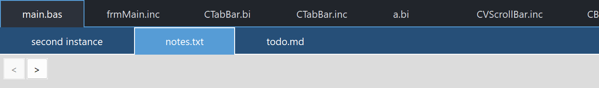

# PsTabBar

An owner-drawn tab bar for FreeBASIC Win32 applications: a horizontal strip of tabs, one of
them active, each with room for an icon on the left and a close "X" on the right. Tabs can be
clicked to select, closed, and dragged to reorder.

**It is a tab bar, not a tab container.** The control draws and manages the strip and nothing
else. It never creates, shows, hides or owns the pages behind the tabs, and it has no concept
of one. What you still have to build:

- the pages themselves, and the code that swaps them when the selection changes;
- the decision about what a close request means — the control deletes nothing on its own;
- everything a tab looks like. **A paint callback is required if you want to see any tabs at
  all**; without one the control paints its background and its chrome and stops.

What it gives you in return is the strip: measuring and positioning tabs, the active tab, hover
and press state, the close-"X" gesture, middle-click close, live drag-to-reorder, horizontal
scrolling for overflow, tooltips, and a set of callbacks that report all of it. Every colour it
paints is one you set, and nothing about its appearance depends on the visual style the user
happens to be running.

The control never takes keyboard focus, deliberately: a tab bar sits above an editor or a
document view, and clicking a tab must not pull the caret out of it.

---

## What it looks like



Two bars. The upper one has a selected tab and more tabs than fit its width; the lower is blue-themed with a different tab current. This is a tab **bar**, not a tab container — it owns no pages. The `<` and `>` buttons belong to the demo and drive the control programmatically, exercising the setters that deliberately stay silent.

---

## Requirements

**Files to copy into your project:**

| File | Purpose |
|---|---|
| `PsTabBar.bi` | Declarations — types, callbacks, constants, custom messages, function prototypes |
| `PsTabBar.inc` | Implementation |
| `PsBufferPaint.bi` | The flicker-free drawing surface the control paints through |
| `PsBufferPaint.inc` | Its implementation |
| `PsTipHost.bi` / `PsTipHost.inc` | The tooltip backend switch — see *Tooltips: two backends* |
| `PsTooltip.bi` / `PsTooltip.inc` | The owner-drawn tooltip. Required even if you never switch to it: `PsTipHost.inc` includes it. |

**AfxNova is required.** The control is built on `CWindow` and uses `DWSTRING`, and
`CBufferPaint` draws through `AfxNova\CGdiPlus.inc`. Sources include AfxNova relative to the
workspace root (`#include once "AfxNova\CWindow.inc"`), so builds need the workspace root on
the include path:

```bash
fbc64.exe -i "C:\dev" main.bas
```

**Include order.** AfxNova first, then the two implementation files in this order.
`PsTabBar.inc` pulls in its own `.bi`, which pulls in `PsBufferPaint.bi` and `PsTipHost.bi`;
`PsTabBar.inc` also pulls in `PsTipHost.inc`, which in turn pulls in `PsTooltip.inc`. So the two
tooltip files need no include line of your own. The **implementation** of `PsBufferPaint` is the
one thing not pulled in for you, so include it yourself, first:

```freebasic
#define UNICODE
#define _WIN32_WINNT &h0602

#include once "windows.bi"
#include once "AfxNova\CWindow.inc"
#include once "AfxNova\AfxStr.inc"
#include once "AfxNova\AfxGdiplus.inc"

using AfxNova

#include once "PsBufferPaint.inc"
#include once "PsTabBar.inc"
```

**GDI+ must be running before the first repaint and must outlive the last one.** The control
renders through GDI+, so bracket your message loop:

```freebasic
dim as ULONG_PTR gdipToken = AfxGdipInit()
' ... create windows, run the message loop ...
AfxGdipShutdown( gdipToken )
```

`AfxGdipShutdown` must come after every window is destroyed, because each repaint builds and
tears down a `PsBufferPaint`. If you also use COM, shut GDI+ down *before* `CoUninitialize` —
GDI+ leans on COM.

**Never name an identifier `ok`.** GDI+ defines `Ok = 0` as a `Status` enum value in namespace
`AfxNova`, and hosts customarily say `using AfxNova`. An existing variable, parameter or
function called `ok` becomes a duplicate definition the moment you adopt these files. Use
`bOK` instead.

**There is no pump obligation.** The control installs no message filter, needs no
`FilterMessage` call, and takes no keyboard focus, so it does not care whether you call
`IsDialogMessage`. Drop it into any existing message loop unchanged.

**You supply and own the font.** The control never creates one. `PsTabBar_SetFont` stores the
`HFONT` you hand it and nothing more — keep it alive for as long as the control lives, and
destroy it yourself. With no font set, the control measures with the stock
`DEFAULT_GUI_FONT`, which it does not own either.

The control does own two things and cleans both up itself: its tooltip window, and its own
state block. Destroy the parent and you are done.

---

## Quick start

```freebasic
' Create it. The control is created zero-sized and hidden.
dim as HWND hBar = PsTabBar_Create( hWndParent, IDC_MYFORM_TABBAR )

' A paint callback is REQUIRED -- without one no tab is ever drawn.
PsTabBar_SetPaintCallback( hBar, @MyTabBar_Paint )

' The notifications you probably want.
PsTabBar_SetSelChangeCallback( hBar, @MyTabBar_SelChange )   ' user picked a tab
PsTabBar_SetCloseCallback( hBar, @MyTabBar_Close )           ' user wants one closed
PsTabBar_SetReorderCallback( hBar, @MyTabBar_Reorder )       ' a drag moved one

' Appearance. Both colours default to black, so set them.
PsTabBar_SetBackColor( hBar, BGR( 33, 37, 43) )
PsTabBar_SetBorderColor( hBar, BGR( 86,156,214) )    ' the chrome the CONTROL draws
PsTabBar_SetFont( hBar, ghFont )                     ' you keep ownership

' Tabs. itemData is yours -- put your document id there; it travels with the tab.
PsTabBar_AddTab( hBar, "document1.bas", 1001 )
PsTabBar_AddTab( hBar, "document2.inc", 1002 )
PsTabBar_AddTab( hBar, "notes.txt",     1003 )

' A very short caption makes an uncomfortably small click target; floor it.
PsTabBar_SetTabMinWidth( hBar, 2, pWindow->ScaleX(110) )

' Programmatic: this does NOT fire the selection callback.
PsTabBar_SetCurSel( hBar, 0 )

' Place it like any window, then show it.
SetWindowPos( hBar, 0, rc.left, rc.top, rc.right - rc.left, pWindow->ScaleY(36), SWP_NOZORDER )
ShowWindow( hBar, SW_SHOW )
```

Painting one tab — every rect arrives precomputed, so derive nothing:

```freebasic
sub MyTabBar_Paint( byval p as PSTABBAR_PAINTINFO ptr )
    dim as COLORREF backclr, foreclr
    if p->isDragging then                    ' dragging > selected > hot > normal
        backclr = clrDrag   : foreclr = clrDragText
    elseif p->isSelected then
        backclr = clrActive : foreclr = clrActiveText
    elseif p->isHot then
        backclr = clrHot    : foreclr = clrHotText
    else
        backclr = clrBack   : foreclr = clrText
    end if
    p->b->SetForeColor( foreclr )
    p->b->SetBackColor( backclr )
    p->b->PaintRect( @p->rc )                ' rc is already deflated by the border

    ' Caption, in the font the widths were measured with.
    p->b->SetFont( ghFont )
    p->b->PaintText( p->wszCaption, @p->rcText, DT_LEFT )

    ' The close "X" -- shown only while the tab is hot, brightened over the X itself.
    if p->isHot orelse p->isHotClose then
        if p->isHotClose then p->b->SetForeColor( clrCloseHot )
        p->b->SetFont( ghSymbolFont )
        p->b->PaintText( wchr(&hE8BB), @p->rcClose, DT_CENTER )   ' Segoe Fluent ChromeClose
    end if
end sub
```

Handling a close request — the control has deleted nothing:

```freebasic
sub MyTabBar_Close( byval hTabBar as HWND, byval idx as integer )
    ' Prompt "save changes?" here. Veto by simply not deleting.
    PsTabBar_DeleteTab( hTabBar, idx )
end sub
```

And a selection change:

```freebasic
sub MyTabBar_SelChange( byval hTabBar as HWND, byval idxOld as integer, byval idxNew as integer )
    ' User action only. The control's state is already updated, so
    ' PsTabBar_GetCurSel( hTabBar ) = idxNew. Swap your page here.
    ShowDocument( PsTabBar_GetItemData( hTabBar, idxNew ) )
end sub
```

That is the whole minimum. Everything below is refinement.

---

## Concepts

### The handle is a real HWND

`PsTabBar_Create` returns an ordinary window handle, and every `PsTabBar_*` function takes it. It
is not an opaque type, so you can treat the control as the window it is — `SetWindowPos` to
place and size it, `ShowWindow` to show it, `GetDlgItem` to find it by the `CtrlID` you passed
at creation, `SendMessage` to drive it from another control.

There are **no child windows**. The control window *is* the bar; every tab is a rectangle
painted into it, not a window. That is why hit-testing, hover and tooltips all work off rects.

### It is created zero-sized and hidden

`PsTabBar_Create` gives the control the styles `WS_CHILD`, `WS_CLIPSIBLINGS` and
`WS_CLIPCHILDREN`. `WS_VISIBLE` is deliberately absent, so a newly created control shows
nothing until you size it and call `ShowWindow`. That lets you build a full set of tabs before
any of it is seen. `CS_DBLCLKS` is enabled on the window class, so double-clicks arrive as
`WM_LBUTTONDBLCLK` rather than a second `WM_LBUTTONDOWN`.

### Tab indices are model indices

Every index in the API — every `idx` parameter, `GetCurSel`, `GetFirstVisible`, the callbacks'
indices — counts tabs from 0 through `GetCount() - 1`, in bar order. Scrolling does not shift
them; only inserting, deleting and moving do. When it does, the control remaps everything it
stores: the selection and the hover index follow the *tab*, so the selected file stays selected
as indices shift underneath it.

`itemData` is the escape hatch for the other direction. It is an `integer` the control stores
and never looks at, it travels with its tab through every insert, delete and drag, and it is
how you find your document from a tab index that has moved.

### Programmatic setters are silent; only user interaction notifies

This is the rule to internalise before writing a single handler.

| Route | Selection callback | Reorder callback |
|---|---|---|
| `PsTabBar_SetCurSel` | **no** | — |
| `PsTabBar_MoveTab` | — | **no** |
| A click on a tab | **yes** | — |
| A drag past a neighbour | — | **yes**, once per move |

It mirrors Win32's own `TCM_SETCURSEL` / `TCN_SELCHANGE` split, and it exists for one concrete
reason: it lets you call `PsTabBar_SetCurSel` **from inside your own selection handler** — or
`PsTabBar_MoveTab` from inside your reorder handler — without re-entering it. Nothing recurses,
and there is no re-entrancy guard to remember.

The same rule holds for the close callback in the other direction: it is notify-only, and
`PsTabBar_DeleteTab` called from inside it fires nothing.

Both user-driven callbacks fire **after** the control's state is updated, so the getters already
agree with the arguments you were handed.

### One operation, two doors

Navigation is exposed twice: as a plain function, and as a `WM_USER`-based message you can
`SendMessage`. There is one implementation behind both — the message case in the window
procedure calls the function.

The reason for the second door is that scroll buttons for a tab bar usually live in a
*different* control, one that has no include-level knowledge of this one. A separate nav
control can drive the bar with nothing but its `HWND`:

```freebasic
' Step the bar left, from anywhere.
SendMessage( hBar, TCM_NAVIGATE, cast(WPARAM, -1), 0 )

' Grey out a nav button when a step that way would do nothing.
EnableWindow( hBtnLeft, iif( SendMessage( hBar, TCM_CANNAVIGATE, cast(WPARAM, -1), 0 ), CTRUE, FALSE ) )
```

In-process code that already includes `PsTabBar.bi` should just call `PsTabBar_Navigate` and
`PsTabBar_CanNavigate` directly; the behaviour is identical.

### Tabs never shrink, and overflow clips

A tab's width is computed, never assigned:

```
  width = max( textWidth + 2*iconWidth + 2*padding + 2*borderWidth,  nMinWidth )
```

`textWidth` is measured with the font you set. Nothing in that formula can make a tab narrower
than its own caption plus its two icon cells — there is no `SetTabWidth`, and no compression
when tabs run out of room. When they do stop fitting, **the rightmost tab simply clips at the
client edge**. Horizontal scrolling is the escape valve, not squeezing.

Rects that run past the edge are computed honestly rather than truncated, so hit-testing stays
correct for free: the cursor cannot reach past the client edge anyway.

`nMinWidth` defaults to 0, which means auto-size. Set a floor on a tab that would otherwise be
uncomfortably narrow for its own caption, or on one whose caption changes and must not shove
its neighbours along each time.

### Both icon rects are always reserved

Every tab reserves two square icon cells — a left one for a file-type glyph or similar, and a
right one for the close "X" — **whether or not you draw anything in them**. That is what keeps
the caption at the same offset in every tab, and what stops the text jumping sideways the
moment the "X" appears on hover.

They are a layout input, not decoration: `PsTabBar_SetIconWidth` changes the measured width of
every tab.

### Geometry is derived, never assigned

The control computes five rects per tab and owns all five. You influence them through the
layout setters and the caption; you never write them.

| Rect | What it is |
|---|---|
| `rc` | The full tab, spanning the client's full height |
| `rcPaint` | `rc` deflated by the border — **this is the one the paint callback is handed as `p->rc`** |
| `rcText` | The caption area, between the two icon rects |
| `rcIcon` | The left icon square |
| `rcClose` | The right icon square, and the close "X" hit-test target |

The deflation into `rcPaint` is **asymmetric on purpose**:

- left, top and right are deflated on *every* tab, active or not. Reserving space a border may
  occupy is what stops the caption jumping sideways the moment a tab is selected — the same
  argument as the always-reserved icon rects.
- the bottom is deflated on **inactive tabs only**. The active tab's `rcPaint` runs all the way
  to the client bottom, because its own fill is what covers the gap where the control's bottom
  line breaks. Deflate it and a one-pixel background strip destroys the merge-with-content
  look.

The icon rects and `rcText` are vertically centred on the *symmetrically* deflated height, so
they — and `DT_VCENTER` text aligned to them — sit at identical offsets whether or not the tab
is selected. Nothing twitches when the selection moves.

Layout is lazy. A mutator marks the layout stale and asks for a repaint; the next paint, or any
rect query, recomputes it. There is no begin-update / end-update pair to remember, and a burst
of `PsTabBar_SetText` calls costs one measuring pass, not one each.

### The chrome belongs to the control

Two things are drawn by the control itself, **after** every paint callback has run, so they are
authoritative no matter what a callback painted:

- **A full-width bottom rule that breaks under the active tab.** It is drawn as two segments
  that skip the active tab's x-range, never as a full line the active tab paints over — the
  control's chrome must not depend on a host callback to complete it. Your fill of the active
  tab's `rc`, which runs to the client bottom, is what shows through the break.
- **The active tab's three-sided border** — left, top, right. The sides run the full tab height
  so they meet the broken rule's ends.

Both use `BorderColor` and `nBorderWidth`. Setting the border width to 0 removes all of it.

### Scrolling is a first-visible index

`nFirstVisible` is a listbox-style top index: the leftmost *whole* tab. Tabs are never
half-drawn at the left edge. Tabs scrolled off the left are given **empty rects**, not stale
ones, so they cannot be hovered or clicked.

Three things move it:

- `PsTabBar_Navigate` / `TCM_NAVIGATE` step it one tab, gated on `CanNavigate` so a no-op step
  is harmless;
- `PsTabBar_SetFirstVisible` sets it outright;
- the mouse wheel over the control steps it — wheel up scrolls left.

Two things move it *for* you. `PsTabBar_SetCurSel` with a valid index queues a scroll-into-view
consumed at the next layout, which is where measured widths exist — so calling it before the
control has ever been sized is safe, and the scroll happens once it is. And the layout
**back-fills**: when the whole tail from `nFirstVisible` onward fits with enough slack to also
hold the tab before it, earlier tabs are pulled back into view, so a delete or a widening
resize never leaves dead space on the right while tabs sit hidden on the left.

### How a click, a close and a drag are decided

The control **takes mouse capture** on a left or middle press. It has to: two gestures here
consume the guaranteed down→up pairing.

- **Select** happens on the button **down**, which is what real tab controls do — *unless* the
  press landed on the close "X", because closing a tab must not first activate it.
- **Close** fires only on a **matched** gesture: pressed this tab's "X" and released still on
  this tab's "X". Capture is what routes an outside release back here so that press, slide off,
  release is a reliable cancel. Middle-click is the same shape, but anywhere on the tab rather
  than only on the "X".
- **Drag** starts when a live left press that did *not* land on the "X" travels past the system
  drag threshold (`SM_CXDRAG` / `SM_CYDRAG`). Reordering is **live**: the tabs exchange the
  moment the pointer crosses into an adjacent tab, so the tabs visibly changing places *are*
  the drag feedback — there is no ghost image and no drop indicator. The exchange is gated on
  the direction of travel, which is what stops a narrow tab dragged over a wide one from
  oscillating back and forth.

While a drag is live, **hover is pinned to the dragged tab**: it keeps `isHot` — and so its
"X" — for the whole gesture, and a tab being dragged over can never light up or grow an "X" of
its own. Normal tracking resumes on the first mouse move after the drop.

The cursor also becomes the four-headed **move** cursor (`IDC_SIZEALL`) for the duration of the
drag, and goes back to the window class's cursor on the drop. The control owns the cursor
unconditionally while dragging — under capture the pointer legitimately roams off the control,
so the hit-test code is not consulted — and claims nothing at all when it is not dragging.
`WM_SETCURSOR` is **not** offered to `MessageCallback`; the list of messages a host observes is
unchanged.

There is no Escape to cancel a drag, and losing capture mid-drag does **not** restore the
original order. With live reordering every intermediate order is already a legitimate, notified
state, so there is nothing to roll back to.

Any tab mutation — insert, delete, clear — cancels a live press: the slot the finger meant no
longer means the same thing.

### Hover

The control tracks two hover facts, both single-valued: which tab the cursor is over, and
whether it is over that tab's close rect. A tab is `isHot` and `isHotClose` at the same time
when the cursor is on its "X", because the "X" is inside the tab.

`WM_MOUSELEAVE` is not reliably delivered when the cursor exits quickly or onto another
control, which would strand a tab painted as hot, so a 100 ms timer polls the cursor while it
is over the control and clears hover itself if the message never comes. The timer runs only
while it is needed and never during a drag.

### Pixels, and who scales them

Only the creation-time defaults are DPI-scaled for you:

| Setting | Default | DPI-scaled at create? |
|---|---:|---|
| Padding | 8 | Yes |
| Icon width | 20 | Yes |
| Border width | 1 | Yes, with a floor of 1 |

Every setter afterwards takes **raw pixels** and expects you to scale — typically
`pWindow->ScaleX(...)` / `ScaleY(...)`. That includes `PsTabBar_SetTabMinWidth`.

---

## Behaviour and limits

Firm properties of the control, not settings:

- **A paint callback is required to see any tabs.** With none installed the control still
  paints its background and its chrome, and every tab is invisible. This is the single most
  likely reason a freshly created bar looks empty.
- **A paint callback that fills a rectangle covering the whole control will erase everything
  under it** — including the tabs drawn before it in the same pass. Fill `p->rc`, which is the
  space that tab owns, and nothing wider.
- **The control never deletes a tab.** The close callback is notify-only; if you do not call
  `PsTabBar_DeleteTab`, nothing happens, which is exactly how you veto a close.
- **Adding a tab does not select it, and deleting the selected tab selects nothing.** The
  control never guesses which document you want next. `GetCurSel` returns -1 after deleting the
  active tab; select something yourself.
- **Nothing shrinks and nothing ellipsises.** Tabs clip at the client edge. Your callback may
  use `DT_END_ELLIPSIS` inside `rcText` if it wants that look.
- **A partially clipped rightmost tab is clickable, but its close rect can sit past the client
  edge and be unreachable.** Scroll it into view, or middle-click it.
- **No keyboard handling, no focus.** The control never calls `SetFocus` and never sees a key
  message. Ctrl+Tab, Ctrl+W and friends are host accelerators that call `PsTabBar_SetCurSel` /
  `PsTabBar_MoveTab` / `PsTabBar_DeleteTab`.
- **`WM_RBUTTONUP` is not reported.** The right button is observable on the down message only,
  and no capture is taken for it. A context menu is your business.
- **Double-clicks are reported but not interpreted.** `CS_DBLCLKS` is on, so a rapid second
  click arrives as `WM_LBUTTONDBLCLK`; the control runs the same press-and-select bookkeeping
  as an ordinary down and hands the message to your message callback. There is no
  double-click callback.
- **Your message callback's return value is ignored for `WM_LBUTTONUP` and `WM_MBUTTONUP`.**
  Those messages release the mouse capture, and a callback that suppressed one would strand
  the capture and route every later click in the application to this control.
- **All tabs are the same height**: every tab spans the control's full client height. There is
  no per-tab height and no multi-row mode.
- **One selected tab at most.** No multi-select.
- **No drag between two bars.** A drag is confined to the control it started in.
- **The tooltip is one tool covering the whole control**, not one per tab, because tabs are
  painted rects rather than windows. Its text is resolved on demand from whichever tab is
  currently hot.
- **`PsTabBar_SetHoverTime` does two jobs at once.** It sets the `TrackMouseEvent` hover time —
  which is what decides when your *message callback* receives `WM_MOUSEHOVER` — **and** the
  tooltip's initial delay. One number drives both; there is no way to set them apart.
- **`PsTabBar_SetBackColor` does not repaint.** It is the one appearance setter that does not;
  call `PsTabBar_Refresh` after it if the control is already on screen. `PsTabBar_SetBorderColor`
  does repaint.
- **The control ships no glyphs.** The close "X" in the examples is Segoe Fluent Icons
  `&hE8BB`, drawn by the host's paint callback. Supply your own glyph font.

---

## API reference

Every function takes the `HWND` returned by `PsTabBar_Create` as its first argument. All of them
are safe to call with a handle that is not a PsTabBar — they detect it and return a benign
value (`false`, `0`, `-1` or `""`) rather than faulting.

### Creation

| Function | Description |
|---|---|
| `PsTabBar_Create( hWndParent, CtrlID ) as HWND` | Creates the control as a child of `hWndParent` and returns its window handle. `CtrlID` becomes the window's `GWLP_ID`, so `GetDlgItem` finds it. Created zero-sized and hidden — place it with `SetWindowPos`, then `ShowWindow`. Creates the control's tooltip window as a side effect; the control destroys it. |

### Tabs

| Function | Description |
|---|---|
| `PsTabBar_AddTab( hTabBar, Text, itemData = 0 ) as integer` | Appends a tab and returns its index, or -1 on failure. **Does not select it.** |
| `PsTabBar_InsertTab( hTabBar, idx, Text, itemData = 0 ) as integer` | Inserts before `idx`, shifting later tabs right. `idx` is **clamped** to `[0, count]` rather than rejected, and the actual index used is returned (-1 on failure). Selection, hover and scroll position all follow the shift. |
| `PsTabBar_DeleteTab( hTabBar, idx ) as boolean` | Deletes the tab. FALSE for an invalid index. **Deleting the active tab leaves nothing selected** (`GetCurSel` returns -1); deleting an earlier one keeps the same tab selected at its new index. |
| `PsTabBar_MoveTab( hTabBar, idxFrom, idxTo ) as boolean` | Moves one tab to another slot, remapping stored indices exactly as a drag does: selection and hover follow the moved tab, the scroll position stays put. FALSE if either index is invalid. `idxFrom = idxTo` returns TRUE and does nothing. **Silent** — does not fire the reorder callback. |
| `PsTabBar_Clear( hTabBar )` | Removes every tab and resets selection, hover, scroll position and any live press. |
| `PsTabBar_GetCount( hTabBar ) as integer` | The number of tabs. |
| `PsTabBar_IsValidTab( hTabBar, idx ) as boolean` | TRUE when `0 <= idx < GetCount()`. |
| `PsTabBar_GetText( hTabBar, idx ) as DWSTRING` | The tab's caption, or `""` for an invalid index. |
| `PsTabBar_SetText( hTabBar, idx, Text ) as boolean` | Sets the caption and **re-lays out** — text drives the tab's width, so neighbours may move. FALSE for an invalid index. |
| `PsTabBar_GetItemData( hTabBar, idx ) as integer` | The value you stored, or 0 for an invalid index. |
| `PsTabBar_SetItemData( hTabBar, idx, itemData ) as boolean` | Stores an arbitrary integer against the tab; the control never interprets it. Does not repaint — nothing visible changed. FALSE for an invalid index. |
| `PsTabBar_Refresh( hTabBar )` | Marks the layout stale and requests a repaint with background erase. Rarely needed — every mutator does this for you. The exception is `PsTabBar_SetBackColor`, which does not. |

### Selection and order

| Function | Description |
|---|---|
| `PsTabBar_GetCurSel( hTabBar ) as integer` | The active tab's index, or -1 when nothing is selected. |
| `PsTabBar_SetCurSel( hTabBar, idx ) as boolean` | Sets the active tab. **-1 is accepted** and clears the selection; any other invalid index returns FALSE. A valid index is queued to be scrolled into view at the next layout, so calling this before the control has been sized is safe. Re-lays out, because the active tab's paint rect differs from an inactive one's. **Silent** — does not fire the selection callback. |
| `PsTabBar_MoveTab( hTabBar, idxFrom, idxTo ) as boolean` | See *Tabs* above. Silent. |
| `PsTabBar_GetFirstVisible( hTabBar ) as integer` | The leftmost drawn tab's index. |
| `PsTabBar_SetFirstVisible( hTabBar, idx ) as boolean` | Scrolls so `idx` is the leftmost tab. FALSE for an invalid index — including any index on an empty bar. **Cancels a scroll-into-view queued by an earlier `SetCurSel`**, so the last explicit instruction wins rather than being overridden at the next layout. The layout still clamps the result, so you cannot scroll into empty space. |
| `PsTabBar_Navigate( hTabBar, nDirection ) as integer` | Steps the first-visible index one tab left (`-1`) or right (`+1`), gated internally on `CanNavigate` so a no-op step is harmless. Returns the possibly unchanged first-visible index (-1 for a bad handle). |
| `PsTabBar_CanNavigate( hTabBar, nDirection ) as boolean` | Whether that step would actually move. Left: not already at tab 0. Right: the last tab still clips at the client edge — scrolling past "last tab visible" would serve nothing. FALSE for an empty bar, for a direction other than ±1, and while the control has no geometry yet. Forces a pending layout, so the answer is current. |

### Geometry and layout

The three scalar setters below take **raw pixels** — you do the DPI scaling — clamp negatives to
0, and re-lay out every tab.

| Function | Description |
|---|---|
| `PsTabBar_GetTabMinWidth( hTabBar, idx ) as integer` | This tab's width floor, or 0 for auto-size. 0 for an invalid index. |
| `PsTabBar_SetTabMinWidth( hTabBar, idx, nMinWidth ) as boolean` | Sets the floor. **A floor, not a fixed width**: a tab never renders narrower than its own caption plus its icon cells and border, so a small value has no effect. Clamped to a minimum of 0. FALSE for an invalid index. |
| `PsTabBar_GetPadding( hTabBar ) as integer` | The horizontal inset added to *each* side of a tab's text when measuring. |
| `PsTabBar_SetPadding( hTabBar, nPadding )` | Sets it. Inset your paint callback's text by the same amount, or the drawn text and the measured width disagree. |
| `PsTabBar_GetIconWidth( hTabBar ) as integer` | The side, in pixels, of the two square icon rects reserved in every tab. |
| `PsTabBar_SetIconWidth( hTabBar, nIconWidth )` | Sets it. Every tab reserves `2 × nIconWidth`, so this re-measures the whole bar. |
| `PsTabBar_GetBorderWidth( hTabBar ) as integer` | The width of the control-drawn chrome. |
| `PsTabBar_SetBorderWidth( hTabBar, nBorderWidth )` | Sets it. **Both a layout input and a chrome setting**: it is what `rcPaint` is deflated by, and how thick the bottom rule and active-tab border are drawn. **0 is legal and means no chrome at all.** |
| `PsTabBar_GetTabRect( hTabBar, idx, byref rc ) as boolean` | The tab's full rect in client coordinates. |
| `PsTabBar_GetTabParts( hTabBar, idx, byref rcPaint, byref rcText, byref rcIcon, byref rcClose ) as boolean` | The four derived interior rects — the same ones the paint callback receives. |

Both rect queries force a pending layout first, so their results are always current. Both return
FALSE for an invalid index, leaving every output rect empty. **A tab scrolled off the left
returns empty rects**, which is its honest geometry, not a failure — check
`GetFirstVisible` if you need to tell the two apart.

### Appearance

| Function | Description |
|---|---|
| `PsTabBar_GetBackColor( hTabBar ) as COLORREF` | The control's own background colour. |
| `PsTabBar_SetBackColor( hTabBar, clr ) as COLORREF` | Sets it and returns the **previous** colour. **Does not repaint** — call `PsTabBar_Refresh` if the control is already on screen. |
| `PsTabBar_GetBorderColor( hTabBar ) as COLORREF` | The chrome colour: the bottom rule and the active tab's three-sided border. |
| `PsTabBar_SetBorderColor( hTabBar, clr ) as COLORREF` | Sets it and returns the **previous** colour. Repaints with background erase. |
| `PsTabBar_GetFont( hTabBar ) as HFONT` | The font handle you supplied, or 0 if none. |
| `PsTabBar_SetFont( hTabBar, hFont ) as boolean` | Stores the handle and re-lays out, because tab widths are measured with it. **The control does not own the font** — keep it alive and destroy it yourself. Paint with this same font in your callback, or the measured widths lie. FALSE only for a bad handle. |

### Tooltips

| Function | Description |
|---|---|
| `PsTabBar_SetHoverTime( hTabBar, milliseconds as integer )` | **Drives two things.** It is the `TrackMouseEvent` hover time — how long the cursor must rest before your message callback receives `WM_MOUSEHOVER` — *and* the tooltip's initial delay (`TTDT_INITIAL`), honoured by **both** backends. Default 250 ms. Note the parameter is an `integer`, not the `long` the two setters below take. |
| `PsTabBar_SetAutoPopTime( hTabBar, milliseconds as long )` | How long the tip stays up (`TTDT_AUTOPOP`). |
| `PsTabBar_SetReshowTime( hTabBar, milliseconds as long )` | The shorter delay after a tip was recently dismissed (`TTDT_RESHOW`). |
| `PsTabBar_GetTooltipHandle( hTabBar ) as HWND` | The **comctl32** tooltip window, for any `TTM_*` message you want to send it yourself. The control owns it and destroys it. Returns **0** while this control is on the PsTooltip backend — the honest answer, since a `TTM_*` sent to a PsTooltip window is silently ignored. |
| `PsTabBar_GetPsTooltipHandle( hTabBar ) as HWND` | The **PsTooltip** window, or 0 while on the system backend. The door to `PsTooltip_SetColors` / `SetFonts` / `SetStyle` / `SetMaxWidth` / `SetTitle` / `SetGlyph` — none of which is mirrored here. |
| `PsTabBar_SetTooltipMode( hTabBar, nMode ) as boolean` | `PSTIP_MODE_SYSTEM` (default) or `PSTIP_MODE_PS`. See below. Returns TRUE if the requested mode is live on return. |
| `PsTabBar_GetTooltipMode( hTabBar ) as long` | Which backend is live. |

#### Tooltips: two backends

The control ships on the **system** (comctl32) tooltip. `PSTIP_MODE_PS` switches this instance to
**PsTooltip**: owner-drawn, themeable, word-wrapping without a hand-sent `TTM_SETMAXTIPWIDTH`,
and — the one that matters structurally — **not a subclass of the control it serves**. Either way
the control adds **no pump obligation**: PsTooltip has no `FilterMessage`, so switching costs you
nothing in the message loop.

The default is deliberate, not caution. PsTooltip's colour defaults are **dark**, so a control
that switched itself would put a dark tip on a light form. Theme every tip in the process at once
with `PsTooltip_SetDefaultColors` / `SetDefaultFonts` / `SetDefaultStyle` / `SetDefaultMaxWidth` /
`SetDefaultDelays`, once at startup, then opt in per instance.

**The mode changes how a tip is drawn, never what it says.** Both backends resolve per-tab text
through the same rule — `TooltipCallback` if installed, else the tab's own caption.

A delay you set is **stored as well as pushed**, so one set before a mode switch is still in
force after it. A delay you never set keeps the backend's own derivation from the system
double-click time, which is what makes a tip appear on the same beat as every other tip on the
machine.

```freebasic
PsTooltip_SetDefaultColors( @myTipColors )     ' once, at startup, for every tip in the process
PsTooltip_SetDefaultFonts( ghFontUI )

PsTabBar_SetTooltipMode( hBar, PSTIP_MODE_PS )
PsTabBar_SetHoverTime( hBar, 400 )
dim as HWND hTip = PsTabBar_GetPsTooltipHandle( hBar )
if hTip then PsTooltip_SetTitle( hTip, "Open documents" )   ' not reachable on the system backend
```

### Custom messages

Both are declared in `PsTabBar.bi` and answered by the control's window procedure. They are the
`SendMessage` door to the identically named functions, for driving the bar from a separate
control that only has its `HWND`.

| Message | Value | wParam | lParam | Returns |
|---|---|---|---|---|
| `TCM_NAVIGATE` | `WM_USER + 100` | `-1` left / `+1` right; anything else is answered without moving | unused, pass 0 | The new (possibly unchanged) first-visible index |
| `TCM_CANNAVIGATE` | `WM_USER + 101` | `-1` / `+1` | unused, pass 0 | `1` if that step would move, else `0` — grey a nav button with this |

`wParam` arrives zero-extended, so cast a negative direction when you send it:
`cast(WPARAM, -1)`. The control casts it back through `LONG_PTR` to recover the sign.

### Callback registration

| Function | Description |
|---|---|
| `PsTabBar_SetPaintCallback( hTabBar, usersub )` | Installs the per-tab renderer. **Required to see any tabs.** |
| `PsTabBar_SetMessageCallback( hTabBar, userfunc )` | Installs an observer for mouse messages. |
| `PsTabBar_SetTooltipCallback( hTabBar, userfunc )` | Installs the on-demand tooltip text supplier. Optional — without one the tab's own caption is used. |
| `PsTabBar_SetSelChangeCallback( hTabBar, usersub )` | Installs the handler told when the **user** changes the active tab. |
| `PsTabBar_SetCloseCallback( hTabBar, usersub )` | Installs the handler told the user wants a tab closed. |
| `PsTabBar_SetReorderCallback( hTabBar, usersub )` | Installs the handler told a drag moved a tab. |

All are independent, and all but the paint callback are optional. Each is per instance: two bars
can share one callback and tell themselves apart from the `HWND` they are handed.

---

## Colors

The control paints only two things itself, so it has two colour properties rather than a colour
struct. Everything a *tab* looks like is the paint callback's, drawn from colours you keep on
your own side.

| Property | Accessors | Paints | Default |
|---|---|---|---|
| `BackColor` | `PsTabBar_GetBackColor` / `PsTabBar_SetBackColor` | The whole client area, filled first every repaint — so it shows through any gap no tab covers, including the empty space to the right of the last tab | 0 (black) |
| `BorderColor` | `PsTabBar_GetBorderColor` / `PsTabBar_SetBorderColor` | The full-width bottom rule (broken under the active tab) and the active tab's three-sided border | 0 (black) |

Neither default is useful, so set both.

### Paint order, and which layer wins

One repaint draws in exactly this order, and later layers cover earlier ones:

```
  1.  the whole client, filled with BackColor
  2.  your paint callback, once per tab that intersects the update region
  3.  the chrome, in BorderColor -- bottom rule, then the active tab's border
```

Step 3 running last is deliberate: the control's chrome is authoritative no matter what a
callback painted, and it never depends on a callback to complete it. The one place the two
layers cooperate is the break in the bottom rule, where the active tab's own fill from step 2
is what shows through — which is why the active tab's `rc` runs to the client bottom.

Step 2 is skipped for tabs that do not intersect the update region. That is only an
optimisation — skipping is safe because the whole client is filled in step 1 and the paint DC
is clipped to the update region, so a skipped tab's stale pixels never reach the screen.

### Tab state precedence

The control decides the state flags; you decide what they look like. It imposes no precedence
of its own — all five flags are handed to you independently, and more than one is true at once
routinely. The order that reads correctly, and the one the examples use, is:

```
  dragging   >   selected   >   hot   >   normal
```

with `isPressed` folded into whichever of those applies, and `isHotClose` handled separately
because it changes only how the "X" is drawn, not the tab.

`isDragging` first is the one worth keeping: while tabs are exchanging places around it, a
distinct fill on the dragged tab is the only thing letting the eye follow it. `isHot` and
`isHotClose` are both true when the cursor is on the "X", because the "X" is inside the tab.

---

## Callbacks

### Paint

```freebasic
type TB_PaintCallbackSub as sub( byval p as PSTABBAR_PAINTINFO ptr )
```

Draws **one tab**, and is called once per tab that intersects the repaint. Keep it cheap. Paint
through `p->b`, the control's double buffer for this repaint — do not touch the screen DC, and
do not keep the pointer past the call.

Without this callback no tab is drawn at all.

Two contracts, or the layout will not match what you draw:

- **Draw with the same font you handed `PsTabBar_SetFont`.** Tab widths were measured with it; a
  different font means the widths lie.
- **Use the rects as handed to you** rather than re-deriving insets from `p->rc`. They are
  exactly the space the measured width accounts for, and their vertical extents encode the
  never-moves-on-selection rule.

`PSTABBAR_PAINTINFO`:

| Field | Meaning |
|---|---|
| `hTabBar` | The control, so the callback can query it |
| `itemID` | This tab's model index |
| `b` | The control's `PsBufferPaint` for this repaint (borrowed, not owned) |
| `rc` | The **border-deflated** paint area — fill this. On the active tab it runs to the client bottom, and that fill is what covers the break in the bottom rule |
| `rcText` | The caption area, from `rcIcon.right` to `rcClose.left`, on symmetric vertical extents so `DT_VCENTER` text never moves when the selection changes |
| `rcIcon` | The left icon square |
| `rcClose` | The right icon square — the close "X" |
| `isSelected` | This is the active tab |
| `isHot` | The mouse is over this tab |
| `isHotClose` | The mouse is over this tab's close rect. A tab is `isHot` **and** `isHotClose` at once — the "X" is inside the tab |
| `isPressed` | A live left press is on this tab |
| `isDragging` | This tab is being drag-reordered. It is `isPressed` too. The tabs visibly moving *are* the drag feedback, so style this one so the eye can follow it |
| `wszCaption` | The tab's text |

> **A paint callback that fills a rectangle covering the whole control will erase everything
> under it**, including the tabs already drawn in this pass. Fill `p->rc` — the space this tab
> owns — and nothing wider.

### Selection changed

```freebasic
type TB_SelChangeCallbackSub as sub( byval hTabBar as HWND, byval idxOld as integer, byval idxNew as integer )
```

The **user** changed the active tab — a left press on a different tab, that did not land on its
close "X". Fires after the control's state is updated, so `PsTabBar_GetCurSel( hTabBar )` already
equals `idxNew`. `idxOld` is -1 when nothing was selected before.

It does not fire for `PsTabBar_SetCurSel`, which is what makes it safe to call that setter from
inside this handler.

This is where you swap the page behind the bar.

### Close requested

```freebasic
type TB_CloseCallbackSub as sub( byval hTabBar as HWND, byval idx as integer )
```

The user asked to close a tab: a matched press-and-release on its close "X", or a matched
middle-click anywhere on it.

**Notify-only — the control deletes nothing.** You decide: prompt to save, veto by simply doing
nothing, or call `PsTabBar_DeleteTab( hTabBar, idx )` yourself. That call fires no further
callback.

A close on the "X" never selects the tab first, so `idx` is frequently *not* the active tab.

### Reorder

```freebasic
type TB_ReorderCallbackSub as sub( byval hTabBar as HWND, byval idxFrom as integer, byval idxTo as integer )
```

A drag moved a tab. Fired **once per move**, after the control's array and stored indices are
already updated.

Reordering is live, so one drag across several tabs fires several of these. Mirror each
`(idxFrom, idxTo)` move into your own model as it arrives and the two stay in step. There is
nothing to veto — a move destroys nothing, so the control reorders itself and tells you after.

It does not fire for `PsTabBar_MoveTab`.

### Tooltip

```freebasic
type TB_TooltipCallbackFunc as function( byval hTabBar as HWND, byval idx as integer ) as DWSTRING
```

Supplies the tooltip text for a tab, and is called **only when a tip is about to show** — so it
is the place to build a string you would not want to keep around, such as a full path or a
modified-state suffix.

`idx` is whichever tab is currently hot. Return `""` for no tooltip.

With no callback installed, the tab's own caption is used, which means tooltips are on by
default. Install a callback returning `""` to suppress them entirely.

The tooltip is a single tool covering the whole control, not one per tab, so there is no
per-tab tooltip window to manage.

This rule is the same on both tooltip backends: the mode decides how a tip is drawn, never what
it says. See *Tooltips: two backends* in the API reference.

### Message

```freebasic
type TB_MessageCallbackFunc as function( byval m as PSTABBAR_MESSAGEINFO ptr ) as boolean
```

Observes mouse messages as they arrive. Return TRUE to suppress the control's own handling of
that message, FALSE to let it proceed.

`PSTABBAR_MESSAGEINFO`:

| Field | Meaning |
|---|---|
| `hTabBar` | The control |
| `uMsg` | The message |
| `wParam` | Its `wParam` |
| `lParam` | Its `lParam` |
| `idx` | The tab under the cursor, or **-1** for none — over empty bar area, or outside the control entirely |

The callback is invoked for exactly these messages, and no others:

`WM_MOUSEMOVE`, `WM_MOUSEHOVER`, `WM_MOUSELEAVE`, `WM_LBUTTONDOWN`, `WM_LBUTTONDBLCLK`,
`WM_LBUTTONUP`, `WM_MBUTTONDOWN`, `WM_MBUTTONUP`, `WM_RBUTTONDOWN`, `WM_MOUSEWHEEL`.

Note what is absent: no keyboard messages (the control never has focus), no `WM_PAINT` (use the
paint callback) and no `WM_RBUTTONUP`.

**Your return value is ignored for two messages:**

| Message | Why |
|---|---|
| `WM_LBUTTONUP` | The control holds mouse capture across a press, and this message is what releases it. A callback that suppressed it would strand the capture and route every later click in the application to this control. |
| `WM_MBUTTONUP` | The same, for the middle-click close gesture. |

Suppressing `WM_LBUTTONDOWN` or `WM_MBUTTONDOWN` *is* honoured, and suppresses the selection
and the press bookkeeping — but never the capture bookkeeping, which is already done by the
time you are called and whose release is guaranteed.

Two other useful suppressions: returning TRUE from `WM_MOUSEWHEEL` stops the bar scrolling, and
returning TRUE from `WM_MOUSEMOVE` stops that move driving a live drag.

---

## Constants

### Custom messages

```freebasic
#define TCM_NAVIGATE     (WM_USER + 100)
#define TCM_CANNAVIGATE  (WM_USER + 101)
```

See *Custom messages* in the API reference for their `wParam` / return contracts.

### Defaults

| Constant | Value | Meaning |
|---|---:|---|
| `PSTABBAR_DEFAULT_PADDING` | 8 | Default horizontal inset per side of a tab's text, DPI-scaled at create |
| `PSTABBAR_DEFAULT_ICONWIDTH` | 20 | Default side of each of the two reserved icon squares, DPI-scaled at create |
| `PSTABBAR_HOTTRACK_MS` | 100 | Period of the hover safety-net poll |
| `IDT_CTABBAR_HOTTRACK` | `&hCB01` | Timer id used by that poll. Timer ids are per window, so every instance shares it — but avoid it in the control's parent if you ever forward timers |

The border width has no named constant; it defaults to 1 DPI-scaled pixel, floored at 1.

### Types

`PSTABBAR_PAINTINFO`, `PSTABBAR_MESSAGEINFO` and `PSTABBAR_TABINFO` are declared in `PsTabBar.bi`.
The first two are documented under *Callbacks*. `PSTABBAR_TABINFO` is the control's internal
per-tab record — its derived rect fields are produced by the layout and must never be written
from outside; reach them through `PsTabBar_GetTabRect` / `PsTabBar_GetTabParts` instead.

## Running the demo

The demo loads **Segoe Fluent Icons** at startup via `AddFontResourceEx`, and
**aborts if the font is absent** — the control family draws its glyphs from it.

The font ships with Windows 11 but is Microsoft's, not ours, so it is not
redistributed here. Copy it in once before building:

```bash
copy C:\Windows\Fonts\SegoeIcons.ttf SegoeFluentIcons.ttf
```

Note the rename: Windows stores the file as `SegoeIcons.ttf`, while the family
name is "Segoe Fluent Icons". On Windows 10 the font is not present at all.

## Licence

[Mozilla Public License 2.0](LICENSE).

MPL-2.0 is file-level copyleft, chosen deliberately for a drop-in control:

- **You may use this in closed-source software**, commercial or otherwise.
  §3.2 permits static linking with no additional conditions.
- **If you modify these files, publish those files' changes.** The obligation is
  per-file — your own sources are unaffected however tightly they are combined
  with these.
- The Exhibit B "Incompatible With Secondary Licenses" notice is **not applied**,
  which keeps this GPL-compatible.
