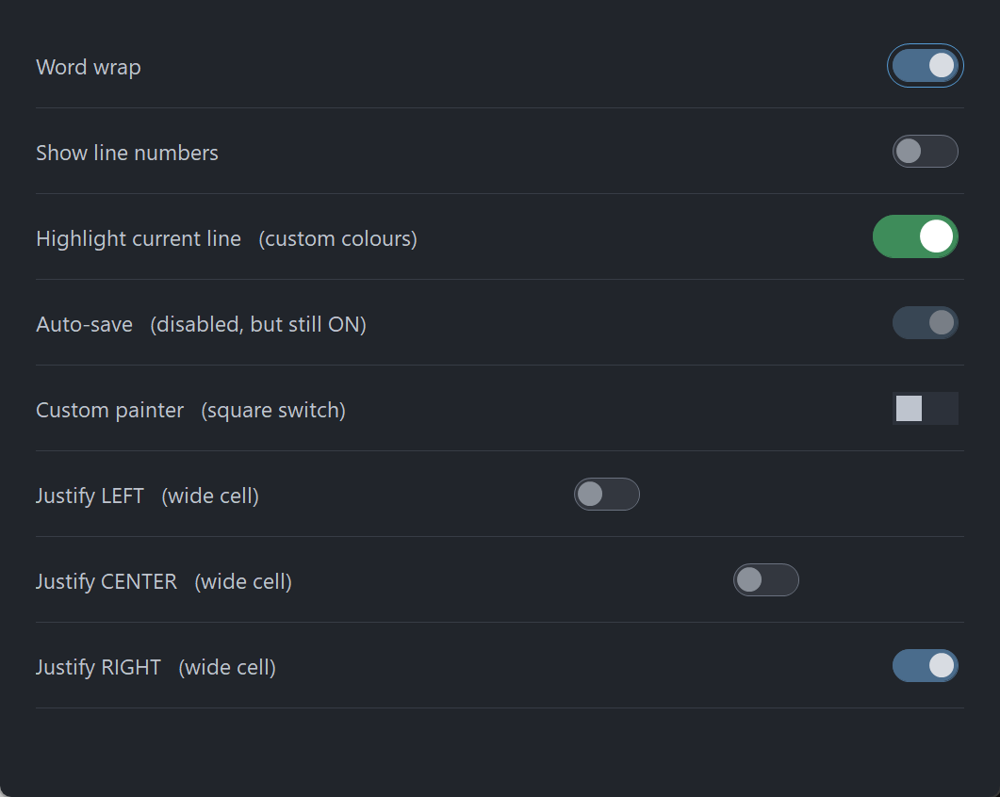

# PsToggle

An owner-drawn toggle switch for FreeBASIC Win32 applications: a rounded pill whose fill
changes with state, and a circular knob that sits at the left end when the switch is OFF and
the right end when it is ON.

It is the control you reach for in a settings list, where a checkbox would work but a switch
reads better. It takes focus, so it can be reached with Tab and operated with Space or Enter,
and it draws itself entirely — there is no system control underneath, and nothing about its
appearance depends on the visual style the user happens to be running. Every colour it paints
is one you can set.

The control has no caption. It draws only the track and the knob, so a label goes beside it,
positioned by you. There is no animation: the knob is at one end or the other.

---

## What it looks like



Eight rows: ON with the focus ring, OFF, custom green colours, disabled-but-still-ON, a square switch from a host painter, and the three justifications inside a deliberately wide cell. The pill and knob are drawn through `PsBufferPaint`'s GDI+ primitives, which is why the shoulders and the knob rim are smooth at this size.

---

## Requirements

**Files to copy into your project:**

| File | Purpose |
|---|---|
| `PsToggle.bi` | Declarations — types, callbacks, constants, function prototypes |
| `PsToggle.inc` | Implementation |
| `PsBufferPaint.bi` | The flicker-free drawing surface the control paints through |
| `PsBufferPaint.inc` | Its implementation |

**AfxNova is required.** The control is built on `CWindow`, and `PsBufferPaint` draws through
`AfxNova\CGdiPlus.inc`. Sources include AfxNova relative to the workspace root
(`#include once "AfxNova\CWindow.inc"`), so builds need the workspace root on the include
path:

```bash
fbc64.exe -i "C:\dev" main.bas
```

**Include order.** `PsToggle.inc` pulls in its own `.bi`, which pulls in `PsBufferPaint.bi`. The
two implementation files are included in this order:

```freebasic
#include once "PsBufferPaint.inc"
#include once "PsToggle.inc"
```

**GDI+ must be running before the first repaint and must outlive the last one.** The control
renders all of its geometry through GDI+, so bracket your message loop:

```freebasic
dim as ULONG_PTR gdipToken = AfxGdipInit()
' ... create windows, run the message loop ...
AfxGdipShutdown( gdipToken )
```

`AfxGdipShutdown` must come after every window is destroyed, because each repaint builds and
tears down a `PsBufferPaint`.

**Never name an identifier `ok`.** GDI+ defines `Ok = 0` as a `Status` enum value in namespace
`AfxNova`, and hosts customarily say `using AfxNova`. An existing variable, parameter or
function called `ok` becomes a duplicate definition the moment you adopt these files. Use
`bOK` instead.

**For Tab navigation, call `IsDialogMessage` in your message pump.** The control is a tabstop,
but only the dialog manager moves focus between tabstops:

```freebasic
do while GetMessage( @uMsg, null, 0, 0 )
    if uMsg.message = WM_QUIT then exit do
    if IsDialogMessage( hWndForm, @uMsg ) = 0 then
        TranslateMessage @uMsg
        DispatchMessage @uMsg
    end if
loop
```

Without it you still get full mouse behaviour, and Space and Enter still work once the control
has focus — only Tab navigation is lost. There is no other pump obligation: the control needs
no message filter of its own.

**Give something the focus at startup.** `IsDialogMessage` acts only when the focused window is
already a descendant of the window you pass it. A real dialog does this in `WM_INITDIALOG`; an
ordinary window must call `SetFocus` on its first control itself. Skip it and the first Tab
does nothing, which is indistinguishable from the tabstops being broken.

---

## Quick start

```freebasic
' Create it. The control is created zero-sized and hidden.
dim as HWND hToggle = PsToggle_Create( hWndParent, IDC_MYFORM_TOGGLE )

' Be told when the user flips it.
PsToggle_SetCheckChangedCallback( hToggle, @MyToggle_CheckChanged )

' Set the initial state. This is silent — the callback above does not fire.
PsToggle_SetChecked( hToggle, true )

' Ask how big it wants to be, then place it. GetIdealSize is valid immediately,
' before the control has ever been sized.
dim as long iw, ih
PsToggle_GetIdealSize( hToggle, iw, ih )
SetWindowPos( hToggle, 0, x, y, iw, ih, SWP_NOZORDER )

ShowWindow( hToggle, SW_SHOW )
```

And the callback:

```freebasic
sub MyToggle_CheckChanged( byval hToggle as HWND, byval isChecked as boolean )
    ' Fired only for user action: a completed click, or Space/Enter.
    ' The control's state is already updated, so PsToggle_GetChecked() = isChecked.
    gConfig.WordWrap = isChecked
end sub
```

That is the whole minimum. Everything below is refinement.

---

## Concepts

### The handle is a real HWND

`PsToggle_Create` returns an ordinary window handle, and every `PsToggle_*` function takes it. It
is not an opaque type, so you can treat the control as the window it is — `SetWindowPos` to
place and size it, `ShowWindow` to show it, `GetDlgItem` to find it by the `CtrlID` you passed
at creation.

### It is created zero-sized and hidden

`PsToggle_Create` gives the control the styles `WS_CHILD`, `WS_TABSTOP`, `WS_CLIPSIBLINGS` and
`WS_CLIPCHILDREN`, and no extended style at all. `WS_VISIBLE` is deliberately absent, so a
newly created control shows nothing until you size it and call `ShowWindow`. That lets you
build and configure a control before it is ever seen.

### Geometry is derived, never assigned

The control computes three rectangles and owns all three. You influence them through the layout
setters; you never write them.

| Rect | What it is |
|---|---|
| `rcTrack` | The pill |
| `rcKnob` | The circle, already at whichever end the current state calls for |
| `rcVisual` | `rcTrack` grown on all four sides by the focus-ring band |

The formulas, if you need to predict them:

```
  ringPad      = focusGap + focusThickness
  knobDia      = trackHeight - 2*knobInset          (floored at 1)

  rcTrack.top  = clientTop + (clientH - trackHeight) \ 2        ALWAYS v-centred
  rcTrack.left = LEFT   -> clientLeft  + ringPad
                 CENTER -> clientLeft  + (clientW - trackWidth) \ 2
                 RIGHT  -> clientRight - ringPad - trackWidth

  rcKnob.top   = rcTrack.top + knobInset            (w = h = knobDia)
  rcKnob.left  = OFF -> rcTrack.left  + knobInset
                 ON  -> rcTrack.right - knobInset - knobDia

  rcVisual     = rcTrack inflated by ringPad on all four sides
```

Layout is lazy. A setter marks the layout stale and asks for a repaint; the next paint — or any
rect query — recomputes it. There is no begin-update / end-update pair to remember, and setting
six properties in a row costs one layout pass, not six.

The knob's diameter follows the track **height** and the inset, never the width. Widening the
track lengthens the pill and leaves the knob the same size.

### The pill has an intrinsic size

It does not stretch to fill the control. Give the control a client area larger than the pill
needs and the pill is *placed* inside it — horizontally by the justification setting, and
always vertically centred.

### The focus-ring band is always reserved

The ring is drawn inside a band of `focusGap + focusThickness` pixels around the track, and that
band is reserved whether or not the control currently has focus. This is why the pill does not
jump sideways when you Tab onto it — and it is why changing either focus-ring value changes the
control's ideal size.

`PsToggle_GetIdealSize` returns those full visual bounds, ring band included. Size the control
with it and the ring is never clipped.

### Pixels, and who scales them

Only the creation-time defaults are DPI-scaled for you:

| Setting | Default | DPI-scaled at create? |
|---|---:|---|
| Track width | 40 | Yes |
| Track height | 20 | Yes |
| Knob inset | 2 | Yes |
| Focus-ring gap | 3 | Yes |
| Border thickness | 1 | **No** |
| Focus-ring thickness | 1 | **No** |

Every setter afterwards takes raw pixels and expects **you** to scale — typically
`pWindow->ScaleX(...)` / `ScaleY(...)`. The two thickness values should not be scaled at all: a
hairline should stay a hairline at any DPI.

### Programmatic changes are silent

`PsToggle_SetChecked` never fires the change callback. The callback reports **user** action — a
completed click, or Space/Enter — and nothing else. This follows Win32's own `BM_SETCHECK` /
`BN_CLICKED` split, and it means you can safely call `PsToggle_SetChecked` from inside your own
change handler without recursing.

### How a click is decided

Pressing the left button focuses the control, then takes mouse capture. The state flips on
**release**, and only if the press started on the control and the cursor is still over it. So
the standard escape gesture works: press, slide off, release — nothing happens.

While a press is live and the cursor has slid outside, the control stops painting as pressed
but the gesture is not over. Slide back on and it re-arms.

Space and Enter take exactly the same path as a completed click, so the keyboard and the mouse
cannot drift apart: both are user action, both notify.

### Keyboard handling is narrow on purpose

The control answers `WM_GETDLGCODE` with `DLGC_WANTALLKEYS` only for Space and Enter, and only
when the dialog manager is asking about one specific message. Claiming keys unconditionally
would swallow Tab and break the very navigation the control opted into by being a tabstop;
claiming nothing would let `IsDialogMessage` route Enter to your dialog's default button before
the control ever saw it.

### Enabling and disabling is real, not cosmetic

`PsToggle_SetEnabled` calls `EnableWindow`. A disabled window receives no mouse input at all and
the dialog manager's Tab skips it, so there is no way for a click or a keystroke to get past a
cosmetic check. If you call `EnableWindow` on the control directly, the control notices and
greys itself, so the two routes cannot disagree.

Disabling does **not** change the checked state. A disabled ON switch still reads as ON, which
is why the colour struct carries separate disabled colours for each state.

### Lifetime

The control frees itself when its window is destroyed. It owns no host resources: no font, no
tooltip window, nothing to release. Destroy the parent and you are done.

---

## Behaviour and limits

Firm properties of the control, not settings:

- **No caption and no font.** There is no `SetFont` / `GetFont`. Nothing about this control's
  geometry is measured, so it never takes a device context. Put your label beside it.
- **No tooltip support.** There is no tooltip callback and no tooltip window is created. If you
  want a tip, add your own tool over the control's `HWND`.
- **No animation.** The knob is at one end or the other; it does not slide.
- **No tri-state.** Checked or unchecked.
- **No hit-test function.** The entire client rectangle is the hit area, so a hit test could
  only ever return TRUE for points the caller already knows are inside.
- **Double-clicks are not special.** `CS_DBLCLKS` is deliberately off, so a rapid second click
  arrives as an ordinary down/up pair and flips the switch again. That is what you want from a
  control whose job is to flip once per click — with `CS_DBLCLKS` on, every second rapid click
  would arrive as `WM_LBUTTONDBLCLK` and be dropped.
- **Arrow keys are not handled.** Only Space and Enter activate the control. Left/right as
  off/on is a common switch idiom, but claiming the arrows would take them away from the dialog
  manager's navigation.
- **The right mouse button is reported, never acted on.** A context menu is your business. No
  capture is taken for the right button, so a right-up can arrive without a matching down.
- **Invalid justification values are ignored**, leaving the current setting in place, rather
  than laying the pill out somewhere unexpected.
- **When the control is too small for the pill, justification degrades to LEFT and the pill
  clips at the edge.** Rects are computed honestly rather than squeezed, so the pill keeps its
  proper shape and only the part past the edge is lost. The same applies vertically: a client
  shorter than the track clips top and bottom rather than deforming the pill.

---

## API reference

### Creation

| Function | Description |
|---|---|
| `PsToggle_Create( hWndParent, CtrlID ) as HWND` | Creates the control as a child of `hWndParent` and returns its window handle. `CtrlID` becomes the window's `GWLP_ID`, so `GetDlgItem` finds it. Created zero-sized and hidden — size it with `PsToggle_GetIdealSize`, place it with `SetWindowPos`, then `ShowWindow`. |

### State

| Function | Description |
|---|---|
| `PsToggle_GetChecked( hToggle ) as boolean` | TRUE when the switch is ON (knob at the right end). |
| `PsToggle_SetChecked( hToggle, isChecked )` | Sets the state and repaints. **Silent** — does not fire the change callback. No-op when the state already matches. |
| `PsToggle_GetEnabled( hToggle ) as boolean` | The control's enabled state. |
| `PsToggle_SetEnabled( hToggle, isEnabled )` | Enables or disables through `EnableWindow`, so input really stops. Disabling clears any hover and cancels a live press immediately rather than waiting for the next mouse move. Does not change the checked state. |
| `PsToggle_GetFocused( hToggle ) as boolean` | TRUE while the control has keyboard focus and is painting its focus ring. |
| `PsToggle_Refresh( hToggle )` | Marks the layout stale and requests a repaint with background erase. Rarely needed — every setter does this for you. |

### Layout

All setters take **raw pixels**; you do the DPI scaling. Each marks the layout stale and
requests a repaint.

| Function | Description |
|---|---|
| `PsToggle_GetTrackSize( hToggle, byref nTrackWidth, byref nTrackHeight )` | The pill's current size in pixels. |
| `PsToggle_SetTrackSize( hToggle, nTrackWidth, nTrackHeight )` | Sets the pill's size. Each dimension is clamped to a minimum of 1. Changing the height also changes the knob's diameter. |
| `PsToggle_GetKnobInset( hToggle ) as long` | The gap between the track edge and the knob, on all four sides. |
| `PsToggle_SetKnobInset( hToggle, nKnobInset )` | Sets that gap; clamped to a minimum of 0. An inset larger than half the track height yields a knob of diameter 1 rather than an invalid shape. |
| `PsToggle_GetBorderThickness( hToggle ) as long` | The track's border thickness. |
| `PsToggle_SetBorderThickness( hToggle, nThickness )` | Sets it; clamped to a minimum of 0, where **0 means no border at all**. Repaints but never re-lays-out — the border is drawn inside the track, so it moves nothing. Do not DPI-scale this value. |
| `PsToggle_GetFocusRing( hToggle, byref nGap, byref nThickness )` | The gap from the track to the focus ring, and the ring's own thickness. |
| `PsToggle_SetFocusRing( hToggle, nGap, nThickness )` | Sets both; each clamped to a minimum of 0. **Both change the ideal size**, because the ring's band is reserved whether or not the control has focus. Do not DPI-scale the thickness. |
| `PsToggle_GetJustify( hToggle ) as long` | The current horizontal placement: `TOG_JUSTIFY_LEFT`, `TOG_JUSTIFY_CENTER` (the default) or `TOG_JUSTIFY_RIGHT`. |
| `PsToggle_SetJustify( hToggle, nJustify )` | Places the pill horizontally when the control is wider than the pill needs. Values outside the three constants are ignored. The pill is **always** vertically centred; there is no vertical justification. |
| `PsToggle_GetIdealSize( hToggle, byref nWidth, byref nHeight )` | The full visual bounds — `(trackW + 2×ringPad) × (trackH + 2×ringPad)`, where `ringPad = focusGap + focusThickness`. Computed from the scalars rather than from the layout, so it is **valid before the control has ever been sized**. |
| `PsToggle_GetTrackRect( hToggle, byref rc ) as boolean` | The pill's rectangle in client coordinates. |
| `PsToggle_GetKnobRect( hToggle, byref rc ) as boolean` | The knob's rectangle, already positioned for the current state. |
| `PsToggle_GetVisualRect( hToggle, byref rc ) as boolean` | The track inflated by the focus-ring band. |

The three rect queries force any pending layout first, so their results are always current. Each
returns FALSE — leaving `rc` empty — when the control has no client area yet, which is the case
between `PsToggle_Create` and the first `SetWindowPos`.

### Appearance

| Function | Description |
|---|---|
| `PsToggle_GetColors( hToggle, pColors as PSTOGGLE_COLORS ptr )` | Fills your struct with the control's current colours. |
| `PsToggle_SetColors( hToggle, pColors as PSTOGGLE_COLORS ptr )` | Copies the whole struct in and repaints with background erase. |

To change one colour, read-modify-write:

```freebasic
dim as PSTOGGLE_COLORS clrs
PsToggle_GetColors( hToggle, @clrs )
clrs.TrackColorOn       = BGR( 62,140, 90)
clrs.TrackBorderColorOn = BGR( 62,140, 90)
PsToggle_SetColors( hToggle, @clrs )
```

### Callback registration

| Function | Description |
|---|---|
| `PsToggle_SetPaintCallback( hToggle, usersub )` | Installs a renderer that draws the whole control **instead of** the built-in painter. Repaints. |
| `PsToggle_SetMessageCallback( hToggle, userfunc )` | Installs an observer for mouse, focus and key messages. |
| `PsToggle_SetCheckChangedCallback( hToggle, usersub )` | Installs the handler told when the **user** flips the switch. |

All three are optional and independent.

---

## Colors

The colour surface is one flat struct, `PSTOGGLE_COLORS`, with twenty `COLORREF` fields: three
drawn parts (track fill, track border, knob) × two states (ON / OFF) × three moods (idle, hot,
disabled), plus the control's own background and the focus ring. Every field ships with a usable
dark-theme default, so a control you never call `PsToggle_SetColors` on still looks right.

| Field | Paints |
|---|---|
| `BackColor` | The control's own client area, behind the pill |
| `FocusRingColor` | The focus ring, drawn only while the control has focus |
| `TrackColorOn` | Pill fill, ON, idle |
| `TrackColorOnHot` | Pill fill, ON, mouse over or pressed |
| `TrackColorOnDisabled` | Pill fill, ON, disabled |
| `TrackBorderColorOn` | Pill border, ON, idle |
| `TrackBorderColorOnHot` | Pill border, ON, mouse over or pressed |
| `TrackBorderColorOnDisabled` | Pill border, ON, disabled |
| `KnobColorOn` | Knob, ON, idle |
| `KnobColorOnHot` | Knob, ON, mouse over or pressed |
| `KnobColorOnDisabled` | Knob, ON, disabled |
| `TrackColorOff` | Pill fill, OFF, idle |
| `TrackColorOffHot` | Pill fill, OFF, mouse over or pressed |
| `TrackColorOffDisabled` | Pill fill, OFF, disabled |
| `TrackBorderColorOff` | Pill border, OFF, idle |
| `TrackBorderColorOffHot` | Pill border, OFF, mouse over or pressed |
| `TrackBorderColorOffDisabled` | Pill border, OFF, disabled |
| `KnobColorOff` | Knob, OFF, idle |
| `KnobColorOffHot` | Knob, OFF, mouse over or pressed |
| `KnobColorOffDisabled` | Knob, OFF, disabled |

### Which colour wins

The built-in painter picks one fill, one border and one knob colour per repaint, in this
precedence:

```
disabled   >   hot or pressed   >   idle
```

within whichever of the two state groups (ON or OFF) currently applies.

**There are no pressed colours.** A live press renders as hot, which reads correctly for a
control that flips on release. The pressed flag is still handed to a paint callback, so a custom
renderer can draw a distinct pressed look if it wants one.

**Disabled colours are per-state on purpose:** a disabled ON switch must still read as ON.

### Why the ON pill looks borderless by default

`TrackBorderColorOn*` defaults to exactly the matching `TrackColorOn*`, so the ON pill reads as
a solid shape with no outline. The OFF pill is distinguished the other way: its fill sits close
to the background and its border is markedly lighter, so it reads as an outline. That asymmetry
is the intended look. If you want a visible ON border, set the field to something different from
the fill.

### What the painter draws

| Part | Shape |
|---|---|
| Track | A rounded rectangle whose corner ellipse is as wide and tall as the rect's own height. That, and only that, is what makes both ends exact semicircles and turns a rounded rectangle into a pill. Drawn with a border when the border thickness is above 0, filled without one at 0. |
| Knob | A filled ellipse, no rim. |
| Focus ring | A rounded **outline** over `rcVisual`, drawn only while the control has focus and the ring thickness is above 0. Never a fill — it is drawn over the pill, and a filled shape there would erase it. |

All of it goes through `PsBufferPaint`, which renders geometry with GDI+, so the pill's shoulders
and the knob's rim are antialiased. A paint callback gets that same buffer and inherits the same
antialiased primitives.

---

## Callbacks

### Check changed

```freebasic
type TOG_CheckChangedCallbackSub as sub( byval hToggle as HWND, byval isChecked as boolean )
```

The user flipped the switch — a completed click, or Space/Enter. Fires **after** the control's
state is updated, so `PsToggle_GetChecked( hToggle )` already equals `isChecked`.

It does not fire for `PsToggle_SetChecked`, which is what makes it safe to call that setter from
inside this handler.

### Paint

```freebasic
type TOG_PaintCallbackSub as sub( byval p as PSTOGGLE_PAINTINFO ptr )
```

Draws the whole control **instead of** the built-in painter. Paint through `p->b`, the control's
double buffer for this repaint — do not touch the screen DC.

The control has already filled the client with `BackColor` before calling you, so a callback
that only wants to add something on top does not have to repaint the background.

`PSTOGGLE_PAINTINFO` carries everything you need:

| Field | Meaning |
|---|---|
| `hToggle` | The control, so the callback can query it |
| `b` | The control's `PsBufferPaint` for this repaint (borrowed, not owned) |
| `rcClient` | The whole client area |
| `rcTrack` | The pill |
| `rcKnob` | The circle, already at the end the current state calls for |
| `rcVisual` | `rcTrack` inflated by the focus-ring padding |
| `isChecked` | ON when TRUE |
| `isHot` | The mouse is over the control |
| `isPressed` | A live left press **and** the cursor is still inside |
| `isEnabled` | The control's enabled state |
| `isFocused` | Draw a focus ring when TRUE |

All three rects are precomputed. Use them as given — in particular, do not re-derive the knob
from the track by repeating the inset arithmetic, because the inset can change underneath you.

`isPressed` goes FALSE when the cursor slides off during a press, without the gesture ending.
That is deliberate: the press should stop *looking* armed the moment the cursor leaves.

> **A paint callback that fills a rectangle covering the whole control will erase everything
> under it.** Draw your additions, not a background — the control has already painted one.

### Message

```freebasic
type TOG_MessageCallbackFunc as function( byval m as PSTOGGLE_MESSAGEINFO ptr ) as boolean
```

Observes messages as they arrive. Return TRUE to suppress the control's own handling of that
message, FALSE to let it proceed.

`PSTOGGLE_MESSAGEINFO` carries `hToggle`, `uMsg`, `wParam` and `lParam`.

Mouse messages, focus changes (`WM_SETFOCUS`, `WM_KILLFOCUS`) and `WM_KEYDOWN` are all reported
here.

**Your return value is ignored for three messages:**

| Message | Why |
|---|---|
| `WM_LBUTTONUP` | The control holds mouse capture across a press, and the up-message is what releases it. A callback that suppressed it would strand the capture and route every later click to this control. Suppressing `WM_LBUTTONDOWN` suppresses the press itself, which *is* allowed — no capture has been taken at that point. |
| `WM_SETFOCUS` | Focus is a fact the system reports, not an action to veto. The state is already updated by the time you are called. A host that does not want the control focusable must not make it a tabstop. |
| `WM_KILLFOCUS` | As above. |

For every other message, TRUE suppresses the default handling.

---

## Constants

```freebasic
enum
    TOG_JUSTIFY_LEFT = 0
    TOG_JUSTIFY_CENTER      ' the default
    TOG_JUSTIFY_RIGHT
end enum
```

| Constant | Value | Meaning |
|---|---:|---|
| `PSTOGGLE_DEFAULT_TRACKW` | 40 | Default track width, DPI-scaled at create |
| `PSTOGGLE_DEFAULT_TRACKH` | 20 | Default track height, DPI-scaled at create |
| `PSTOGGLE_DEFAULT_KNOBINSET` | 2 | Default knob inset, DPI-scaled at create |
| `PSTOGGLE_DEFAULT_BORDERTHICK` | 1 | Default border thickness, never DPI-scaled |
| `PSTOGGLE_DEFAULT_FOCUSGAP` | 3 | Default focus-ring gap, DPI-scaled at create |
| `PSTOGGLE_DEFAULT_FOCUSTHICK` | 1 | Default focus-ring thickness, never DPI-scaled |

## Licence

[Mozilla Public License 2.0](LICENSE).

MPL-2.0 is file-level copyleft, chosen deliberately for a drop-in control:

- **You may use this in closed-source software**, commercial or otherwise.
  §3.2 permits static linking with no additional conditions.
- **If you modify these files, publish those files' changes.** The obligation is
  per-file — your own sources are unaffected however tightly they are combined
  with these.
- The Exhibit B "Incompatible With Secondary Licenses" notice is **not applied**,
  which keeps this GPL-compatible.
