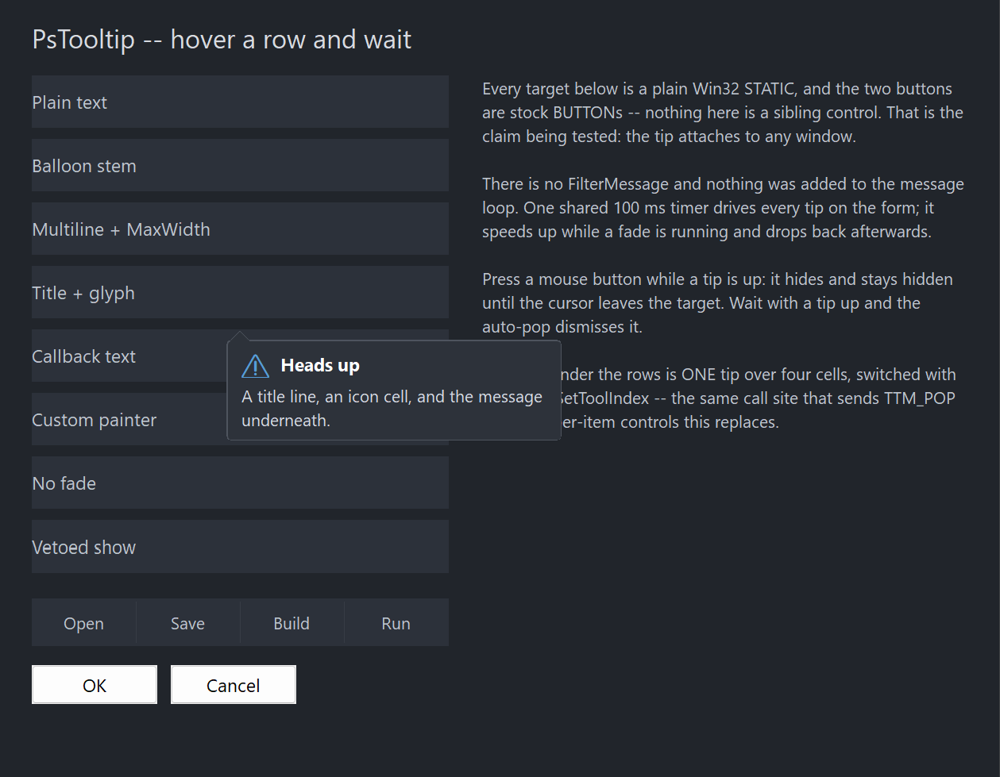

# PsTooltip

An owner-drawn tooltip for FreeBASIC/Win32 applications built on the AfxNova framework.

`PsTooltip` is a `WS_POPUP` window that appears near the cursor after a dwell, shows a message —
optionally wrapped, optionally under a bold title and an icon glyph — fades in, and goes away
again. It draws itself, so it matches an owner-drawn application instead of looking like system
chrome, and it adds capabilities the comctl32 tooltip does not expose without message-level
poking: word wrap with a maximum width, a title band, a balloon stem that points at the target,
and a fade you can time or switch off.

You attach one to a control and then largely forget about it. `PsTooltip_Create( hCtrl )` creates
the tip *and* attaches it; from that point a shared timer watches the cursor and decides when to
show, when to hide, and how to fade. **It does not subclass the control it serves** and it adds
nothing to your message loop.

It is a display element only. It never takes focus, never takes activation, and is
hit-test transparent, so clicks pass straight through it to whatever is underneath. Only one tip
is ever on screen at a time, whatever number of them you create.

Repository: <https://github.com/PaulSquires/PsTooltip>

---

## What it looks like



Each row in the demo is a plain Win32 `STATIC` with its own tip configured differently. The tip
shown is the "Title + glyph" one: an icon cell, a bold title band, a wrapped message, and a
balloon stem pointing back at the cursor. Only one tip is visible at any moment, which is why the
other seven are not also in the picture.

---

## Requirements

| File | Purpose |
|---|---|
| `PsTooltip.bi` | Public surface: types, enums, callback typedefs, declarations |
| `PsTooltip.inc` | Implementation |
| `PsBufferPaint.bi` | Flicker-free drawing surface |
| `PsBufferPaint.inc` | |

`PsBufferPaint` must be at version carrying `PaintPolygon`; `TIP_STYLE_BALLOON` draws its stem
with it.

### Include order

Verified against the demo's `main.bas`. `PsTooltip.inc` includes `PsTooltip.bi` itself, so you
only name the `.inc` — but `PsBufferPaint.inc` must come first:

```freebasic
#include once "windows.bi"
#include once "AfxNova\CWindow.inc"
#include once "AfxNova\AfxStr.inc"
#include once "AfxNova\AfxGdiplus.inc"
using AfxNova

#include once "PsBufferPaint.inc"
#include once "PsTooltip.inc"
```

### GDI+ must be running

The frame, the rounded corners and the stem are geometry drawn through GDI+. Initialise it before
the first repaint and shut it down after every window is destroyed:

```freebasic
dim as ULONG_PTR gdipToken = AfxGdipInit()
function = frmMain_Show( 0 )
AfxGdipShutdown( gdipToken )
```

Without the bracket the tip draws nothing at all.

### Do not name any identifier `ok`

GDI+ defines `Ok = 0` as a `Status` enum value in namespace `AfxNova`, and your host says
`using AfxNova`. Any variable, parameter or function of yours called `ok` becomes a duplicate
definition the moment you adopt this control. Use `bOK`.

### There is no pump obligation

**`PsTooltip` has no `FilterMessage` and needs nothing added to your message loop.** If you are
coming from `PsComboBox`, `PsTextBox`, `PsMenuBar`, `PsNumericUpDown` or `PsDatePicker` you will
be looking for one — there isn't one. The dwell detection, click dismissal and fade all run off a
shared timer, and the tip never receives keyboard input, so there is nothing for a filter to do:

```freebasic
dim as MSG uMsg
while GetMessage( @uMsg, null, 0, 0 )
    TranslateMessage( @uMsg )
    DispatchMessage( @uMsg )
wend
```

### Destroy the tip with the control it serves

The tip is a top-level window and nothing else will free it. Destroy it where you destroy the
control it is attached to:

```freebasic
case WM_NCDESTROY
    if IsWindow( pCtrl->hTip ) then DestroyWindow( pCtrl->hTip )
```

---

## Quick start

```freebasic
' One call creates the tip AND attaches it to the control.
dim as HWND hTip = PsTooltip_Create( hMyControl )

PsTooltip_SetFonts( hTip, ghFont(GUIFONT_9), ghFont(GUIFONTBOLD_10), ghFont(GUIFONT_14) )
PsTooltip_SetText( hTip, "A plain tooltip." )
```

That is a complete working tooltip. Everything below is optional.

A wrapped tip with a title, an icon and a stem:

```freebasic
PsTooltip_SetTitle( hTip, "Heads up" )
PsTooltip_SetGlyph( hTip, wchr(&h26A0) )              ' from the glyph font
PsTooltip_SetText(  hTip, "A title line, an icon cell, and the message underneath." )
PsTooltip_SetMaxWidth( hTip, 260 )
PsTooltip_SetStyle( hTip, TIP_STYLE_BALLOON )
```

Text supplied on demand instead of stored — the callback runs only when a tip is about to
appear, so it can report live state:

```freebasic
PsTooltip_SetTooltipCallback( hTip, @MyTipCallback )

private function MyTipCallback( byval hTooltip as HWND, byval hAttached as HWND, _
                                byval idx as long ) as DWSTRING
    if idx < 0 then return ""                         ' "" means show no tip at all
    dim as DWSTRING wszOut = "Row " & str(idx) & ": " & gRows(idx).Name
    return wszOut
end function
```

For a control with several hot regions, use one tip for the whole window and tell it which item
the cursor is over. Call this from your `WM_MOUSEMOVE` — a set to the value it already holds
costs nothing:

```freebasic
case WM_MOUSEMOVE
    dim as long idx = HitTestMyCells( hwnd, x, y )
    PsTooltip_SetToolIndex( hTip, idx )               ' -1 when over no cell
```

---

## Concepts

### The handle is a real `HWND`

`PsTooltip_Create` returns an ordinary window handle. It is not an opaque token — but unlike
every other control you will not position it, because the tip decides its own place.

### It sizes and places itself

This is the one control here that is not a rectangle you lay out. Its **size** comes from its
content (text, title, glyph, padding, border, stem band) and its **position** from the cursor or
from an anchor rect you pass to `PsTooltip_ShowForRect`. `PsTooltip_GetIdealSize` is
informational; nothing you do with `SetWindowPos` will survive the next show.

Placement clamps into the work area of the nearest monitor, and when there is no room below the
anchor the tip **flips above it** rather than being pushed up over it.

### Size formula

```
contentW = max( titleRow, message )
    titleRow = glyphCell + (gap if both a glyph and a title) + title
    message  = measured at nMaxWidth when one is set, natural width otherwise

width  = contentW + 2*padX + 2*border
height = titleRowHeight + (titleGap if both bands present) + messageHeight
         + 2*padY + 2*border
         + stemHeight   (TIP_STYLE_BALLOON only)
```

`SetMaxWidth` caps the **text wrap**, not the window. The width is a `max()` over the bands, so a
title longer than the cap legitimately makes the tip wider — clamping there would clip the title
rather than the thing the cap was aimed at.

### The glyph cell is declared, not measured

`PsTooltip_SetGlyphCell` states how much room the icon gets. Nothing is measured, so a glyph that
is missing from the font, or a different size from the last one, cannot shift the text underneath
it.

### It watches the cursor; it does not subclass your control

The tip never sees your control's messages. A shared timer samples the cursor position, works out
which attached control it is over, and decides from there. That means:

- Attaching costs your control nothing and changes none of its behaviour.
- The tip cannot see your control's *items*, which is why per-item tips need
  `PsTooltip_SetToolIndex`.
- A control that is hit-test transparent still works. A plain `STATIC` without `SS_NOTIFY`
  reports `HTTRANSPARENT`, so `WindowFromPoint` returns its parent; the tip recognises that case.

### Text resolution order

1. `PsTooltip_SetText` — if it is non-empty, that is the text.
2. Otherwise `TIP_TooltipCallbackFunc`, if one is set.
3. Otherwise no tip appears.

**There is no fallback to the attached control's caption.** If you want the item text as the tip,
return it from the callback.

### Programmatic and user-driven shows both notify

`TIP_ShowCallbackFunc` reports a window-state transition, so it fires for `PsTooltip_Show` as well
as for a dwell. Its showing edge is a veto: return FALSE and no tip appears, and no matching
hiding edge follows.

---

## Behaviour and limits

- **Only one tip is visible at a time**, process-wide. Showing one hides any other.
- **The stem is always vertical.** Every placement mode puts the tip above or below its anchor,
  never beside it, so the stem leaves the top or the bottom edge. There is no left or right stem.
- **A tip that is up does not follow the cursor.** Moving within the same control neither moves
  nor dismisses it; leaving the control, clicking, changing the tool index or the auto-pop delay
  are what end it.
- **A click hides the tip and suppresses it** until the cursor leaves the control and comes back.
- **A refused show is not retried during the same hover.** Returning FALSE from the show callback,
  or `""` from the tooltip callback, suppresses the tip until the cursor leaves — so a host
  callback is consulted once per hover, not on every timer tick.
- **The stem is dropped, not shrunk, when it will not fit.** A tip narrower than
  `curvature + stemWidth` on both sides draws as a plain rounded rectangle.
- **The window is region-shaped**, so its edge is hard where the region clips. At the default
  curvature this is not visible; at a large curvature the outermost antialiased pixel of each
  corner is lost.
- **Fonts are borrowed.** The control never creates or deletes one. Do not delete a font while a
  tip using it is alive.
- **Single-threaded.** UI thread only.
- **`PsTooltip_SetToolIndex` is the only way the tip learns about your items.** It has no
  hit-testing of its own.
- **Timing is per tip, not global.** Each instance has its own delays and fade time.

---

## API reference

### Creation and attachment

| Function | Behaviour |
|---|---|
| `PsTooltip_Create( hAttach, CtrlID = 0 ) as HWND` | Creates the tip **and** attaches it to `hAttach`. The popup's owner is `GetAncestor( hAttach, GA_ROOT )`. Returns 0 if `hAttach` is not a window. You own the result and must destroy it. |
| `PsTooltip_Attach( hTooltip, hAttach )` | Re-points an existing tip at another window. Hides it first. Passing 0 is the same as `Detach`. |
| `PsTooltip_Detach( hTooltip )` | Stops watching. The tip stays alive but can never show. |
| `PsTooltip_GetAttached( hTooltip ) as HWND` | The window currently being watched, or 0. |

### Content

| Function | Behaviour |
|---|---|
| `PsTooltip_SetText( hTooltip, wszText )` | The authored message. `""` means "ask the callback, then show nothing". Discards the resolved text so the next show re-reads it. |
| `PsTooltip_GetText( hTooltip ) as DWSTRING` | The authored message, not the resolved one. |
| `PsTooltip_SetTitle( hTooltip, wszTitle )` | Optional bold first line. `""` removes the band. |
| `PsTooltip_GetTitle( hTooltip ) as DWSTRING` | |
| `PsTooltip_SetGlyph( hTooltip, wszGlyph )` | A character drawn from the glyph font in the declared cell. `""` removes it. |
| `PsTooltip_GetGlyph( hTooltip ) as DWSTRING` | |
| `PsTooltip_SetToolIndex( hTooltip, idx )` | Which item the tip describes; `-1` for a whole-control tip. **A set to the current value is a no-op**, so it is safe from `WM_MOUSEMOVE`. A real change hides any visible tip without a fade and lets the short reshow delay apply. |
| `PsTooltip_GetToolIndex( hTooltip ) as long` | |

### Appearance

| Function | Behaviour |
|---|---|
| `PsTooltip_SetColors( hTooltip, pColors )` | Copies the struct by value. Repaints. |
| `PsTooltip_GetColors( hTooltip, pColors )` | Fills your struct. |
| `PsTooltip_SetFonts( hTooltip, hText, hTitle = 0, hGlyph = 0 )` | All three are **borrowed**. `hTitle`/`hGlyph` of 0 fall back to `hText`. |
| `PsTooltip_SetStyle( hTooltip, nStyle )` | `TIP_STYLE_RECT` or `TIP_STYLE_BALLOON`. The balloon adds `stemHeight` to the tip's height and nothing to its width. |
| `PsTooltip_GetStyle( hTooltip ) as long` | |
| `PsTooltip_SetMaxWidth( hTooltip, nMaxWidth )` | Caps the text wrap in pixels; 0 disables wrapping, leaving only embedded newlines to break lines. Not a clamp on the window — see the size formula. |
| `PsTooltip_GetMaxWidth( hTooltip ) as long` | |
| `PsTooltip_SetPadding( hTooltip, nX, nY )` | Negative values leave that axis unchanged. |
| `PsTooltip_SetCurvature( hTooltip, nCurvature )` | Corner ellipse **diameter**. Negative is clamped to 0 (square corners). |
| `PsTooltip_SetBorderWidth( hTooltip, nBorderWidth )` | Negative is clamped to 0 (no frame). Raw pixels — the pen is DPI-scaled when it is drawn, so do not pre-scale it. |
| `PsTooltip_SetStemSize( hTooltip, nW, nH )` | Negative values leave that axis unchanged. A width below 2 or a height below 1 means no stem is drawn. |
| `PsTooltip_SetGlyphCell( hTooltip, nCell, nGap )` | The declared icon cell and the gap between it and the title. Negative values leave that field unchanged. The gap is only spent when there is a title beside the glyph. |

### Timing

All in milliseconds. Negative values are clamped to 0. Defaults derive from `GetDoubleClickTime()`.

| Function | Behaviour |
|---|---|
| `PsTooltip_SetInitialDelay( hTooltip, nMs )` | How long the cursor must rest before a tip appears. |
| `PsTooltip_SetAutoPopDelay( hTooltip, nMs )` | How long a tip stays up. **0 means it never expires.** After an auto-pop the tip is suppressed until the cursor leaves. |
| `PsTooltip_SetReshowDelay( hTooltip, nMs )` | The shorter delay used when a tip was shown and dismissed recently. |
| `PsTooltip_SetFadeTime( hTooltip, nMs )` | Fade duration, in and out. **0 disables the fade** and the tip appears instantly. A fade is interruptible: hiding mid-fade-in continues down from the current opacity. |
| `PsTooltip_SetMoveTolerance( hTooltip, nPixels )` | How far the cursor may drift and still count as at rest. |

### Process-wide defaults

A control in this family creates its tooltip **for itself, lazily**, and never hands the host
the `HWND`. Styling every tip on a form one at a time is therefore impossible from the outside.
These set what `PsTooltip_Create` applies to each new tip — call them once at startup, before
any control is created.

Each is **independently armed**: a field you never set keeps the value `Create` derives for it.
That is why this is five calls and not one struct — `Create` derives all three delays from
`GetDoubleClickTime()`, and a zeroed struct would silently replace a machine-appropriate 500 ms
with 0 for a host that only wanted to change the colours.

| Function | Behaviour |
|---|---|
| `PsTooltip_SetDefaultColors( pColors )` | Colours for every tip created afterwards. |
| `PsTooltip_SetDefaultFonts( hText, hTitle, hGlyph )` | Fonts, **borrowed** — the host keeps ownership and must outlive every tip. This is the one real hazard in the block, since the promise is being made to controls the host never sees. |
| `PsTooltip_SetDefaultStyle( nStyle )` | `TIP_STYLE_RECT` or `TIP_STYLE_BALLOON`. |
| `PsTooltip_SetDefaultMaxWidth( nMaxWidth )` | Wrap width, in raw pixels — the caller scales, as everywhere else here. |
| `PsTooltip_SetDefaultDelays( nInitialMs, nAutoPopMs, nReshowMs )` | A **negative** argument leaves that delay alone, so "just change the hover time" is one call that cannot disturb the other two. |
| `PsTooltip_ClearDefaults()` | Disarms everything. Later tips are derived again. |
| `PsTooltip_ApplyDefaults( hTooltip )` | Applies the armed defaults to a tip that **already exists**. `Create` calls this itself; a host calls it to re-theme after a theme switch. |

```freebasic
' Once, at startup -- every control's tooltip follows, including ones built lazily later.
dim tipColors as PSTOOLTIP_COLORS
tipColors.BackColor = BGR(250,250,250)
tipColors.ForeColor = BGR( 30, 30, 30)
PsTooltip_SetDefaultColors( @tipColors )
PsTooltip_SetDefaultFonts( ghFontUI )
PsTooltip_SetDefaultMaxWidth( 260 )
PsTooltip_SetDefaultDelays( 400 )          ' hover time only; the other two stay derived
```

### The system's own tooltip font

`PsTooltip_GetSystemFont( byref info as PSTOOLTIP_SYSTEMFONT ) as boolean`

Reads `SPI_GETNONCLIENTMETRICS`'s `lfStatusFont` — the face **Windows itself** draws tooltips
and the status bar in — and reports it. It creates nothing: this control never creates a font
(the family rule), so you build the `HFONT` and you own it, exactly as for
`PsTooltip_SetFonts`.

It lives here for the same reason the delays are derived from `GetDoubleClickTime()` rather
than picked: a tip drawn in a different face and size from every other tip on the machine
reads as broken. A host that wants its own font simply does not call this.

Returns FALSE if the system refuses **or** if what it reports is unusable — no face name, or
no derivable point size. On FALSE your struct is **not touched**, so you fall back to a face of
your own rather than to an empty `LOGFONT`.

| Field | Meaning |
|---|---|
| `wszFaceName` | The typeface, e.g. `Segoe UI`. |
| `pointSize` | `pixelHeight` converted against the screen's real `LOGPIXELSY`. **This is the field to build from.** |
| `pixelHeight` | `abs(lfHeight)`, exactly as the system reported it. |
| `lfWeight` | The raw `LOGFONT` weight. **Build from this**, not from `isBold`. |
| `isBold` | `lfWeight >= FW_BOLD`. A convenience, and lossy — see below. |
| `isItalic` | `lfItalic <> 0`. |

> **Use `pointSize`, not `pixelHeight` — the difference is not cosmetic.**
> `lfHeight` comes back in **pixels at the current DPI**. Every font-building call that takes a
> size in **points** — `CWindow.CreateFont` among them — DPI-scales what it is given, so handing
> it the pixel height asks for a font about **1.75× too large on a 175% display, and looks
> correct at 100%**. That is how the bug ships. Points are DPI-neutral, so
> pixels → points → `CreateFont` lands back on the size the system asked for. Measured at 175%:
> `LOGPIXELSY 168`, `pixelHeight 21`, `pointSize 9`.

> **Build from `lfWeight`, not `isBold`.** `FW_BOLD` is a threshold. A system face at
> `FW_SEMIBOLD` reports `isBold = false`, and a host that rebuilt from the boolean alone would
> redraw it at `FW_NORMAL` — visibly lighter than the system asked for.

```freebasic
' Take the system's tooltip face, and fall back to your own if it will not answer.
dim sf as PSTOOLTIP_SYSTEMFONT
if PsTooltip_GetSystemFont( sf ) then
    ghTipFont     = pWindow->CreateFont( sf.wszFaceName, sf.pointSize, sf.lfWeight, sf.isItalic )
    ghTipFontBold = pWindow->CreateFont( sf.wszFaceName, sf.pointSize, FW_HEAVY,    sf.isItalic )
end if
if ghTipFont = 0 then ghTipFont = pWindow->CreateFont( "Segoe UI", 9, FW_NORMAL )

' The fonts are BORROWED by every tip -- keep them alive, and destroy them yourself.
PsTooltip_SetDefaultFonts( ghTipFont, ghTipFontBold, ghGlyphFont )
```

### Showing and hiding

These bypass the dwell. The timer still auto-hides what they put up.

| Function | Behaviour |
|---|---|
| `PsTooltip_Show( hTooltip ) as boolean` | Shows at the current cursor position. Returns FALSE if the text resolves empty, the layout cannot be measured, or a show callback vetoes it. |
| `PsTooltip_ShowForRect( hTooltip, rcAnchor, nAlign = TIP_ALIGN_BELOW ) as boolean` | Shows against a **screen** rect — how you pin a tip under a specific row or cell instead of following the cursor. |
| `PsTooltip_Hide( hTooltip )` | Hides, with a fade if one is configured. |
| `PsTooltip_IsVisible( hTooltip ) as boolean` | TRUE while shown, including during a fade out. |

### Callback registration

| Function | Behaviour |
|---|---|
| `PsTooltip_SetPaintCallback( hTooltip, userfunc )` | Replaces the built-in painter entirely. Repaints. |
| `PsTooltip_SetMessageCallback( hTooltip, userfunc )` | Observes the tip window's messages. |
| `PsTooltip_SetTooltipCallback( hTooltip, userfunc )` | Supplies text on demand. Discards the resolved text so the next show re-reads it. |
| `PsTooltip_SetShowCallback( hTooltip, userfunc )` | Notified on show and hide; the showing edge can veto. |

### Geometry and introspection

| Function | Behaviour |
|---|---|
| `PsTooltip_GetIdealSize( hTooltip, byref nW, byref nH ) as sub` | The size the tip would be for its current content, stem band included. Forces the pending layout, so it is always current, and resolves the text if it has not been resolved yet — which can run your tooltip callback. |
| `PsTooltip_GetPartRect( hTooltip, nPart ) as RECT` | The rect of a `TIP_PART_*` region in client coordinates. Empty for a part that is not present (no glyph, no title, no stem). Forces the pending layout. |

### Placement and animation helpers

Pure functions — no window, no timer, no state. They are the arithmetic behind placement, exposed
so you can reproduce or predict it.

| Function | Behaviour |
|---|---|
| `PsTooltip_ComputeOrigin( rcAnchor, tipW, tipH, rcWork, nAlign, nCursorOffset ) as POINT` | Where a tip of that size goes against that anchor, clamped into `rcWork`, flipping past the anchor when there is no room. All rects in the same (screen) space. |
| `PsTooltip_StemOnTop( rcAnchor, ptOrigin, nAlign ) as boolean` | TRUE when the resulting tip sits below its anchor, i.e. the stem leaves the top edge. |
| `PsTooltip_ComputeStem( cxClient, cyClient, bStemOnTop, nStemW, nStemH, nTargetX, nCurvature, pts ) as boolean` | Fills `pts(0..2)` with the stem's vertices in client coordinates, clamped clear of the rounded corners. FALSE — leaving `pts` untouched — when the client is too narrow, the stem size is degenerate, or `pts` is null. |
| `PsTooltip_ComputeAlpha( nElapsed, nFadeMs, bFadingIn ) as long` | The fade ramp, 0..255, clamped at both ends. `nFadeMs <= 0` gives an instant transition. |
| `PsTooltip_ShouldShow( bOver, bResting, bHasText, bButtonDown, bSuppressed ) as boolean` | The complete decision table for whether a tip may appear. |

### Test seam

| Function | Behaviour |
|---|---|
| `PsTooltip_TickForTest( hTooltip, ptCursor, bOver, bButtonDown, dwNow )` | Drives exactly one tick of the dwell/hide/fade state machine with injected inputs, instead of waiting for the shared timer and reading the real cursor. `bOver` is stated rather than derived, because a test cannot fake `WindowFromPoint`. Pass **real** timestamps offset from one `GetTickCount()` base — hide bookkeeping stamps itself from the real clock, so a synthetic value near zero would wrap the unsigned arithmetic. |

This is a test seam, not a control channel: calling it from application code fights the shared
timer, which is still running and will tick with the real cursor a moment later. It exists
because everything that decides *when* a tip appears — the dwell, the reshow-versus-initial delay
choice, the movement tolerance, click suppression, auto-pop, the fade, and the rule that a
refused show covers the whole hover — otherwise needs a live message loop and a real mouse to
exercise.

### Render probes

Both drive the real paint path into an offscreen buffer. They exist so a host that replaces the
painter can assert its render is sane.

| Function | Behaviour |
|---|---|
| `PsTooltip_CountRenderedTones( hTooltip, nPart ) as long` | Distinct colours in a part rect, capped at 256. 0 if the part is empty or the surface could not be created. |
| `PsTooltip_HashRenderedPart( hTooltip, nPart ) as ulong` | FNV-1a over a part rect, for asserting that a state change reached the pixels. |

Two cautions if you build assertions on these. A tone floor copied from another control is
meaningless — the number depends entirely on what else is inside the part rect, and a frame's
antialiased corners survive a render with nothing left in it. And a hash comparison must isolate
its variable: if the change under test also alters the tip's size, the part rect moves and the
hash changes for that reason instead.

---

## Colors

`PSTOOLTIP_COLORS` — five fields, which is as many surfaces as a tooltip has. There are no
per-state variants: the tip has no hot, pressed or disabled mood, because it is never interactive.

| Field | Paints | Default |
|---|---|---|
| `BackColor` | The body fill, and the stem's interior | `BGR(45, 50, 58)` |
| `BorderColor` | The frame, and the stem's two sloped edges | `BGR(78, 84, 94)` |
| `ForeColor` | The message | `BGR(212, 217, 226)` |
| `TitleColor` | The title line | `BGR(255, 255, 255)` |
| `GlyphColor` | The icon glyph | `BGR(86, 156, 214)` |

Paint order in the built-in painter: body fill → frame → stem fill → stem edges → glyph → title →
message. The stem is filled **after** the frame on purpose, with a skirt reaching into the body,
so the frame's edge does not draw a line across the stem's base and leave the balloon looking like
a triangle stuck onto a closed box.

---

## Callbacks

### `TIP_TooltipCallbackFunc`

```freebasic
type TIP_TooltipCallbackFunc as function( byval hTooltip as HWND, _
                                          byval hAttached as HWND, _
                                          byval idx as long ) as DWSTRING
```

Supplies the message on demand. Consulted **only** when the tip has no authored text, and **only**
when a tip is about to appear — not on the timer ticks that decide against one. `idx` is whatever
was last given to `PsTooltip_SetToolIndex`, or `-1`. Return `""` for no tooltip.

### `TIP_ShowCallbackFunc`

```freebasic
type TIP_ShowCallbackFunc as function( byval hTooltip as HWND, _
                                       byval hAttached as HWND, _
                                       byval idx as long, _
                                       byval bShowing as boolean ) as boolean
```

The showing edge runs after the text is resolved and the window sized, but before anything reaches
the screen — **return FALSE to suppress the tip**. The hiding edge's result is ignored; a tip
already on screen cannot be un-hidden. Both edges fire for programmatic shows and hides. A vetoed
show produces no matching hide.

**A veto covers the whole hover, not one attempt.** The dwell conditions are still true a tick
later, so a refused show suppresses the tip until the cursor leaves the attached control — which
also means you are consulted once per hover rather than ten times a second. Changing the tool
index clears that suppression, so vetoing one cell does not silence the rest of the control.

### `TIP_PaintCallbackSub`

```freebasic
type TIP_PaintCallbackSub as sub( byval p as PSTOOLTIP_PAINTINFO ptr )
```

Draws the whole tip instead of the built-in painter, through `p->b`. Nothing has been drawn when
you are called — the fill and the frame are one rounded shape, so pre-filling the client would put
square corners behind it.

Three things to honour:

- **Paint the body against `p->rcBody`, not `p->rcClient`.** `rcClient` includes the stem band.
- **Draw the message with `p->nTextFlags` and the font you gave `SetFonts`.** The window was sized
  by measuring with both; a different font or different flags means the size is wrong and the text
  clips.
- **Do not use `PaintBorderRect` or `PaintRoundBorderRect` to draw a frame.** They fill
  unconditionally before stroking, so over existing pixels they erase everything beneath.
  `PaintRoundOutline` strokes without filling. `PsTooltip_CountRenderedTones` exists so you can
  assert you have not done it.

### `TIP_MessageCallbackFunc`

```freebasic
type TIP_MessageCallbackFunc as function( byval m as PSTOOLTIP_MESSAGEINFO ptr ) as boolean
```

Observes the tip window's messages; return TRUE to suppress the default handling.

Very little arrives here, so do not go looking for something that cannot come. The tip is
`WS_EX_NOACTIVATE`, answers `WM_MOUSEACTIVATE` with `MA_NOACTIVATE` and `WM_NCHITTEST` with
`HTTRANSPARENT`, and is never focused — so it receives no mouse messages at all, no keyboard, and
no activation. In practice: `WM_PAINT`, `WM_ERASEBKGND`, `WM_WINDOWPOSCHANGED` and the destroy
pair. The user-visible events are on `TIP_ShowCallbackFunc`.

**The result is ignored for `WM_DESTROY` and `WM_NCDESTROY`** — the control needs both for its own
teardown, and suppressing one would leak the state block and leave a dead entry in the internal
registry.

### `PSTOOLTIP_PAINTINFO`

| Field | Meaning |
|---|---|
| `hTooltip` | The tip window |
| `hAttached` | The control it is serving |
| `b` | The tip's `PsBufferPaint` for this repaint (borrowed, not a copy) |
| `rcClient` | The whole window, **including** the stem band |
| `rcBody` | The rounded frame. Equals `rcClient` in `TIP_STYLE_RECT`; in `TIP_STYLE_BALLOON` it is `rcClient` less the stem band on whichever edge the stem leaves |
| `rcGlyph` | The declared glyph cell. Empty when there is no glyph |
| `rcTitle` | The title **span**, out to the content's right edge — not a tight box round the glyphs, so `DT_END_ELLIPSIS` has room. Empty when there is no title |
| `rcText` | The message span. Empty when there is no message |
| `ptStem(0..2)` | The stem's three vertices in client coordinates: base, apex, base |
| `bHasStem` | FALSE in `TIP_STYLE_RECT`, and when the tip is too narrow to seat a stem |
| `bStemOnTop` | TRUE when the tip is below its target and the stem points up |
| `wszText` | The **resolved** message, not the authored field |
| `wszTitle` | |
| `wszGlyph` | |
| `nStyle` | `TIP_STYLE_*` |
| `nCurvature` | Corner ellipse diameter |
| `nBorderWidth` | Raw pixels; the pen is DPI-scaled when drawn |
| `nToolIndex` | `-1` for a whole-control tip |
| `nTextFlags` | The `DrawText` flags the message was **measured** with. Paint with these |

### `PSTOOLTIP_MESSAGEINFO`

| Field | Meaning |
|---|---|
| `hTooltip` | The tip window |
| `hAttached` | The control it is serving |
| `uMsg` | |
| `wParam` | |
| `lParam` | |

---

## Constants

### Style

| Constant | Value | Meaning |
|---|---|---|
| `TIP_STYLE_RECT` | 0 | Rounded rectangle, no stem (default) |
| `TIP_STYLE_BALLOON` | 1 | Rounded rectangle with a stem pointing at the target |

### Alignment

| Constant | Value | Meaning |
|---|---|---|
| `TIP_ALIGN_CURSOR` | 0 | Below-right of the cursor, cleared by the cursor's height |
| `TIP_ALIGN_BELOW` | 1 | Below the anchor rect, flipping above when there is no room |
| `TIP_ALIGN_ABOVE` | 2 | Above the anchor rect, flipping below when there is no room |

### Parts

| Constant | Value | Region |
|---|---|---|
| `TIP_PART_CLIENT` | 0 | The whole window, stem band included |
| `TIP_PART_BODY` | 1 | The rounded frame, stem band excluded |
| `TIP_PART_GLYPH` | 2 | The declared icon cell |
| `TIP_PART_TITLE` | 3 | The title span |
| `TIP_PART_TEXT` | 4 | The message span |
| `TIP_PART_STEM` | 5 | The stem band only; empty in `TIP_STYLE_RECT` |

### Geometry defaults

Unscaled pixels, DPI-scaled once when the tip is created. Setters afterwards take raw pixels and
you scale them yourself.

| Constant | Value |
|---|---|
| `PSTOOLTIP_DEFAULT_PADX` | 10 |
| `PSTOOLTIP_DEFAULT_PADY` | 7 |
| `PSTOOLTIP_DEFAULT_CURVATURE` | 6 (a diameter) |
| `PSTOOLTIP_DEFAULT_STEMW` | 14 |
| `PSTOOLTIP_DEFAULT_STEMH` | 7 |
| `PSTOOLTIP_DEFAULT_GLYPHCELL` | 20 |
| `PSTOOLTIP_DEFAULT_GLYPHGAP` | 8 |
| `PSTOOLTIP_DEFAULT_TITLEGAP` | 4 |
| `PSTOOLTIP_DEFAULT_MOVETOL` | 3 |

The border width defaults to 1 and is **not** pre-scaled: `PaintRoundOutline`, `PaintLine` and
`PaintPolygon` each scale the pen they are handed, so scaling it here as well would double it
above 100% DPI.

### Timing defaults

| Setting | Default |
|---|---|
| Initial delay | `GetDoubleClickTime()` |
| Auto-pop delay | `GetDoubleClickTime() * 10` |
| Reshow delay | `GetDoubleClickTime() \ 5` |
| Fade time | `PSTOOLTIP_DEFAULT_FADEMS`, 120 ms |

## Licence

[Mozilla Public License 2.0](LICENSE).

MPL-2.0 is file-level copyleft, chosen deliberately for a drop-in control:

- **You may use this in closed-source software**, commercial or otherwise.
  §3.2 permits static linking with no additional conditions.
- **If you modify these files, publish those files' changes.** The obligation is
  per-file — your own sources are unaffected however tightly they are combined
  with these.
- The Exhibit B "Incompatible With Secondary Licenses" notice is **not applied**,
  which keeps this GPL-compatible.
