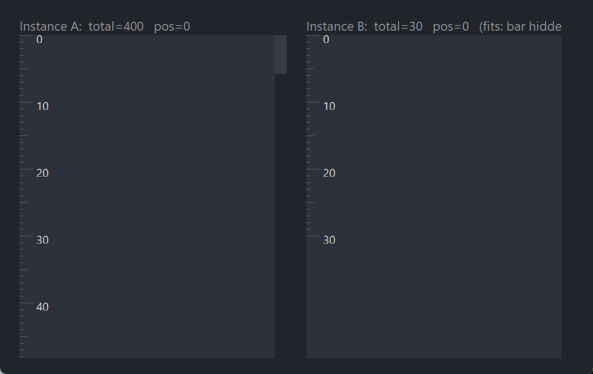

# PsVScrollBar

An owner-drawn **vertical** scrollbar for FreeBASIC Win32 applications: a flat track with a
flat thumb that brightens under the mouse and while it is being dragged.

It is the bar you reach for when you already own the scrolling. The control knows nothing
about your content — you tell it how many units there are, how many are visible, and where
you are; it tells you when the user moves it. Nothing about its appearance depends on the
visual style the user happens to be running, and every colour it paints is one you can set.

It never takes focus, has no arrow buttons at the ends, and does not size, place or hide
itself. It handles the mouse wheel and precision-touchpad swipes, and exposes that same
handling as a public function so you can route a gesture made over your **content** into the
bar — which is what makes the feature usable, since the bar itself is a twelve-pixel strip.

---

## What it looks like



Two instances over the same ruler content. **A** has `total=400` against a short viewport, so it carries a thumb. **B** has `total=30`, which fits — the bar auto-hides and gives its width back to the content, which is the behaviour to know about before you lay a host out around it. The rulers are drawn by the demo; the control draws only the bar.

---

## Requirements

**Files to copy into your project:**

| File | Purpose |
|---|---|
| `PsVScrollBar.bi` | Declarations — types, callbacks, constants, function prototypes |
| `PsVScrollBar.inc` | Implementation |
| `PsBufferPaint.bi` | The flicker-free drawing surface the control paints through |
| `PsBufferPaint.inc` | Its implementation |

**AfxNova is required.** The control is built on `CWindow`, and `PsBufferPaint` draws through
AfxNova's GDI+ wrappers. Sources include AfxNova relative to the workspace root
(`#include once "AfxNova\CWindow.inc"`), so builds need the workspace root on the include
path:

```bash
fbc64.exe -i "C:\dev" main.bas
```

**Include order.** `PsVScrollBar.inc` pulls in its own `.bi`, which pulls in `PsBufferPaint.bi`.
The AfxNova headers come first, then the two implementation files in this order:

```freebasic
#include once "windows.bi"
#include once "AfxNova\CWindow.inc"
#include once "AfxNova\AfxStr.inc"
#include once "AfxNova\AfxGdiplus.inc"

using AfxNova

#include once "PsBufferPaint.inc"
#include once "PsVScrollBar.inc"
```

**GDI+ must be running before the first repaint and must outlive the last one.** The control
renders through GDI+, so bracket your message loop:

```freebasic
dim as ULONG_PTR gdipToken = AfxGdipInit()
' ... create windows, run the message loop ...
AfxGdipShutdown( gdipToken )
```

`AfxGdipShutdown` must come after every window is destroyed, because each repaint builds and
tears down a `PsBufferPaint`. If you also initialise COM, do it before `AfxGdipInit` and
uninitialise it after `AfxGdipShutdown` — GDI+ leans on COM.

**Never name an identifier `ok`.** GDI+ defines `Ok = 0` as a `Status` enum value in namespace
`AfxNova`, and hosts customarily say `using AfxNova`. An existing variable, parameter or
function called `ok` becomes a duplicate definition the moment you adopt these files. Use
`bOK` instead.

**There is no pump obligation.** The control needs no message filter, no `IsDialogMessage` and
no hook of any kind. It is not a tabstop and never takes focus, so nothing in your message
loop has to know it exists.

**But you should route wheel messages yourself.** Windows delivers `WM_MOUSEWHEEL` to the
**focused** window, and this control never takes focus. Hovering over the bar works only
because Windows 10+'s *"Scroll inactive windows when I hover over them"* (Settings → Mouse) is
on by default and redirects the message to the window under the cursor. With that setting off,
the message goes to whatever has focus and `DefWindowProc` bubbles it to that window's
**parent** — never sideways to the bar. Handle `WM_MOUSEWHEEL` in the window that owns your
content and call `PsVScrollBar_HandleWheelDelta`; that path is reliable regardless of the
setting, and it makes the whole content area a scroll target instead of a narrow strip.

---

## Quick start

```freebasic
' Create it. The control is created zero-sized and hidden.
dim as HWND hSB = PsVScrollBar_Create( hWndParent, IDC_MYFORM_VSCROLL )

' Theme it, and be told when the user scrolls.
PsVScrollBar_SetColors( hSB, BGR(33,37,43), BGR(53,59,69), BGR(90,98,112) )
PsVScrollBar_SetScrollCallback( hSB, @MyBar_Scroll )
```

Then, from your layout code — on every resize, and whenever the content changes:

```freebasic
sub MyForm_Layout( byval hwnd as HWND )
    dim pWindow as CWindow ptr = AfxCWindowPtr( hwnd )
    dim as integer barW = pWindow->ScaleX( CVSCROLL_DEFAULT_WIDTH )

    ' You place the bar. It never sizes or moves itself.
    SetWindowPos( hSB, 0, xRight - barW, yTop, barW, yBottom - yTop, SWP_NOZORDER )

    ' Push the range. Passing the current position preserves it -- SetRange clamps
    ' it if the new range no longer allows it.
    dim as integer nPage = (yBottom - yTop) \ LINE_HEIGHT
    PsVScrollBar_SetRange( hSB, gTotalLines, nPage, PsVScrollBar_GetPos( hSB ) )

    ' Auto-hide is YOUR decision, made from the range.
    if PsVScrollBar_NeedsThumb( hSB ) then
        ShowWindow( hSB, SW_SHOWNA )
    else
        ShowWindow( hSB, SW_HIDE )
    end if
end sub
```

The scroll callback — this is the user moving the bar, so scroll your content to match:

```freebasic
sub MyBar_Scroll( byval hScrollBar as HWND, byval newPos as integer )
    gTopLine = newPos
    InvalidateRect( HWND_MYFORM, NULL, FALSE )
end sub
```

And, in the window that owns the content, forward the wheel:

```freebasic
case WM_MOUSEWHEEL
    ' Wheel messages carry SCREEN coordinates in lParam, unlike every other mouse
    ' message -- and both those coordinates and the delta are SIGNED words that
    ' loword/hiword hand back unsigned.
    dim as POINT pt
    pt.x = cast(short, loword(lParam))
    pt.y = cast(short, hiword(lParam))
    ScreenToClient( hwnd, @pt )
    if PtInRect( @gViewport, pt ) then
        PsVScrollBar_HandleWheelDelta( hSB, cast(short, hiword(wParam)) )
    end if
    return 0
```

That is the whole minimum. Everything below is refinement.

---

## Concepts

### The handle is a real HWND

`PsVScrollBar_Create` returns an ordinary window handle, and every `PsVScrollBar_*` function
takes it. It is not an opaque type, so you can treat the control as the window it is —
`SetWindowPos` to place and size it, `ShowWindow` to show or hide it, `GetDlgItem` to find it
by the `CtrlID` you passed at creation.

Every instance keeps its own state, so any number of bars can coexist in one window and
nothing you do to one can disturb another.

### It is created zero-sized and hidden

`PsVScrollBar_Create` gives the control the styles `WS_CHILD`, `WS_CLIPSIBLINGS` and
`WS_CLIPCHILDREN`. `WS_VISIBLE` is deliberately absent, so a newly created bar shows nothing
until you size it and call `ShowWindow`. That lets you configure it — colours, callbacks,
range — before it is ever seen, and it is what makes the auto-hide pattern natural: you show
the bar once you know there is something to scroll.

There is no `WS_TABSTOP` and the control never calls `SetFocus`. It is a mouse-only surface.

### The range model: total, page, position

Three numbers describe everything, and they are deliberately generic — the control has no idea
whether a "unit" is a line, a row, a pixel or a record:

| Term | Meaning |
|---|---|
| `total` | How many units of content there are altogether |
| `page` | How many units are visible at once |
| `pos` | The index of the **first visible** unit — the topmost one |

Two values are derived from those, and both matter:

```
  MaxPos     = max( total - page, 0 )                      the largest legal pos
  NeedsThumb = (total > 0) and (page > 0) and (total > page)
```

`pos` is always clamped into `[0, MaxPos]` by every path that can change it — `SetRange`,
`SetPos`, a thumb drag, a track click, the auto-repeat and the wheel. There is no way to get
an out-of-range position out of the control.

Positions are whole units. There is no fractional scrolling: if you need sub-unit precision,
make your unit smaller — pixels rather than lines, say — and give the bar a correspondingly
larger `total` and `page`.

### Who owns the content

You do, entirely. The control stores three integers and paints a thumb; it never touches your
content, never asks how big it is, and never scrolls anything. The contract is:

1. You compute `total`, `page` and `pos` and push them in with `PsVScrollBar_SetRange`.
2. The user drags, clicks or wheels; the control clamps, repaints itself, and calls your
   scroll callback with the new `pos`.
3. Your callback scrolls your content and repaints it.

Step 3 must **not** push the position back into the bar — the control already has it.
`PsVScrollBar_SetPos` exists for the other direction: when *you* scroll the content (a keyboard
command, a "go to line", a search hit) and need the bar to catch up.

### Geometry is derived, never assigned

The thumb rectangle is recomputed from the range on every paint, every resize and every
position change, so it can never go stale no matter who moved what. You never set it.

```
  track       = client height
  minThumb    = ScaleY( CVSCROLL_MIN_THUMB )         20, DPI-scaled

  thumbH      = clamp( (page / total) * track, minThumb, track )
  span        = track - thumbH
  thumb.top   = (pos / MaxPos) * span                0 when MaxPos = 0
  thumb.left  = client left                          always the full width
  thumb.right = client right
```

The thumb always spans the bar's full **width**; only its top edge and its height vary. It is
clamped to a minimum height so it stays grabbable on very large ranges — which is why a
100,000-unit list still gets a thumb you can hit, at the cost of the thumb no longer being
exactly proportional there.

A drag runs that mapping backwards: the cursor's y, minus the offset within the thumb where it
was grabbed, is converted to a position, and the thumb is then rebuilt **from that position**.
The thumb and the position you are told about therefore cannot drift apart.

When `total <= page` — everything fits — the thumb rect is empty and the control paints only
its background.

### The bar never sizes, places or hides itself

`CVSCROLL_DEFAULT_WIDTH` (12) is a suggestion for you to DPI-scale and use; the control does
not read it. The bar's size and position come from your `SetWindowPos`, and its visibility from
your `ShowWindow`.

That includes auto-hide. `PsVScrollBar_NeedsThumb` answers the range question — *is there
anything to scroll?* — and the decision to show or hide is yours. That function deliberately
ignores the bar's own geometry: you ask it in order to decide whether to show the bar at all,
and at that moment the bar may still be 0×0, because it only gets a size once it is shown.
Folding a track-height test into the answer would deadlock — never sized, so never needed, so
never shown. The geometry guard lives in the thumb calculation instead, which simply produces
no thumb when there is no track.

The control does clean up after itself when you hide it: hiding drops the hover highlight,
stops any auto-repeat and cancels a drag in progress, so nothing stale reappears the next time
you show it.

### Wheel and trackpad

The control handles `WM_MOUSEWHEEL`, so a wheel or a two-finger vertical swipe with the cursor
over the bar scrolls it. All of the work lives in one public function,
`PsVScrollBar_HandleWheelDelta`, and the control's own message handler is a thin wrapper around
it — so the built-in path and anything you route in behave identically.

**One notch is 120 delta units, and one notch moves `SetWheelStep` range units.** The default
step of 0 means *follow the system setting*: `SPI_GETWHEELSCROLLLINES`, typically 3, re-read on
every message so a Control Panel change takes effect immediately without restarting your app.
The special value `WHEEL_PAGESCROLL` ("one page per notch") is honoured and resolves to the
current `page`. Set the step explicitly when your range units are neither lines nor characters
and the system number would be meaningless.

**Sub-notch deltas accumulate.** High-resolution wheels and precision touchpads routinely send
deltas well under 120. The remainder that does not amount to a whole unit is carried between
messages, so a slow two-finger swipe scrolls continuously instead of sitting dead until a full
notch arrives. Only the delta that the applied units actually represent is consumed, so a run
of uneven deltas neither leaks nor double-counts.

**The sign, which is the trap.** For `WM_MOUSEWHEEL` a **positive** delta means the wheel moved
away from the user, which scrolls **up**, which **decreases** `pos`. A negative delta scrolls
down and increases `pos`. If you route deltas yourself, pass the value exactly as the message
gave it to you and let the control apply the sign — do not negate it first. A horizontal bar
reads the opposite way round, so do not assume the two axes match if you write one routing
routine for both.

**Extract the delta as a signed word.** `loword` and `hiword` yield *unsigned* words, so a
scroll-up delta read without the cast becomes ~65416 instead of −120 and the direction
silently inverts:

```freebasic
PsVScrollBar_HandleWheelDelta( hSB, cast(short, hiword(wParam)) )
```

**Routing.** Wheel messages go to the focused window, and this control never takes focus.
Hovering works only because *"Scroll inactive windows when I hover over them"* is on by
default; with it off, the message never reaches the bar. Handling the wheel in the window that
owns your content and calling `PsVScrollBar_HandleWheelDelta` yourself is the reliable path —
and it also makes the whole content area a scroll target, which is what users expect. The
built-in handler is the convenience, not the mechanism.

Wheel scrolling **fires the scroll callback**, because it is the user scrolling. The
programmatic `PsVScrollBar_SetPos` stays silent.

### Mouse capture is taken

Pressing the left button on the thumb takes capture, so the drag survives the cursor leaving
the bar — dragging above or below the window is the normal case, not an edge case, and the
position simply clamps. Pressing the track also takes capture, because that click starts an
auto-repeat which must be bounded by the button release.

Capture is released on `WM_LBUTTONUP`, and a `WM_CAPTURECHANGED` from anywhere else cancels
the drag and the auto-repeat rather than leaving either stranded.

### Programmatic changes are silent

`PsVScrollBar_SetPos` and `PsVScrollBar_SetRange` never fire the scroll callback. The callback
reports **user** action — a thumb drag, a track click, an auto-repeat step, a wheel gesture —
and nothing else. This follows Win32's own `SetScrollInfo` / `WM_VSCROLL` split, and it means
you can safely call either setter from inside your own scroll handler without recursing.

### Hover tracking

The thumb brightens under the mouse. `WM_MOUSELEAVE` is not reliably delivered when the cursor
leaves fast, so the control arms a 100 ms poll timer as a safety net while the mouse is inside,
and clears the highlight the moment the poll finds the cursor gone. Both the timer and the
hover state are dropped when the highlight clears, so this costs nothing while the mouse is
elsewhere.

### Lifetime

The control frees itself when its window is destroyed, killing its own timers on the way out.
It owns no host resources: no font, no tooltip window, nothing to release. Destroy the parent
and you are done.

---

## Behaviour and limits

Firm properties of the control, not settings:

- **The control never sizes, moves or hides itself.** `CVSCROLL_DEFAULT_WIDTH` is a suggestion
  you scale and apply; placement is your `SetWindowPos` and visibility is your `ShowWindow`.
- **Auto-hide is your decision, not the control's.** `PsVScrollBar_NeedsThumb` answers a
  **range** question only and deliberately ignores the bar's own geometry — otherwise a bar
  that is never sized would never be needed and so never shown.
- **Positions are whole units, always clamped to `[0, total − page]`.** No fractional
  scrolling, and no way to read an out-of-range position back out.
- **`SetRange` clamps `total` and `page` to a minimum of 0**, then clamps the position into the
  range those two imply. Passing a position beyond the end is the normal way to say "as far as
  it goes".
- **There is no getter for `total` or `page`.** Only the position round-trips
  (`PsVScrollBar_GetPos`). Keep your own copy of the other two if you need them.
- **There are no arrow buttons.** The whole client area is track and thumb. A click on the
  track pages by exactly `page` units toward the click and then auto-repeats while held,
  stopping when the thumb reaches the cursor or when there is nowhere left to go.
- **The thumb has a minimum height** of `CVSCROLL_MIN_THUMB` (20, DPI-scaled), so on very large
  ranges it is no longer exactly proportional. That is what keeps it grabbable.
- **The control never takes focus and handles no keyboard input.** It is not a tabstop. Home,
  End, PgUp and PgDn are yours to handle, by calling `PsVScrollBar_SetPos`.
- **Only vertical wheel messages are handled.** `WM_MOUSEHWHEEL` — a horizontal trackpad swipe
  — is not claimed and falls through to `DefWindowProc`.
- **A wheel message the control handles is consumed**, whether or not the position actually
  moved, so it never bubbles to your parent window as well.
- **The wheel sign is not symmetric with a horizontal bar.** A positive `WM_MOUSEWHEEL` delta
  *decreases* `pos`. If you route deltas yourself, pass them unmodified.
- **`hiword` is unsigned.** Extract the delta as `cast(short, hiword(wParam))` or the direction
  inverts silently.
- **There is no enabled/disabled state.** The control does not grey out and does not change
  appearance for `EnableWindow`. When there is nothing to scroll, a click on it does nothing at
  all — the button-down handler returns immediately and takes no capture.
- **Double-clicks are not handled.** The window class carries `CS_DBLCLKS`, so a rapid second
  click on the track arrives as `WM_LBUTTONDBLCLK`, which the control ignores. Sustained paging
  is what the auto-repeat is for.
- **The right mouse button is not handled at all.** A context menu over the bar is your
  business.
- **No tooltips**, no hit-test function, no smooth-scroll animation, no getter for the colours,
  and no way to query whether a drag is in progress.

---

## API reference

### Creation

| Function | Description |
|---|---|
| `PsVScrollBar_Create( hWndParent, CtrlID ) as HWND` | Creates the bar as a child of `hWndParent` and returns its window handle. `CtrlID` becomes the window's `GWLP_ID`, so `GetDlgItem` finds it. Created zero-sized and hidden — place it with `SetWindowPos`, then `ShowWindow` once you know there is something to scroll. |

### Range and position

| Function | Description |
|---|---|
| `PsVScrollBar_SetRange( hSB, nTotal, nPage, nPosition )` | Pushes the whole model in at once and repaints. `nTotal` and `nPage` are each clamped to a minimum of 0; `nPosition` is then clamped into `[0, nTotal − nPage]`, so passing a huge value means "as far as it goes". **Silent** — does not fire the scroll callback. Call it from your layout code whenever the content or the viewport changes; passing `PsVScrollBar_GetPos( hSB )` as the position preserves where the user was. |
| `PsVScrollBar_GetPos( hSB ) as integer` | The index of the first visible unit. Always within `[0, total − page]`. |
| `PsVScrollBar_SetPos( hSB, nPosition )` | Moves the bar to a position you chose, clamped into `[0, total − page]`, and repaints. **Silent** — does not fire the scroll callback, which is what makes it safe to call from inside your own scroll handler. A no-op when the bar is already there. |

### Wheel

| Function | Description |
|---|---|
| `PsVScrollBar_HandleWheelDelta( hSB, nDelta ) as boolean` | Feeds the bar one wheel delta; returns TRUE if the position actually moved. `nDelta` is the **already-extracted signed** delta — `cast(short, hiword(wParam))`, never the raw `wParam`, because `hiword` is unsigned and an uncast scroll-up delta inverts the direction. A **positive** delta scrolls **up** and **decreases** `pos`; pass the value unmodified and let the control apply the sign. Sub-notch remainders are carried between calls. Fires the scroll callback when the position moves. This is public so you can route a gesture your **content** window received into the bar — do that, because wheel messages go to the focused window and this control never takes focus. |
| `PsVScrollBar_SetWheelStep( hSB, nUnitsPerNotch )` | How many range units one 120-unit notch scrolls. Clamped to a minimum of 0, where **0 (the default) means follow the system setting** — `SPI_GETWHEELSCROLLLINES`, re-read per message, with `WHEEL_PAGESCROLL` resolving to one `page`. **Changing the value discards any part-accumulated sub-notch remainder**, because that remainder was measured against the old step. Setting it to the value it already has is a deliberate no-op that **keeps** the remainder — which matters if, like most hosts, you set the step from the same layout routine that pushes the range, since that routine re-runs constantly, including mid-swipe. |
| `PsVScrollBar_GetWheelStep( hSB ) as integer` | The current units-per-notch, or 0 when following the system setting. It never reports the resolved system value. |

### Geometry and layout

| Function | Description |
|---|---|
| `PsVScrollBar_NeedsThumb( hSB ) as boolean` | TRUE when `total > 0`, `page > 0` and `total > page` — i.e. there is something to scroll. A **range** question only: it deliberately ignores the bar's own size, so it is valid before the bar has ever been given one. This is the auto-hide test; the `ShowWindow` call is yours. |

The bar's own rectangle is whatever you gave it. Use `CVSCROLL_DEFAULT_WIDTH`, DPI-scaled, for
a conventional width, and give the bar the full height of the region it scrolls.

### Appearance

| Function | Description |
|---|---|
| `PsVScrollBar_SetColors( hSB, backclr, foreclr, foreclrhot )` | Sets all three colours at once and repaints: track background, thumb, and thumb while hot or dragging. There is no getter and no partial setter — pass all three every time. Ignored entirely while a paint callback is installed. |

### Callback registration

| Function | Description |
|---|---|
| `PsVScrollBar_SetPaintCallback( hSB, usersub )` | Installs a renderer that draws the whole bar **instead of** the built-in painter, and repaints. Pass 0 to go back to the built-in painter. |
| `PsVScrollBar_SetScrollCallback( hSB, usersub )` | Installs the handler told when the **user** scrolls. Does not repaint — it changes nothing visible. |

Both are optional and independent.

---

## Colors

**There is no colours struct.** The control paints three colours, set together by
`PsVScrollBar_SetColors`, and each ships with a usable dark default — so a bar you never call
that function on still looks right.

| Colour | Parameter | Default | Paints |
|---|---|---|---|
| Track background | `backclr` | `BGR(33,37,43)` | The whole client area, always, including behind the thumb |
| Thumb | `foreclr` | `BGR(53,59,69)` | The thumb at rest |
| Thumb, active | `foreclrhot` | `BGR(90,98,112)` | The thumb while the mouse is over it, or while it is being dragged |

### Which colour wins

The background is unconditional — it is painted over the whole client area first, on every
repaint. The thumb is then drawn over it, in one of two colours:

```
  hot OR dragging   >   idle
```

There is no separate pressed colour and no disabled colour: hovering and dragging render
identically, and the control has no disabled state. There is no state in which the thumb is
drawn but the background is not.

When there is nothing to scroll, the thumb rect is empty and only the background is painted.

### What the painter draws

| Part | Shape |
|---|---|
| Track | The whole client rectangle, filled with the background colour |
| Thumb | A plain filled rectangle spanning the bar's full width — no border, no rounding, no gradient |

All of it goes through `PsBufferPaint`, so there is no flicker. A paint callback gets that same
buffer and can draw anything it likes in place of the two rectangles.

---

## Callbacks

### Scroll

```freebasic
type VScrollCallbackSub as sub( byval hScrollBar as HWND, byval newPos as integer )
```

The **user** moved the bar. Fires for a thumb drag (once per position change during the drag),
a track click, each step of the track auto-repeat, and a wheel or trackpad gesture. `newPos` is
the new index of the first visible unit, already clamped, and the control's own state is
already updated — so `PsVScrollBar_GetPos( hScrollBar )` equals `newPos`.

It does **not** fire for `PsVScrollBar_SetPos` or `PsVScrollBar_SetRange`, which is what makes it
safe to call either from inside this handler.

The callback's job is to scroll and repaint your content. Do not push the position back into
the bar; it is already there.

The handle is passed in so one callback can serve any number of bars.

### Paint

```freebasic
type VScrollPaintCallbackSub as sub( byval p as PSVSCROLLBAR_PAINTINFO ptr )
```

Draws the whole bar **instead of** the built-in painter. Paint through `p->b`, the control's
double buffer for this repaint — do not touch the screen DC.

**Nothing has been painted for you.** The callback runs in place of the background fill, not
after it, so it must cover every pixel of the client area. The three colours set by
`PsVScrollBar_SetColors` are not consulted at all while a callback is installed; use your own.

`PSVSCROLLBAR_PAINTINFO` carries everything you need:

| Field | Meaning |
|---|---|
| `b` | The control's `PsBufferPaint` for this repaint (borrowed, not owned) |
| `rcClient` | The whole client area — the track |
| `rcThumb` | The thumb, in client coordinates. **Empty when no thumb is needed** — test it with `IsRectEmpty` before drawing |
| `isHot` | The mouse is over the thumb |
| `isDragging` | The thumb is being dragged right now |

The thumb rect is recomputed immediately before the callback runs, so it is always current. Use
it as given rather than re-deriving it from the range.

A typical callback:

```freebasic
sub MyBar_Paint( byval p as PSVSCROLLBAR_PAINTINFO ptr )
    p->b->SetBackColor( theme.BackColorBox )
    p->b->PaintClientRect()
    if IsRectEmpty( @p->rcThumb ) = 0 then
        dim as RECT rcT = p->rcThumb
        rcT.left  += 2                     ' inset the thumb within the track
        rcT.right -= 2
        dim as COLORREF clr = theme.Accent
        if p->isHot orelse p->isDragging then clr = theme.AccentHot
        p->b->SetBackColor( clr )
        p->b->PaintRect( @rcT )
    end if
end sub
```

---

## Constants

| Constant | Value | Meaning |
|---|---:|---|
| `CVSCROLL_MIN_THUMB` | 20 | Minimum thumb height in pixels. Used by the control, DPI-scaled at the point of use |
| `CVSCROLL_DEFAULT_WIDTH` | 12 | Suggested track width in pixels. **The control never reads this** — scale it yourself and pass it to `SetWindowPos` |
| `CVSCROLL_HOTTRACK_MS` | 100 | Hover poll interval in ms, the safety net for unreliable `WM_MOUSELEAVE` |
| `CVSCROLL_REPEAT_DELAY` | 400 | Delay in ms before a held track click starts auto-repeating |
| `CVSCROLL_REPEAT_MS` | 80 | Auto-repeat interval in ms while the button is held on the track |

Two timer ids are also defined, `IDT_CVSCROLL_HOTTRACK` (`&hCB10`) and `IDT_CVSCROLL_REPEAT`
(`&hCB11`). Timer ids are per-window, so every instance can safely share these values — but
avoid reusing them for your own timers on the bar's own window.

## Licence

[Mozilla Public License 2.0](LICENSE).

MPL-2.0 is file-level copyleft, chosen deliberately for a drop-in control:

- **You may use this in closed-source software**, commercial or otherwise.
  §3.2 permits static linking with no additional conditions.
- **If you modify these files, publish those files' changes.** The obligation is
  per-file — your own sources are unaffected however tightly they are combined
  with these.
- The Exhibit B "Incompatible With Secondary Licenses" notice is **not applied**,
  which keeps this GPL-compatible.
